# DevOps / SRE Interview Preparation — Complete Technical Deep-Dive

> Built from my resume. Every claim on the CV is backed here by: **the concept → why it exists → how I implemented it → code/commands → interview talking points**.
> Target roles: Senior DevOps Engineer / Senior SRE / Platform Engineer.

---

## Table of Contents

1. [Your 90-second Narrative (Elevator Pitch)](#1-your-90-second-narrative)
2. [Kubernetes Foundations (must be bulletproof)](#2-kubernetes-foundations)
3. [AWS EKS — Managed Kubernetes](#3-aws-eks--managed-kubernetes)
4. [Terraform — Full Cluster Lifecycle (Provision + Decommission)](#4-terraform--full-cluster-lifecycle)
5. [GitOps with ArgoCD](#5-gitops-with-argocd)
6. [Helm — Packaging & Templating](#6-helm)
7. [CI/CD with GitHub Actions](#7-cicd-with-github-actions)
8. [Observability — Grafana Stack (Prometheus, Loki, Alertmanager)](#8-observability--grafana-stack)
9. [Observability — ELK Stack + SLO/SLI + xMatters](#9-observability--elk-stack--slosli)
10. [Velero — Backup & Disaster Recovery](#10-velero--backup--disaster-recovery)
11. [Kubernetes Security — CrowdStrike Falcon](#11-kubernetes-security--crowdstrike-falcon)
12. [Secrets & Storage — AWS Secrets Manager, Pod Identity, EBS CSI](#12-secrets--storage-on-eks)
13. [Portainer — Multi-cluster Management](#13-portainer)
14. [OpenShift PoC (CRC)](#14-openshift-poc-crc)
15. [Python Automation for K8s](#15-python-automation)
16. [Incident Management & SRE Practice](#16-incident-management--sre-practice)
17. [Terraform Modules + Ansible (earlier roles)](#17-terraform-modules--ansible)
18. [Linux Essentials for Interviews](#18-linux-essentials)
19. [Hands-on Scenarios (do these before interviews)](#19-hands-on-scenarios)
20. [Rapid-fire Q&A Bank](#20-rapid-fire-qa-bank)

---

## 1. Your 90-second Narrative

Memorize the *shape*, not the words:

> "I'm a Senior DevOps/SRE with 6+ years focused on Kubernetes platforms — both AWS EKS and on-prem. I own the **full platform lifecycle**: Terraform provisions and decommissions clusters, ArgoCD + Helm deliver workloads via GitOps, GitHub Actions handles CI, and I've built observability twice — once on the Grafana stack (Prometheus/Loki/Grafana) and once on ELK with formal SLOs and xMatters paging. On the reliability side I've implemented Velero for validated backup/DR, CrowdStrike Falcon for runtime security, and AWS Secrets Manager + Pod Identity + EBS CSI for secrets and storage. I also write Python automation — for example a cleanup tool that reclaimed unused K8s resources and saved ~15 hrs/week. I've led incident bridges, written RCAs, and cut MTTR ~40%."

**Rule for every answer:** Concept (1 line) → What I did → How (tools/flow) → Result (number from resume).

---

## 2. Kubernetes Foundations

Interviewers *will* drill fundamentals before believing the resume. Everything else in this doc sits on this.

### 2.1 Why Kubernetes exists

- Containers solve packaging ("works on my machine"), but not: scheduling across machines, self-healing, service discovery, rolling upgrades, scaling.
- K8s = a **declarative reconciliation engine**: you declare desired state (YAML in etcd), controllers continuously reconcile actual → desired. This "control loop" idea is THE core concept — it explains ArgoCD, HPA, Deployments, everything.

### 2.2 Architecture

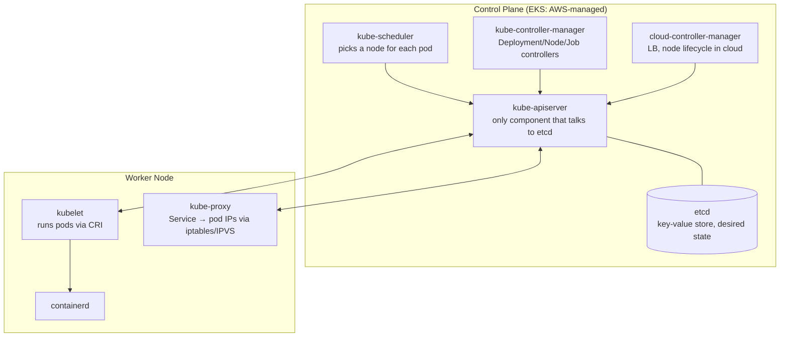

**Flow of `kubectl apply -f deploy.yaml` (classic interview question):**
1. kubectl → API server (authN: who are you → authZ/RBAC: allowed? → admission controllers: mutate/validate, e.g. inject sidecar, enforce policy).
2. Object persisted in etcd. That's it — apply returns.
3. Deployment controller sees new Deployment → creates ReplicaSet → creates Pod objects (Pending).
4. Scheduler sees Pending pod with no node → filters (resources, taints, affinity) → scores → binds pod to node.
5. kubelet on that node sees the binding → pulls image via containerd → starts containers → reports status.
6. kube-proxy/CNI wire up networking; readiness probe passes → pod added to Service endpoints.

### 2.3 Core objects — one-liners you must own

| Object | One-liner | Key detail interviewers probe |
|---|---|---|
| Pod | Smallest deployable unit; 1+ containers sharing network/IPC | Containers in a pod share `localhost` and volumes |
| Deployment | Manages ReplicaSets; rolling updates & rollback | `maxSurge`/`maxUnavailable`; `kubectl rollout undo` |
| StatefulSet | Stable identity + per-pod PVC | Ordered rollout; headless service gives `pod-0.svc` DNS |
| DaemonSet | One pod per node | Used by CrowdStrike, node-exporter, Fluent Bit, CNI |
| Job/CronJob | Run-to-completion / scheduled | `backoffLimit`, `concurrencyPolicy` |
| Service ClusterIP | Stable virtual IP → healthy pods | Backed by EndpointSlices; kube-proxy programs iptables |
| NodePort / LoadBalancer | Expose externally | LB in EKS = AWS NLB/ALB via controller |
| Ingress | L7 HTTP routing, one LB many services | Needs an ingress controller (nginx, ALB controller) |
| ConfigMap/Secret | Config & sensitive config | Secrets are only base64 — hence external secrets (see §12) |
| PV / PVC / StorageClass | Storage abstraction; dynamic provisioning | `ReclaimPolicy`, `WaitForFirstConsumer` (see §12) |
| HPA | Scale pods on metrics | Needs metrics-server; formula: `desired = ceil(current * currentMetric/targetMetric)` |
| RBAC (Role/ClusterRole + Binding) | Who can do what | Namespaced vs cluster-scoped; ServiceAccounts for pods |
| NetworkPolicy | Pod-level firewall | Default allow-all; needs CNI support (Calico/VPC CNI) |
| ResourceQuota / LimitRange | Per-namespace caps / defaults | The backbone of multi-tenancy |
| PDB | Min pods during voluntary disruption | Protects apps during node drains/upgrades |

### 2.4 Networking model (frequent senior-level probe)

- **Every pod gets a real IP; all pods reach all pods without NAT.** CNI plugin implements this (EKS: **AWS VPC CNI** — pods get VPC IPs from ENIs; on-prem: Calico/Flannel).
- **Service** = virtual IP; kube-proxy programs iptables/IPVS rules: `ClusterIP:port → random healthy podIP:port`.
- **DNS**: CoreDNS. `svc.namespace.svc.cluster.local`.
- **Ingress vs Service LB**: LB Service = L4, one LB per service ($$). Ingress = L7, one LB, host/path routing, TLS termination.

```
Request path (ALB ingress on EKS):
Internet → ALB (TLS) → target group (pod IPs, because VPC CNI) → pod
                          ↑ AWS Load Balancer Controller watches Ingress objects and builds this
```

### 2.5 Scheduling controls

- **requests/limits**: requests = scheduling guarantee (and what quota counts); limits = cgroup cap. CPU over limit → throttled; memory over limit → OOMKilled.
- **QoS classes**: Guaranteed (req=lim) > Burstable > BestEffort (evicted first).
- **Taints/tolerations** (node repels pods) vs **nodeAffinity** (pod attracts to nodes). Multi-tenant pattern: taint tenant node groups, tolerate + affinity in tenant workloads.
- **Probes**: liveness (restart if dead), readiness (remove from Service if not ready), startup (protect slow boots). Wrong liveness probe = restart storms — real ops story material.

### 2.6 Multi-tenancy (your resume says "multi-tenant platforms" — expect questions)

Layers I applied:
1. **Namespace per tenant/team** + ResourceQuota + LimitRange.
2. **RBAC**: tenant group → RoleBinding scoped to their namespace only.
3. **NetworkPolicy**: default-deny per namespace, allow only declared flows.
4. **Node isolation** (optional): dedicated node groups with taints for noisy/regulated tenants.
5. **Cost/showback**: labels + Kubecost/CloudWatch by namespace.
6. **ArgoCD Projects** restrict which repos/namespaces each team can deploy to (see §5).

### 2.7 Troubleshooting playbook (be able to whiteboard this)

```
Pod Pending      → kubectl describe pod → Events:
                   - insufficient cpu/memory → scale nodes / lower requests
                   - unbound PVC → StorageClass / CSI issue (§12)
                   - taint mismatch → tolerations
Pod CrashLoopBackOff → kubectl logs --previous → app error vs bad probe vs OOM (exit 137)
ImagePullBackOff → wrong tag / registry auth (imagePullSecrets) / rate limit
Service not reachable → endpoints empty? (kubectl get endpoints)
                   → selector/label mismatch, readiness failing, wrong targetPort
Node NotReady    → kubelet down, disk/memory pressure, CNI broken → kubectl describe node
DNS failures     → CoreDNS pods, resolv.conf ndots, network policy blocking 53
```

Commands to rattle off: `kubectl get events --sort-by=.lastTimestamp`, `kubectl describe`, `kubectl logs -p`, `kubectl exec -it`, `kubectl top pods/nodes`, `kubectl rollout status/history/undo`, `kubectl debug node/<n> -it --image=busybox`.

---

## 3. AWS EKS — Managed Kubernetes

### 3.1 What EKS manages vs what you manage

| AWS manages | You manage |
|---|---|
| Control plane (API server, etcd) — multi-AZ, patched | Worker nodes (managed node groups / Fargate / Karpenter) |
| Control-plane scaling & HA | Add-ons: VPC CNI, CoreDNS, kube-proxy, EBS CSI versions |
| etcd backup | Everything in-cluster: workloads, ingress, RBAC, upgrades of nodes |

### 3.2 EKS architecture I ran

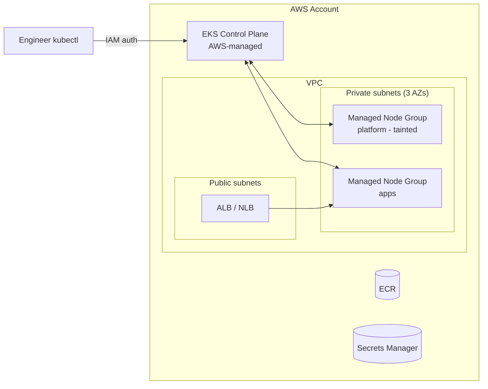

Key talking points:
- **Auth**: `aws eks update-kubeconfig` → kubectl sends a token from `aws sts` → EKS maps IAM identity to K8s user/groups via **access entries** (older: `aws-auth` ConfigMap). "IAM authenticates, RBAC authorizes."
- **VPC CNI**: pods get real VPC IPs → plan CIDR sizing (IP exhaustion is a classic EKS incident; fixes: prefix delegation, secondary CIDR).
- **Endpoint access**: private endpoint for prod API server; public+CIDR-restricted for tooling.
- **Upgrades**: control plane one minor at a time (AWS does the plane, you click/Terraform it) → then node groups (rolling: new launch template AMI → cordon/drain respecting PDBs) → then add-ons. Always check API deprecations first (`kubectl convert`, pluto/kubent).
- **Node options**: Managed Node Groups (I used — AWS handles ASG + graceful drain), Fargate (serverless pods), **Karpenter** (just-in-time right-sized nodes — good to mention as modern direction).

### 3.3 EKS vs on-prem (you ran both — gold interview material)

| Concern | EKS | On-prem |
|---|---|---|
| Control plane | AWS-managed | You run kubeadm/rke2; etcd backup is YOUR job |
| LoadBalancer svc | NLB/ALB automatic | MetalLB / F5 / ingress on NodePort |
| Storage | EBS/EFS CSI | Longhorn/Ceph/NFS/vendor CSI |
| Autoscaling nodes | ASG/Karpenter | Mostly capacity planning by hand |
| Upgrades | One-click plane | Full drill: etcd snapshot → control plane → workers |

---

## 4. Terraform — Full Cluster Lifecycle

### 4.1 Foundations (asked in EVERY interview)

- **Declarative IaC**: HCL describes desired infra; Terraform builds a dependency graph and calls provider APIs.
- **Workflow**: `init` (providers, backend, modules) → `plan` (diff desired vs state vs real) → `apply` → `destroy`.
- **State**: the mapping between your config and real resource IDs. Without state, TF can't know what it owns.
  - Remote backend: **S3 + native lockfile / DynamoDB locking** — one source of truth, prevents concurrent applies.
  - `terraform state list/show/mv/rm`, `terraform import` (adopt existing infra), `terraform taint`/`-replace` (force recreate).
- **State drift**: someone changed infra in console → `plan` shows diff → decide: revert infra or update code. I ran scheduled `terraform plan` in CI to detect drift.
- **Workspaces vs directories**: I prefer **directory-per-environment** (`envs/dev`, `envs/prod`) with shared modules — explicit, safer than workspaces for prod.
- **Sensitive values**: never in code; fed via TF variables from vault/Secrets Manager, marked `sensitive = true`.

### 4.2 EKS provisioning — real structure I used

```
terraform/
├── modules/
│   ├── vpc/            # subnets across 3 AZs, NAT, tags for ELB discovery
│   ├── eks/            # cluster, node groups, addons, IRSA/pod-identity
│   └── observability/  # prometheus stack via helm_release
├── envs/
│   ├── dev/    ├── main.tf  ├── backend.tf  └── terraform.tfvars
│   └── prod/   ...
```

```hcl
# envs/prod/main.tf (condensed but realistic)
terraform {
  backend "s3" {
    bucket         = "org-tfstate-prod"
    key            = "eks/platform.tfstate"
    region         = "us-east-1"
    dynamodb_table = "tf-locks"
    encrypt        = true
  }
}

module "vpc" {
  source          = "../../modules/vpc"
  cidr            = "10.40.0.0/16"
  azs             = ["us-east-1a", "us-east-1b", "us-east-1c"]
  private_subnets = ["10.40.0.0/19", "10.40.32.0/19", "10.40.64.0/19"]
  # Tag subnets so AWS LB Controller can discover them
  private_subnet_tags = { "kubernetes.io/role/internal-elb" = "1" }
  public_subnet_tags  = { "kubernetes.io/role/elb" = "1" }
}

module "eks" {
  source          = "terraform-aws-modules/eks/aws"
  version         = "~> 20.0"
  cluster_name    = "platform-prod"
  cluster_version = "1.30"
  vpc_id          = module.vpc.vpc_id
  subnet_ids      = module.vpc.private_subnets

  cluster_endpoint_private_access = true
  cluster_endpoint_public_access  = false

  cluster_addons = {
    coredns    = {}
    kube-proxy = {}
    vpc-cni    = {}
    aws-ebs-csi-driver = {}
    eks-pod-identity-agent = {}   # for Pod Identity (§12)
  }

  eks_managed_node_groups = {
    platform = {
      instance_types = ["m6i.large"]
      min_size = 2, max_size = 6, desired_size = 3
      taints = [{ key = "dedicated", value = "platform", effect = "NO_SCHEDULE" }]
    }
    apps = {
      instance_types = ["m6i.xlarge"]
      min_size = 3, max_size = 12, desired_size = 4
    }
  }
}
```

Talking points:
- Bootstrap ordering: VPC → EKS → addons → (helm_release or hand off to ArgoCD for everything in-cluster). I kept **infra in Terraform, apps in GitOps** — clean boundary, and say that sentence in interviews.
- CI ran `fmt -check`, `validate`, `tflint`, `tfsec/checkov`, `plan` on PR; apply only on merge with manual approval for prod.

### 4.3 Decommissioning (your resume highlights this — most people can't talk about it!)

Destroying is harder than creating. My staged process:

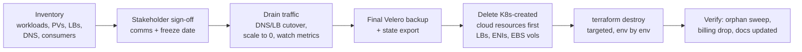

Gotchas I hit (great "war story" answers):
- **K8s-created resources aren't in TF state** (LoadBalancer Services create NLBs; PVCs create EBS volumes). Destroy those *first* (delete Services/PVCs in-cluster) or `terraform destroy` hangs on VPC deletion because ENIs/LBs still reference subnets.
- Velero final backup + retention before deletion = rollback insurance.
- Staged validation: non-prod first, soak period, then prod, with a checklist per cluster and sign-off recorded in Confluence.

---

## 5. GitOps with ArgoCD

### 5.1 Why GitOps

- **Git = single source of truth** for desired cluster state. Deploy = merge a PR.
- Benefits: full audit trail, trivially reviewable changes, easy rollback (`git revert`), **drift detection** (someone `kubectl edit`s prod → ArgoCD flags/undoes it), disaster recovery (repoint ArgoCD at a fresh cluster).
- **Pull vs push**: classic CI/CD *pushes* kubectl/helm from the pipeline (needs cluster creds in CI = attack surface). ArgoCD runs *inside* the cluster and *pulls* from Git — cluster creds never leave the cluster.

### 5.2 Architecture

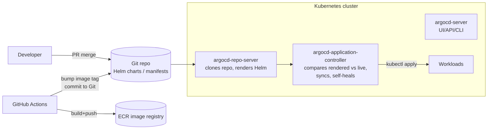

Components: **repo-server** (renders manifests: Helm/Kustomize/plain), **application-controller** (the reconciler — diff & sync), **argocd-server** (UI/API), **dex** (SSO), Redis (cache).

### 5.3 The Application CRD (know this YAML cold)

```yaml
apiVersion: argoproj.io/v1alpha1
kind: Application
metadata:
  name: payments-api
  namespace: argocd
spec:
  project: team-payments            # AppProject = multi-tenancy guardrail
  source:
    repoURL: https://github.com/org/deploy-configs.git
    targetRevision: main
    path: charts/payments-api
    helm:
      valueFiles: [values-prod.yaml]
  destination:
    server: https://kubernetes.default.svc
    namespace: payments
  syncPolicy:
    automated:
      prune: true        # delete resources removed from Git
      selfHeal: true     # revert manual kubectl changes
    syncOptions:
      - CreateNamespace=true
    retry:
      limit: 3
      backoff: {duration: 30s, factor: 2}
```

- **Sync statuses**: Synced/OutOfSync (Git vs live) and Healthy/Progressing/Degraded (resource health checks).
- **Sync waves & hooks**: `argocd.argoproj.io/sync-wave: "0/1/2"` orders resources (CRDs → DB migration Job as PreSync hook → app).
- **App-of-Apps**: a root Application whose "manifests" are more Application CRDs — how I bootstrapped whole clusters (platform stack: ingress, monitoring, ArgoCD itself, then team apps). Mention **ApplicationSet** for generating apps across many clusters/environments from a template.
- **AppProject** for tenancy: restrict source repos, destination namespaces, and allowed resource kinds per team.

### 5.4 Operations I actually did (rollbacks, syncs, troubleshooting — resume line)

- **Rollback**: preferred `git revert` of the values bump (GitOps-pure, keeps history) → auto-sync deploys previous image. Emergency: `argocd app rollback payments-api <revision>` — but auto-sync must be paused or it re-syncs to Git; then fix Git.
- **Stuck sync debugging**: `argocd app get <app>` → check conditions; common causes: helm template error (check repo-server logs), RBAC of ArgoCD's service account missing for a new CRD, resource hook Job failing, finalizers blocking prune.
- **Drift**: `app diff`; selfHeal reverts hotfixes people made with kubectl — I made this a *feature*: "all changes via PR."
- **Waves of failure**: `Degraded` app → drill into the resource tree in UI → usually the Deployment's pods (then it's a normal K8s debug, §2.7).

---

## 6. Helm

### 6.1 Why Helm

Raw YAML doesn't scale across environments (dev/stage/prod differ in replicas, resources, hostnames). Helm = **templating + packaging + release lifecycle** (install/upgrade/rollback/history).

### 6.2 Chart anatomy

```
payments-api/
├── Chart.yaml          # name, version (chart), appVersion (app)
├── values.yaml         # defaults
├── values-prod.yaml    # env overrides (ArgoCD points at these)
├── templates/
│   ├── deployment.yaml
│   ├── service.yaml
│   ├── ingress.yaml
│   ├── hpa.yaml
│   ├── _helpers.tpl    # named templates (labels, fullname)
│   └── NOTES.txt
└── charts/             # dependencies (subcharts)
```

```yaml
# templates/deployment.yaml (the parts interviewers ask about)
apiVersion: apps/v1
kind: Deployment
metadata:
  name: {{ include "payments-api.fullname" . }}
  labels: {{- include "payments-api.labels" . | nindent 4 }}
spec:
  replicas: {{ .Values.replicaCount }}
  template:
    metadata:
      annotations:
        # roll pods automatically when config changes — classic Helm trick
        checksum/config: {{ include (print $.Template.BasePath "/configmap.yaml") . | sha256sum }}
    spec:
      containers:
        - name: app
          image: "{{ .Values.image.repository }}:{{ .Values.image.tag }}"
          resources: {{- toYaml .Values.resources | nindent 12 }}
          {{- with .Values.env }}
          env: {{- toYaml . | nindent 12 }}
          {{- end }}
```

Must-know bits: `{{ .Values }}`, `.Release`, `.Chart`; `include` vs `template`; `toYaml | nindent`; `with`/`range`/`if`; `helm template` (render locally), `helm upgrade --install --atomic --wait`, `helm rollback <release> <rev>`, `helm history`. Chart version vs appVersion. Dependencies via `Chart.yaml` + `helm dependency update`. Hooks (pre-install/pre-upgrade Jobs — DB migrations). `helm lint` + `helm template | kubectl apply --dry-run=server` in CI.

**With ArgoCD**: ArgoCD renders charts itself (no Tiller/`helm install` — `helm template` under the hood), so `helm history` is empty; history lives in Git. Good nuance to mention.

---

## 7. CI/CD with GitHub Actions

### 7.1 CI vs CD boundary I used

**GitHub Actions = CI** (build, test, scan, push image, bump tag in Git). **ArgoCD = CD** (pulls the bump). The pipeline never runs kubectl against prod.

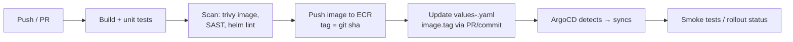

### 7.2 Real workflow (with the two things interviewers probe: OIDC + environments)

```yaml
name: build-and-release
on:
  push:
    branches: [main]

permissions:
  id-token: write     # OIDC federation to AWS — NO stored AWS keys
  contents: write

jobs:
  build:
    runs-on: ubuntu-latest
    steps:
      - uses: actions/checkout@v4
      - uses: aws-actions/configure-aws-credentials@v4
        with:
          role-to-assume: arn:aws:iam::123456789012:role/gha-ecr-push
          aws-region: us-east-1
      - name: Build, scan, push
        run: |
          IMAGE=123456789012.dkr.ecr.us-east-1.amazonaws.com/payments-api:${GITHUB_SHA::7}
          docker build -t $IMAGE .
          trivy image --exit-code 1 --severity CRITICAL $IMAGE
          aws ecr get-login-password | docker login --username AWS --password-stdin 123456789012.dkr.ecr.us-east-1.amazonaws.com
          docker push $IMAGE

  release-dev:
    needs: build
    environment: dev            # env-scoped secrets & rules
    runs-on: ubuntu-latest
    steps:
      - uses: actions/checkout@v4
        with: { repository: org/deploy-configs, token: "${{ secrets.DEPLOY_PAT }}" }
      - name: Bump image tag
        run: |
          yq -i '.image.tag = env(TAG)' charts/payments-api/values-dev.yaml
          git commit -am "dev: payments-api ${TAG}" && git push
        env: { TAG: "${{ github.sha }}" }

  release-prod:
    needs: release-dev
    environment: prod           # required reviewers = manual approval gate
    runs-on: ubuntu-latest
    steps: [ ... same bump against values-prod.yaml ... ]
```

Talking points:
- **OIDC to AWS**: GitHub issues a short-lived JWT; an IAM role trusts `token.actions.githubusercontent.com` filtered by repo/branch claim. No long-lived keys in secrets. Say this — instantly signals seniority.
- **Environments + required reviewers** = promotion gates (dev auto, prod approved).
- Reusable workflows (`workflow_call`) + composite actions = the "reusable pipelines across 15+ apps" resume line.
- Caching (`actions/cache` for deps, Docker layer cache), matrix builds, concurrency groups to cancel stale runs.
- **Result line**: multi-env delivery for 5 EKS environments, deployment time −60%.

---

## 8. Observability — Grafana Stack

### 8.1 The three pillars + why

- **Metrics** (Prometheus): numeric time series — cheap, great for alerting/trends.
- **Logs** (Loki): the *why* behind a spike.
- **Traces** (Tempo — mention as roadmap): request path across services.
- Goal I state in interviews: **cut time-to-detect** (resume line) — find out from alerts, not from users.

### 8.2 Architecture I deployed (kube-prometheus-stack via ArgoCD)

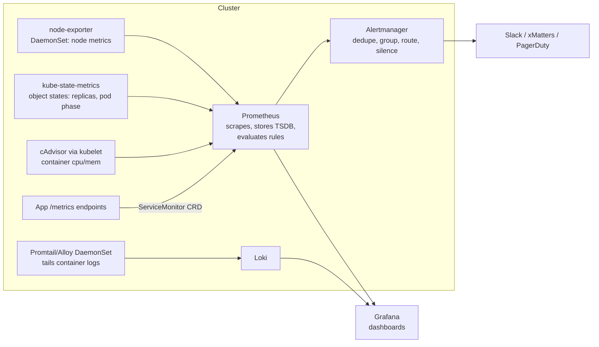

- **Pull model**: Prometheus scrapes `/metrics` (Prometheus text format) — discovery via K8s API. **Prometheus Operator** adds CRDs: `ServiceMonitor`/`PodMonitor` (what to scrape), `PrometheusRule` (alerts) — teams self-serve monitoring through GitOps.
- Metric types: **counter** (only up — use `rate()`), **gauge**, **histogram** (buckets — use `histogram_quantile`), summary.

### 8.3 PromQL you must write on a whiteboard

```promql
# Pod CPU usage vs requests (throttling risk)
sum(rate(container_cpu_usage_seconds_total{namespace="payments"}[5m])) by (pod)
  / sum(kube_pod_container_resource_requests{resource="cpu",namespace="payments"}) by (pod)

# p99 latency from a histogram
histogram_quantile(0.99, sum(rate(http_request_duration_seconds_bucket{job="payments"}[5m])) by (le))

# Error ratio (the S in RED: Rate, Errors, Duration)
sum(rate(http_requests_total{status=~"5.."}[5m])) / sum(rate(http_requests_total[5m]))

# Node memory pressure
1 - node_memory_MemAvailable_bytes / node_memory_MemTotal_bytes

# Pods restarting (crash loops)
increase(kube_pod_container_status_restarts_total[1h]) > 3
```

### 8.4 Alert rule (PrometheusRule CRD) — real example

```yaml
apiVersion: monitoring.coreos.com/v1
kind: PrometheusRule
metadata:
  name: platform-alerts
spec:
  groups:
    - name: workload.rules
      rules:
        - alert: PodCrashLooping
          expr: increase(kube_pod_container_status_restarts_total[15m]) > 3
          for: 5m                      # must be true 5m — kills flapping alerts
          labels: {severity: warning, team: platform}
          annotations:
            summary: "{{ $labels.namespace }}/{{ $labels.pod }} restarting"
            runbook_url: "https://confluence/x/pod-crashloop"
        - alert: NodeDiskFillingUp
          expr: predict_linear(node_filesystem_avail_bytes{mountpoint="/"}[6h], 24*3600) < 0
          for: 30m
          labels: {severity: critical}
```

**Alertmanager** design: route by `severity`/`team` labels → critical pages (xMatters/PagerDuty), warning → Slack; **grouping** (one node dies → 1 notification, not 40), **inhibition** (NodeDown suppresses pod alerts on that node), **silences** during maintenance.

**Alert philosophy** (say this): alert on **symptoms users feel** (error rate, latency, saturation), page only on actionable+urgent; everything else is a ticket or dashboard. Every alert links a runbook.

### 8.5 Dashboards I built (resume line)

Per-cluster "platform health": API server latency/error rate, node CPU/mem/disk, pod restarts, pending pods, PVC usage, top namespaces by usage. Per-service RED dashboards. Dashboards as code: JSON/ConfigMaps synced by Grafana sidecar via GitOps — no click-ops dashboards.

---

## 9. Observability — ELK Stack + SLO/SLI

### 9.1 ELK architecture (First American role)

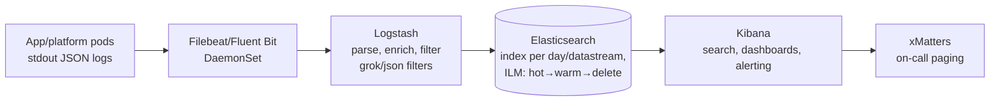

- **Filebeat DaemonSet** tails `/var/log/containers/*.log`, adds K8s metadata (namespace, pod, labels).
- **Logstash** pipelines: `input → filter (grok/json/mutate) → output`. Structured JSON logging at source avoids grok pain — I pushed teams to log JSON.
- **Elasticsearch**: inverted index; shards/replicas; **ILM** (hot→warm→cold→delete) to control cost; index templates + datastreams.
- **Kibana**: KQL queries, dashboards for ArgoCD & EKS platform apps, alerting rules → connector → **xMatters** (on-call schedules, escalation chains — ack or it escalates).
- ELK vs Loki (expect this): ES full-text indexes everything = powerful search, heavy resources; Loki indexes only labels = cheap, grep-style; I've run both — pick by query needs and budget.

### 9.2 SLI / SLO / SLA / Error budget (SRE core — resume says "defined SLOs/SLIs")

- **SLI** = a measurement: `good events / total events` (e.g., % requests < 300ms and non-5xx).
- **SLO** = internal target on an SLI: "99.9% over rolling 30 days".
- **SLA** = external contract with penalties. SLO must be stricter than SLA.
- **Error budget** = 1 − SLO = 0.1% ≈ 43m 49s/month of allowed badness. **Budget healthy → ship fast; budget burned → freeze features, work reliability.** This is the mechanism that ends dev-vs-ops fights — say exactly that.
- **Burn-rate alerting** (multi-window): page when burning budget 14.4× too fast over 1h AND 5m (fast burn); ticket at 3× over 6h (slow burn). Avoids both false pages and silent budget death.

Example SLO I'd quote for ArgoCD-as-a-platform-service: "99.5% of syncs complete successfully within 5 minutes, measured over 30 days from argocd_app_sync metrics."

---

## 10. Velero — Backup & Disaster Recovery

### 10.1 What Velero protects (and what EKS doesn't)

AWS backs up EKS **etcd**, but that doesn't help you restore *your* workloads selectively, migrate clusters, or recover PV **data**. Velero = backup/restore/migrate **K8s objects + volume data**.

### 10.2 Architecture

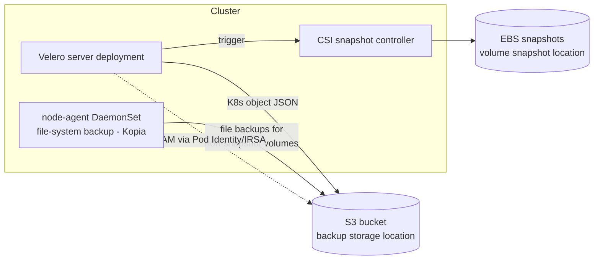

Two volume strategies (know both):
1. **CSI VolumeSnapshots** → native EBS snapshots (fast, crash-consistent, same-cloud).
2. **File-system backup (Kopia/restic)** → works across storage types/clouds, slower — what you need for on-prem→EKS migration.

### 10.3 Real usage

```bash
# Install (server side pieces via helm/ArgoCD; CLI:)
velero backup create daily-platform \
  --include-namespaces payments,platform \
  --snapshot-volumes --ttl 720h

# Scheduled (the real setup — this is a CRD, GitOps-managed)
velero schedule create daily --schedule="0 1 * * *" \
  --include-namespaces '*' --exclude-namespaces kube-system --ttl 720h

velero backup describe daily-platform --details   # ALWAYS verify PodVolumeBackups/snapshots
velero restore create --from-backup daily-platform \
  --include-namespaces payments --namespace-mappings payments:payments-restore
```

### 10.4 "Implemented and TESTED" — the resume word that matters

Untested backup = no backup. My validation drill (be ready to narrate):
1. Quarterly restore test into a **sandbox namespace/cluster**.
2. Verify: object counts match, PVC data integrity (checksum a known file), app boots, secrets/webhooks/certs valid.
3. Gotchas found in testing (great war stories): restored Services keep old LB annotations → new LBs spun up; resources with `ownerReferences` to missing owners; CRDs must restore before CRs (Velero handles ordering, but operator-managed resources may need the operator excluded/re-reconciled); IRSA/Pod Identity role mappings are cluster-specific → fix on cross-cluster restore.
4. Documented **RTO/RPO**: RPO = schedule frequency (24h daily, 1h for critical ns), RTO = measured restore drill time.

---

## 11. Kubernetes Security — CrowdStrike Falcon

### 11.1 Concepts

- **Runtime security** = detect/prevent threats *while workloads run* (vs image scanning = before run). Both needed: scan in CI (trivy) + runtime sensor (Falcon).
- Threats it catches: crypto-miners in compromised pods, container escapes, reverse shells, anomalous process/network behavior, drift from image (process not in the original image).

### 11.2 Deployment I did

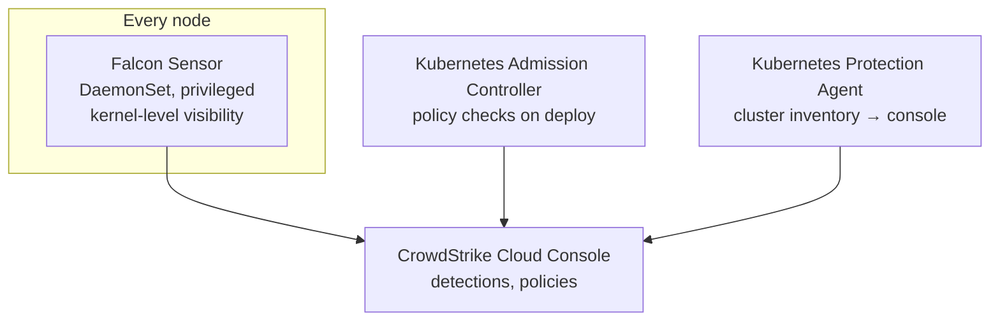

- **Falcon sensor as DaemonSet** (deployed via Helm through ArgoCD): node-level kernel visibility covers every container on the node — no per-pod sidecars.
- Needs `privileged`/host access → carve explicit **PodSecurity/PSA exceptions** for its namespace only; document why (interviewers love the "security tool itself needs risky privileges — how do you scope it" discussion).
- Rollout at scale: staged by cluster (dev → nonprod → prod), watched node CPU/mem overhead on Grafana before/after, tuned detection policies to cut false positives before enabling prevention mode.
- Operational integration: detections → SOC; I owned sensor health (version currency, pods Running on all nodes — alert if DaemonSet desired ≠ ready).

### 11.3 Broader K8s security checklist (they'll widen the question)

RBAC least privilege · no default SA tokens (`automountServiceAccountToken: false`) · Pod Security Admission (baseline/restricted) · NetworkPolicies default-deny · image scanning + signed images · private API endpoint · secrets external (§12) · audit logs on · CIS benchmark (kube-bench) · runtime (Falcon).

---

## 12. Secrets & Storage on EKS

Resume line: *"AWS Secrets Manager, Pod Identity, and EBS CSI Driver for secure credential injection and dynamic volume provisioning."* Expect deep questions here.

### 12.1 Why not plain K8s Secrets

K8s Secrets are **base64, not encryption** — anyone with namespace read RBAC sees them; they live in etcd; no rotation, no audit trail of value access. Enterprise answer: keep secrets in **AWS Secrets Manager** (encrypted with KMS, rotation, audit via CloudTrail) and inject into pods.

### 12.2 Pod → AWS identity: IRSA vs Pod Identity (know BOTH)

| | IRSA (older) | **EKS Pod Identity (what I used)** |
|---|---|---|
| Mechanism | OIDC federation: SA token → `sts:AssumeRoleWithWebIdentity` | `eks-pod-identity-agent` addon on each node; `sts:AssumeRole` via EKS Auth API |
| Setup | Create OIDC provider per cluster; trust policy per role per cluster/SA | One **pod identity association**: `aws eks create-pod-identity-association --cluster X --namespace payments --service-account payments-sa --role-arn ...` |
| Trust policy | References cluster OIDC URL (breaks on cluster rebuild) | Generic `pods.eks.amazonaws.com` principal — **same role reusable across clusters** |
| Why it matters | — | Simpler ops at multi-cluster scale; survives cluster recreation |

Flow: pod's SDK → credential chain hits the pod-identity agent on the node → agent exchanges the pod's projected SA token with EKS Auth → returns temp role credentials. **No keys anywhere.**

### 12.3 Secret injection: Secrets Store CSI Driver + ASCP

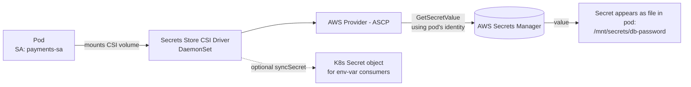

```yaml
apiVersion: secrets-store.csi.x-k8s.io/v1
kind: SecretProviderClass
metadata:
  name: payments-db-creds
  namespace: payments
spec:
  provider: aws
  parameters:
    objects: |
      - objectName: "prod/payments/db"
        objectType: "secretsmanager"
        jmesPath:
          - path: password
            objectAlias: db-password
  secretObjects:              # optional: also materialize a K8s Secret
    - secretName: payments-db
      type: Opaque
      data: [{objectName: db-password, key: password}]
---
# In the Deployment pod spec:
#   volumes:
#     - name: secrets
#       csi:
#         driver: secrets-store.csi.k8s.io
#         readOnly: true
#         volumeAttributes: {secretProviderClass: payments-db-creds}
```

Key nuances: retrieval happens at **pod start** using the **pod's own IAM identity** (least privilege per app: role policy allows only `prod/payments/*` secrets); rotation → `rotationPollInterval` re-mounts files (app must re-read, or restart pods). Alternative worth naming: **External Secrets Operator** (syncs SM → K8s Secrets continuously) — I chose CSI to avoid persisting values as K8s Secrets where possible.

### 12.4 Storage: EBS CSI Driver + dynamic provisioning

- **CSI** = standard plugin interface so storage vendors live out-of-tree. EBS CSI = controller Deployment (create/attach volumes via AWS API — needs IAM via Pod Identity) + node DaemonSet (mount/format).
- Flow: PVC created → StorageClass `provisioner: ebs.csi.aws.com` → controller creates EBS vol → PV bound → kubelet attaches & mounts.

```yaml
apiVersion: storage.k8s.io/v1
kind: StorageClass
metadata: {name: gp3-encrypted}
provisioner: ebs.csi.aws.com
parameters: {type: gp3, encrypted: "true"}
volumeBindingMode: WaitForFirstConsumer   # create vol in the AZ where the pod lands!
allowVolumeExpansion: true
reclaimPolicy: Delete                      # Retain for precious data
```

Must-know gotchas (real ops): **EBS is AZ-bound** — `WaitForFirstConsumer` prevents "volume in 1a, pod scheduled in 1b" deadlock; pod stuck `ContainerCreating` with volume attach errors → node in wrong AZ or vol still attached to a dead node (force detach); expansion = edit PVC (online for gp3); `Retain` policy leaves PV `Released` — recover data by re-creating a PV pointing at the same volume ID. RWO (EBS) vs RWX (need EFS CSI).

---

## 13. Portainer

One-paragraph mastery (it's a smaller line item):
- **What**: web UI for managing multiple container environments (K8s clusters, Docker hosts) from one pane — RBAC per team, resource browsing, deploy/rollback, registry integration.
- **Why we used it**: on-prem estate with mixed teams — gave app teams **scoped self-service** (their namespaces only) without shipping kubeconfigs, and gave ops one place to see all clusters.
- **How**: Portainer server central; **Portainer agent** DaemonSet/Deployment per cluster connects outbound (Edge agent = works behind NAT/firewall — no inbound holes to on-prem). Mapped AD groups → Portainer teams → namespace-scoped access.
- Honest positioning in interviews: "convenience/RBAC UI layer for humans; all real deployment stayed GitOps via ArgoCD."

---

## 14. OpenShift PoC (CRC)

Resume: prototyped on **OpenShift Local (CRC)**, presented platform fit & migration findings.

### 14.1 OpenShift vs vanilla K8s (the whole interview here)

| Area | Kubernetes | OpenShift |
|---|---|---|
| Distribution | DIY assembly (CNI, ingress, registry, CI all chosen) | Opinionated platform: everything included & supported (Red Hat) |
| Ingress | Ingress + controller you install | **Routes** (HAProxy router built-in; Route predates Ingress) |
| Security default | Pods can run as root unless you stop them | **SCCs (SecurityContextConstraints)**: `restricted` by default — random non-root UID; many public images break → the #1 migration finding |
| Builds | External CI | **BuildConfigs/S2I** (source-to-image), internal registry, ImageStreams |
| UI | Dashboard (optional) | Full web console, developer + admin views |
| Users/Projects | Namespaces | **Projects** (namespace + annotations + tighter self-provisioning) |
| Ops | You upgrade components | Cluster Operators manage themselves; `oc` CLI superset of kubectl |

### 14.2 What I actually did in the PoC

1. Ran **CRC** (single-node OpenShift on a workstation) — sized ~4 vCPU/12GB.
2. Deployed representative workloads: our Helm charts → found SCC failures (images running as fixed UID/root → needed `runAsUser` removal or `anyuid` SCC discussion), Route vs Ingress conversion, internal registry integration.
3. Evaluated: ArgoCD compatibility (works — OpenShift GitOps is literally ArgoCD), monitoring (built-in Prometheus stack overlaps with ours), RBAC/SCC operational model, subscription cost vs self-managed K8s effort.
4. Presented findings: migration effort concentrated in **image compliance (non-root) and manifest deltas (Routes, SCCs)**; platform value = supported stack + stronger default security posture.

---

## 15. Python Automation

Resume: *"Python tools cleaning unused K8s resources across namespaces and EKS clusters — saved 15+ hrs/week."* Be ready to sketch this code.

### 15.1 Design

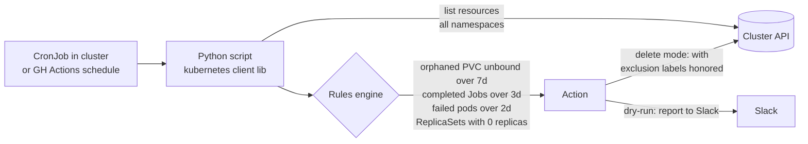

Safety principles (SAY these): **dry-run by default**, allowlist/exclusion label (`cleanup.io/skip: "true"`), age thresholds, report before delete, RBAC-scoped ServiceAccount (only verbs/resources it needs), audit log of everything deleted.

### 15.2 Condensed but real code

```python
from kubernetes import client, config
from datetime import datetime, timezone, timedelta
import argparse

def load():
    try: config.load_incluster_config()     # running as CronJob w/ ServiceAccount
    except config.ConfigException: config.load_kube_config()  # local dev

def old(ts, days): return ts < datetime.now(timezone.utc) - timedelta(days=days)

def find_completed_jobs(batch, days=3):
    for j in batch.list_job_for_all_namespaces().items:
        if j.metadata.labels and j.metadata.labels.get("cleanup.io/skip") == "true":
            continue
        done = j.status.succeeded and j.status.completion_time
        if done and old(j.status.completion_time, days):
            yield ("Job", j.metadata.namespace, j.metadata.name)

def find_orphan_pvcs(core, days=7):
    mounted = {(v.persistent_volume_claim.claim_name, p.metadata.namespace)
               for p in core.list_pod_for_all_namespaces().items
               for v in (p.spec.volumes or []) if v.persistent_volume_claim}
    for pvc in core.list_persistent_volume_claim_for_all_namespaces().items:
        if (pvc.metadata.name, pvc.metadata.namespace) not in mounted \
           and old(pvc.metadata.creation_timestamp, days):
            yield ("PVC", pvc.metadata.namespace, pvc.metadata.name)

if __name__ == "__main__":
    ap = argparse.ArgumentParser()
    ap.add_argument("--delete", action="store_true")  # default = dry-run
    args = ap.parse_args()
    load()
    core, batch = client.CoreV1Api(), client.BatchV1Api()
    targets = [*find_completed_jobs(batch), *find_orphan_pvcs(core)]
    for kind, ns, name in targets:
        print(f"{'DELETING' if args.delete else 'DRY-RUN'}: {kind} {ns}/{name}")
        if args.delete:
            if kind == "Job":
                batch.delete_namespaced_job(name, ns, propagation_policy="Background")
            elif kind == "PVC":
                core.delete_namespaced_persistent_volume_claim(name, ns)
```

Deployment: containerized, ran as **CronJob** with a dedicated ServiceAccount + minimal Role, results to Slack webhook; multi-cluster via looping kubeconfig contexts from CI. Impact framing: reclaimed EBS from orphan PVCs (direct $), cut etcd object bloat, 15+ hrs/week of manual sweeps eliminated.

Other Python automations to mention: boto3 scripts (untagged/idle resource reports), Prometheus API queries for capacity reports, ArgoCD API health sweeps.

---

## 16. Incident Management & SRE Practice

Resume: led bridges, RCAs, reliability docs → **MTTR −40%**.

### 16.1 Incident lifecycle

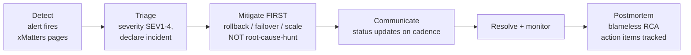

Roles on a bridge (I ran these): **Incident Commander** (coordinates, decides — I did this), comms lead (stakeholder updates so engineers aren't interrupted), ops/SME (hands on keyboard). One person ≠ all roles on a SEV1.

**Mitigate before you diagnose** — rollback first (GitOps makes this a `git revert`), find root cause after. That single behavioral change is a big chunk of the −40% MTTR; other contributors: runbooks linked from every alert, better alert routing (right team paged first), dashboards per service so triage starts with data.

### 16.2 Blameless RCA structure (be ready to walk one)

1. Impact (who/what/how long, SLO budget consumed) → 2. Timeline (detection → mitigation → resolution timestamps) → 3. Root cause via **5 Whys** → 4. What went well/poorly → 5. Action items with owners & due dates (tracked in Jira, reviewed weekly).

**Have one real story rehearsed.** Template if needed: "ArgoCD sync pushed a config change; pods OOMKilled on rollout (new feature raised memory). Alert on restart spike → bridge → `git revert` mitigated in ~10 min → RCA found no memory-limit review in PR process → action items: resource-diff bot on deploy PRs + staging soak with load. Detection-to-mitigation 12 minutes because the rollback path was one revert."

### 16.3 Vocabulary

MTTD/MTTA/MTTR · SEV levels & criteria · error budget policy (§9.2) · toil (manual, repetitive, automatable — measure & burn down: my Python cleanup = toil elimination) · on-call hygiene (page = urgent+actionable only) · change freeze windows · runbooks vs playbooks · Confluence runbook culture (resume line: reduced tribal knowledge, faster onboarding).

---

## 17. Terraform Modules + Ansible (earlier roles)

- **Terraform modules** (ITC role): reusable modules for EC2/S3/EBS/VPC — inputs via `variables.tf`, outputs chained between modules (VPC outputs → EC2 inputs), versioned via git tags (`source = "git::...//modules/vpc?ref=v1.4.0"`), consumed by app teams. Provisioning days → hours.
- **Terraform vs Ansible** (guaranteed question): Terraform = *provisioning*, declarative, tracks state, immutable mindset. Ansible = *configuration management*, procedural-ish, agentless over SSH, idempotent modules, no state file. **Pattern I used: TF creates the EC2 fleet → outputs IPs → Ansible inventory (dynamic AWS EC2 inventory plugin) → playbooks install/configure (users, packages, hardening, app config).**

```yaml
# playbook essence
- hosts: web
  become: true
  vars: {app_port: 8080}
  tasks:
    - name: Install nginx
      ansible.builtin.package: {name: nginx, state: present}
    - name: Template config
      ansible.builtin.template: {src: nginx.conf.j2, dest: /etc/nginx/nginx.conf}
      notify: reload nginx
  handlers:
    - name: reload nginx
      ansible.builtin.service: {name: nginx, state: reloaded}
```

Know: idempotency (rerun = no change), handlers (run once on change), roles structure, inventory groups/group_vars, `ansible-vault` for secrets, `--check --diff` dry runs.

---

## 18. Linux Essentials

Platform roles always probe Linux. Minimum bar:

- **Processes**: `ps aux`, `top/htop`, signals (`SIGTERM` 15 graceful vs `SIGKILL` 9 — maps directly to pod termination: K8s sends TERM, waits `terminationGracePeriodSeconds`, then KILL), zombies, `nice`.
- **Containers ARE Linux**: **namespaces** (pid, net, mnt, uts, ipc, user — isolation views) + **cgroups** (cpu/memory limits — where OOMKill comes from) + union filesystems (image layers). A container = a process with namespaces + cgroups. Saying this well is a senior signal.
- **Debugging box slowness**: `uptime` (load vs cores) → `vmstat 1` / `top` (CPU vs iowait) → `free -h` (memory/swap) → `df -h` + `df -i` (disk & **inodes** — full inodes with free space is a classic) → `iostat -x` (disk latency) → `ss -tulpn` (ports) → `journalctl -u kubelet -f`, `dmesg -T | grep -i oom`.
- **Files/perms**: `chmod`/`chown`, octal (750), suid/sticky, symlink vs hardlink, `/proc` as kernel window (`/proc/<pid>/limits`).
- **Networking**: `ip a`, `ip route`, `curl -v`, `dig`, `tcpdump -i any port 443`, `/etc/resolv.conf` (ndots issue in K8s DNS!), iptables concept (kube-proxy).
- **systemd**: `systemctl status/restart`, unit files, `journalctl -u <svc> --since "1h ago"` (kubelet & containerd are systemd services on nodes).
- **Text tools**: `grep -r`, `awk '{print $2}'`, `sed -i`, `sort | uniq -c | sort -rn` (top talkers from logs), `xargs`.

---

## 19. Hands-on Scenarios

Do these before interviews — they cover different real-time situations and make every resume line demo-able. Prereqs: Docker Desktop, a local cluster (`kind` or minikube), `kubectl`, `helm`, `terraform`, AWS free-tier account (Scenarios 1 & 4 can also be done partially local).

### Scenario 1 — Platform build: Terraform → EKS → ArgoCD → Helm app (the core story)

**Real-world frame**: "new environment request: stand up a cluster and deliver an app via GitOps."

```bash
# 1. Provision (or use kind locally: kind create cluster --name platform)
cd terraform/envs/dev && terraform init && terraform plan -out tfplan && terraform apply tfplan
aws eks update-kubeconfig --name platform-dev

# 2. Install ArgoCD
kubectl create namespace argocd
kubectl apply -n argocd -f https://raw.githubusercontent.com/argoproj/argo-cd/stable/manifests/install.yaml
kubectl -n argocd get secret argocd-initial-admin-secret -o jsonpath='{.data.password}' | base64 -d

# 3. Create a Helm chart, push to a GitHub repo
helm create payments-api   # then edit values.yaml: image nginx, add values-dev.yaml

# 4. Apply the Application CRD from section 5.3 pointing at your repo, watch it sync
kubectl apply -f app.yaml
kubectl -n argocd get applications -w

# 5. PROVE GitOps: change replicas in Git -> auto-sync. Then kubectl scale the
#    deployment manually -> watch selfHeal revert it. Then git revert -> rollback.
```

**Exercises**: break the chart (bad indent) and debug via repo-server logs; add a PreSync Job hook; build app-of-apps with 2 child apps.

### Scenario 2 — Incident drill: observability, alert → diagnose → fix (the SRE story)

**Real-world frame**: "p99 latency alert fires at 2am — walk me through it."

```bash
# 1. Monitoring stack
helm repo add prometheus-community https://prometheus-community.github.io/helm-charts
helm install kps prometheus-community/kube-prometheus-stack -n monitoring --create-namespace
kubectl -n monitoring port-forward svc/kps-grafana 3000:80   # admin / prom-operator

# 2. Deploy a victim app with a tight memory limit
kubectl create deploy stress --image=polinux/stress -- stress --vm 1 --vm-bytes 300M --vm-hang 0
kubectl set resources deploy stress --limits=memory=200Mi

# 3. Watch it OOMKill -> CrashLoopBackOff. Now DIAGNOSE like the interview:
kubectl get pods -w
kubectl describe pod <pod>              # Last State: OOMKilled, exit code 137
kubectl get events --sort-by=.lastTimestamp

# 4. In Grafana: find restarts via PromQL
#    increase(kube_pod_container_status_restarts_total[15m]) > 0
# 5. Create the PrometheusRule from section 8.4, watch the alert fire in Alertmanager
# 6. Fix (raise limit), then write a 5-line mini-RCA. Practice narrating end-to-end.
```

**Exercises**: add a bad readiness probe and watch endpoints empty out (service "down" with pods Running); fill a PVC and alert on `kubelet_volume_stats`; simulate node pressure with `kubectl drain`.

### Scenario 3 — DR drill: Velero backup, disaster, restore (the resilience story)

**Real-world frame**: "namespace deleted by accident / cluster lost — recover."

```bash
# 1. Local: run MinIO as the S3 target (or a real S3 bucket)
kubectl apply -f https://raw.githubusercontent.com/vmware-tanzu/velero/main/examples/minio/00-minio-deployment.yaml
velero install --provider aws --plugins velero/velero-plugin-for-aws:v1.10.0 \
  --bucket velero --secret-file ./minio-creds --use-volume-snapshots=false \
  --use-node-agent --default-volumes-to-fs-backup \
  --backup-location-config region=minio,s3ForcePathStyle=true,s3Url=http://minio.velero.svc:9000

# 2. Stateful victim app: deploy postgres with a PVC, insert marker data
kubectl create ns crm
helm install pg oci://registry-1.docker.io/bitnamicharts/postgresql -n crm
kubectl exec -n crm pg-postgresql-0 -- psql -U postgres -c \
  "CREATE TABLE t(x text); INSERT INTO t VALUES ('backup-proof-42');"

# 3. Backup, verify, DESTROY, restore
velero backup create crm-bkp --include-namespaces crm
velero backup describe crm-bkp --details          # check PodVolumeBackups completed!
kubectl delete namespace crm                       # the "disaster"
velero restore create --from-backup crm-bkp
kubectl exec -n crm pg-postgresql-0 -- psql -U postgres -c "SELECT * FROM t;"  # data back?
```

**Exercises**: restore into a *different* namespace with `--namespace-mappings`; create a `velero schedule` + TTL; write down measured RTO — that's your interview number.

### Scenario 4 — Secure secrets: Secrets Manager + Pod Identity + CSI (the security story)

**Real-world frame**: "remove DB passwords from K8s Secrets/Git."

On a real EKS cluster (needs AWS): install `eks-pod-identity-agent` addon + Secrets Store CSI driver + ASCP (helm) → create a secret in Secrets Manager → IAM role with `secretsmanager:GetSecretValue` on that ARN only → `aws eks create-pod-identity-association ...` → apply the `SecretProviderClass` from §12.3 → deploy a pod mounting it → `kubectl exec ... cat /mnt/secrets/db-password`.
**Negative test (do it!)**: point a pod with a *different* SA at the same SecretProviderClass → mount fails with AccessDenied → you can now *demonstrate* least privilege.
Local alternative: run External Secrets Operator against a mock/localstack to grasp the sync model.

### Scenario 5 — CI/CD end-to-end: GitHub Actions → ECR → GitOps bump (the delivery story)

**Real-world frame**: "commit to running in prod with approval gates."

1. Small Flask/Go app + Dockerfile in repo A; deploy-configs repo B with the Helm chart.
2. Workflow from §7.2: build → trivy scan → push (use Docker Hub or ECR with OIDC role) → `yq` bump `values-dev.yaml` in repo B via PAT.
3. ArgoCD (from Scenario 1) watches repo B → auto-deploys dev.
4. Add `environment: prod` job with a required reviewer → approve → prod bump.
5. Break it on purpose: push an image that crashes → watch ArgoCD Degraded → `git revert` → recovered. Time yourself.

**Exercises**: make the workflow reusable (`workflow_call`) and consume from a second app repo — that's the "15+ applications" line; add concurrency groups; add a rollout smoke test step (`kubectl rollout status`).

### Scenario 6 — Python cleanup bot (the automation story)

Run the §15.2 script against your kind cluster: create 5 completed Jobs and 2 orphan PVCs → dry-run report → labeled exclusion (`cleanup.io/skip=true`) → delete mode → package as CronJob with a minimal RBAC Role. Then narrate: rules, safety rails, impact.

---

## 20. Rapid-fire Q&A Bank

**Kubernetes**
- *Deployment vs StatefulSet?* Stable identity + per-pod storage + ordered rollout vs interchangeable replicas.
- *Pod stuck Pending?* describe → events: resources / PVC / taints / affinity.
- *What happens when a node dies?* node-controller marks NotReady (~40s) → after tolerance (~5m default) pods evicted → rescheduled; StatefulSet pods wait (at-most-one semantics); LB health checks pull the node early.
- *Limits vs requests?* Scheduling guarantee vs cgroup cap; CPU throttles, memory kills.
- *How does a Service find pods?* Label selector → EndpointSlice → kube-proxy iptables/IPVS → DNAT to pod IP.
- *Zero-downtime deploy requirements?* Readiness probe + rolling update params + PDB + preStop/graceful shutdown handling SIGTERM + connection draining.

**Terraform**
- *State file lost?* Restore backend versioning (S3 versioning!); else `terraform import` resources back — say "versioned, encrypted, locked remote state" as prevention.
- *Two people apply at once?* State locking (DynamoDB/lockfile) blocks the second.
- *Module vs resource drift, `-target`, `moved` blocks, `import` blocks* — know they exist and when.
- *Secrets in state?* State can contain them in plaintext → encrypt backend, restrict access, prefer data sources fetching at apply time.

**GitOps/ArgoCD**
- *ArgoCD vs Flux?* Both pull-based; ArgoCD = UI + app-centric + AppProjects; Flux = toolkit/CRD-centric. I ran ArgoCD at scale.
- *Secrets in Git?* Never plaintext: SOPS/SealedSecrets, or better — reference external stores (§12).
- *Sync fails midway?* Resources applied are kept; app shows OutOfSync/Degraded; retry policy, or `argocd app sync --prune`; hooks make risky steps atomic-ish.

**Observability/SRE**
- *Counter vs gauge?* Monotonic (use rate) vs point-in-time.
- *Why `for:` in alerts?* Anti-flap — condition must persist.
- *SLO for a service — walk me through.* Pick user-journey SLI → measure current baseline → set achievable SLO → error budget policy → burn-rate alerts → review quarterly.
- *Page vs ticket?* Urgent+actionable+user-impacting = page; else ticket.

**Security**
- *Pod compromised — blast radius controls?* Least-priv SA (no default token), NetworkPolicy egress deny, non-root + readOnlyRootFilesystem, seccomp, runtime detection (Falcon), namespace isolation.
- *Why is base64 not encryption?* It's encoding — reversible with no key. (They ask this to weed out.)

**Behavioral (prepare 1 story each, STAR format)**
- Toughest production incident you led. (Have timeline + numbers.)
- A migration/decommission you executed safely. (§4.3 story.)
- Conflict with an app team over a platform decision. (e.g., selfHeal reverting their hotfixes → agreed emergency-change process.)
- Something you automated and its measurable impact. (§15.)
- A time you were wrong. (e.g., alert threshold too aggressive → pager fatigue → burn-rate rework.)

---

## Final prep checklist

- [ ] Run Scenarios 1–3 minimum (1 evening each); 4–6 if time allows.
- [ ] Rehearse the 90-second narrative out loud.
- [ ] One rehearsed war story per: incident, migration, automation, security rollout.
- [ ] Whiteboard from memory: K8s architecture (§2.2), GitOps flow (§5.2), monitoring stack (§8.2).
- [ ] Re-derive every number on the resume (60% deploy time, 40% MTTR, 15 hrs/wk) with the *mechanism* that produced it.

*Good luck — you did the work; this doc just makes sure you can prove it.*
