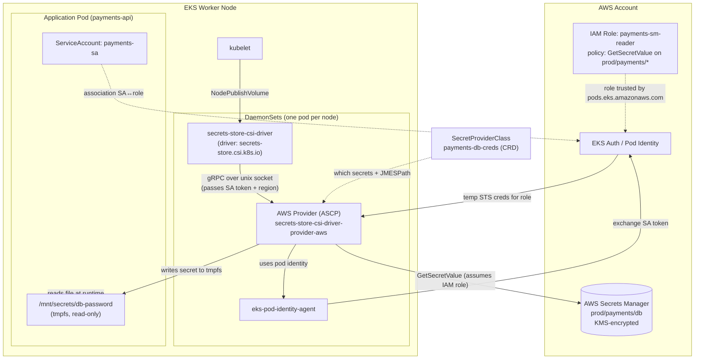
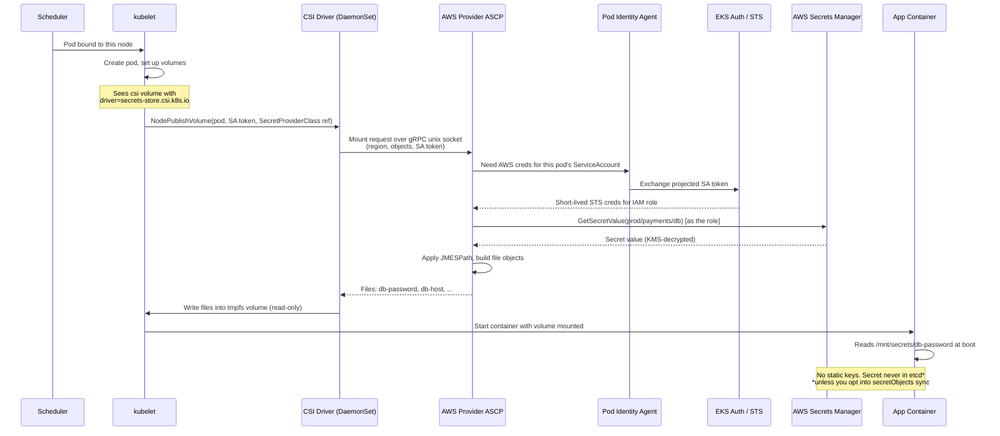
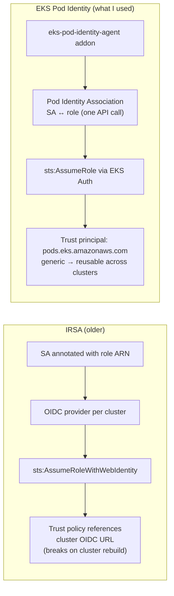
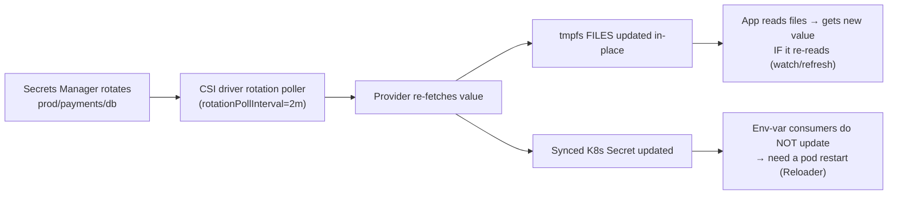
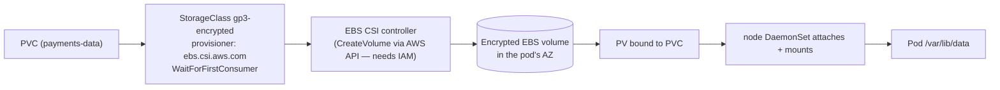

# Kubernetes Secret Management via the Secrets Store CSI Driver — Full Technical Deep-Dive

> **This is YOUR implementation, reconstructed so you can explain it end-to-end.**
> Resume line it backs: *"enterprise-grade Kubernetes secret & storage management integrating AWS Secrets Manager, Pod Identity, and Amazon EBS CSI Driver for secure credential injection and dynamic volume provisioning."*
> Read top-to-bottom once, then rehearse the **§10 interview narrative** out loud.

---

## 1. The Problem — Why this exists (start every interview answer here)

Plain Kubernetes `Secret` objects are **not** a security solution:

| Problem with native K8s Secrets | Consequence |
|---|---|
| Stored as **base64, not encrypted** (unless you enable etcd encryption-at-rest) | Anyone who can read the Secret object reads the value |
| Live in **etcd** and in the K8s API | Broad blast radius; every namespace-admin can see them |
| **No rotation** | A leaked secret stays valid forever |
| **No audit trail** of who read the value | Can't prove compliance |
| Secret value ends up in **Git** if you template it | Secret sprawl across the pipeline |

**The goal of my implementation:** keep the source of truth in **AWS Secrets Manager** (KMS-encrypted, rotation, CloudTrail audit) and inject secrets into pods **at runtime as files**, using the **pod's own AWS identity** — so no static credentials and no secret ever committed to Git or (ideally) persisted in etcd.

---

## 2. The Moving Parts (know every component by name)

```
┌─ Secrets Store CSI Driver ─────────────────────────────────────────────┐
│  A DaemonSet that registers a CSI driver named `secrets-store.csi.k8s.io`│
│  It ONLY mounts secrets as a volume at pod start. It is provider-agnostic│
│  and does the Kubernetes-side plumbing (NodePublishVolume).             │
└────────────────────────────────────────────────────────────────────────┘
┌─ AWS Provider (ASCP) ──────────────────────────────────────────────────┐
│  `secrets-store-csi-driver-provider-aws` — a separate DaemonSet.        │
│  The driver calls it over a Unix socket; IT talks to AWS Secrets Manager │
│  / SSM Parameter Store using the POD's IAM identity.                    │
└────────────────────────────────────────────────────────────────────────┘
┌─ SecretProviderClass (CRD) ────────────────────────────────────────────┐
│  Namespaced object that declares WHICH secrets to fetch, HOW to parse   │
│  them (JMESPath), file aliases, and optional sync to a K8s Secret.      │
└────────────────────────────────────────────────────────────────────────┘
┌─ Identity: EKS Pod Identity (or IRSA) ─────────────────────────────────┐
│  Maps a Kubernetes ServiceAccount → an AWS IAM role, so the pod gets    │
│  short-lived STS credentials. NO access keys anywhere.                  │
└────────────────────────────────────────────────────────────────────────┘
┌─ AWS Secrets Manager ──────────────────────────────────────────────────┐
│  Source of truth. KMS-encrypted, supports rotation, audited via         │
│  CloudTrail. (SSM Parameter Store works the same way via ASCP.)         │
└────────────────────────────────────────────────────────────────────────┘
```

Two crucial facts interviewers probe:
1. **The driver and the provider are two different DaemonSets.** The driver is generic; the provider is cloud-specific (AWS/Azure/GCP/Vault each have one).
2. **The CSI driver is mount-only.** It hooks the pod's volume-mount lifecycle — that's why secrets are delivered as **files in a tmpfs volume**, refreshed on mount and (optionally) on a rotation poll.

---

## 3. Overall Architecture Diagram



**One-sentence read of the diagram:** *kubelet asks the CSI driver to mount the volume → driver calls the AWS provider → provider gets the pod's temporary IAM credentials via Pod Identity → provider calls Secrets Manager and writes the value into a tmpfs file that the app reads.*

---

## 4. Runtime Sequence — What happens when the pod starts (the money diagram)



Key talking points on this flow:
- The secret is fetched **just-in-time at mount**, not baked into the image or manifest.
- The volume is **tmpfs (memory)** and **read-only** — it never touches disk.
- Auth uses **short-lived STS credentials** scoped to the pod's ServiceAccount → true least privilege per workload.

---

## 5. The Identity Piece — Pod Identity vs IRSA (guaranteed follow-up)

The provider must authenticate to AWS **as the pod**. Two mechanisms — know both, say which you used:



| | IRSA | **EKS Pod Identity** |
|---|---|---|
| Setup | OIDC provider + per-role trust policy per cluster | One `create-pod-identity-association` call |
| Trust policy | Tied to cluster OIDC URL | Generic `pods.eks.amazonaws.com` |
| Cluster rebuild | Trust policy breaks (new OIDC URL) | Survives — role is reusable |
| Best for | Existing/older clusters | **Multi-cluster scale (my case)** |

The AWS provider supports both. With Pod Identity you set `usePodIdentity: "true"` in the SecretProviderClass parameters (shown below).

---

## 6. Full Working Implementation (copy-paste, in order)

### Step 0 — Prerequisites
- EKS cluster, `kubectl`, `helm`, `aws` CLI.
- For Pod Identity: the `eks-pod-identity-agent` EKS add-on installed.

### Step 1 — Create the secret in AWS Secrets Manager
```bash
aws secretsmanager create-secret \
  --name prod/payments/db \
  --secret-string '{"username":"payments_app","password":"S3cr3t-P@ss","host":"payments-db.internal"}'
```

### Step 2 — Install the CSI driver + AWS provider (Helm)
```bash
# 1) The generic Secrets Store CSI Driver
helm repo add secrets-store-csi-driver \
  https://kubernetes-sigs.github.io/secrets-store-csi-driver/charts
helm install csi-secrets-store secrets-store-csi-driver/secrets-store-csi-driver \
  --namespace kube-system \
  --set syncSecret.enabled=true \          # allow optional sync to K8s Secret
  --set enableSecretRotation=true \        # enable rotation polling
  --set rotationPollInterval=2m

# 2) The AWS provider (ASCP) — separate DaemonSet
helm repo add aws-secrets-manager \
  https://aws.github.io/secrets-store-csi-driver-provider-aws
helm install secrets-provider-aws \
  aws-secrets-manager/secrets-store-csi-driver-provider-aws \
  --namespace kube-system
```

Verify both DaemonSets are Running on every node:
```bash
kubectl get pods -n kube-system -l 'app in (secrets-store-csi-driver, secrets-store-csi-driver-provider-aws)' -o wide
```

### Step 3 — Least-privilege IAM policy + role
```json
{
  "Version": "2012-10-17",
  "Statement": [
    {
      "Sid": "ReadPaymentsSecrets",
      "Effect": "Allow",
      "Action": ["secretsmanager:GetSecretValue", "secretsmanager:DescribeSecret"],
      "Resource": "arn:aws:secretsmanager:us-east-1:111122223333:secret:prod/payments/*"
    },
    {
      "Sid": "DecryptWithCMK",
      "Effect": "Allow",
      "Action": "kms:Decrypt",
      "Resource": "arn:aws:kms:us-east-1:111122223333:key/<cmk-id>"
    }
  ]
}
```
```bash
# Trust policy for Pod Identity
cat > trust.json <<'EOF'
{ "Version": "2012-10-17", "Statement": [{
  "Effect": "Allow",
  "Principal": { "Service": "pods.eks.amazonaws.com" },
  "Action": ["sts:AssumeRole", "sts:TagSession"]
}]}
EOF

aws iam create-role --role-name payments-sm-reader \
  --assume-role-policy-document file://trust.json
aws iam put-role-policy --role-name payments-sm-reader \
  --policy-name read-payments-secrets --policy-document file://policy.json
```

### Step 4 — ServiceAccount + Pod Identity association
```yaml
apiVersion: v1
kind: ServiceAccount
metadata:
  name: payments-sa
  namespace: payments
```
```bash
aws eks create-pod-identity-association \
  --cluster-name platform-prod \
  --namespace payments \
  --service-account payments-sa \
  --role-arn arn:aws:iam::111122223333:role/payments-sm-reader
```

### Step 5 — SecretProviderClass (the heart of it)
```yaml
apiVersion: secrets-store.csi.x-k8s.io/v1
kind: SecretProviderClass
metadata:
  name: payments-db-creds
  namespace: payments
spec:
  provider: aws
  parameters:
    usePodIdentity: "true"          # use EKS Pod Identity (default is IRSA)
    region: us-east-1
    objects: |
      - objectName: "prod/payments/db"
        objectType: "secretsmanager"
        # Break the JSON secret into individual files via JMESPath
        jmesPath:
          - path: username
            objectAlias: db-username
          - path: password
            objectAlias: db-password
          - path: host
            objectAlias: db-host
  # OPTIONAL: also project into a native K8s Secret for env-var consumers
  secretObjects:
    - secretName: payments-db          # created only while a pod mounts the volume
      type: Opaque
      data:
        - objectName: db-password       # the alias above
          key: password
        - objectName: db-username
          key: username
```

### Step 6 — Deployment that mounts it
```yaml
apiVersion: apps/v1
kind: Deployment
metadata:
  name: payments-api
  namespace: payments
spec:
  replicas: 2
  selector: { matchLabels: { app: payments-api } }
  template:
    metadata: { labels: { app: payments-api } }
    spec:
      serviceAccountName: payments-sa          # <-- the identity that can read the secret
      containers:
        - name: app
          image: 111122223333.dkr.ecr.us-east-1.amazonaws.com/payments-api:1.4.0
          # (A) Consume as FILES (most secure — value stays in tmpfs, not etcd)
          volumeMounts:
            - name: db-secrets
              mountPath: /mnt/secrets
              readOnly: true
          # (B) OR consume as ENV VARS from the synced K8s Secret
          env:
            - name: DB_PASSWORD
              valueFrom:
                secretKeyRef: { name: payments-db, key: password }
      volumes:
        - name: db-secrets
          csi:
            driver: secrets-store.csi.k8s.io
            readOnly: true
            volumeAttributes:
              secretProviderClass: payments-db-creds
```

### Step 7 — Verify (and the negative test that PROVES least privilege)
```bash
# Positive: the file is present inside the pod
kubectl exec -n payments deploy/payments-api -- ls -l /mnt/secrets
kubectl exec -n payments deploy/payments-api -- cat /mnt/secrets/db-password

# The synced K8s Secret exists only while a pod mounts the volume
kubectl get secret payments-db -n payments

# NEGATIVE TEST — prove per-pod least privilege:
# deploy a pod with a DIFFERENT ServiceAccount (no association) mounting the same SPC.
# Result: pod stuck ContainerCreating; describe shows AccessDenied from Secrets Manager.
kubectl describe pod <other-sa-pod> -n payments | grep -A3 -i "failed\|denied"
```

---

## 7. Secret Rotation — how it actually refreshes



**The nuance interviewers love:**
- **Files** update automatically on the poll interval — but your app must **re-read the file** (many apps only read at boot). A file-watcher or periodic re-read handles this.
- **Env vars** are set once at container start → they do **not** pick up rotation. Use a tool like **Stakater Reloader** to roll the Deployment when the synced Secret changes.
- This is exactly why **files are more secure and rotation-friendly** than env vars.

---

## 8. Secrets Store CSI Driver vs External Secrets Operator (know the trade-off)

| | **Secrets Store CSI Driver** (what I used) | External Secrets Operator (ESO) |
|---|---|---|
| Delivery | Mounts secrets as **files** at pod start (tmpfs) | **Syncs** SM → native K8s Secret continuously |
| Secret in etcd? | **No** (unless you opt into `secretObjects`) | **Yes** — always creates a K8s Secret |
| Coupling | Secret only exists while a pod mounts it | Secret exists independent of pods |
| Best when | You want minimal etcd exposure, file-based apps | Many consumers need a plain K8s Secret / env vars |
| Rotation | Poll + remount files | Refresh interval re-syncs the Secret |

**My reasoning in the interview:** *"I chose the CSI driver to keep values out of etcd where possible and deliver them as read-only tmpfs files scoped to the pod's identity. Where a legacy app needed env vars, I used the optional `secretObjects` sync plus Reloader — but the default path kept secrets off etcd."*

---

## 9. Storage counterpart — EBS CSI Driver (same "CSI" word, different job)

The resume pairs this with the **EBS CSI Driver** for *dynamic volume provisioning*. Don't confuse them:
- **Secrets Store CSI Driver** = injects **secrets** as files (security).
- **EBS CSI Driver** = provisions **persistent block storage** dynamically.


```yaml
apiVersion: storage.k8s.io/v1
kind: StorageClass
metadata: { name: gp3-encrypted }
provisioner: ebs.csi.aws.com
parameters: { type: gp3, encrypted: "true" }
volumeBindingMode: WaitForFirstConsumer   # create the volume in the AZ the pod lands in
allowVolumeExpansion: true
reclaimPolicy: Delete
```
One-liner for the interview: *"Both are CSI plugins, but one delivers secrets from Secrets Manager and the other provisions encrypted EBS volumes on demand — and both authenticate to AWS through the pod's IAM identity, no static keys."*

---

## 10. How I Explain This in an Interview (rehearse this 90-second script)

> "Native K8s secrets are just base64 in etcd — no encryption, rotation, or audit — so I moved the source of truth to **AWS Secrets Manager** and injected secrets at runtime with the **Secrets Store CSI Driver**.
>
> There are two DaemonSets: the **generic CSI driver** does the Kubernetes mount plumbing, and the **AWS provider (ASCP)** actually calls Secrets Manager. I describe what to fetch in a **SecretProviderClass** CRD — the secret ARN plus JMESPath to split a JSON secret into individual files.
>
> The pod authenticates to AWS through **EKS Pod Identity**: I associate the pod's **ServiceAccount** with an IAM role that's scoped to just `prod/payments/*`, so each workload gets short-lived STS credentials for only its own secrets — no access keys anywhere.
>
> At pod start, kubelet calls the driver → driver calls the provider → provider gets the pod's temporary credentials via the pod-identity agent → calls `GetSecretValue` → writes the value into a **read-only tmpfs file** the app reads. Because it's a file in memory, the value never lands in etcd or on disk. I enabled **rotation polling** so files refresh; for env-var consumers I optionally synced a K8s Secret and used Reloader to restart on change.
>
> I proved least privilege with a **negative test** — a pod with a different ServiceAccount mounting the same SecretProviderClass fails with AccessDenied."

### Likely follow-up questions (be ready)
1. *"Is the secret stored in etcd?"* → No, unless you use `secretObjects` sync; the default file path keeps it in tmpfs only.
2. *"How does the pod authenticate to AWS?"* → Pod Identity (SA↔role association) or IRSA; short-lived STS creds, no keys.
3. *"How does rotation reach the running pod?"* → Files auto-refresh on the poll interval if the app re-reads; env vars need a restart (Reloader).
4. *"CSI driver vs External Secrets Operator?"* → §8 table — etcd exposure is the deciding factor.
5. *"What IAM permissions does the role need?"* → `secretsmanager:GetSecretValue` (+ `DescribeSecret`), and `kms:Decrypt` if a customer-managed KMS key encrypts the secret.
6. *"Driver vs provider — what's the difference?"* → Driver is generic/mount-only; provider is cloud-specific and makes the AWS API calls.

---

## 11. Common Gotchas / Troubleshooting (hands-on credibility)

| Symptom | Root cause | Fix |
|---|---|---|
| Pod stuck `ContainerCreating`, mount fails | Missing/incorrect Pod Identity association or IAM policy | `kubectl describe pod` → look for AccessDenied; fix role scope/association |
| `failed to get provider` | AWS provider DaemonSet not running on that node | Check `secrets-store-csi-driver-provider-aws` pods |
| Secret file present but empty/wrong | Bad JMESPath or wrong `objectName`/ARN | Validate the secret JSON keys vs `jmesPath` |
| Synced K8s Secret missing | No pod mounts the volume yet, or `syncSecret.enabled=false` | The Secret only exists while a pod references it |
| Rotation not reflected in app | App reads env var / reads file only at boot | Files: re-read/watch; Env: Reloader restart |
| `kms:Decrypt` denied | Secret uses a customer-managed key not in the policy | Add `kms:Decrypt` on the CMK ARN |

---

*You built this. This doc just makes it fresh again. Rehearse §10, redraw the §4 sequence from memory, and run §6 once on a test EKS cluster so it's muscle memory.*
