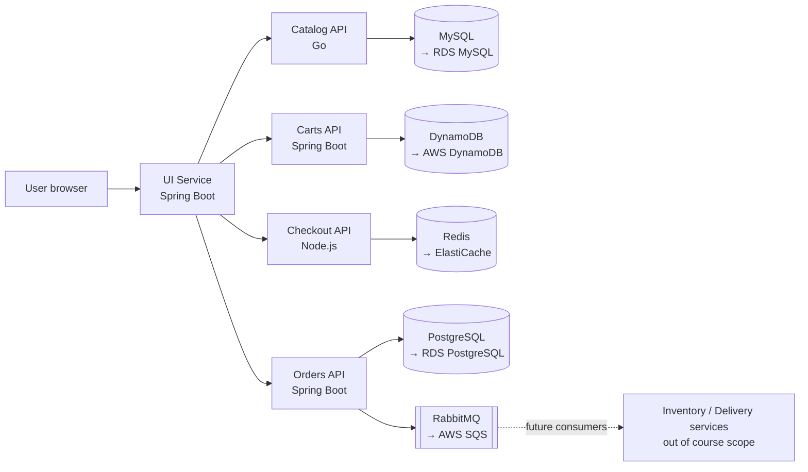

# Section 01 — Project Overview: The Retail Store Microservices App

> Transcript: `0) Intro to retail Microservice project` · ~8 min · Repo: [`../devops-real-world-project-implementation-on-aws/01-Project-Files/`](../devops-real-world-project-implementation-on-aws/01-Project-Files/)

## 1. Objective

Know the **reference application** used in every demo of this course cold: its 5 microservices, 3 databases, cache, and message broker — and the exact user-journey each service handles. Every later section (Docker → Terraform → EKS → Helm → Karpenter → ADOT → CI/CD) deploys *this same app* in progressively more production-grade ways.

## 2. Problem Statement

You can't learn "real-world DevOps" on `hello-world`. You need an app that is genuinely polyglot (Go, Java, Node.js), genuinely stateful (SQL + NoSQL + cache + queue), and genuinely multi-component (10 containers) — so that every tool in the stack has a *reason* to exist when you meet it.

## 3. Why This Approach

Why this app over a single-language demo app:

| Property | Single demo app | Retail store app | Why it matters later |
|---|---|---|---|
| Languages | 1 | Go, Java Spring Boot ×3, Node.js | Multi-stage Dockerfiles differ per runtime (S03) |
| State | none | MySQL, PostgreSQL, DynamoDB, Redis, RabbitMQ/SQS | Drives Secrets (S09), Storage (S10), AWS data plane (S14) |
| Component count | 1 container | 10 containers | Justifies Compose (S04) → Kubernetes (S07+) → Helm (S12) |
| Cloud swap-ability | n/a | in-cluster DB ↔ AWS managed service per microservice | The "persistent data plane" migration story (S13–S14, S19) |

## 4. How It Works — Under the Hood

### Component inventory

| Service | Language | Backing store (in-cluster → AWS production) | Role |
|---|---|---|---|
| **UI** | Java Spring Boot | — | Web front end; calls all other APIs |
| **Catalog** | Go | MySQL → **AWS RDS MySQL** | Product listings |
| **Carts** | Java Spring Boot | DynamoDB-local → **AWS DynamoDB** | Shopping cart state |
| **Checkout** | Node.js | Redis → **Amazon ElastiCache (Redis)** | Orchestrates checkout; caches session/checkout state |
| **Orders** | Java Spring Boot | PostgreSQL → **AWS RDS PostgreSQL**; RabbitMQ → **AWS SQS** | Persists orders; publishes order events |

Total when containerized: **10 containers** (5 services + MySQL + PostgreSQL + DynamoDB-local + Redis + RabbitMQ).

### Architecture



### The user journey (request path)

```
browse products      → UI → Catalog API → MySQL          (product data rendered)
"Add to cart"        → UI → Carts API   → DynamoDB       (cart state saved)
"Start checkout"     → UI → Checkout API→ Redis           (address/delivery/card cached)
"Purchase"           → UI → Orders API  → PostgreSQL      (order row written)
                                        → RabbitMQ/SQS    (same order event published
                                                           for downstream consumers)
```

Two details the instructor stresses:
- Checkout state goes to **Redis** *for speed* during the multi-step checkout flow — it's a cache, not the system of record.
- The order is written **twice on purpose**: durably to PostgreSQL *and* as an event to the message broker, so future services (inventory, delivery) can consume it without touching the Orders DB. That's the standard **database + event** integration pattern.

### Vocabulary map

| Term in course | Plain English |
|---|---|
| Microservice | One独立 deployable service owning one business capability + its own datastore |
| Polyglot | Each service picks its own language/runtime |
| Data plane (later sections) | The set of backing stores (DBs/cache/queue) the services depend on |
| In-cluster vs AWS managed | Run the DB as a container yourself vs let AWS run it (RDS/DynamoDB/ElastiCache/SQS) |

## 5. Instructor's Approach

1. **Component diagram first, architecture second** — inventory before interactions.
2. **Walk the buying journey twice** in the live demo UI (browse → cart → checkout → purchase), explicitly naming which API and which datastore serves each click. He repeats it verbatim so the flow sticks.
3. States the course path out loud: *the same app* goes **Docker → Kubernetes → Helm → …** — deliberately re-deploying one app with increasingly production-grade tooling rather than switching demo apps per topic.
4. Scope call-out: only the 5 services are in scope; inventory/delivery consumers of the message queue are mentioned only to justify RabbitMQ/SQS's existence.

## 6. Code & Commands, Line by Line

This section is conceptual — no commands are executed. The demo store shown is the app you will build/run starting Section 02. Paths seen on screen map to the repo:

| On screen | In your clone |
|---|---|
| Retail store project files | `01-Project-Files/` |
| Per-topic working folders | `02_Docker_Commands/` … `14_RetailStore_Microservices_with_AWS_Data_Plane/` |

## 7. Complete Code Reference

None for this section (first commands arrive in Section 02).

## 8. Hands-On Labs

> All three labs are free/local — no AWS resources. 💰 n/a.

### Lab A — Reproduce: inventory the app from the repo
- **Prerequisites:** the course repo cloned (`devops-real-world-project-implementation-on-aws/`).
- **Steps:**
  1. `ls 01-Project-Files/` and each `NN_*/` folder — match folders to course sections.
  2. Find the Docker Compose file (used in S04): `grep -ril "catalog" --include="*.y*ml" . | head`.
  3. In the compose file, count services and map each to its image + datastore.
- **Expected output:** 10 container definitions (5 apps + 5 stores).
- **Verify:** your table matches §4's component inventory exactly.
- 🧹 **Teardown:** none.

### Lab B — Variation: draw the flow from memory
- **Steps:** without looking, draw the mermaid diagram of §4 (5 services, 5 stores, arrows). Then diff against §4.
- **Verify:** you drew *both* Orders→PostgreSQL and Orders→RabbitMQ arrows — the double-write is the detail most people drop.
- 🧹 none.

### Lab C — Break-it thought drill: failure domains
- **Steps:** for each store going down (MySQL / DynamoDB / Redis / PostgreSQL / RabbitMQ), state which user action breaks and which still works.
- **Expected answers:** MySQL down → browsing breaks, existing carts still readable; Redis down → checkout flow degraded; RabbitMQ down → orders still persist to PostgreSQL but downstream events stop; etc.
- **Verify:** each answer names exactly one service pair (API + store).
- 🧹 none.

## 9. Troubleshooting

Nothing executable yet — but one navigational gotcha:

| Symptom | Likely cause | Confirm | Fix |
|---|---|---|---|
| Course folder names don't match section numbers | Repo folders are numbered by *topic* (`02_Docker_Commands`…), transcripts by *file* (`0)`–`21)`), curriculum by *section* (01–21) | compare all three | Use [00-INDEX.md](00-INDEX.md)'s mapping table |

## 10. Interview Articulation

**90-second explanation:**
> "The reference app is a retail store built as five microservices — a Spring Boot UI, a Go catalog service backed by MySQL, a Spring Boot carts service on DynamoDB, a Node.js checkout service using Redis as a fast checkout-state cache, and a Spring Boot orders service that writes each order durably to PostgreSQL *and* publishes the same event to RabbitMQ or SQS so future consumers like inventory can react without coupling to the orders database. It's deliberately polyglot and stateful — ten containers total — because the whole course re-deploys this one app up the maturity ladder: Docker, Compose, EKS with Terraform, Helm, then swapping every in-cluster datastore for its AWS managed equivalent — RDS, DynamoDB, ElastiCache, SQS — which is exactly the migration story you'd run in production."

<details>
<summary>5 self-test questions</summary>

1. **Which services are Java Spring Boot?** — UI, Carts, Orders (3 of 5). Catalog is Go; Checkout is Node.js.
2. **Where does checkout state live during the checkout flow, and why?** — Redis (ElastiCache in prod) — a cache for speed across the multi-step flow; not the system of record.
3. **Why is an order written to two places?** — PostgreSQL is the durable record; RabbitMQ/SQS carries the same event so downstream services (inventory/delivery) integrate without touching the DB.
4. **How many containers does the full app need, and why?** — 10: five services + MySQL, PostgreSQL, DynamoDB-local, Redis, RabbitMQ.
5. **What is each in-cluster store's AWS production replacement?** — MySQL→RDS MySQL, PostgreSQL→RDS PostgreSQL, DynamoDB-local→DynamoDB, Redis→ElastiCache, RabbitMQ→SQS.

</details>
