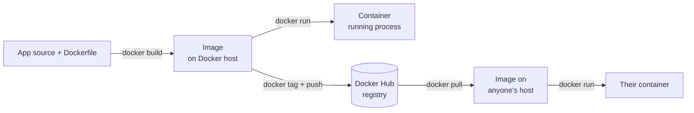

# Section 02 — Docker Commands

> Transcript: `1) Docker Commands` · ~1h12m · Repo: [`../devops-real-world-project-implementation-on-aws/02_Docker_Commands/`](../devops-real-world-project-implementation-on-aws/02_Docker_Commands/)

## 0. 🧭 Beginner Follow-Along Guide (start here)

> Read this guide first; dive into the numbered sections after. Tags: **[Terminal]** = a shell (your laptop, or the EC2 box after you SSH in — each step says which) · **[AWS Console]** = console.aws.amazon.com in the browser · **[Browser]** = the store page you're testing.
> 💡 **Cheaper option:** every Docker command here runs identically on your own laptop (you installed Docker in S01 §0) — only the EC2 + Security-Group steps disappear. Course-faithful = EC2; zero-cost = laptop. Steps below mark the EC2-only ones.

### 📊 The whole section at a glance — components & workflow

*Read top to bottom; boxes are components, arrows are the flow (the same shape as your terminal→shell→fork diagram).*

```
┌──────────────────────────────────────────────────────────────────────┐
│                   YOU  ([Terminal] laptop or EC2)                    │
│                                                                      │
│ docker pull / run / build / push commands                            │
└──────────────────────────────────────────────────────────────────────┘
                                    │  Docker CLI → Docker daemon
                                    ▼
┌──────────────────────────────────────────────────────────────────────┐
│                DOCKER ENGINE (the daemon on the host)                │
│                                                                      │
│ build ─▶ IMAGE (frozen template)   run ─▶ CONTAINER (live)           │
│ -p 8888:8080  maps host port → container port (needs SG rule too)    │
└──────────────────────────────────────────────────────────────────────┘
             │                     │                      │
             ▼                     ▼                      ▼
   ┌──────────────────┐  ┌───────────────────┐  ┌──────────────────┐
   │   docker pull    │  │     docker run    │  │   docker push    │
   │ image ← registry │  │ container ← image │  │ image → registry │
   └──────────────────┘  └───────────────────┘  └──────────────────┘
                                    │  push / pull
                                    ▼
┌──────────────────────────────────────────────────────────────────────┐
│                   DOCKER HUB / ghcr.io  (registry)                   │
│                                                                      │
│ stores images by  <user>/<name>:<tag>                                │
└──────────────────────────────────────────────────────────────────────┘
```

### Where you are in the course

```
S01 met the app ─▶ THIS: S02 drive Docker by hand (pull/run/exec/build/push) ─▶ S03 Dockerfiles
```

**Must already exist/be running:**
```
[ ] Docker installed (S01 §0 toolbox) — or an AWS account if doing the EC2 path
[ ] A free Docker Hub account (hub.docker.com) — needed for the push step
```

### Words you'll meet (plain English)

| Word | Plain meaning |
|---|---|
| image | the frozen, packaged app — a template |
| container | one running copy of an image |
| registry (Docker Hub) | the online library images are pushed to / pulled from |
| tag | the version label after the colon (`:1.0.0`, `:2.0.0`) |
| `-p 8888:8080` | "host doorway 8888 forwards into the container's 8080" — host first, container second |
| Security Group | AWS's firewall on the EC2 box — must ALSO open the host port |
| `-d` detached | run in the background, give my terminal back |
| `docker exec` | open a shell INSIDE a running container to poke around |

### The simplified play-by-play (do this → see that)

1. **[AWS Console]** *(EC2 path only — skip all EC2 steps if working locally)* Launch the host: EC2 → Launch instance → Amazon Linux 2023, **t3.large**, 30 GB disk, key pair downloaded → SSH(22) open. `(deep dive: §6 host setup)`
   → **you should see:** instance state Running with a public DNS name.
2. **[Terminal]** *(EC2 only)* SSH in and install Docker: `chmod 400 key.pem && ssh -i key.pem ec2-user@<dns>`, then `sudo dnf install docker -y && sudo systemctl enable docker && sudo systemctl start docker && sudo usermod -aG docker ec2-user`, then `exit` and SSH back in (the group needs a fresh login).
   → **you should see:** `docker version` prints BOTH a Client and a Server section.
3. **[Terminal]** Smoke-test: `docker run hello-world`
   → **you should see:** "Hello from Docker!" — engine works; now on to the real app.
4. **[Terminal]** Pull the retail UI: `docker pull stacksimplify/retail-store-sample-ui:1.0.0`
   → **you should see:** layers downloading; `docker images` lists it. (Rate-limited? `docker login`, or pull from ghcr.io — §9.)
5. **[Terminal]** Run it: `docker run --name myapp1 -p 8888:8080 -d stacksimplify/retail-store-sample-ui:1.0.0`
   → **you should see:** a long container ID; `docker ps` shows it Up with `0.0.0.0:8888->8080`.
6. **[AWS Console]** *(EC2 only)* Open the doorway: the instance's Security Group → Edit inbound rules → Custom TCP **8888** from 0.0.0.0/0. `(deep dive: §4 port-mapping picture)`
   → **you should see:** rule saved. Skipping this = browser spins forever (the #1 gotcha).
7. **[Browser]** Visit `http://<EC2-public-IP>:8888` (laptop path: `http://localhost:8888`).
   → **you should see:** the demo retail store rendering.
8. **[Terminal]** Go inside: `docker exec -it myapp1 /bin/sh`, then `whoami` (→ `appuser`, not root), `curl http://localhost:8080`, `exit`. `(deep dive: §6 "Inside a running container")`
   → **you should see:** the app answering from within its own little world.
9. **[Terminal]** Lifecycle: `docker stop myapp1` (browser dies) → `docker start myapp1` (same container, same mapping, back up).
   → **you should see:** status flip Exited ⇄ Up in `docker ps -a`.
10. **[Terminal]** Build your own v2: download the source (§6 build block), make the visible edit (`sed -i 's/The Most Public Secret Shop/…V2 version/' …home.html`), then `docker build -t stacksimplify/retail-store-sample-ui:2.0.0 .`
    → **you should see:** a 1–2 min multi-stage build ending "naming to …:2.0.0".
11. **[Terminal]** Run v2 beside v1: `docker run --name myapp1-v2 -p 8889:8080 -d …:2.0.0` (+ SG rule for 8889 on EC2).
    → **you should see:** `:8889` shows "V2 version", `:8888` still shows v1 — two containers, one host.
12. **[Terminal]** Publish: `docker login` → `docker tag retail-store-sample-ui:2.0.0 <your-dockerid>/retail-store-sample-ui:2.0.0` → `docker push <your-dockerid>/retail-store-sample-ui:2.0.0` — your Hub username IS your namespace; untagged pushes are denied. `(deep dive: §6 build→tag→push)`
    → **you should see:** layers pushing; the 2.0.0 tag on hub.docker.com in your repo.

### ✅ Done-check

```
[ ] docker version shows Client AND Server sections
[ ] store renders at :8888 (v1) and :8889 shows "V2 version"
[ ] you exec'd inside and saw whoami = appuser
[ ] your Docker Hub repo shows tag 2.0.0
```

🧹 **Teardown before you stop:** `docker rm -f $(docker ps -aq) && docker rmi $(docker images -q)`; **[AWS Console]** STOP the EC2 instance (it's reused through S05 — stop between sessions, terminate after S05). 💰 t3.large ≈ $0.08/hr while running; laptop path bills nothing.

---

## 1. Objective

Stand up a Docker host on an EC2 instance and drive the full image lifecycle by hand: **pull → run → exec → stop/start → rm/rmi → build → tag → push** — using the real retail-store UI image, not hello-world.

## 2. Problem Statement

The retail store app ships as container images. Before any orchestration (Compose/Kubernetes), you must be able to: get a machine running the Docker daemon, pull an app image from a registry, map its port so a browser reaches it, get *inside* a running container to debug, and build + publish your own modified version. This section builds exactly that muscle.

## 3. Why This Approach

| Choice | Alternative | Why the instructor's pick |
|---|---|---|
| **EC2 + Cloud Shell** as the Docker host | local Docker Desktop | Everything stays on AWS (course theme); same box later hosts 10 containers |
| **t3.large, 30 GB disk** | t2.micro free tier | 10 containers coming in S04 need 2 vCPU / 8 GB and image space |
| **Amazon Linux 2023 + dnf** | Ubuntu + apt | AL2023 is the AWS-native default; `dnf install docker` is one line |
| **Docker Hub** public registry | GitHub Packages (GHCR) | Hub is the default; **GHCR is the documented fallback when Hub rate-limits pulls** (same image published in both) |
| Pin app source **v1.2.4** | latest (1.3.0 at recording) | Course is baselined on 1.2.4 so every demo is reproducible; a backup copy sits in `01-Project-Files/` |

> 🐛 TRANSCRIPT ERROR: he says "**P3 large**" — the instance type used is **t3.large** (2 vCPU / 8 GB). P3 is a GPU family. Also "AT&T port" = "**8080** port" (ASR).

## 4. How It Works — Under the Hood

### The Docker workflow



- **Docker daemon (server/engine)** runs on the **Docker host**; the **Docker client** (`docker` CLI) talks to it. On this EC2 box, *client and daemon are the same machine* — `docker version` prints both a Client and a Server section, which is how you verify that.
- **Image** = immutable packaged filesystem + metadata. **Container** = a running (or exited) instance of an image. **Registry** (Docker Hub/GHCR) = central image store.
- In a free Docker Hub account, **your username *is* your repository namespace** — which is why pushing requires re-tagging the image as `<username>/<image>:<tag>`.

### Port mapping — the browser-to-container path

```
Browser ── http://<EC2-public-IP>:8888 ──▶ EC2 (Docker host) port 8888
                                             │  -p 8888:8080  (host:container)
                                             ▼
                                    container port 8080 (Spring Boot UI)
BLOCKED unless the EC2 Security Group has an inbound rule for 8888!
```

Two gates, always in this order: the **Security Group** (AWS firewall, per-port inbound rule) and the **-p host:container** mapping (Docker's NAT). Miss either → browser spins forever.

### Vocabulary map

| Term | Plain English |
|---|---|
| Docker host / daemon | The machine + background service that actually runs containers |
| Docker client | The `docker` CLI sending commands to the daemon |
| Image vs container | Class vs instance: template vs running copy |
| Tag | Version label on an image (`:1.0.0`, `:2.0.0`) |
| Detached mode (`-d`) | Run in background; terminal returns immediately |
| Exited container | Ran to completion or stopped — still exists until `docker rm` |

## 5. Instructor's Approach

1. **hello-world first, then immediately dismisses it** — "just running hello-world doesn't look good" — and re-runs everything with the retail UI image. Deliberate: prove the install with the canonical smoke test, then move to the real app.
2. **Pull-and-run before build-and-push.** Consume an existing image before producing one — the workflow diagram is taught in that order.
3. **The special UI image:** `retail-store-sample-ui` (tags `1.0.0`, `2.0.0`) is the *whole* app bundled into one container for teaching — carts/checkout work in-memory. He explicitly defers "real" multi-container to Docker Compose (S04).
4. **Makes a visible change before building**: edits `home.html` ("The Most Public Secret Shop" → adds *V2 version*) so the rebuilt image is *provably* different in the browser — v1 on `:8888` and v2 on `:8889` side-by-side.
5. **Deletes the 2.0.0 tag from his Hub repo before the demo** so pushing it back is honest.

## 6. Code & Commands, Line by Line

### Host setup (Cloud Shell → EC2)

```bash
# EC2: create key pair (RSA, .pem) → Launch instance:
#   AMI: Amazon Linux 2023, 64-bit · Type: t3.large (2vCPU/8GB) · Disk: 30 GB
#   SG: SSH(22) from anywhere; app ports added later as needed
# In CloudShell: Actions → Upload file → your .pem
chmod 400 devops-demos-101.pem                      # SSH refuses world-readable keys
ssh -i devops-demos-101.pem ec2-user@<ec2-public-dns>

sudo dnf update -y                                  # patch the OS
sudo dnf install docker -y                          # install engine from AL2023 repos
sudo systemctl enable docker                        # start on every boot
sudo systemctl start docker                         # start now
sudo usermod -aG docker ec2-user                    # run docker without sudo…
exit                                                # …takes effect on next login
ssh -i devops-demos-101.pem ec2-user@<ec2-public-dns>
docker version                                      # Client + Server sections = healthy
```

### The core command set

```bash
docker run hello-world            # pull (if absent) + run; prints "Hello from Docker!"
docker images                     # local images (-q → IDs only)
docker ps                         # RUNNING containers only
docker ps -a                      # + exited/stopped ones
docker ps -aq                     # all container IDs — feeds bulk commands
docker rm  $(docker ps -aq)       # delete all stopped containers
docker rmi $(docker images -q)    # delete all local images
```

### Pull & run the retail UI

```bash
docker pull stacksimplify/retail-store-sample-ui:1.0.0
# Hub rate-limited? Same image on GitHub Packages (ghcr.io) — no pull limits.

docker run --name myapp1 -p 8888:8080 -d stacksimplify/retail-store-sample-ui:1.0.0
#           │            │            │  └ image:tag
#           │            │            └ detached (background)
#           │            └ host 8888 → container 8080 (app's listen port)
#           └ container name (else Docker invents one)
# THEN: EC2 → Security → SG → Edit inbound rules → Custom TCP 8888 from 0.0.0.0/0
# Browse http://<EC2-public-IP>:8888 → demo store renders
```

### Inside a running container

```bash
docker exec -it myapp1 /bin/sh    # interactive shell inside the container
  uname -a                        # host's kernel (containers share it!)
  cat /etc/os-release             # Amazon Linux 2023 (the image's userland)
  whoami                          # appuser — NOT root (Dockerfile did this, see S03)
  pwd && ls                       # /app → app.jar
  java -version
  curl http://localhost:8080      # the app answering from inside
  exit
docker exec -it myapp1 ls         # or run one-off commands without entering
docker exec -it myapp1 env       # container env vars; HOSTNAME = container ID
```

### Stop / start lifecycle

```bash
docker stop myapp1     # graceful stop → status Exited; browser now fails
docker ps -a           # see it Exited
docker start myapp1    # same container, same port mapping, back up
```

### Build → tag → push (v2)

```bash
docker login                                        # Hub credentials, once per host
mkdir demo-docker-build && cd demo-docker-build
wget https://github.com/aws-containers/retail-store-sample-app/archive/refs/tags/v1.2.4.tar.gz
tar xzf v1.2.4.tar.gz && cd retail-store-sample-app-1.2.4/src/ui   # Dockerfile lives HERE

# make the change visible: add "V2 version" next to "Secret Shop" in the landing page
sed -i 's/The Most Public Secret Shop/The Most Public Secret Shop - V2 version/' \
    src/main/resources/templates/home.html
grep -n "V2 version" src/main/resources/templates/home.html        # confirm

docker build -t stacksimplify/retail-store-sample-ui:2.0.0 .
#             │                                             └ build context = cwd (Dockerfile here)
#             └ -t name:tag at build time
# (~1–2 min: multi-stage build compiles the Spring Boot jar — details in S03)

docker run --name myapp1-v2 -p 8889:8080 -d stacksimplify/retail-store-sample-ui:2.0.0
# + SG inbound rule for 8889 → browser shows "V2 version"; :8888 still shows v1

# Free-account rule: repo namespace = YOUR Docker username → tag accordingly:
docker tag  retail-store-sample-ui:2.0.0  <your-dockerid>/retail-store-sample-ui:2.0.0
docker push <your-dockerid>/retail-store-sample-ui:2.0.0
# Hub → your repo → Tags: 2.0.0 appears
```

> Note: `docker tag` adds a **second name to the same image ID** — `docker images` shows two rows, one ID.

## 7. Complete Code Reference

```bash
# ---- host ----
chmod 400 key.pem && ssh -i key.pem ec2-user@<dns>
sudo dnf update -y && sudo dnf install docker -y
sudo systemctl enable docker && sudo systemctl start docker
sudo usermod -aG docker ec2-user   # re-login after
# ---- lifecycle ----
docker pull stacksimplify/retail-store-sample-ui:1.0.0
docker run --name myapp1 -p 8888:8080 -d stacksimplify/retail-store-sample-ui:1.0.0
docker ps / docker ps -a / docker ps -aq
docker exec -it myapp1 /bin/sh
docker stop myapp1 && docker start myapp1
docker rm $(docker ps -aq) && docker rmi $(docker images -q)
# ---- build & publish ----
docker login
docker build -t <id>/retail-store-sample-ui:2.0.0 .
docker run --name myapp1-v2 -p 8889:8080 -d <id>/retail-store-sample-ui:2.0.0
docker tag <old> <id>/retail-store-sample-ui:2.0.0
docker push <id>/retail-store-sample-ui:2.0.0
```

## 8. Hands-On Labs

> 💰 **Cost warning:** t3.large ≈ $0.08/hr + 30 GB gp3 ≈ $2.40/mo. **Terminate the instance when done** (it's reused through S05, so *stop* between sessions, *terminate* after S05).
> 🆓 **Local variant:** everything in this section runs identically on Docker Desktop / any local Docker — only the Security-Group steps disappear. Zero AWS cost.

### Lab A — Reproduce: full lifecycle on EC2
- **Prerequisites:** AWS account, key pair, Docker Hub account.
- **Steps:** §6 top-to-bottom: launch EC2 → install Docker → pull+run v1 on 8888 → exec in and `curl localhost:8080` → build v2 → run on 8889 → tag+push.
- **Expected output:** browser shows v1 at `:8888`, "V2 version" at `:8889`; Hub repo has tag `2.0.0`.
- **Verify:** `docker ps` shows both containers Up; `docker images` shows same image ID under two names post-tag.
- 🧹 **Teardown:** `docker rm -f $(docker ps -aq) && docker rmi $(docker images -q)`; stop the EC2 instance.

### Lab B — Variation: nginx with a different mapping (local, free)
- **Steps:** `docker run --name web -p 9000:80 -d nginx:alpine` → `curl localhost:9000` → `docker exec -it web sh` → `cat /etc/nginx/conf.d/default.conf` → `docker stop web && docker start web` → confirm mapping survives restart.
- **Verify:** same lifecycle, different image/port — proves the pattern generalizes.
- 🧹 `docker rm -f web && docker rmi nginx:alpine`.

### Lab C — Break it and fix it
1. **Wrong port mapping:** run the UI with `-p 8888:80` (container listens on 8080, not 80). Browser → connection reset. **Confirm:** `docker logs myapp1` shows the app healthy on 8080; `curl localhost:8888` fails. **Fix:** `docker rm -f`, re-run with `8888:8080`.
2. **Missing SG rule:** run correctly but skip the inbound rule. Browser spins forever (timeout ≠ reset — that's the firewall signature). **Confirm:** `curl localhost:8888` **on the EC2 box works**. **Fix:** add the SG inbound rule — no container change needed.
3. **Name conflict:** `docker run --name myapp1 …` twice → `Conflict. The container name "/myapp1" is already in use`. **Fix:** `docker rm myapp1` (or `-f` if running) or pick a new name.
- 🧹 as Lab A.

## 9. Troubleshooting

| Symptom | Likely cause | Command to confirm | Fix |
|---|---|---|---|
| `permission denied … docker.sock` | user not in `docker` group / didn't re-login | `groups` | `sudo usermod -aG docker ec2-user` then logout+login |
| Browser spins forever | SG has no inbound rule for the host port | `curl localhost:<port>` on EC2 (works) | Add Custom TCP rule for that port |
| Browser: connection reset | wrong `-p` mapping (container port mismatch) | `docker logs <ctr>`; `docker ps` PORTS column | rerun with `-p host:8080` |
| `toomanyrequests: pull rate limit` | Docker Hub anonymous limit | error text | `docker login`, or pull from GitHub Packages (ghcr.io) |
| `Conflict … name already in use` | old container holds the name | `docker ps -a` | `docker rm -f <name>` or new name |
| `denied: requested access to the resource is denied` on push | image not tagged under *your* username | `docker images` | `docker tag img <you>/img:tag` then push |
| Container in `Exited` right after run | app crashed / one-shot command | `docker logs <ctr>` | read the log; hello-world exiting is normal |

## 10. Interview Articulation

**90-second explanation:**
> "Docker separates a client from a daemon: the CLI sends commands to the engine that actually runs containers — `docker version` shows both halves. The lifecycle is build, run, push, pull: an image is the immutable template, a container is a running instance. Networking is two layers on AWS: `-p 8888:8080` NATs the host port to the container's listen port, and the EC2 Security Group must separately allow that host port inbound — a spinning browser means firewall, a connection reset means bad mapping. For debugging you `docker exec -it <ctr> sh` into the container — you'll see it shares the host kernel but has its own filesystem and runs as a non-root app user. Publishing means tagging the image under your registry namespace — on a free Docker Hub account your username *is* the repo — then `docker push`. And if Hub rate-limits you, the same images are on GitHub Packages without limits."

<details>
<summary>5 self-test questions</summary>

1. **What's the difference between `docker ps`, `-a`, and `-aq`?** — running only / + exited / IDs only (for feeding `rm`).
2. **In `-p 8888:8080`, which is host and which is container?** — host first, container second; the app listens on the container side (8080).
3. **Why did the push fail before re-tagging?** — Hub authorizes pushes only into your namespace; `docker tag old <username>/name:tag` adds that name (same image ID).
4. **Browser hangs but `curl localhost:8888` on the EC2 box works — what's wrong?** — Security Group inbound rule missing; Docker side is fine.
5. **What does `docker exec -it <ctr> uname -a` reveal about containers?** — the host's kernel version: containers share the host kernel, unlike VMs.

</details>
