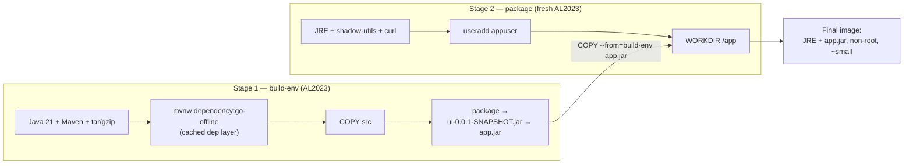

# Section 03 — Dockerfile Mastery (Multi-Stage Builds, Cache, Prune)

> Transcript: `2) Docker Files` · ~44 min · Repo: [`../devops-real-world-project-implementation-on-aws/03_Docker_Files/`](../devops-real-world-project-implementation-on-aws/03_Docker_Files/)

## 1. Objective

Read and write a **production-grade multi-stage Dockerfile** for a Java Spring Boot microservice (the retail UI): non-root user, `.dockerignore`, layer caching that turns a 95-second build into a 0.02-second one — and clean up build debris with `builder prune` / `system prune`.

## 2. Problem Statement

A naive single-stage image ships **Maven, the JDK toolchain, and your full source code** into production — huge, slow to pull, and a bigger attack surface. Builds also re-download every dependency on every change, and Docker's cache/artifacts silently eat the disk. Multi-stage builds, cache-aware layer ordering, and prune commands fix all three.

## 3. Why This Approach

| Decision | Alternative | Why |
|---|---|---|
| **Multi-stage build** | single-stage image | Final image gets *only* JRE + `app.jar` — no Maven, no source, no build tools → small, fast, secure |
| **Non-root `appuser`** | default root | A compromised app process isn't root in the container |
| `dependency:go-offline` as its **own layer** before `COPY src` | copy everything then build | Dependencies change rarely, source changes often → dep layer stays cached across code edits |
| `.dockerignore` | send everything as build context | Keeps context small; stops Dockerfile/compose/charts/target leaking into the image |
| `--no-cache` when weird | trusting the cache | Cache can serve stale layers; a from-scratch rebuild isolates cache-induced bugs |

## 4. How It Works — Under the Hood

### Multi-stage anatomy



Only the compiled `app.jar` crosses the stage boundary. **Everything in stage 1 is discarded** — Maven, source, wrappers. Docker even runs independent parts of the two stages **in parallel** (both `dnf install` layers start together; only the `COPY --from` creates a dependency).

### Layer caching — the mental model

```
each Dockerfile instruction = a layer, keyed by (instruction + input files' checksums)
change NOTHING            → every layer HIT      → build ≈ 0.02 s
change src/ only          → layers above COPY src stay HIT
                            (deps NOT re-downloaded — that's why go-offline is early)
change pom.xml            → dep layer busted → deps re-download
--no-cache                → all layers MISS → full 95 s rebuild
```

Cache benefits the instructor lists: only changed layers rebuild; only *new* layers get pushed to the registry (small pushes); and it forces you into a logical, cache-friendly Dockerfile layout.

### Instruction vocabulary map

| Instruction | What it does | In *this* Dockerfile |
|---|---|---|
| `FROM x AS name` | base image; `AS` names the stage | AL2023 twice — `build-env` and final |
| `RUN` | execute at **build** time | `dnf install …` + `dnf clean all` (keep layers lean) |
| `VOLUME /tmp` | declare a mount point outside image layers | Spring Boot unpacks temp files to `/tmp`; keeps them off the image layers |
| `WORKDIR` | cwd for following instructions | `/` in build, `/app` in package |
| `COPY` | host (build context) → image | wrapper + `pom.xml`, then `src/`; later `--from=` the jar |
| `ENV` | env vars baked into image | UID/GID, `SPRING_PROFILES_ACTIVE=prod` |
| `USER` | run as this user from here on | `appuser` (created with `useradd`) — **not root** |
| `EXPOSE 8080` | **documentation only** — no networking action | tells humans/orchestrators the listen port |
| `ENTRYPOINT` | command when the **container starts** | `java $JAVA_OPTS -jar /app/app.jar` |

**`.dockerignore`** (sits next to the Dockerfile): excludes `Dockerfile`, `.dockerignore`, compose files, `.gitignore`, `chart/`, plus anything you add (`target/`, `.idea/`, `scripts/`) from the build context — smaller uploads, no accidental source/config in layers.

## 5. Instructor's Approach

1. **Instructions first in isolation, then the real Dockerfile line-by-line** — vocabulary before reading the whole document.
2. **Runs `docker builder prune --all` *before* the demo** — explicitly so timings are honest ("this demo is always fresh").
3. **Times the builds out loud:** first build ≈ **95 s** → cached rebuild ≈ **0.02 s** → `--no-cache` ≈ 95 s again. The three numbers *are* the caching lesson.
4. **Verifies claims inside the container**: execs in and proves `/src` doesn't exist, `which mvn` is empty, `/app` holds only `app.jar` + licenses, and `id` shows `appuser`. He also notes tiny images lack tools (`hostname`, `ps` missing) — expected, not a bug.
5. Uses the Spring Boot **`/actuator/health`** (UP) and **`/topology`** endpoints to check the app — topology shows UI connecting to *no* other services yet (they arrive in Compose, S04).

## 6. Code & Commands, Line by Line

### The Dockerfile (annotated — UI service, from `src/ui/Dockerfile`)

```dockerfile
# ---------- STAGE 1: build ----------
FROM public.ecr.aws/amazonlinux/amazonlinux:2023 AS build-env
RUN dnf install -y java-21-amazon-corretto-devel maven tar gzip which \
 && dnf clean all                       # install toolchain; clean metadata → lean layer
VOLUME /tmp                             # Spring temp unpacking stays OFF image layers
WORKDIR /
COPY .mvn .mvn                          # maven wrapper…
COPY mvnw pom.xml ./                    # …and the dependency manifest FIRST
RUN ./mvnw dependency:go-offline        # pre-download deps → its own cached layer
COPY src ./src                          # source LAST (changes most often)
RUN ./mvnw package -DskipTests \
 && mv target/ui-0.0.1-SNAPSHOT.jar target/app.jar    # build + rename

# ---------- STAGE 2: package (production image) ----------
FROM public.ecr.aws/amazonlinux/amazonlinux:2023
RUN dnf install -y java-21-amazon-corretto-headless shadow-utils \
 && dnf clean all                       # JRE + user-mgmt tools only
RUN dnf install -y curl --allowerasing && dnf clean all   # minimal debug tooling
ENV APPUSER=appuser APPUID=1000 APPGID=1000
RUN useradd --home /app --uid $APPUID --gid root $APPUSER   # non-root identity
ENV SPRING_PROFILES_ACTIVE=prod         # prod profile at runtime
WORKDIR /app
USER appuser                            # everything below runs unprivileged
COPY --chown=appuser:root --from=build-env /target/app.jar .   # ONLY the jar crosses
COPY ATTRIBUTION.md LICENSES.md ./
EXPOSE 8080                             # documentation of listen port
ENTRYPOINT ["/bin/sh","-c","java $JAVA_OPTS -jar /app/app.jar"]
```

> Exact file: `01-Project-Files/…/src/ui/Dockerfile` in the repo (the annotation above follows the transcript's walkthrough; field order preserved).

### Build / verify / cache / prune

```bash
docker builder prune --all -f          # start with an empty build cache (honest timings)
cd retail-store-sample-app-1.2.4/src/ui
docker build -t retail-ui:9.0.0 .      # ~95 s — watch both stages run in parallel

docker run --name myapp1-v9 -p 8080:8080 -d retail-ui:9.0.0
curl http://<ec2-ip>:8080/actuator/health   # {"status":"UP"} — Spring health endpoint
curl http://<ec2-ip>:8080/topology          # UI alone; no downstream services yet

docker exec -it myapp1-v9 /bin/sh
  ls /            # app bin boot dev etc … — NO /src directory
  which mvn       # nothing — Maven never entered the final image
  ls /app         # app.jar, LICENSES.md — exactly what stage 2 copied
  id              # uid=1000(appuser) — non-root
  exit

docker build -t retail-ui:9.0.0 .              # again → ≈0.02 s, all layers CACHED
docker build --no-cache -t retail-ui:10.0.0 .  # force full rebuild → ~95 s again

# --- cleanup commands ---
docker builder prune           # remove dangling build cache (prompts; -f to skip)
docker builder prune --all -f  # ALL build cache incl. layers in use by no build
docker system prune            # stopped containers + unused networks + dangling images + cache
docker system prune --volumes  # also unused anonymous volumes
docker system prune -a --volumes -f   # ☢️ "disaster option": also EVERY image with no container
```

> ☢️ `system prune -a` deletes **all images not used by at least one container** — his running v1/v2 containers protected those two images; retail-ui 9/10 vanished.

## 7. Complete Code Reference

```bash
# fresh-cache demo
docker builder prune --all -f
docker build -t retail-ui:9.0.0 .                       # ~95s
docker run --name myapp1-v9 -p 8080:8080 -d retail-ui:9.0.0
curl localhost:8080/actuator/health ; curl localhost:8080/topology
docker exec -it myapp1-v9 /bin/sh                       # verify: no /src, no mvn, appuser
# cache proof
docker build -t retail-ui:9.0.0 .                       # ~0.02s
docker build --no-cache -t retail-ui:10.0.0 .           # ~95s
# teardown + prune
docker stop myapp1-v9 && docker rm myapp1-v9 && docker rmi retail-ui:9.0.0
docker builder prune --all -f
docker system prune -a --volumes -f                      # only when you mean it
```

## 8. Hands-On Labs

> 🆓 All labs run on local Docker (no AWS needed). If on the course EC2 box: 💰 stop the instance after.

### Lab A — Reproduce: build, verify, time the cache
- **Prerequisites:** app source v1.2.4 (`src/ui`), Docker.
- **Steps:** run §6 exactly; record the three build times (fresh / cached / `--no-cache`).
- **Expected output:** ≈95 s / <1 s / ≈95 s; `/actuator/health` = UP; container has no `/src`, runs as `appuser`.
- **Verify:** `docker history retail-ui:9.0.0` — the final image's layers contain no Maven layer.
- 🧹 `docker rm -f myapp1-v9; docker rmi retail-ui:9.0.0 retail-ui:10.0.0; docker builder prune --all -f`.

### Lab B — Variation: cache-bust surgically
- **Steps:** (1) touch a file in `src/` → rebuild → note deps layer still HIT, only source layers rebuild (~fast). (2) add a blank line to `pom.xml` → rebuild → watch `dependency:go-offline` re-run (slow).
- **Verify:** build log marks layers `CACHED` up to the first changed input.
- **Lesson:** layer order = cache policy. Source-last is deliberate.
- 🧹 as Lab A.

### Lab C — Break it and fix it
1. **Reorder the copies:** move `COPY src ./src` *above* the `dependency:go-offline` line → every code edit now re-downloads all dependencies. **Confirm:** rebuild after touching `src/` is slow. **Fix:** restore order.
2. **Drop `USER appuser`:** rebuild, exec in, `id` → `root`. **Confirm:** the security regression is invisible in behavior — only `id` shows it. **Fix:** restore `USER`.
3. **Stale cache illusion:** edit `home.html`, rebuild *without* `-t` retag, but run the **old** tag → browser shows old content. **Confirm:** `docker images` timestamps. **Fix:** run the new image, or use `--no-cache` if you suspect the cache itself.
- 🧹 as Lab A.

## 9. Troubleshooting

| Symptom | Likely cause | Command to confirm | Fix |
|---|---|---|---|
| Image is huge (~GBs) | single-stage build shipped Maven+src | `docker history ` | multi-stage; copy only the jar |
| Every build re-downloads deps | `COPY src` above `go-offline`, or `pom.xml` changed | build log: which layer missed | order layers dep-manifest-first |
| Weird behavior only on cached builds | stale cache layer | rebuild with `--no-cache` — bug gone? | `docker builder prune --all -f` |
| `ps`/`hostname` not found inside container | minimal prod image lacks tools (expected) | `docker exec <c> which ps` | use `docker top`/`docker inspect` from host, or install debug tools in a dev stage |
| Disk full on Docker host | accumulated build cache/images | `docker system df` | `docker builder prune --all -f`, then `system prune` |
| Container starts as root unexpectedly | `USER` missing or after `ENTRYPOINT`-relevant layers | `docker exec <c> id` | add `USER appuser` before runtime instructions |
| Build context upload is slow/huge | no `.dockerignore` | build log's "transferring context" size | add `.dockerignore` next to the Dockerfile |

## 10. Interview Articulation

**90-second explanation:**
> "Our production Dockerfiles are multi-stage: stage one is a fat build environment — Amazon Linux with the JDK and Maven — that compiles the Spring Boot jar; stage two starts from a fresh minimal base and copies in *only* the jar, so no build tools or source code ever reach production. The final image runs as a dedicated non-root user, `EXPOSE` documents the port, and `ENTRYPOINT` launches the jar. Layer ordering is deliberate cache policy: we copy the pom and run `dependency:go-offline` *before* copying source, so code changes rebuild in seconds while dependency layers stay cached — our first build was ninety-five seconds, the cached rebuild was two hundredths of a second. `.dockerignore` keeps the build context clean. And for hygiene, `docker builder prune` clears build cache while `docker system prune -a --volumes` is the full cleanup — with the caveat that `-a` deletes any image no container is using."

<details>
<summary>5 self-test questions</summary>

1. **What crosses from build stage to package stage, and how?** — only `app.jar`, via `COPY --from=build-env`.
2. **Why is `dependency:go-offline` its own layer before `COPY src`?** — deps change rarely; source changes often — this keeps the expensive dep download cached across code edits.
3. **What does `EXPOSE 8080` actually do?** — nothing functional; it documents the listen port for humans and orchestrators.
4. **Why `VOLUME /tmp` for a Spring Boot app?** — Spring unpacks temp files there; declaring it a volume keeps that churn off the image layers.
5. **Difference between `docker builder prune` and `docker system prune -a --volumes`?** — build cache only vs. stopped containers + unused networks + unused volumes + **all images without a container**.

</details>
