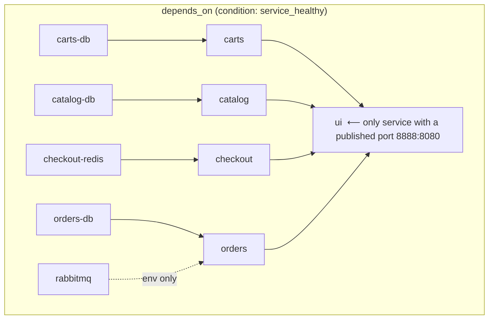

# Section 04 — Docker Compose (Run All 10 Containers as One System)

> Transcript: `3) Docker Compose` · ~74 min · Repo: [`../devops-real-world-project-implementation-on-aws/04_Docker_Compose/`](../devops-real-world-project-implementation-on-aws/04_Docker_Compose/)

## 1. Objective

Bring the **entire 10-container retail store up (and down) with one command**, with correct start ordering via `depends_on` + health checks — and operate it: per-service stop/start/restart, logs, exec, stats, top, and **`--force-recreate`** for config changes.

## 2. Problem Statement

With raw `docker run` you cannot: start 10 containers with one command; express "start MySQL *before* catalog"; keep ports/volumes/env in a maintainable place (CLI flags get clumsy); wire service-to-service networking without hand-built networks; or stop the whole system at once. Compose solves all five declaratively in one YAML file.

## 3. Why This Approach

| Need | Manual `docker run` | Docker Compose |
|---|---|---|
| Start/stop everything | 10+ commands each way | `docker compose up -d` / `down` |
| Dependency ordering | impossible | `depends_on` + `healthcheck` (`condition: service_healthy`) |
| Config location | CLI flags per command | one declarative YAML |
| Service-to-service networking | manual `docker network` + flags | one shared default network; **hostname = service DNS name** |
| Local dev environment | slow, error-prone | whole env up/down "in seconds" — the instructor's key selling point |

Why it matters: to test a change in *one* service (e.g., Orders) through the UI, you need the **whole** environment running. Compose makes that a one-liner.

## 4. How It Works — Under the Hood

### The Compose file's three top-level keys

```yaml
name: retail-sample            # project name
networks:
  default:                     # ONE shared network for all 10 containers
    name: retail-sample-default
services:                      # 10 entries: 5 apps + 5 stores
  carts, carts-db, catalog, catalog-db, checkout, checkout-redis,
  orders, orders-db, rabbitmq, ui
```

All containers join the same network → each is reachable by its **`hostname`** (`catalog`, `carts-db`, `rabbitmq`…). That's the whole service-discovery story at this stage — DNS by service hostname on a shared bridge network.

### Startup ordering (the control loop Compose runs)

```
docker compose up -d
  └─ create network
  └─ start DB tier first:  carts-db, catalog-db, checkout-redis, orders-db, rabbitmq
        └─ healthchecks run every 10s (3 retries, 15s start_period, 10s timeout)
  └─ when a DB is HEALTHY → its app starts:   carts, catalog, checkout, orders
  └─ when ALL FOUR app services are healthy → ui starts
browser ── EC2-IP:8888 ──▶ ui:8080 ──▶ catalog/carts/checkout/orders :8080 ──▶ their stores
```

Only **ui publishes a port** (`8888→8080`). Every other service has `ports: []` (empty list) — reachable *inside* the Docker network only. That's deliberate exposure control.



### Security hardening baked into the AWS-authored file

| Setting | Meaning |
|---|---|
| `cap_drop: [ALL]` | strip every Linux capability… |
| `cap_add: [NET_BIND_SERVICE]` (apps) / `CHOWN,SETGID,SETUID` (dbs) | …re-add only what's needed (bind <1024 / manage file perms) |
| `read_only: true` | container filesystem is immutable |
| `security_opt: [no-new-privileges:true]` | no privilege escalation |
| `tmpfs: /tmp (noexec,nosuid)` | in-memory scratch space; nothing in /tmp can execute or setuid |
| `restart: always` | auto-restart on failure |

The instructor's note: these are security best-practice, not functionally required — a dev copy works without them.

### Healthcheck anatomy (carts service — the "real" one)

```yaml
healthcheck:
  test: ["CMD-SHELL", "curl -f http://localhost:8080/actuator/health || exit 1"]
  interval: 10s        # run every 10s
  timeout: 10s         # each probe must finish within 10s
  retries: 3           # 3 consecutive failures → UNHEALTHY
  start_period: 15s    # grace period before failures count (JVM warmup)
```
`carts-db` (DynamoDB-local) has a **dummy** check (`exit 0`) — no good probe exists for it; MySQL uses `mysqladmin ping`, PostgreSQL `pg_isready`, Redis `redis-cli ping`.

### Vocabulary map

| Compose key | Plain English |
|---|---|
| `services.<name>` | one container's full declarative config |
| `depends_on … service_healthy, required: true` | hard startup ordering gate |
| `hostname` | the DNS name other containers dial |
| `ports: []` vs `published: 8888, target: 8080` | internal-only vs exposed to host |
| `environment` | app config (DB endpoints, credentials, feature flags) |
| `${DB_PASSWORD}` | value injected from the shell env at `up` time |
| `mem_limit` | per-container memory cap (only UI sets one) |

## 5. Instructor's Approach

1. **Pattern over repetition:** deep line-by-line on ONE pair — `carts-db` then `carts` — because "keys are the same, values differ"; then a fast tour of catalog/checkout/orders/rabbitmq/ui. Copy that reading strategy for any large Compose file.
2. **DB before app, app before UI** — he traces `depends_on` bottom-up and shows the startup logs proving DBs go healthy first, then apps, then UI.
3. **Secrets stay out of the file:** `DB_PASSWORD` is `export`ed in the shell; Compose interpolates it — first appearance of the "no hardcoded credentials" theme.
4. Runs `up` **without `-d` first on purpose** so you see the log firehose, then teaches `-d` as the sane default.
5. **Breaks the system live**: `docker compose stop orders` → topology page shows orders *unhealthy* → a purchase **fails** in the UI → `start orders` → recovery. Proves the microservices are genuinely interconnected.
6. Teaches **`--force-recreate`** by first demonstrating that plain `stop`/`start` does **NOT** pick up a compose-file env change — the trap first, then the fix.

## 6. Code & Commands, Line by Line

### Install the Compose plugin (EC2 / AL2023)

```bash
docker compose version                      # "not a docker command" → not installed
sudo mkdir -p /usr/local/lib/docker/cli-plugins
sudo curl -SL https://github.com/docker/compose/releases/latest/download/docker-compose-linux-x86_64 \
     -o /usr/local/lib/docker/cli-plugins/docker-compose
sudo chmod +x /usr/local/lib/docker/cli-plugins/docker-compose
docker compose version                      # now prints the version
```

### Get the file, set the secret, bring it up

```bash
mkdir demo-compose && cd demo-compose
wget https://github.com/aws-containers/retail-store-sample-app/releases/download/v1.3.0/docker-compose.yaml
export DB_PASSWORD='Mydb101'                # interpolated into ${DB_PASSWORD} everywhere
echo $DB_PASSWORD                           # verify it's set BEFORE up

docker compose up -d                        # pulls 10 images, creates network, ordered start
# file named docker-compose.yaml → no -f needed; any other name → docker compose -f abc.yaml up
```

Verify in the browser: `http://<EC2-IP>:8888` (SG rule for 8888 required) →
- **`/topology`**: every service healthy with its endpoint + its store's endpoint (catalog→catalog-db:3306, carts→carts-db:8000, checkout→redis:6379, orders→postgres:5432 + rabbitmq:5672).
- Full purchase flow works: explore → add to cart → checkout → purchase → order ID.

### Operating commands

```bash
docker compose ps                # service-view of docker ps: state + (healthy) + ports
docker compose stop orders       # stop ONE service (its DB keeps running)
docker compose ps -a             # orders shows Exited
# → /topology shows orders UNHEALTHY; purchase in UI FAILS
docker compose start orders      # recovery; topology healthy again
docker compose restart carts     # bounce one service (not its DB)

docker compose logs              # all 10 services' logs
docker compose logs checkout     # one service
docker compose logs -f checkout  # follow while clicking through the UI — see requests land

docker compose exec ui env | grep RETAIL    # run a command inside a service
docker compose exec ui sh                    # or a shell: id → appuser; curl localhost:8080/actuator/health

docker compose stats             # live CPU/mem per service (UI shows its 512MB mem_limit)
docker compose top ui            # processes inside: the java -jar process
docker compose top catalog-db    # the mariadb process

docker compose down              # stop AND REMOVE all containers + network
docker system prune -a --volumes -f   # optional full host cleanup afterwards
```

> 🐛 TRANSCRIPT ERROR: he says the UI `mem_limit` is "five MB" — the file sets **512 MB** (`mem_limit: 512m`); 5 MB couldn't boot a JVM. Confirm in the compose file.

### The `--force-recreate` lesson (config changes)

```bash
# Goal: switch the UI theme (env var RETAIL_UI_THEME: default|green|orange|teal)
docker compose exec ui env | grep RETAIL     # no THEME var → default purple

vi docker-compose.yaml       # ui.environment: add  RETAIL_UI_THEME: green

docker compose stop ui && docker compose start ui
docker compose exec ui env | grep RETAIL     # STILL no THEME — stop/start reuses the OLD container!

docker compose up -d --force-recreate ui     # recreate JUST the ui container from current YAML
docker compose exec ui env | grep RETAIL     # RETAIL_UI_THEME=green
# browser → all buttons/accents now green
```

**Why:** `stop/start` restarts the *existing* container (old env frozen at creation). Only **recreating** the container re-reads the compose file. `--force-recreate <svc>` does it surgically without touching the other 9 containers.

## 7. Complete Code Reference

```bash
# install plugin (once)
sudo mkdir -p /usr/local/lib/docker/cli-plugins
sudo curl -SL https://github.com/docker/compose/releases/latest/download/docker-compose-linux-x86_64 -o /usr/local/lib/docker/cli-plugins/docker-compose
sudo chmod +x /usr/local/lib/docker/cli-plugins/docker-compose
# run the system
export DB_PASSWORD='Mydb101'
docker compose up -d ; docker compose ps
# operate
docker compose stop|start|restart <svc>
docker compose logs -f <svc>
docker compose exec <svc> <cmd>
docker compose stats ; docker compose top <svc>
docker compose up -d --force-recreate <svc>     # after editing the YAML
# teardown
docker compose down
docker system prune -a --volumes -f
```

## 8. Hands-On Labs

> 🆓 Local variant: the whole section runs unchanged on local Docker (skip SG steps). On EC2: 💰 stop the instance after; `docker compose down` always.

### Lab A — Reproduce: full system up + failure demo
- **Prerequisites:** Docker + compose plugin; `DB_PASSWORD` exported.
- **Steps:** `up -d` → check `/topology` all healthy → complete a purchase → `stop orders` → purchase again (fails) → `start orders` → purchase succeeds.
- **Expected output:** topology flips healthy→unhealthy→healthy for orders; UI error only during the outage.
- **Verify:** `docker compose ps` state matches topology at every step.
- 🧹 `docker compose down`.

### Lab B — Variation: theme change via force-recreate (the assignment)
- **Steps:** set `RETAIL_UI_THEME: orange` (or `teal`) in ui's environment → prove `stop/start` does nothing → `up -d --force-recreate ui` → browser shows the theme.
- **Verify:** `docker compose exec ui env | grep RETAIL_UI_THEME`.
- 🧹 remove the env line, `--force-recreate ui` again (back to purple), then `down`.

### Lab C — Break it and fix it
1. **Unset the secret:** new shell (no `DB_PASSWORD`), `docker compose up -d` → catalog/orders DBs crash-loop or apps can't authenticate. **Confirm:** `docker compose logs catalog-db` shows empty-password error; `docker compose ps` unhealthy. **Fix:** `export DB_PASSWORD=…`, `docker compose up -d --force-recreate`.
2. **Sabotage a healthcheck:** point carts' healthcheck at `/wrong` → carts never turns healthy → **ui never starts** (`depends_on` gate). **Confirm:** `docker compose ps` shows carts (unhealthy), ui absent/waiting. **Fix:** restore `/actuator/health`, `up -d --force-recreate carts`.
3. **Publish a DB port by mistake:** give `catalog-db` `ports: ["3306:3306"]` → DB now reachable from the internet (with an open SG). **Lesson:** `ports: []` on data services is a security posture, not an omission. **Fix:** restore the empty list.
- 🧹 `docker compose down`.

## 9. Troubleshooting

| Symptom | Likely cause | Command to confirm | Fix |
|---|---|---|---|
| `docker: 'compose' is not a docker command` | plugin not installed | `docker compose version` | install into `/usr/local/lib/docker/cli-plugins` |
| DB containers unhealthy at startup | `DB_PASSWORD` not exported | `docker compose logs <db>` | `export DB_PASSWORD=…` then `up -d --force-recreate` |
| ui never starts | a dependency never went healthy | `docker compose ps` — find the (unhealthy) one | fix that service/healthcheck first |
| Env change "doesn't apply" | used stop/start instead of recreate | `docker compose exec <svc> env` | `docker compose up -d --force-recreate <svc>` |
| Can't reach carts/catalog from the browser | by design: `ports: []` (internal-only) | compose file | only ui is published (8888); use `exec` + curl for internals |
| Purchase fails, everything looks up | one downstream service stopped | `/topology` page; `docker compose ps -a` | `docker compose start <svc>` |
| `Pool overlaps with other one` on up | leftover network from a previous project | `docker network ls` | `docker compose down` then prune networks |

## 10. Interview Articulation

**90-second explanation:**
> "Compose turns our ten-container retail store into one declarative unit: a single YAML defining ten services on one shared network where each container's hostname is its DNS name. Startup ordering is enforced with `depends_on` gated on health checks — databases first, each app only after its store reports healthy, and the UI only after all four APIs are healthy. Only the UI publishes a host port; every data service has an empty ports list so it's reachable inside the network only. Credentials aren't in the file — `${DB_PASSWORD}` interpolates from the shell. Day-2 operations are all `docker compose` verbs: ps, logs -f, exec, stats, top, per-service stop/start. The one gotcha worth telling: editing the compose file and stop/starting a service changes nothing, because start reuses the old container — you must `up -d --force-recreate <service>` to rebuild just that container from the new config."

<details>
<summary>5 self-test questions</summary>

1. **How does the carts service find its database?** — by DNS: the `carts-db` service's `hostname` on the shared compose network; the endpoint env var points at `carts-db:8000`.
2. **What two mechanisms combine to enforce "DB before app before UI"?** — `depends_on` with `condition: service_healthy`, driven by each service's `healthcheck`.
3. **Why can't you reach the catalog API from your browser?** — its `ports:` list is empty; only ui publishes (8888→8080). Internal-only by design.
4. **You add an env var to a service in the YAML and `stop`/`start` it — why is it missing?** — start reuses the existing container created with the old env; recreate it (`up -d --force-recreate <svc>`).
5. **What's the difference between `docker compose stop` and `down`?** — stop halts containers but keeps them (and the network); down stops **and removes** containers + network.

</details>
