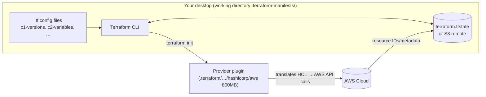

# Section 06 — Terraform Basics (Foundation → Production VPC → State → Modules)

> Transcripts: `5) Terraform Basics, Foundation, Advanced, Variables` + `6) Terraform State & Modules` · ~5.4 h — the biggest section. Repo: [`../devops-real-world-project-implementation-on-aws/06_Terraform_Basics/`](../devops-real-world-project-implementation-on-aws/06_Terraform_Basics/) (sub-demos `0601`–`0607`).

## 1. Objective

Go from zero Terraform to a **production-grade, module-ized VPC with S3 remote state + locking**: HCL blocks, all core commands, input-variable precedence, `for_each`/functions/locals, drift, and the root→child module refactor. Everything Sections 07–20 build on.

## 2. Problem Statement

Manual console clicks are slow, repetitive, error-prone, and unrepeatable across dev/QA/prod. Scripts (bash/Python/CLI) get messy and — critically — have **no desired state**: when someone hand-edits a resource (drift), nothing knows what "correct" is. CloudFormation fixes that but **locks you into AWS**. You need declarative, multi-cloud IaC with a plan preview, state tracking, and reusable code.

## 3. Why This Approach

| Option | Verdict | Why |
|---|---|---|
| Manual console | ❌ | slow, repetitive, human error, no record |
| Bash/Python + AWS CLI | ❌ | messy, unmaintainable, **no desired state → drift is invisible** |
| CloudFormation | ⚠️ works | AWS-only lock-in; skills don't transfer |
| **Terraform** | ✅ | multi-cloud via **providers** (~5,500+ providers incl. AWS/Azure/GCP/K8s/Helm); consistency across envs; reusable **modules**; Git-reviewable; **`plan` = no surprises**; scales 10→10,000 resources; skills portable |

Other course-specific choices: **run Terraform from your local desktop** (Mac/Windows/Linux), *not* the EC2 build VM — you need VS Code (with the Terraform extension for autocomplete) next to the CLI; coding remotely means constant uploads. Steps for the EC2 route exist but are explicitly "not recommended."

## 4. How It Works — Under the Hood

### The execution flow



```
write .tf files → terraform init      (download providers into .terraform/, write .terraform.lock.hcl)
               → terraform validate   (syntax + internal consistency — LOCAL only, no cloud calls)
               → terraform plan       (diff desired[.tf] vs actual[state] → +create ~update -destroy)
               → terraform apply      (execute the plan; record results in STATE)
               → terraform output / show / state list
               → terraform destroy    (or apply -destroy)
```

### Language essentials

| Concept | Rule |
|---|---|
| **argument vs block** | `name = value` (argument) vs `name { … }` (block) |
| value types | string `"x"`, list `["a","b"]`, map `{ k = "v" }`, number, bool |
| **resource labels** | `resource "aws_s3_bucket" "demo_bucket"` = *type* + *local name*; the local name is how OTHER resources reference it (`aws_s3_bucket.demo_bucket.id`) — no meaning outside the module |
| **argument reference** | config you SET before creation (docs list optional/required) |
| **attribute reference** | metadata you READ after creation (`id`, `arn`, …) |
| **version constraints** | `>= 6.0` any future (⚠️ major upgrades can break infra); **`~> 6.0`** = 6.x only (recommended); `~> 6.0.0` = 6.0.x only |
| `.terraform.lock.hcl` | records the EXACT provider versions + checksums init resolved. **Commit it** — teammates then get identical providers |
| meta-arguments | `depends_on`, `count`, `for_each`, `provider(s)`, `lifecycle` — Terraform-level controls on any resource |

> 📖 GLOSSARY add: the transcript's "terraform log dot HTML" = **`.terraform.lock.hcl`** (the dependency lock file).

### The production VPC architecture (demo 0603+)

```
                     VPC 10.0.0.0/16  (65k IPs)
   ┌────────────── us-east-1a ─── 1b ─── 1c ──────────────┐
   │  public  10.0.0.0/24   10.0.1.0/24   10.0.2.0/24     │──▶ IGW ──▶ Internet
   │  private 10.0.10.0/24  10.0.11.0/24  10.0.12.0/24    │
   └───────────────────────────────────────────────────────┘
   routes: ALL subnets  10.0.0.0/16 → local (intra-VPC talk)
           public       0.0.0.0/0  → IGW
           private      0.0.0.0/0  → NAT GW (in a public subnet, has an EIP)
   💰 ONE NAT gateway (not per-AZ) — deliberate cost cut for learning; prod would do 3 for HA.
   Private-subnet workloads get OUTBOUND internet (OS updates, Docker pulls, external APIs)
   but are UNREACHABLE inbound — that's the security posture. Gap 10.0.3-9 left for future public growth.
```

### Variable precedence (lowest → highest; the LAST/HIGHEST source wins)

```
variables.tf defaults  <  TF_VAR_<name> env vars  <  terraform.tfvars
    <  *.auto.tfvars (alphabetical)  <  -var-file=… / -var …  (CLI; if BOTH given, whichever
                                                                comes LAST on the command line wins)
```

### State — local vs remote

| Concern | Local `terraform.tfstate` | S3 remote backend |
|---|---|---|
| Collaboration | ❌ lives on one laptop | ✅ shared bucket |
| Versioning/recovery | ❌ | ✅ S3 versioning keeps every revision |
| Locking (2 applies at once) | ❌ conflicts/corruption | ✅ `use_lockfile = true` → a `.tflock` object during plan/apply |
| Security | ❌ plaintext on disk (may hold secrets) | ✅ encryption + IAM + block-public-access |

State is Terraform's **memory/single source of truth**: plan = diff(.tf, state). Delete it and Terraform forgets everything it built. Never hand-edit it; never change infra outside Terraform (**drift**: console edits are *reverted on the next apply* — demonstrated live).

### Modules

```
ROOT module = your working dir's .tf files (every project has one)
CHILD module = a reusable group of resources the root CALLS:
   module "vpc" { source = "./modules/vpc"  …inputs… }
outputs bubble up as  module.vpc.<output_name>
storage: local/shared FS · your Git repo · private registry · PUBLIC registry (20k+ modules)
⚠️ public modules in prod: pin exact versions or better — COPY and own them (they release weekly;
   an unpinned `>=` can break your infra on the next apply)
```

## 5. Instructor's Approach

1. **File naming `c1-, c2-, c3-…`** ("c" = config) — deliberately ordered so learners read the project in sequence; a `terraform-manifests/` working dir everywhere in the course.
2. **Toy first (S3 bucket, 0602), real second (VPC, 0603)** — all four block types + all six commands on a 2-resource project before the 18-resource VPC.
3. **`terraform console` before code** — he tests `slice(...)`, `cidrsubnet(...)`, `values(...)` interactively, *then* writes them into locals. Copy this habit.
4. **Shows the naive path first**: writes three copy-pasted `aws_subnet` resources, calls it unacceptable, *then* introduces `for_each`. Problem → tool.
5. **Teaches the drift lesson destructively**: adds a tag via console → `plan` flags it → `apply` erases it. "Changes flow one way: configs → cloud."
6. **Cost-consciousness on camera**: 1 NAT GW not 3; destroys every demo immediately; deletes the ~800 MB `.terraform` dir after finishing.
7. **S3-for-state bucket built *with Terraform*** (0605) — answering his students' "why create it manually?"; its own state stays local (chicken-and-egg), and its `prevent_destroy` should be `true` in prod.
8. **Refactor, don't rewrite** (0607): the module demo *transforms* the existing VPC project — same code, new layout — so you see exactly what moves where.

## 6. Code & Commands, Line by Line

### 6.1 Install (0601)

```bash
# macOS: brew tap hashicorp/tap && brew install hashicorp/tap/terraform
# AL2023 EC2 (not recommended, but provided):
sudo dnf install -y dnf-plugins-core
sudo dnf config-manager --add-repo https://rpm.releases.hashicorp.com/AmazonLinux/hashicorp.repo
sudo dnf install -y terraform
terraform version
aws configure           # access key + secret (IAM user w/ AdministratorAccess, "CLI" use type), region, output
# VS Code + HashiCorp Terraform extension (autocomplete: Ctrl+Space lists blocks/arguments)
```

### 6.2 Foundation project (0602): S3 bucket

```hcl
# c1-versions.tf
terraform {
  required_version = ">= 1.0.0"          # min CLI version — older CLI fails fast
  required_providers {
    aws    = { source = "hashicorp/aws",    version = "~> 6.0" }  # 6.x only (no surprise 7.x)
    random = { source = "hashicorp/random", version = "~> 3.0" }  # for a unique bucket suffix
  }
}
provider "aws" {                         # name must match the required_providers key
  region = "us-east-1"                   # (auth comes from `aws configure`; alternatives:
}                                        #  hardcoded keys / env vars / shared files / instance profile)

# c2-s3bucket.tf
resource "random_string" "suffix" {      # S3 names are GLOBALLY unique → random suffix
  length  = 6
  special = false
  upper   = false
}
resource "aws_s3_bucket" "demo_bucket" {
  bucket = "devopsdemo-${random_string.suffix.result}"   # reference by type.localname.attribute
  tags   = { Name = "DevOps demo bucket", Environment = "dev" }
}

# c3-outputs.tf
output "s3_bucket_name" { value = aws_s3_bucket.demo_bucket.bucket }
output "s3_bucket_id"   { value = aws_s3_bucket.demo_bucket.id }
output "s3_bucket_arn"  { value = aws_s3_bucket.demo_bucket.arn, description = "S3 bucket ARN" }
```

```bash
terraform init        # downloads providers → .terraform/ ; writes .terraform.lock.hcl (COMMIT it)
terraform validate    # local-only syntax/consistency check (catches unclosed braces, bad attrs)
terraform plan        # "2 to add" — bucket name "known after apply" (depends on random suffix)
terraform apply       # prints plan again → yes → creates; outputs shown
terraform output      # re-print outputs any time
terraform apply -auto-approve       # skip the prompt (careful!)
terraform plan -out s3plan-v1       # SAVE the plan (binary) — hand to CI/teammate:
terraform apply s3plan-v1           #   applies EXACTLY what was planned, no recalculation
terraform show s3plan-v1            # read a binary plan; -json > s3plan-v1.json for automation
terraform destroy                   # or: terraform apply -destroy   (both print a destroy plan first)
```

### 6.3 Production VPC (0603) — variables, data, locals, for_each

```hcl
# c2-variables.tf
variable "aws_region"      { description = "AWS region",   type = string, default = "us-east-1" }
variable "environment_name"{ type = string, default = "dev" }                # names + tags
variable "vpc_cidr"        { type = string, default = "10.0.0.0/16" }
variable "tags"            { type = map(string), default = { Terraform = "true" } }
variable "subnet_newbits"  { type = number, default = 8 }   # /16 + 8 = /24 subnets (256 IPs each)

# c3-datasources-locals.tf
data "aws_availability_zones" "available" { state = "available" }   # dynamic, region-agnostic
locals {
  azs = slice(data.aws_availability_zones.available.names, 0, 3)    # first 3 healthy AZs
  #      slice(list, start_inclusive, end_exclusive)
  public_subnets  = [for k, az in local.azs : cidrsubnet(var.vpc_cidr, var.subnet_newbits, k)]
  private_subnets = [for k, az in local.azs : cidrsubnet(var.vpc_cidr, var.subnet_newbits, k + 10)]
  # cidrsubnet("10.0.0.0/16", 8, k) → 10.0.k.0/24 ; the +10 offset keeps private at 10.0.10-12
  # (gap 10.0.3-9 reserved for future public growth; no overlap possible)
}

# c4-vpc.tf  — the 10 resource groups
resource "aws_vpc" "main" {
  cidr_block           = var.vpc_cidr
  enable_dns_support   = true            # without these, in-VPC DNS breaks
  enable_dns_hostnames = true
  tags = merge(var.tags, { Name = "${var.environment_name}-vpc" })   # merge maps → one tag map
  lifecycle { prevent_destroy = false }  # PROD: true → terraform destroy REFUSES (VPC is critical)
}
resource "aws_internet_gateway" "igw" {
  vpc_id = aws_vpc.main.id
  tags   = merge(var.tags, { Name = "${var.environment_name}-igw" })
}
resource "aws_subnet" "public" {
  for_each = { for idx, az in local.azs : az => local.public_subnets[idx] }
  # builds a MAP {"us-east-1a"="10.0.0.0/24", …}; for_each needs map/set (count can't carry AZ names)
  vpc_id                  = aws_vpc.main.id
  availability_zone       = each.key       # the AZ
  cidr_block              = each.value     # its /24
  map_public_ip_on_launch = true           # public subnets auto-assign public IPs
  tags = merge(var.tags, { Name = "${var.environment_name}-public-${each.key}" })
}
resource "aws_subnet" "private" {          # same shape; private list; NO map_public_ip
  for_each = { for idx, az in local.azs : az => local.private_subnets[idx] }
  vpc_id            = aws_vpc.main.id
  availability_zone = each.key
  cidr_block        = each.value
  tags = merge(var.tags, { Name = "${var.environment_name}-private-${each.key}" })
}
resource "aws_eip" "nat" { tags = merge(var.tags, { Name = "${var.environment_name}-nat-eip" }) }
resource "aws_nat_gateway" "nat" {
  allocation_id = aws_eip.nat.id
  subnet_id     = values(aws_subnet.public)[0].id   # values(map)→list; first public subnet
  tags          = merge(var.tags, { Name = "${var.environment_name}-nat-gw" })
  depends_on    = [aws_internet_gateway.igw]        # explicit ordering: IGW must exist first
}
resource "aws_route_table" "public_rt" {
  vpc_id = aws_vpc.main.id
  route { cidr_block = "0.0.0.0/0", gateway_id = aws_internet_gateway.igw.id }
  tags = merge(var.tags, { Name = "${var.environment_name}-public-rt" })
}
resource "aws_route_table_association" "public" {
  for_each       = aws_subnet.public                 # associate to ALL public subnets
  subnet_id      = each.value.id
  route_table_id = aws_route_table.public_rt.id
}
resource "aws_route_table" "private_rt" {
  vpc_id = aws_vpc.main.id
  route { cidr_block = "0.0.0.0/0", nat_gateway_id = aws_nat_gateway.nat.id }  # NAT, not IGW!
  tags = merge(var.tags, { Name = "${var.environment_name}-private-rt" })
}
resource "aws_route_table_association" "private" {
  for_each       = aws_subnet.private
  subnet_id      = each.value.id
  route_table_id = aws_route_table.private_rt.id
}

# c5-outputs.tf — for-expressions over for_each results
output "vpc_id"             { value = aws_vpc.main.id }
output "public_subnet_ids"  { value = [for s in aws_subnet.public  : s.id] }   # list
output "private_subnet_ids" { value = [for s in aws_subnet.private : s.id] }
output "public_subnet_map"  { value = { for az, s in aws_subnet.public : az => s.id } }  # AZ→id map
```

`plan` → **18 to add** → `apply` → verify in console: dev-vpc resource map shows public+private per AZ, public RT→IGW, private RT→NAT.

Test functions first in **`terraform console`**:
```
> slice(["a","b","c","d"], 1, 3)          → ["b","c"]
> cidrsubnet("10.0.0.0/16", 8, 0)         → "10.0.0.0/24"
> cidrsubnet("10.0.0.0/16", 8, 11)        → "10.0.11.0/24"
> values({a=3, c=2, d=1})                 → [3, 2, 1]
```

### 6.4 State, drift, inspection (still 0603)

```bash
ls terraform.tfstate            # local state: every resource + IDs + full config (JSON)
# DRIFT DEMO: console → VPC → add tag owner=… → then:
terraform plan                  # detects it: tag should be null → "1 to change"
terraform apply -auto-approve   # console edit ERASED — one-way flow proven
terraform show                  # state in readable HCL (actual IDs, not "known after apply")
terraform state list            # one line per managed resource — quick "what do I own" audit
```

### 6.5 Variable precedence (0604) — same VPC project

```bash
terraform plan                                   # defaults: us-east-1 / dev / 10.0.0.0/16
export TF_VAR_environment_name=predev
export TF_VAR_aws_region=us-east-2
terraform plan                                   # env vars override defaults
# terraform.tfvars in the working dir (auto-loaded):   dev1 / us-east-1 / 10.1.0.0/16 → wins over env
# dev.auto.tfvars (auto-loaded, alphabetical):          dev2 / 10.2.0.0/16          → wins over tfvars
terraform plan -var-file=prod.tfvars             # prod / 10.3.0.0/16 → wins over all auto files
terraform plan -var 'aws_region=us-east-2'       # surgical single override (ad-hoc only)
# -var + -var-file together: LAST one on the command line wins
unset TF_VAR_environment_name TF_VAR_aws_region  # cleanup (bit him in the next demo!)
```

### 6.6 Remote backend (0605 bucket + 0606 usage)

```hcl
# 0605: a tiny TF project that builds the STATE bucket itself (its own state stays local):
#   random_string + aws_s3_bucket "tfstate-<env>-<region>-<suffix>"
#   + aws_s3_bucket_versioning (Enabled)          ← state history/recovery
#   + aws_s3_bucket_server_side_encryption_configuration
#   + aws_s3_bucket_public_access_block (all true)
#   + lifecycle { prevent_destroy = false }        # PROD: true — this bucket holds ALL your state!

# 0606: point the VPC project at it — inside the terraform block:
terraform {
  backend "s3" {
    bucket       = "tfstate-dev-us-east-1-jpjtof"  # ⚠️ NO variables allowed in backend block
    key          = "vpc/dev/terraform.tfstate"     # folder path + state filename (your convention)
    region       = "us-east-1"
    encrypt      = true
    use_lockfile = true          # STATE LOCKING: a .tflock object appears during plan/apply;
  }                              # a second admin is blocked until it's released
}
```
```bash
terraform init      # "Successfully configured the backend s3"
terraform apply -auto-approve
# watch the bucket live: vpc/dev/terraform.tfstate.tflock appears → released on completion
# S3 → object → Versions: every apply adds a version (rollback insurance)
```

### 6.7 Modules (0607) — refactor VPC into a child module

```
terraform-manifests/
├── c1-versions.tf        # unchanged (incl. backend "s3")
├── c2-variables.tf       # unchanged (root still owns region)
├── c3-vpc.tf             # NEW — calls the child module (replaces all resource code)
├── c4-outputs.tf         # rewritten to read module outputs
├── terraform.tfvars
└── modules/vpc/          # THE CHILD MODULE
    ├── main.tf           # ← old c4-vpc.tf (all 10 resources)
    ├── data-sources-locals.tf  # ← old c3
    ├── variables.tf      # ← old c2 MINUS aws_region (a module is region-agnostic;
    └── outputs.tf        # ← old c5           the caller's provider decides the region)
```
```hcl
# c3-vpc.tf (root)
module "vpc" {
  source           = "./modules/vpc"      # local path; could be a git URL or registry ref
  environment_name = var.environment_name # pass ONLY what the module's variables.tf declares
  vpc_cidr         = var.vpc_cidr
  subnet_newbits   = var.subnet_newbits
  tags             = var.tags
}
# c4-outputs.tf (root) — child outputs bubble up via module.<name>.<output>
output "vpc_id"             { value = module.vpc.vpc_id }
output "public_subnet_ids"  { value = module.vpc.public_subnet_ids }
output "private_subnet_ids" { value = module.vpc.private_subnet_ids }
output "public_subnet_map"  { value = module.vpc.public_subnet_map }
```
`plan` now names resources `module.vpc.aws_vpc.main` etc. — same 18 resources, now reusable (call the module twice → two VPCs).

## 7. Complete Code Reference

```bash
# ---- the lifecycle you'll run for EVERY project in this course ----
terraform init
terraform validate
terraform plan            [-out f] [-var-file=x.tfvars] [-var 'k=v']
terraform apply           [-auto-approve] [f]
terraform output ; terraform show ; terraform state list ; terraform console
terraform destroy         # or apply -destroy
# hygiene:
rm -rf .terraform         # ~800MB of providers; re-created by init
```
Full working configs: repo `06_Terraform_Basics/0602…0607/terraform-manifests/` (each demo has a `-storage` backup copy).

## 8. Hands-On Labs

> 💰 **Cost warning:** the VPC labs create a **NAT Gateway (~$0.045/hr + data) and an EIP** — the two chargeable pieces. **`terraform destroy` after every lab, verify in console.** The tfstate S3 bucket is pennies; keep it until after S20, then destroy the 0605 project.
> 🆓 Local variant: `terraform console`, `validate`, and `plan` (with fake creds it fails at API calls — but LocalStack can stand in for full local practice).

### Lab A — Reproduce: 0602 → 0607 end to end
- **Prerequisites:** TF CLI, `aws configure`, VS Code.
- **Steps:** S3 foundation project → VPC project → drift demo → precedence demo → backend bucket → remote-state VPC → module refactor (§6 in order).
- **Expected output:** 18 resources; state visible in S3 with `.tflock` during applies; module-prefixed plan lines after refactor.
- **Verify:** `terraform state list` count = 18; S3 object versions ≥ 2 after a re-apply.
- 🧹 `terraform destroy -auto-approve` in each project, **VPC first**; confirm no NAT GW/EIP remain in the console.

### Lab B — Variation: same module, second environment
- **Steps:** create `qa.auto.tfvars` (`environment_name=qa`, `vpc_cidr=10.5.0.0/16`) → plan/apply → observe a parallel qa-vpc from identical code; change the backend `key` to `vpc/qa/terraform.tfstate` first so states don't collide.
- **Verify:** two state files under different keys; two VPCs with distinct tags.
- 🧹 destroy qa, then dev.

### Lab C — Break it and fix it
1. **Kill the lock discipline:** run `terraform apply` in two terminals simultaneously (remote backend) → second one errors: state locked. **Confirm:** `.tflock` object in S3. **Fix:** wait; never force-unlock unless the holder is truly dead.
2. **Simulate state loss:** on a *local-state* copy, rename `terraform.tfstate` → `plan` wants to create **everything again** (duplicate infra!). **Fix:** restore the file; lesson = why remote + versioning.
3. **Unpin the provider:** change `~> 6.0` to `>= 6.0`, delete `.terraform.lock.hcl`, `init` → newest major could land. **Confirm:** lock file records the jump. **Fix:** restore `~>` and the committed lock file.
4. **Variables in backend:** try `bucket = var.bucket_name` inside `backend "s3"` → hard error ("variables not allowed"). **Fix:** literal values only (or `-backend-config` flags).
- 🧹 destroy everything; `rm -rf .terraform`.

## 9. Troubleshooting

| Symptom | Likely cause | Command to confirm | Fix |
|---|---|---|---|
| `Unsupported Terraform Core version` | `required_version` newer than your CLI | `terraform version` | upgrade CLI or relax the constraint |
| `Error: Unclosed configuration block` / `Unsupported attribute` | syntax typo / bad reference | `terraform validate` | it names file+line; fix both kinds it catches |
| Bucket name conflict on create | S3 names are globally unique | error text | random_string suffix pattern |
| Plan wants to recreate everything | state file missing/moved | `ls terraform.tfstate` / backend config | restore state; use remote backend |
| Console change keeps disappearing | that's **drift correction** working | `terraform plan` shows the revert | make changes in `.tf` files only |
| `Error acquiring the state lock` | another apply in flight (or crashed) | S3: `.tflock` object present? | wait; `terraform force-unlock <id>` only if truly orphaned |
| Wrong region resources appearing | leftover `TF_VAR_…` env vars (bit the instructor!) | `env \| grep TF_VAR` | `unset TF_VAR_…` |
| `Variables not allowed` in backend | backend block can't use vars | error text | hardcode or `-backend-config` |
| Module input not accepted | root passes a var the child doesn't declare | child `variables.tf` | declare it in the module or stop passing it |
| Costs creeping after labs | NAT GW / EIP not destroyed | console: VPC → NAT gateways, EIPs | `terraform destroy`; manually release stragglers |

## 10. Interview Articulation

**90-second explanation:**
> "Terraform is declarative IaC: I describe desired state in HCL, `init` downloads provider plugins that translate my config into cloud API calls, `plan` diffs desired state against the **state file** — Terraform's single source of truth — and `apply` converges reality to match, which is also why console-made changes get reverted as drift. Providers are version-pinned with `~>` constraints plus a committed lock file, so the whole team resolves identical binaries. For teams we move state to an S3 backend with versioning, encryption, and `use_lockfile` for state locking — that gives collaboration, recovery, and prevents concurrent applies from corrupting state. Variables layer with a clear precedence — defaults, TF_VAR env vars, terraform.tfvars, auto.tfvars, then CLI flags, last one wins — which is how one codebase serves dev through prod. And for reuse we factor resources into child modules: our VPC — three AZs, public/private subnets from `cidrsubnet` in a `for_each`, one NAT gateway for cost — became `module "vpc"` callable from any root with different inputs."

<details>
<summary>5 self-test questions</summary>

1. **`~> 6.0` vs `>= 6.0`?** — `~>` allows 6.x only (no major bumps → safe); `>=` allows 7.x+ which can break infra on a routine apply.
2. **What exactly does `terraform validate` NOT do?** — it never contacts the cloud; it's local syntax/consistency only. Plan is what compares against real state.
3. **Why `for_each` over `count` for subnets?** — instances need distinct non-integer identity (AZ name → CIDR map); count only gives 0,1,2 and reorders badly.
4. **Someone edits a resource in the console — what happens and why?** — next plan flags drift and apply reverts it: state+config are authoritative; changes must flow through Terraform.
5. **Four problems the S3 remote backend solves over local state?** — collaboration (shared), versioning (recovery), locking (`use_lockfile` → `.tflock` blocks concurrent applies), security (encryption+IAM vs plaintext on a laptop).

</details>

---
### Related sections
[07 — Terraform EKS Cluster](07-terraform-eks-cluster.md) (this VPC becomes the cluster's home) · [13 — TF Add-Ons](13-terraform-eks-addons.md) · [GLOSSARY](GLOSSARY.md)
