# Section 07 — Terraform EKS Cluster

> Transcript: `7) EKS cluster with TF` · ~2h · Repo: [`../devops-real-world-project-implementation-on-aws/07_Terraform_EKS_Cluster/`](../devops-real-world-project-implementation-on-aws/07_Terraform_EKS_Cluster/) — two projects: `01_vpc-terraform-manifests` (the S06 VPC module) + `02_eks-terraform-manifests`.
> 🐛 ASR NOTE: the transcript says "ECS cluster" and "Z / asset database" constantly — it always means **EKS** and **etcd**. "P3 medium" = **t3.medium**; "EMI type" = **AMI type**. Normalized throughout.

## 0. 🧭 Beginner Follow-Along Guide (start here)

> Read this guide first; dive into the numbered sections after. Tags: **[Terminal]** = your laptop's shell · **[Editor]** = VS Code on the .tf files · **[AWS Console]** = console.aws.amazon.com (for verifying).
> Nothing new to WRITE here — you review two ready Terraform projects (the S06 VPC + a new EKS one), apply them, and connect kubectl. The skill is reading the pieces and knowing why each exists.

### 📊 The whole section at a glance — components & workflow

*Read top to bottom; boxes are components, arrows are the flow (the same shape as your terminal→shell→fork diagram).*

```
┌──────────────────────────────────────────────────────────────────────┐
│               VPC PROJECT (S06)  →  state key vpc/dev                │
│                                                                      │
│ outputs: vpc_id, private_subnet_ids                                  │
└──────────────────────────────────────────────────────────────────────┘
                                    │  remote-state datasource reads outputs
                                    ▼
┌──────────────────────────────────────────────────────────────────────┐
│            EKS PROJECT  (terraform apply, ~21 resources)             │
│                                                                      │
│ IAM roles (cluster + node)  ·  subnet tags for LBs                   │
│ aws_eks_cluster  +  managed node group in PRIVATE subnets            │
└──────────────────────────────────────────────────────────────────────┘
                                    │  aws eks update-kubeconfig
                                    ▼
┌──────────────────────────────────────────────────────────────────────┐
│           EKS CONTROL PLANE (AWS-run)  ◄──►  kubectl (you)           │
│                                                                      │
│ 3 worker nodes · internal IPs only · kube-system pods                │
└──────────────────────────────────────────────────────────────────────┘
```

### Where you are in the course

```
S06 built the VPC with Terraform ─▶ THIS: S07 put an EKS cluster IN it ─▶ S08 run the app on Kubernetes
```

**Must already exist/be running:**
```
[ ] S06 finished: tfstate S3 bucket exists; you understand init/plan/apply
[ ] kubectl installed (S01 §0)
[ ] aws configure working (aws sts get-caller-identity answers)
```

### Words you'll meet (plain English)

| Word | Plain meaning |
|---|---|
| EKS control plane | the Kubernetes "brain" (API server, etcd…) that AWS runs FOR you — you never SSH to it |
| managed node group | the worker EC2s AWS creates/patches/replaces per your spec — your pods run here |
| remote-state datasource | how the EKS project READS the VPC project's outputs (vpc id, subnet ids) from S3 |
| IAM roles (cluster + node) | permissions: the cluster's right to touch your account; the nodes' right to join/network/pull images |
| EKS subnet tags | labels on subnets telling EKS where load balancers may go — miss them and Ingress never gets an address |
| access entry / bootstrap admin | who may administer the cluster; the identity running apply becomes admin |
| `update-kubeconfig` | the command that writes ~/.kube/config so kubectl can talk to YOUR cluster |
| private nodes | workers in private subnets: internal IPs only, internet via NAT — the security posture |

### The simplified play-by-play (do this → see that)

1. **[Terminal]** Bring back the VPC: `cd 01_vpc-terraform-manifests && terraform init && terraform apply -auto-approve`
   → **you should see:** the familiar 18 resources, ~3 min. (Same S06 module, backend key `vpc/dev/…`.)
2. **[Editor]** Open `02_eks-terraform-manifests/` and read c1→c10 IN ORDER with §6 beside you. Before touching anything: update the **S3 bucket name** in `c1` (backend) AND `c3` (remote-state datasource) to YOUR 0605 bucket — the ritual for every project from now on.
   → **you should see:** c3 is the bridge: `data.terraform_remote_state.vpc.outputs.private_subnet_ids` — project 2 reading project 1's outputs. `(deep dive: §6 c3)`
3. **[Editor]** Skim the two IAM roles by the failure each prevents (§5.4): cluster role = "cluster exists but can't touch your account"; node role's 3 policies = "nodes can't join / can't network / can't pull images".
4. **[Terminal]** `cd ../02_eks-terraform-manifests && terraform init && terraform validate && terraform plan`
   → **you should see:** **21 to add** — tags, roles, cluster, node group, nothing else.
5. **[Terminal]** `terraform apply` and wait ~10–15 min (cluster ~8, node group ~3). 💰 The meter starts NOW: control plane $0.10/hr + 3× t3.medium.
   → **you should see:** apply complete; outputs include a ready-made `configure_kubectl` command.
6. **[Terminal]** Connect: `aws eks --region us-east-1 update-kubeconfig --name retail-dev-eksdemo1`
   → **you should see:** "Added new context … to ~/.kube/config" — kubectl now aims at YOUR cluster. `(deep dive: 00A Climb 2 — it's just a file)`
7. **[Terminal]** Verify like the instructor — three ways: `kubectl get nodes -o wide` (3 Ready nodes, INTERNAL-IP only, no EXTERNAL-IP = private ✓), `kubectl get all -n kube-system` (aws-node + kube-proxy DaemonSets, coredns).
   → **you should see:** the cluster's plumbing pods all Running.
8. **[AWS Console]** Cross-check: EKS → your cluster → Compute (node group, 3× t3.medium) / Networking (private subnets, public endpoint) / Access (your IAM user as admin entry) — and any private subnet's Tags tab shows the `kubernetes.io/…` tags.
   → **you should see:** console agreeing with kubectl — same truth, two windows. `(deep dive: §4 subnet tags)`

### ✅ Done-check

```
[ ] plan said 21 to add; apply completed without errors
[ ] kubectl get nodes shows 3 Ready nodes with ONLY internal IPs
[ ] kube-system has aws-node, kube-proxy, coredns running
[ ] subnet tags (elb / internal-elb / cluster=shared) visible in the console
[ ] you can say what the remote-state datasource in c3 does
```

🧹 **Teardown before you stop:** `terraform destroy -auto-approve` in `02_eks…` FIRST, then in `01_vpc…` — ALWAYS this order (EKS lives inside the VPC). **[AWS Console]** confirm: no EC2 instances, no NAT GW, no EIP left. 💰 Left running ≈ **$8–10/day** (control plane + 3 nodes + NAT). The course deliberately recreates this cluster per section — destroying is part of the workflow, not a loss.

---

## 1. Objective

Stand up a **production-shaped EKS cluster with Terraform**: managed control plane, worker node group in **private subnets** of your own VPC, correct IAM roles, EKS subnet tags for load balancers, control-plane logging, and modern access entries — then connect `kubectl` to it.

## 2. Problem Statement

Docker runs containers; it doesn't **orchestrate** them: no autoscaling, no self-healing, no multi-node scheduling, no rolling updates, no desired-state management. And even choosing Kubernetes, hand-building a control plane is heavy — while wiring EKS *wrong* (public workers, missing subnet tags, missing IAM) produces clusters that half-work. This section wires it right, as code, on top of the S06 VPC.

## 3. Why This Approach

**Why Kubernetes at all** (vs plain Docker): scaling, built-in service load-balancing (ClusterIP/NodePort/Ingress/Gateway API), self-healing, thousands-of-nodes multi-node support, automation, zero-downtime rolling updates, **desired-state management** ("I want 5 replicas" stays true), first-class managed offerings (EKS/AKS/GKE).

**Why not Docker Swarm:**

| Aspect | Swarm | Kubernetes |
|---|---|---|
| Setup | `docker swarm init` — trivial | steeper learning curve |
| Scale | small clusters | thousands of nodes |
| Ecosystem | tiny community | industry standard |
| LB | basic round-robin | advanced discovery + intelligent LB |
| Autoscaling | none native | **HPA** (pods) / **VPA** (resources) / **CA/Karpenter** (nodes) |
| Storage/网络 | basic volumes | PV/StorageClass, CNI, NetworkPolicies |
| Managed cloud | none | EKS / AKS / GKE |

Rule of thumb: Swarm for tiny dev experiments; Kubernetes for production. **Why EKS**: AWS runs the control plane (HA, patching); you own only worker nodes. **Why two Terraform projects** (VPC ≠ EKS): independent lifecycles, linked by the **remote-state datasource** — the S06 outputs become this project's inputs.

## 4. How It Works — Under the Hood

### Kubernetes architecture (the "city" analogy)

```mermaid
flowchart TB
    subgraph CP["Control plane (master) — the city council"]
        ETCD[(etcd<br/>record book: ALL cluster state)]
        API[kube-apiserver<br/>front desk: EVERY request goes through it]
        SCHED[kube-scheduler<br/>job board: pods → right nodes]
        KCM["kube-controller-manager<br/>(replication·node·endpoints·namespace controllers)"]
        CCM["cloud-controller-manager<br/>(node-lifecycle·route·service·volume controllers)"]
        API<-->ETCD
        SCHED-->API
        KCM-->API
        CCM-->API
    end
    subgraph W["Worker node — construction workers"]
        KL[kubelet<br/>site supervisor: run what's assigned]
        KP[kube-proxy<br/>traffic cop: route to pods]
        CR[container runtime<br/>containerd: the engine]
    end
    API --> KL
```



Deploy flow: `kubectl apply` → **apiserver** (front desk) → stored in **etcd** → **scheduler** assigns pods to nodes with capacity → **kubelet** runs containers → **kube-proxy** routes traffic. The controllers reconcile desired vs actual (3 replicas asked, 2 running → replication controller creates 1; node dies → node controller marks it, workloads shift). The **cloud-controller-manager** is the AWS "ambassador": provisions ELBs for Services, attaches EBS volumes, registers cloud VMs, sets routes.

### EKS architecture — two VPCs, three flows

```
AWS-MANAGED VPC (Amazon's account)          YOUR ("customer") VPC 10.0.0.0/16
┌────────────────────────────┐    ┌───────────────────────────────────────────┐
│  EKS CONTROL PLANE          │    │ public subnets: ALB/NLB + NAT GW           │
│  apiserver·etcd·scheduler·  │    │ private subnets: EC2 worker nodes (pods)   │
│  controllers  (AWS-managed) │    └───────────────────────────────────────────┘
└────────────────────────────┘
flow① users → IGW → ALB/NLB (public) → pods on private workers
flow② admin: kubectl → public API endpoint (restrictable by CIDR; prod often private-only)
flow③ workers → NAT → IGW → Docker Hub / ECR   (image pulls need outbound)
```

### The two IAM roles (who assumes what, and why)

| Role | Assumed by | Policies | Why |
|---|---|---|---|
| **cluster role** | `eks.amazonaws.com` (the control plane) | `AmazonEKSClusterPolicy` (+`AmazonEKSVPCResourceController` — advanced networking, needed later for Fargate/Karpenter) | control plane lives in *Amazon's* account but must manage ENIs/LBs in *yours* |
| **node-group role** | `ec2.amazonaws.com` (each worker) | `AmazonEKSWorkerNodePolicy` (join cluster) · `AmazonEKS_CNI_Policy` (VPC CNI assigns pod IPs) · `AmazonEC2ContainerRegistryReadOnly` (pull private ECR) | nodes must register, network pods, pull images |

### The subnet tags — "the glue between AWS networking and Kubernetes services"

| Subnet | Tag | Meaning |
|---|---|---|
| public | `kubernetes.io/role/elb = 1` | internet-facing LBs may be placed here |
| private | `kubernetes.io/role/internal-elb = 1` | internal-only LBs here |
| both | `kubernetes.io/cluster/<cluster-name> = shared` | associates subnets with the cluster (`shared` = multiple clusters may use them) |

**Without these, `type: LoadBalancer`/Ingress simply fails to get an address** — EKS wouldn't know where to place the LB.

### Vocabulary map

| AWS/EKS term | K8s term | Plain English |
|---|---|---|
| EKS control plane | master components | AWS-run brain (you never SSH to it) |
| Managed node group | worker nodes | EC2s AWS provisions/patches/replaces per your spec |
| Access entry / `API_AND_CONFIG_MAP` | — | who may administer the cluster (new API + legacy aws-auth ConfigMap, hybrid = future-ready) |
| `bootstrap_cluster_creator_admin_permissions=true` | — | the IAM identity running `terraform apply` becomes cluster admin (false ⇒ locked-out cluster!) |
| service IPv4 CIDR | Service network | VIP range for ClusterIPs (null → AWS default) |
| remote-state datasource | — | project 2 reads project 1's outputs from its S3 state |

## 5. Instructor's Approach

1. **Concept ladder before code:** why-K8s → why-not-Swarm → K8s architecture → EKS architecture → only then Terraform. The city analogy is his memory device — keep it.
2. **Review, don't retype:** "you already know how to write Terraform — now watch the pieces come together." Files reviewed in strict `c1…c10` order.
3. **Remote-state datasource taught as THE bridge**: outputs aren't just terminal prints — they're the *export interface* between projects (VPC → EKS needs vpc_id + subnet IDs).
4. **Explains each IAM role by the failure it prevents** (cluster exists but can't touch your account; nodes can't join/network/pull) rather than by policy name.
5. **Version discipline:** check the EKS Kubernetes-versions/support docs before pinning; `cluster_version=null` → AWS default (1.34 at recording); ≥1.34 mandates **AL2023** AMIs (AL2 is out).
6. `depends_on` on both cluster and node group → IAM attachments must exist first *and* destroy must happen in reverse (avoids race conditions both ways).
7. Verifies **three ways**: terraform outputs → `kubectl` (nodes, kube-system pods/daemonsets) → console (subnet tags, cluster tabs, access entries) — cross-checking CLI against console.

## 6. Code & Commands, Line by Line

### c1–c2 — versions, backend, variables

```hcl
terraform { required_version = ">= 1.0.0"
  required_providers { aws = { source = "hashicorp/aws", version = "~> 6.0" } }
  backend "s3" { bucket = "<your-0605-bucket>", key = "eks/dev/terraform.tfstate",
                 region = "us-east-1", encrypt = true, use_lockfile = true } }
provider "aws" { region = var.aws_region }

# key variables (defaults in terraform.tfvars):
variable "aws_region"        { default = "us-east-1" }
variable "environment"       { default = "dev" }       # naming + tags
variable "business_division" { default = "retail" }    # ownership/cost tags in big orgs
variable "cluster_name"      { default = "eksdemo1" }
variable "cluster_version"   { default = null }        # null → AWS default (1.34 today)
variable "cluster_service_ipv4_cidr"      { default = null }   # null → AWS default
variable "cluster_endpoint_private_access"{ default = false }  # prod best practice: true…
variable "cluster_endpoint_public_access" { default = true }   # …and this false; learning = public
variable "cluster_endpoint_public_access_cidrs" { default = ["0.0.0.0/0"] }  # restrict in prod!
variable "node_instance_types" { default = ["t3.medium"] }
variable "node_capacity_type"  { default = "ON_DEMAND" }       # or SPOT (cost vs stability)
variable "node_disk_size"      { default = 20 }
```

### c3 — remote-state datasource (the project bridge)

```hcl
data "terraform_remote_state" "vpc" {
  backend = "s3"
  config = { bucket = "<your-0605-bucket>",           # SAME bucket…
             key    = "vpc/dev/terraform.tfstate",    # …the VPC project's key
             region = var.aws_region }
}
# consume anywhere as:  data.terraform_remote_state.vpc.outputs.vpc_id
#                       data.terraform_remote_state.vpc.outputs.private_subnet_ids
# ⚠️ the names AFTER .outputs. must match the VPC project's output names EXACTLY.
```

### c4 — locals (naming policy enforced automatically)

```hcl
locals {
  owners           = var.business_division       # "retail"
  environment      = var.environment             # "dev"
  name             = "${local.owners}-${local.environment}"          # retail-dev
  eks_cluster_name = "${local.name}-${var.cluster_name}"             # retail-dev-eksdemo1
}
```

### c5 — EKS subnet tags (for_each over remote-state outputs)

```hcl
resource "aws_ec2_tag" "public_elb" {              # ×3 public subnets
  for_each    = toset(data.terraform_remote_state.vpc.outputs.public_subnet_ids)
  resource_id = each.value
  key         = "kubernetes.io/role/elb"
  value       = "1"
}
resource "aws_ec2_tag" "public_cluster" {
  for_each    = toset(data.terraform_remote_state.vpc.outputs.public_subnet_ids)
  resource_id = each.value
  key         = "kubernetes.io/cluster/${local.eks_cluster_name}"
  value       = "shared"
}
# + the same PAIR for private subnets with key kubernetes.io/role/internal-elb
# 4 tags × 3 subnets = 12 aws_ec2_tag resources from 4 blocks (for_each saves 12 copies)
```

### c6–c7 — cluster IAM role + the cluster

```hcl
resource "aws_iam_role" "eks_cluster" {
  name = "${local.name}-eks-cluster-role"
  assume_role_policy = jsonencode({ Version = "2012-10-17", Statement = [{
    Effect = "Allow", Action = "sts:AssumeRole",
    Principal = { Service = "eks.amazonaws.com" } }] })   # ONLY the EKS service may assume
}
resource "aws_iam_role_policy_attachment" "eks_cluster_policy" {
  policy_arn = "arn:aws:iam::aws:policy/AmazonEKSClusterPolicy"           # mandatory
  role       = aws_iam_role.eks_cluster.name }
resource "aws_iam_role_policy_attachment" "eks_vpc_resource_controller" {
  policy_arn = "arn:aws:iam::aws:policy/AmazonEKSVPCResourceController"   # Fargate/Karpenter-ready
  role       = aws_iam_role.eks_cluster.name }

resource "aws_eks_cluster" "main" {
  name     = local.eks_cluster_name
  version  = var.cluster_version                    # null → AWS default
  role_arn = aws_iam_role.eks_cluster.arn
  vpc_config {
    subnet_ids              = data.terraform_remote_state.vpc.outputs.private_subnet_ids
    endpoint_private_access = var.cluster_endpoint_private_access
    endpoint_public_access  = var.cluster_endpoint_public_access
    public_access_cidrs     = var.cluster_endpoint_public_access_cidrs
  }
  kubernetes_network_config { service_ipv4_cidr = var.cluster_service_ipv4_cidr }
  enabled_cluster_log_types = ["api","audit","authenticator","controllerManager","scheduler"]
  access_config {
    authentication_mode = "API_AND_CONFIG_MAP"      # hybrid: new Access Entries + legacy aws-auth
    bootstrap_cluster_creator_admin_permissions = true   # ⚠️ false ⇒ nobody is admin
  }
  tags       = var.tags
  depends_on = [aws_iam_role_policy_attachment.eks_cluster_policy,
                aws_iam_role_policy_attachment.eks_vpc_resource_controller]
}
```

### c8–c9 — node-group role + managed node group

```hcl
resource "aws_iam_role" "eks_nodegroup_role" {
  name = "${local.name}-eks-nodegroup-role"
  assume_role_policy = jsonencode({ …Principal = { Service = "ec2.amazonaws.com" }… })
}
# three attachments: AmazonEKSWorkerNodePolicy, AmazonEKS_CNI_Policy, AmazonEC2ContainerRegistryReadOnly

resource "aws_eks_node_group" "private_nodes" {
  cluster_name    = aws_eks_cluster.main.name
  node_group_name = "${local.name}-private-ng"
  node_role_arn   = aws_iam_role.eks_nodegroup_role.arn
  subnet_ids      = data.terraform_remote_state.vpc.outputs.private_subnet_ids  # PRIVATE
  instance_types  = var.node_instance_types       # t3.medium
  capacity_type   = var.node_capacity_type        # ON_DEMAND | SPOT
  disk_size       = var.node_disk_size            # 20 GB
  ami_type        = "AL2023_x86_64_STANDARD"      # mandatory from k8s 1.34 (AL2 retired)
  scaling_config { min_size = 1, max_size = 6, desired_size = 3 }
  update_config  { max_unavailable_percentage = 33 }   # rolling node upgrades: ≤1/3 down
  force_update_version = true                     # roll nodes when a new EKS AMI ships
  labels = { environment = local.environment }    # optional: schedule pods by node label
  tags       = var.tags
  depends_on = [/* the 3 node policy attachments */]   # create-after + destroy-before
}
```

### c10 — outputs (incl. the connect command)

```hcl
output "cluster_endpoint" { value = aws_eks_cluster.main.endpoint }
output "cluster_name"     { value = aws_eks_cluster.main.name }
output "cluster_version"  { value = aws_eks_cluster.main.version }
output "cluster_certificate_authority_data" { value = aws_eks_cluster.main.certificate_authority[0].data }
output "node_group_name"  { value = aws_eks_node_group.private_nodes.node_group_name }
output "configure_kubectl" {
  value = "aws eks --region ${var.aws_region} update-kubeconfig --name ${aws_eks_cluster.main.name}"
}
```

### Execute & verify

```bash
cd 01_vpc-terraform-manifests   && terraform init && terraform apply -auto-approve   # 18 res, ~3 min
cd ../02_eks-terraform-manifests && terraform init && terraform validate && terraform plan
terraform apply    # 21 resources; cluster ~8 min + node group ~3 min ≈ 10–15 min total

aws eks --region us-east-1 update-kubeconfig --name retail-dev-eksdemo1   # writes ~/.kube/config
kubectl version                      # client AND server versions → connected
kubectl get nodes -o wide            # 3 nodes (desired), INTERNAL-IP only, no EXTERNAL-IP → private ✓
kubectl get ns                       # default, kube-system, …
kubectl get all -n kube-system       # aws-node + kube-proxy DaemonSets, coredns Deployment
kubectl get ds -n kube-system        # matches console → cluster → Resources tab
# Console checks: subnet Tags (all 4 EKS tags), cluster Compute (node group, 3× t3.medium),
# Networking (private subnets, API endpoint public + 0.0.0.0/0), Access (creator user =
# access entry with AmazonEKSClusterAdminPolicy — bootstrap_creator_admin at work)
```

## 7. Complete Code Reference

Repo: `07_Terraform_EKS_Cluster/01_vpc-terraform-manifests/` + `02_eks-terraform-manifests/` (c1-versions → c10-outputs). Run order:
```bash
# up:    VPC apply → EKS apply → update-kubeconfig
# down:  EKS destroy → VPC destroy       (ALWAYS this order)
terraform destroy -auto-approve   # in 02_eks… first, then 01_vpc…
```

## 8. Hands-On Labs

> 💰 **Cost warning — the big one starts here:** EKS control plane **$0.10/hr (~$73/mo)** + 3× t3.medium (~$0.125/hr) + NAT GW + EBS. **Destroy EKS then VPC after every session.** This cluster pattern is recreated per-section throughout the course — that's deliberate cost hygiene.
> 🆓 Local variant: concepts (not EKS specifics) run free on `kind create cluster` — kubectl/nodes/kube-system exploration works identically.

### Lab A — Reproduce: VPC → EKS → kubectl
- **Prerequisites:** S06 completed (bucket exists), kubectl installed.
- **Steps:** §6 execute block, top to bottom.
- **Expected output:** 21 resources; 3 Ready nodes with only internal IPs; kube-system healthy.
- **Verify:** all four subnet-tag types present in console; Access tab shows your IAM user as admin entry.
- 🧹 **Teardown:** `terraform destroy` EKS, then VPC; confirm EC2 instances + NAT gone.

### Lab B — Variation: scale + version pin
- **Steps:** set `desired_size=2` and pin `cluster_version="1.33"` in tfvars → plan (watch what changes) → apply → `kubectl get nodes` shows 2.
- **Verify:** node group edits are in-place updates, not cluster recreation.
- 🧹 as Lab A.

### Lab C — Break it and fix it
1. **Delete the subnet-tag resources** (comment c5) → apply → deploy any `type: LoadBalancer` service later → stuck, no address. **Confirm:** `kubectl describe svc` events mention subnet discovery. **Fix:** restore c5, apply.
2. **`bootstrap_cluster_creator_admin_permissions = false`** on a *test* cluster → creation succeeds but `kubectl` gets `Unauthorized`. **Confirm:** Access tab shows no entries. **Fix:** add an access entry via console/CLI — or keep it `true`.
3. **Wrong remote-state key** (typo in c3) → `plan` errors: no outputs found. **Confirm:** error names the bucket/key. **Fix:** match the VPC project's backend key exactly.
- 🧹 as Lab A.

## 9. Troubleshooting

| Symptom | Likely cause | Command to confirm | Fix |
|---|---|---|---|
| `kubectl` `Unauthorized` | kubeconfig stale or no access entry | `aws eks update-kubeconfig …` again; console → Access | re-run update-kubeconfig; add access entry |
| `Unsupported: no outputs` from remote state | wrong bucket/key or VPC never applied | check c3 vs VPC backend block | align keys; apply VPC first |
| Service `type: LoadBalancer` pending forever | missing subnet tags | `kubectl describe svc` events | apply c5 tags |
| Node group create fails: role errors | policy attachments raced | plan order / error text | `depends_on` the three attachments (already in code) |
| Nodes NotReady | CNI policy missing → pods get no IPs | `kubectl describe node`; aws-node pod logs | attach `AmazonEKS_CNI_Policy` |
| Destroy hangs/fails | destroying VPC before EKS, or ENIs linger | AWS console ENIs | destroy EKS first; retry after ENI cleanup |
| Cluster made with unexpected k8s version | `cluster_version=null` picked new default | `kubectl version` | pin the version variable |
| API unreachable from office | `public_access_cidrs` restricted | error + variable value | add your CIDR |

## 10. Interview Articulation

**90-second explanation:**
> "Kubernetes earns its complexity through orchestration — desired-state management, self-healing, autoscaling at pod and node level, rolling updates — which Docker or Swarm can't offer at production scale. On EKS, AWS runs the control plane — API server, etcd, scheduler, controllers — in an AWS-managed VPC, while our worker nodes live in **private subnets** of our own VPC; users come in through load balancers in public subnets, and nodes reach registries outbound through NAT. We provision it as two Terraform projects: the VPC exports its IDs as outputs, and the EKS project reads them with a **remote-state datasource**. Two IAM roles matter: the cluster role that `eks.amazonaws.com` assumes to manage resources in our account, and the node role with worker, CNI, and ECR-read policies. Two details people miss: the **kubernetes.io subnet tags** — without them Kubernetes load balancers can't place — and the **access config**, where `bootstrap_cluster_creator_admin_permissions` makes the applying identity cluster admin, with `API_AND_CONFIG_MAP` keeping both the new access-entries API and the legacy aws-auth path alive."

<details>
<summary>5 self-test questions</summary>

1. **Which components live in the AWS-managed VPC vs yours?** — control plane (apiserver, etcd, scheduler, controller-managers) is AWS-managed; worker nodes, LBs, NAT live in your customer VPC.
2. **Why does the cluster IAM role trust `eks.amazonaws.com`?** — the control plane runs in Amazon's account but must create/manage ENIs, LBs, etc. in *your* account — it assumes this role to act on your behalf.
3. **What breaks without `AmazonEKS_CNI_Policy` on the node role?** — the VPC CNI can't manage ENIs → pods don't get VPC IPs → nodes效 NotReady/workloads fail.
4. **What do the subnet tags `role/elb` vs `role/internal-elb` control?** — where internet-facing vs internal load balancers may be provisioned; missing tags = Services/Ingress never get an address.
5. **How does the EKS project learn the VPC's subnet IDs?** — `data "terraform_remote_state"` reads the VPC project's outputs from its S3 state (bucket + key + region).

</details>

---
### Related sections
[06 — Terraform Basics](06-terraform-basics.md) · [08 — Kubernetes Foundation](08-kubernetes-foundation.md) (deploying onto this cluster) · [13 — TF Add-Ons](13-terraform-eks-addons.md) · [17 — Karpenter](17-karpenter-autoscaling.md)
