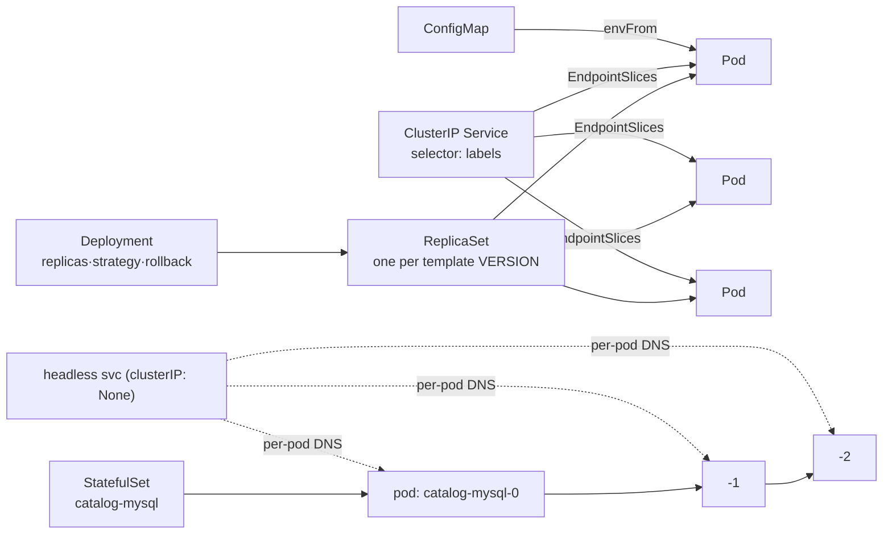

# Section 08 — Kubernetes Foundation (Pods → Deployments → Services → ConfigMaps → StatefulSets)

> Transcript: `8) …` (foundation portion) · ~3h · Repo: [`../devops-real-world-project-implementation-on-aws/08_Kubernetes_Foundation/`](../devops-real-world-project-implementation-on-aws/08_Kubernetes_Foundation/) (demos `0801`–`0805`). All demos use the **catalog microservice** (Go + MySQL) on the S07 EKS cluster.

## 0. 🧭 Beginner Follow-Along Guide (start here)

> Read this guide first; dive into the numbered sections after. Tags: **[Terminal]** = your laptop's shell (kubectl talks to the EKS cluster from here) · **[Editor]** = the YAML files in VS Code · **[Browser]** = the catalog app via port-forward.
> This is THE core Kubernetes section. One microservice (catalog) meets five resource kinds, each solving one failure of the previous: Pod → Deployment → Service → ConfigMap → StatefulSet.

### 📊 The whole section at a glance — components & workflow

*Read top to bottom; boxes are components, arrows are the flow (the same shape as your terminal→shell→fork diagram).*

```
┌──────────────────────────────────────────────────────────────────────┐
│                     kubectl apply -f <manifests>                     │
│                                                                      │
│ Pod → Deployment → Service → ConfigMap → StatefulSet                 │
└──────────────────────────────────────────────────────────────────────┘
                         │                      │
                         ▼                      ▼
              ┌────────────────────┐  ┌──────────────────┐
              │     Deployment     │  │  ClusterIP Svc   │
              │ → ReplicaSet       │  │ selector→labels  │
              │ → Pods (self-heal, │  │ →EndpointSlices  │
              │   rolling update)  │  │ → stable name/IP │
              └────────────────────┘  └──────────────────┘

                  │                          │
                  ▼                          ▼
          ┌───────────────┐  ┌──────────────────────────────┐
          │   ConfigMap   │  │  StatefulSet + headless svc  │
          │ envFrom →     │  │ ordered pods catalog-mysql-0 │
          │ container env │  │ per-pod DNS (the DB master)  │
          └───────────────┘  └──────────────────────────────┘

  test:  kubectl port-forward svc/catalog-service 7080:8080 → /topology
```

### Where you are in the course

```
S07 gave you an empty cluster ─▶ THIS: S08 run catalog the right way, layer by layer ─▶ S09 Secrets → S10 Storage → S11 Ingress
```

**Must already exist/be running:**
```
[ ] S07 cluster up and connected: kubectl get nodes shows 3 Ready nodes
[ ] Repo folder 08_Kubernetes_Foundation/ (demos 0801–0805)
```

### Words you'll meet (plain English)

| Word | Plain meaning |
|---|---|
| Pod | the smallest unit K8s runs — a wrapper around your container (never ship bare ones) |
| Deployment | keeps N copies of a pod alive, replaces them safely on updates, can roll back |
| ReplicaSet | the Deployment's helper that holds each VERSION's pods — kept at 0 = instant rollback |
| Service (ClusterIP) | a stable internal name+IP in front of churning pod IPs |
| EndpointSlices | the live list of pod IPs behind a Service — updates itself when you scale |
| probe (readiness/liveness) | "ready for traffic?" / "still alive?" — HTTP GETs kubelet runs on your app |
| ConfigMap | key/value config injected as env vars (`envFrom`) — same YAML, per-env values |
| StatefulSet + headless service | ordered startup + stable names (`catalog-mysql-0`) + per-pod DNS — for databases |
| `port-forward` | temporary tunnel laptop:7080 → cluster, for testing before Ingress exists |

### The simplified play-by-play (do this → see that)

1. **[Terminal]** 0801 — a bare Pod: `kubectl apply -f 01-catalog-pod.yaml` → `kubectl get pods` → `kubectl describe pod catalog-pod` (read the **Events**: Scheduled → Pulled → Started — describe is "the most important command").
   → **you should see:** Running 1/1; then `kubectl port-forward pod/catalog-pod 7080:8080` and **[Browser]** `localhost:7080/health` + `/catalog/products`. `(deep dive: §6 0801)`
2. **[Terminal]** Kill it: `kubectl delete pod catalog-pod`
   → **you should see:** nothing recreates it — THE reason Deployments exist.
3. **[Terminal]** 0802 — Deployment: `kubectl apply -f 01-catalog-deployment.yaml` → `kubectl get deploy,rs,pods` (the 3-level hierarchy).
   → **you should see:** Deployment → ReplicaSet → Pod chain in the names.
4. **[Terminal]** Scale + self-heal: `kubectl scale deployment catalog --replicas=3` → `kubectl get pods -o wide` (spread across nodes); delete one pod → a replacement appears.
   → **you should see:** desired state enforced without you.
5. **[Terminal]** Rolling update + instant rollback: `kubectl set image deployment/catalog catalog=…:1.3.0` → `kubectl rollout status` → `kubectl get rs` (**old RS kept at 0** — that IS the rollback) → `kubectl rollout undo deployment/catalog`.
   → **you should see:** pods replaced one at a time (`maxUnavailable: 1`), undo near-instant. `(deep dive: §4 RS mechanic)`
6. **[Terminal]** 0803 — Service: apply it, then `kubectl get svc` + `kubectl get endpointslices`; scale to 8 and describe the slice again.
   → **you should see:** the slice tracking pod IPs live; from a test pod (`kubectl run test --image=curlimages/curl -it --rm -- sh`) `curl http://catalog-service:8080/health` works BY NAME. `(deep dive: 00B Climb 10)`
7. **[Terminal]** 0804 — ConfigMap: apply the CM + the `envFrom` Deployment → `kubectl exec -it <pod> -- env | grep RETAIL`.
   → **you should see:** the CM's keys as real env vars in the container. `(deep dive: 00A Climb 1 — frozen at creation!)`
8. **[Terminal]** 0805 — StatefulSet + headless: apply → `kubectl get sts,pods`
   → **you should see:** the pod named **catalog-mysql-0** (ordinal!, not random); `nslookup catalog-mysql` from busybox:1.28 returns the POD's IP (headless = per-pod DNS, no load-balancing of DB writes).
9. **[Terminal]** Prove stable identity: `kubectl delete pod catalog-mysql-0` → same NAME resurrects. Scale sts 1→3→1 and watch `-w`: created 0→1→2, killed 2→1→0 (ordered both ways).
10. **[Terminal]** End-to-end: switch the CM to `PROVIDER: mysql` + endpoint `catalog-mysql-0.catalog-mysql…:3306`, restart, then `kubectl port-forward svc/catalog-service 7080:8080` → **[Browser]** `/topology`.
    → **you should see:** provider=mysql with the pod-0 DNS endpoint — app + real DB wired by names only. (Data still dies with the pod — `emptyDir`; EBS fixes that in S10. Passwords in plain YAML — S09 fixes that.)

### ✅ Done-check

```
[ ] deleted bare pod stayed dead; deleted Deployment-pod was replaced
[ ] after set image: old RS at 0, new RS at 3; undo flipped back instantly
[ ] curl by service NAME worked from inside; EndpointSlices grew when you scaled
[ ] env | grep RETAIL showed ConfigMap values inside the container
[ ] catalog-mysql-0 kept its name across delete; /topology showed provider=mysql
```

🧹 **Teardown before you stop:** `kubectl delete -f catalog-k8s-manifests/` for the last demo you ran (each demo cleans before the next). Cluster stays for S09 — or destroy EKS→VPC if ending the session. 💰 No new billers in this section; the cluster's ~$0.35–0.40/hr continues while up.

---

## 1. Objective

Run the catalog microservice on Kubernetes the *right* way, layer by layer: a **Pod** (and why you never ship bare pods), a **Deployment** (scaling, rolling updates, rollback via ReplicaSets), a **ClusterIP Service** (stable internal endpoint + EndpointSlices), a **ConfigMap** (externalized DB config), and a **StatefulSet + headless service** (ordered, stably-named MySQL).

## 2. Problem Statement

Containers alone don't survive contact with a cluster: pods die with their node and nobody recreates them; pod IPs churn so nothing can reliably call them; config hardcoded in manifests can't move between environments; and databases need *ordered startup* and *stable identity* that Deployments structurally can't give. Each resource in this section exists to close one of those gaps.

## 3. Why This Approach

| Need | Wrong tool | Right tool — why |
|---|---|---|
| Run one app instance | bare container | **Pod** — K8s never runs containers directly; the pod adds network+storage+identity around them |
| Keep N instances alive, upgrade safely | hand-managed pods (die on drain/OOM/spot, no self-heal) | **Deployment** — replicas, self-healing, rolling updates (`maxUnavailable`), instant rollback, +HPA later |
| Call the app from other services | pod IP / pod DNS (both change on restart) | **ClusterIP Service** — stable VIP+DNS, label-selected, auto-updating EndpointSlices |
| Per-env settings | env hardcoded in the Deployment (template not reusable) | **ConfigMap** — key/values injected via `envFrom` (or mounted as files) |
| MySQL master + replicas | Deployment (parallel starts, random pod names) | **StatefulSet** — ordered create (0→1→2), reverse delete (2→1→0), **stable pod names** |
| Address pod-0 (the master) specifically | ClusterIP (load-balances writes to read-only replicas!) | **headless service** (`clusterIP: None`) — per-pod DNS, no load balancing |
| One container or many per pod? | multiple app copies in one pod ❌ | **one main container per pod**; multi-container only for sidecars/helpers (log agent, Envoy) sharing net+storage |

## 4. How It Works — Under the Hood

### The resource ladder



### Rolling update / rollback — the ReplicaSet mechanic

```
set image v1→v2:  Deployment creates a NEW ReplicaSet
   RS-old (v1): 3 → 2 → 1 → 0        old RS is KEPT at 0 replicas (that's the rollback!)
   RS-new (v2): 0 → 1 → 2 → 3        maxUnavailable:1 → at most 1 pod down at a time
rollout undo:     traffic switches back to RS-old — pods spec already there → near-instant
every change = a new REVISION (rollout history); revisions only増 — undo CREATES a new one
```

### Service discovery & DNS

```
Service DNS:      <svc>.<namespace>.svc.cluster.local        e.g. catalog-service.default.svc.cluster.local
Selector match:   Service.spec.selector  ==  Deployment.spec.selector.matchLabels  (labels wire everything)
EndpointSlices:   the live list of matching pod IPs — scale 3→8 pods and it updates itself
Headless per-pod: <pod>.<headless-svc>.<ns>.svc.cluster.local e.g. catalog-mysql-0.catalog-mysql.default.svc.cluster.local
```

Why headless for MySQL: a ClusterIP **load-balances** — a write could land on a read-only replica and fail. Pod IP / pod-DNS change on restart. The headless service gives each StatefulSet pod a **stable, per-pod DNS name** (`…-0` is always the master), with **no load balancing**. The tie: `StatefulSet.spec.serviceName = <headless service name>`.

### Probes & resources (pod-level plumbing)

| Field | Meaning |
|---|---|
| `resources.requests` (100m CPU/128Mi) | **reservation** — scheduler places the pod only where this fits |
| `resources.limits` (200m/256Mi) | **speed limit** — hard ceiling even if the node has spare capacity |
| `readinessProbe` → `/health:8080` | "am I ready for traffic?" — Services withhold traffic until it passes |
| `livenessProbe` → same endpoint | "am I still alive?" — repeated failure ⇒ container **restarted** |
| `imagePullPolicy: IfNotPresent` | reuse local image; avoid re-pulls |
| pod/container `securityContext` | drop ALL capabilities, `runAsNonRoot` (uid 1000 appuser), read-only rootfs |

> 💡 Instructor detail: the app's `/health` endpoint deliberately does **no logging** — he demos pointing the readiness probe at `/topology` instead and the logs flood every 10s. That's *why* health endpoints are silent.

### Vocabulary map

| Term | Plain English |
|---|---|
| Pod | smallest deployable unit; wrapper (net+storage+identity) around container(s) |
| ReplicaSet | keeps N pod copies; one RS per Deployment *version* |
| Revision | numbered deployment history entry (`rollout history`) |
| EndpointSlice | the Service's live pod-IP list |
| `kubectl port-forward` | temp tunnel local-port → pod/svc port (pre-Ingress access) |
| StatefulSet ordinal | the `-0,-1,-2` suffix = stable identity |
| `emptyDir` | ephemeral pod-lifetime volume (deleted with the pod) — placeholder until EBS in S10 |
| `kubectl explain` / API reference | where every YAML field is documented (kubernetes.io → API reference) |

## 5. Instructor's Approach

1. **One microservice for everything** — catalog only, so each new resource is the *only* new variable.
2. **Problem→solution rhythm every time**: pods die on node drain → Deployment; IPs churn → Service; hardcoding → ConfigMap; parallel+random-name pods → StatefulSet; LB-to-replicas breaks writes → headless. Learn the failure first.
3. **API reference as the source of truth** — for each kind he opens kubernetes.io's API reference, shows the group/version (`v1 core` for Pod/Service/ConfigMap, `apps/v1` for Deployment/StatefulSet) and the field docs. The docs even say it: *create pods only through controllers*.
4. **`kubectl describe` is "the most important command"** — pod (Events tell the scheduling/pull/start story), deployment (RS created), rs (owned by deployment; created pod X) — he reads the ownership chain out of Events.
5. **Deliberate wrong-turns**: readiness on `/topology` (log flood), ClusterIP in the ConfigMap endpoint for MySQL then switching to the pod-0 headless DNS, and killing `catalog-mysql-0` to prove same-name resurrection.
6. **Scope control**: `emptyDir` now, EBS later ("one new concept per demo"); MySQL replication explicitly out of scope — *"StatefulSet provides identity and stability; replication logic is up to the app"* (Bitnami charts do it).

## 6. Code & Commands, Line by Line

### 0801 — Pod

```yaml
apiVersion: v1                      # core API group
kind: Pod
metadata:
  name: catalog-pod
  labels: { app: catalog }          # labels = how everything else finds it later
spec:
  containers:                       # a LIST (- ) — usually exactly one main container
  - name: catalog
    image: public.ecr.aws/aws-containers/retail-store-sample-catalog:1.0.0
    ports: [{ containerPort: 8080, protocol: TCP }]
    resources:
      requests: { cpu: 100m, memory: 128Mi }   # scheduler reservation
      limits:   { cpu: 200m, memory: 256Mi }   # hard ceiling
    readinessProbe:
      httpGet: { path: /health, port: 8080 }   # 200 OK ⇒ ready for traffic
```
```bash
kubectl apply -f 01-catalog-pod.yaml
kubectl get pods                          # ContainerCreating → Running, READY 1/1
kubectl describe pod catalog-pod          # node, image, probes, EVENTS (Scheduled→Pulled→Started)
kubectl logs -f catalog-pod               # "using in-memory database, running migration…"
kubectl port-forward pod/catalog-pod 7080:8080     # local 7080 → container 8080
#   browse localhost:7080/health /topology /catalog/products /catalog/products/<id> /catalog/size /catalog/tags
kubectl exec -it catalog-pod -- sh        # inside: ls (app binary), env
kubectl delete pod catalog-pod            # or: kubectl delete -f <file>
```

### 0802 — Deployment

```yaml
apiVersion: apps/v1
kind: Deployment
metadata:
  name: catalog
  labels: { app.kubernetes.io/name: catalog }
spec:                                # DEPLOYMENT spec
  replicas: 1
  strategy:
    type: RollingUpdate
    rollingUpdate: { maxUnavailable: 1 }   # ≤1 pod down during updates (count or %)
  selector:
    matchLabels: { app.kubernetes.io/name: catalog }   # which pods I own — MUST match template labels
  template:                          # ← POD blueprint from here down
    metadata: { labels: { app.kubernetes.io/name: catalog } }
    spec:
      securityContext: { fsGroup: 1000 }   # volumes owned by appuser, not root
      containers:
      - name: catalog
        image: …retail-store-sample-catalog:1.0.0
        imagePullPolicy: IfNotPresent
        securityContext:
          capabilities: { drop: [ALL] }
          readOnlyRootFilesystem: true
          runAsNonRoot: true
          runAsUser: 1000
        ports: [{ containerPort: 8080, name: http, protocol: TCP }]
        readinessProbe: { httpGet: { path: /health, port: 8080 } }
        livenessProbe:  { httpGet: { path: /health, port: 8080 } }   # fails repeatedly ⇒ restart
        resources: { requests: { cpu: 100m, memory: 128Mi }, limits: { memory: 256Mi } }
```
```bash
kubectl apply -f 01-catalog-deployment.yaml
kubectl get deploy && kubectl get rs && kubectl get pods    # the 3-level hierarchy
kubectl rollout status deployment/catalog
kubectl describe deploy catalog             # "Scaled up replica set … to 1"
kubectl describe rs <rs-name>               # "Controlled By: Deployment/catalog"; created pod X
# scale
kubectl scale deployment catalog --replicas=3     # …=5, back to 1 — instant
kubectl get pods -o wide                          # spread across the 3 worker nodes
# rolling update
kubectl describe pod <p> | grep image:            # 1.0.0
kubectl rollout history deployment/catalog        # revision 1
kubectl set image deployment/catalog catalog=…retail-store-sample-catalog:1.3.0
kubectl rollout status deployment/catalog         # gradual: 2/3 updated…
kubectl get rs                                    # OLD rs at 0 (kept!), NEW rs at 3
# rollback
kubectl rollout undo deployment/catalog           # → back on the old RS, near-instant
kubectl rollout undo deployment/catalog --to-revision=2   # jump to a specific revision
kubectl delete -f 01-catalog-deployment.yaml
```

### 0803 — ClusterIP Service

```yaml
apiVersion: v1
kind: Service
metadata:
  name: catalog-service
  labels: { app.kubernetes.io/name: catalog }    # metadata labels: filtering/dashboards only
spec:
  type: ClusterIP                    # internal-only (others: NodePort, LoadBalancer, ExternalName, headless)
  selector:                          # FUNCTIONAL: must match the Deployment's pod labels
    app.kubernetes.io/name: catalog
  ports:
  - port: 8080                       # the SERVICE's port (what callers dial)
    targetPort: 8080                 # the CONTAINER's port
    protocol: TCP
```
```bash
kubectl apply -f …service.yaml && kubectl get svc          # CLUSTER-IP assigned
kubectl get pods -o wide                                    # note pod IPs
kubectl get endpointslices                                  # SAME IPs listed under catalog-service
kubectl scale deployment catalog --replicas=8
kubectl describe endpointslice <name>                       # 8 endpoints now — auto-tracked
# test from INSIDE the cluster:
kubectl run test --image=curlimages/curl -it --rm -- sh
  curl http://catalog-service:8080/health                   # by SERVICE NAME
  curl http://catalog-service:8080/catalog/products
# DNS proof (busybox 1.28 — newer busybox lacks nslookup!):
kubectl run dns-test --image=busybox:1.28 -it --rm -- sh
  nslookup catalog-service     # → catalog-service.default.svc.cluster.local = <ClusterIP>
```

### 0804 — ConfigMap

The catalog app reads its DB config from env vars (documented in the app repo): `RETAIL_CATALOG_PERSISTENCE_PROVIDER` (in-memory | mysql), `…_ENDPOINT`, `…_DB_NAME`, `…_USER`, `…_PASSWORD`, `…_CONNECT_TIMEOUT`.

```yaml
apiVersion: v1
kind: ConfigMap
metadata: { name: catalog }
data:                                            # plain key/value pairs
  RETAIL_CATALOG_PERSISTENCE_PROVIDER: in-memory # this demo; mysql in 0805
  RETAIL_CATALOG_PERSISTENCE_ENDPOINT: ""
  RETAIL_CATALOG_PERSISTENCE_DB_NAME: catalogdb
  RETAIL_CATALOG_PERSISTENCE_USER: catalog_user
  RETAIL_CATALOG_PERSISTENCE_CONNECT_TIMEOUT: "5"
```
```yaml
# in the Deployment's container — inject ALL keys as env vars:
        envFrom:
        - configMapRef: { name: catalog }
```
```bash
kubectl apply -f catalog-k8s-manifests/        # deployment + service + configmap together
kubectl get cm && kubectl describe cm catalog
kubectl exec -it <catalog-pod> -- env | grep RETAIL     # values landed in the container
kubectl delete -f catalog-k8s-manifests/
```

### 0805 — StatefulSet + headless service (MySQL)

```yaml
apiVersion: apps/v1
kind: StatefulSet
metadata:
  name: catalog-mysql
  labels: { app.kubernetes.io/name: catalog, app.kubernetes.io/component: mysql }
spec:
  replicas: 1
  serviceName: catalog-mysql          # ★ THE TIE to the headless service (must equal its name)
  selector:
    matchLabels: { app.kubernetes.io/name: catalog, app.kubernetes.io/component: mysql }
    # `component: mysql` vs the deployment's `component: service` — the differentiator label
  template:
    metadata: { labels: { …same… } }
    spec:
      containers:
      - name: mysql
        image: public.ecr.aws/docker/library/mysql:8.0
        env:                                       # (assignment: move to a ConfigMap)
        - { name: MYSQL_ROOT_PASSWORD, value: my-secret-pw }
        - { name: MYSQL_DATABASE,      value: catalogdb }
        - { name: MYSQL_USER,          value: catalog }
        - { name: MYSQL_PASSWORD,      value: KalyanDB101 }   # → moved to a Secret in S09!
        ports: [{ name: mysql, containerPort: 3306, protocol: TCP }]
        volumeMounts: [{ name: data, mountPath: /var/lib/mysql }]   # the actual DB files
      volumes:
      - { name: data, emptyDir: {} }    # EPHEMERAL — data dies with the pod (EBS comes in S10)
---
apiVersion: v1
kind: Service                          # the HEADLESS service
metadata:
  name: catalog-mysql                  # = serviceName above
spec:
  clusterIP: None                      # ★ this single line makes it headless: no VIP, no LB,
  selector: { …same labels as the STS pods… }        #   per-pod DNS instead
  ports: [{ port: 3306, targetPort: mysql, name: mysql }]
```
ConfigMap switch for the app: `PROVIDER: mysql`, `ENDPOINT: catalog-mysql-0.catalog-mysql.default.svc.cluster.local:3306` (point at **pod-0**, the master — not the headless name itself, which would round-robin DNS across replicas).

```bash
kubectl apply -f catalog-k8s-manifests/
kubectl get sts                          # alias: sts
kubectl get pods -o wide                 # catalog-mysql-0 (ordinal name!), then catalog app pod
kubectl logs -f deploy/catalog           # "using mysql database … migration complete"
# per-pod DNS proof:
kubectl run dns-test --image=busybox:1.28 -it --rm -- \
  nslookup catalog-mysql                 # resolves to the POD's IP (headless = pod records)
# ordered scale up / reverse scale down:
kubectl scale sts catalog-mysql --replicas=3 ; kubectl get pods -w   # -1 created, THEN -2
kubectl scale sts catalog-mysql --replicas=1 ; kubectl get pods -w   # -2 killed, THEN -1
# stable identity:
kubectl delete pod catalog-mysql-0 ; kubectl get pods                # SAME NAME comes back
kubectl rollout restart deployment catalog   # emptyDir wiped data → app re-runs its migration
# verify inside MySQL:
kubectl run mysql-client --image=mysql:8.0 -it --rm -- \
  mysql -h catalog-mysql -u catalog -pKalyanDB101
  mysql> show schemas; use catalogdb; show tables; select * from products; select * from tags;
# app end-to-end:
kubectl port-forward svc/catalog-service 7080:8080
#   /topology now shows databaseEndpoint = catalog-mysql-0.catalog-mysql… provider=mysql ✓
kubectl delete -f catalog-k8s-manifests/
```

## 7. Complete Code Reference

All manifests: repo `08_Kubernetes_Foundation/0801…0805/catalog-k8s-manifests/`. The daily-driver commands:
```bash
kubectl apply|delete -f <file|dir>
kubectl get pods|deploy|rs|svc|cm|sts|endpointslices [-o wide] [-w]
kubectl describe <kind> <name>                 # EVENTS = the truth
kubectl logs -f <pod>|deploy/<name>
kubectl exec -it <pod> -- sh|env
kubectl port-forward pod/<p>|svc/<s> local:remote
kubectl scale deploy|sts <name> --replicas=N
kubectl set image deploy/<d> <ctr>=<image:tag>
kubectl rollout status|history|undo [--to-revision=N] deploy/<d>
kubectl rollout restart deploy/<d>
```

## 8. Hands-On Labs

> 💰 Needs the S07 EKS cluster (control plane + 3 nodes + NAT running). **Destroy EKS+VPC when done for the day.**
> 🆓 Local variant: **everything in this section runs unchanged on `kind create cluster`** — zero AWS cost. Best-value section to drill locally.

### Lab A — Reproduce: the full 0801→0805 ladder
- **Prerequisites:** cluster reachable (`kubectl get nodes` = 3 Ready).
- **Steps:** run each demo block in §6, in order, reading `describe` Events at each level.
- **Expected output:** ends with `/topology` showing the mysql endpoint via headless pod-0 DNS.
- **Verify:** `get rs` after the image update shows the old RS retained at 0.
- 🧹 `kubectl delete -f` each demo's manifests folder.

### Lab B — Variation: the instructor's assignment + scaling drill
- **Steps:** (1) move the StatefulSet's MySQL env block into a new ConfigMap and reference it with `envFrom`. (2) Scale catalog 1→8→1 while `watch kubectl get endpointslices` — see the Service track it live.
- **Verify:** app still connects; endpoint count follows replica count within seconds.
- 🧹 as Lab A.

### Lab C — Break it and fix it
1. **Selector mismatch:** change the Service selector to `app.kubernetes.io/name: catalogX` → curl from the test pod times out. **Confirm:** `kubectl get endpointslices` — empty endpoints. **Fix:** restore the label.
2. **Readiness probe on a bad path:** point it at `/wrong` → pod Running but READY 0/1; Service sends no traffic. **Confirm:** `describe pod` probe failures. **Fix:** `/health`.
3. **StatefulSet data loss (by design):** insert a row via mysql-client → `kubectl delete pod catalog-mysql-0` → row gone (emptyDir). **Lesson:** identity is stable, storage isn't — the S10 EBS motivation. **Fix (temp):** `rollout restart deploy/catalog` to re-run migrations.
4. **Point the app at the headless name with 3 replicas** (instead of `-0`): reads may work, writes intermittently fail against replicas — the exact ClusterIP-for-stateful trap. **Fix:** endpoint = `catalog-mysql-0.…`.
- 🧹 as Lab A.

## 9. Troubleshooting

| Symptom | Likely cause | Command to confirm | Fix |
|---|---|---|---|
| Pod `Pending` | no node fits requests | `describe pod` Events: Insufficient cpu/memory | lower requests or add nodes |
| Pod `ImagePullBackOff` | bad image/tag or no NAT egress | `describe pod` Events | fix image ref; check NAT (S07) |
| Running but READY 0/1 | readiness probe failing | `describe pod` probe section | fix path/port; app slow → add initialDelay |
| Service unreachable, pods fine | selector ≠ pod labels | `kubectl get endpointslices` (empty) | align labels |
| `nslookup` fails in busybox | busybox >1.28 lacks nslookup | use `busybox:1.28` | pin the image (instructor's note) |
| Rollout stuck | new pods failing readiness | `rollout status` + `describe` new pods | `rollout undo` |
| CrashLoopBackOff repeatedly | liveness probe killing a slow app | `describe pod` restart count/events | fix probe timing or the app |
| MySQL data vanishes after pod restart | `emptyDir` is ephemeral | — | expected here; EBS PVs in S10 |
| App can't reach MySQL after scale-out | endpoint points at headless name (round-robin) | app logs; ConfigMap endpoint | use `catalog-mysql-0.<headless>…` |
| `selector does not match template labels` on apply | matchLabels ≠ template labels | error text | make them identical |

## 10. Interview Articulation

**90-second explanation:**
> "Kubernetes never runs containers directly — the pod is the smallest unit, wrapping the container with network, storage, and identity, and the rule is one main container per pod with sidecars only for helpers. You never ship bare pods either: a Deployment manages ReplicaSets which manage pods, giving self-healing, scaling, and rolling updates — each template change creates a *new* ReplicaSet scaled up while the old scales down under `maxUnavailable`, and the old one is kept at zero replicas, which is exactly why rollback is instant. Pod IPs churn, so a ClusterIP Service provides a stable DNS name and virtual IP, wired to pods purely by label selectors and tracked live through EndpointSlices. Config comes from ConfigMaps injected with `envFrom` so the same manifests serve every environment. And for stateful workloads like MySQL, a StatefulSet gives ordered startup and stable ordinal names — `catalog-mysql-0` is always the master — paired with a headless service, `clusterIP: None`, which trades load balancing for per-pod DNS records, because load-balancing writes across read replicas is exactly the failure you're avoiding."

<details>
<summary>5 self-test questions</summary>

1. **Why is rollback near-instant?** — the previous ReplicaSet is retained at 0 replicas with the full old pod spec; undo just scales RSs, no rebuild.
2. **Metadata labels vs selector labels?** — metadata labels are for filtering/dashboards; `spec.selector` labels are *functional* — they wire Service→pods and Deployment→pods and must match template labels.
3. **readiness vs liveness probe outcomes?** — readiness failing withholds Service traffic (pod stays up); liveness failing repeatedly restarts the container.
4. **Three StatefulSet guarantees a Deployment lacks?** — ordered sequential creation, reverse-order deletion, stable ordinal pod names (rebirth with the same name).
5. **What does `clusterIP: None` change, and when do you need it?** — no VIP/no load balancing; DNS returns per-pod records `<pod>.<svc>.<ns>.svc.cluster.local` — needed when clients must target a *specific* pod (e.g., the MySQL master).

</details>

---
### Related sections
[07 — TF EKS Cluster](07-terraform-eks-cluster.md) (the cluster underneath) · [09 — Secrets](09-kubernetes-secrets.md) (those hardcoded MySQL creds get fixed next) · [10 — Storage](10-kubernetes-persistent-storage.md) (emptyDir → EBS) · [11 — Ingress](11-kubernetes-ingress.md)
