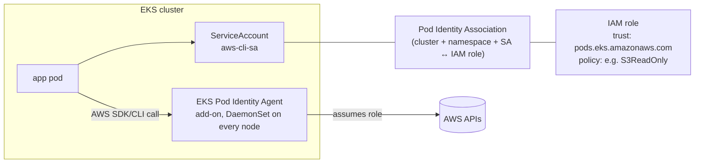

# Section 09 — Kubernetes Secrets (Basics → EKS Pod Identity → AWS Secrets Manager)

> Transcripts: `8)` tail (0901) + `9) Pod Identity` (0902) + `10) CSI Driver & AWS Secret Manager` (0903–0904) · ~2.5h · Repo: [`../devops-real-world-project-implementation-on-aws/09_Kubernetes_Secrets/`](../devops-real-world-project-implementation-on-aws/09_Kubernetes_Secrets/)

## 0. 🧭 Beginner Follow-Along Guide (start here)

> Read this guide first; dive into the numbered sections after. Tags: **[Terminal]** = your laptop's shell · **[AWS Console]** = console.aws.amazon.com · **[Editor]** = the YAML files.
> Three rungs in one section: ① K8s Secrets (and why they're not enough) → ② EKS Pod Identity (how ANY pod gets AWS permissions — the concept the whole course reuses) → ③ credentials mounted straight from AWS Secrets Manager.

### 📊 The whole section at a glance — components & workflow

*Read top to bottom; boxes are components, arrows are the flow (the same shape as your terminal→shell→fork diagram).*

```
┌──────────────────────────────────────────────────────────────────────┐
│             AWS Secrets Manager  (admin-created secret)              │
│                                                                      │
│ catalog-db-secret-1 = { username, password }                         │
└──────────────────────────────────────────────────────────────────────┘
                                    │  pod mounts a CSI volume
                                    ▼
┌──────────────────────────────────────────────────────────────────────┐
│        Secrets Store CSI Driver  +  ASCP  (Pod Identity auth)        │
│                                                                      │
│ SA → association → IAM role  (no stored keys)                        │
│ SecretProviderClass: jmesPath splits JSON → files                    │
└──────────────────────────────────────────────────────────────────────┘
                       │                        │
                       ▼                        ▼
            ┌─────────────────────┐  ┌────────────────────┐
            │    mounted files    │  │ synced K8s Secret  │
            │ /mnt/secrets-store/ │  │ catalog-db         │
            │ USER, PASSWORD      │  │ (created on mount) │
            └─────────────────────┘  └────────────────────┘
                                    │  envFrom secretRef
                                    ▼
┌──────────────────────────────────────────────────────────────────────┐
│                        POD  (catalog / mysql)                        │
│                                                                      │
│ RETAIL_*_USER / _PASSWORD env — nothing in Git or etcd               │
└──────────────────────────────────────────────────────────────────────┘
```

### Where you are in the course

```
S08 left passwords in plain YAML ─▶ THIS: S09 move them out, step by step ─▶ S10 Storage → S11 Ingress
The Pod Identity mechanism you learn here re-appears in S10 (EBS CSI), S11 (LBC), S13–15 (everything).
```

**Must already exist/be running:**
```
[ ] S07 cluster up, kubectl connected (kubectl get nodes → 3 Ready)
[ ] S08's catalog manifests understood (this section edits them)
[ ] helm installed (S01 §0) — first Helm use in the course
```

### Words you'll meet (plain English)

| Word | Plain meaning |
|---|---|
| K8s Secret | like a ConfigMap but base64-encoded — ENCODED, not encrypted (anyone with access can decode) |
| base64 | a reversible text wrapping: `echo <val> \| base64 -d` reveals it |
| Pod Identity (PIA) | the modern way a pod gets an IAM role — agent add-on + an "association", zero stored keys |
| association | the EKS object binding {cluster + namespace + ServiceAccount} → IAM role |
| ServiceAccount (SA) | the pod's identity card inside Kubernetes |
| Secrets Store CSI Driver | plugin that mounts EXTERNAL secrets into pods as files |
| ASCP | the AWS provider plugin for that driver (talks to Secrets Manager) |
| SecretProviderClass (SPC) | the YAML saying WHICH secret to fetch and what filenames its keys become |
| Helm chart/release | an installable package of K8s YAML / one installed instance of it |

### The simplified play-by-play (do this → see that)

1. **[Terminal]** 0901 — native Secret first: `echo -n 'catalog' | base64` (the `-n` matters — a smuggled newline breaks logins!), put both values in the Secret YAML, swap the ConfigMap keys for `secretRef`/`secretKeyRef`, apply.
   → **you should see:** app still works via `port-forward 7080:8080`; `kubectl describe secret catalog-db` hides values… but `base64 -d` reveals them — hence rungs ② and ③. `(deep dive: §6 0901)`
2. **[Terminal]** 0902 — Pod Identity drill, fail FIRST: apply the aws-cli pod + SA, then `kubectl exec -it aws-cli -- aws s3 ls`
   → **you should see:** **AccessDenied** — the pod only has the node's role. The wrong default, experienced.
3. **[AWS Console]** Install the agent (EKS → cluster → Add-ons → "Amazon EKS Pod Identity Agent"), create the IAM role (use case "EKS - Pod Identity", policy AmazonS3ReadOnlyAccess), then Access → Pod Identity associations → Create: role + namespace `default` + SA `aws-cli-sa`.
4. **[Terminal]** Restart the pod (`kubectl delete -f kube-manifests/ && kubectl apply -f kube-manifests/` — associations apply at pod START) → `aws s3 ls` again.
   → **you should see:** ✅ your buckets listed. No keys anywhere. This 4-ingredient recipe (role → agent → SA → association) repeats all course long. `(deep dive: §4)`
5. **[Terminal]** 0903 — Helm debut, install the two DaemonSets: `helm repo add` both repos, then `helm install csi-secrets-store …` and `helm install secrets-provider-aws … --set secrets-store-csi-driver.install=false` (separate installs — combined "sometimes fails").
   → **you should see:** `helm list -n kube-system` two deployed releases; `kubectl get ds -n kube-system` two new DaemonSets.
6. **[Terminal]** Wire IAM for the real thing (§6 heredocs): name-scoped policy (`Resource: …secret:catalog-db-secret*`), trust policy for `pods.eks.amazonaws.com`, role, and the association for SA `catalog-mysql-sa` (SA doesn't exist yet — that's fine, it binds when it appears).
7. **[Terminal]** 0904 — create the secret in AWS: `aws secretsmanager create-secret --name catalog-db-secret-1 …` (name MUST match the policy's `catalog-db-secret*` scope).
8. **[Editor]** Read the SPC (§6): `objects:` names the secret, `jmesPath` splits its JSON, each `objectAlias` becomes a FILE; `usePodIdentity: "true"` picks the auth path. Then the pod spec: CSI volume + `args` that `export MYSQL_USER=$(cat /mnt/secrets-store/MYSQL_USER)` before starting — file names ≠ env names; the args bridge them (the instructor's own live mistake).
9. **[Terminal]** Apply in order: `kubectl apply -f 01-secret-provider-class/` THEN `kubectl apply -f 02-catalog-k8s-manifests/`.
   → **you should see:** pods Running; `kubectl exec -it catalog-mysql-0 -- cat /mnt/secrets-store/MYSQL_USER` → `mydbadmin` — a value that exists NOWHERE in Git or etcd, only in AWS.
10. **[Browser]** `kubectl port-forward svc/catalog-service 7080:8080` → `/topology`, `/catalog/products`.
    → **you should see:** the app fully working with vault-delivered credentials.

### ✅ Done-check

```
[ ] you decoded a K8s Secret with base64 -d (and can say why that's the problem)
[ ] aws s3 ls: AccessDenied BEFORE the association, bucket list AFTER the restart
[ ] two helm releases + two DaemonSets in kube-system
[ ] /mnt/secrets-store/MYSQL_USER readable in both pods; app healthy on /topology
[ ] you can recite the 4 Pod Identity ingredients in order
```

🧹 **Teardown before you stop:** `kubectl delete -f 02-catalog-k8s-manifests/ && kubectl delete -f 01-secret-provider-class/`, delete the 0902 pod/SA/association/role — but **KEEP the two Helm releases** (S10+ reuse them) and keep the Secrets Manager secret if continuing. 💰 Secrets Manager ≈ $0.40/secret/month; cluster hourly cost continues while up.

---

## 1. Objective

Take the MySQL credentials from *hardcoded YAML* to a **zero-trust production setup**: first native K8s Secrets (and see exactly why they're insufficient), then **EKS Pod Identity** (how any pod gets AWS permissions without keys), then **Secrets Store CSI Driver + ASCP** mounting credentials **directly from AWS Secrets Manager** into the catalog and MySQL pods.

## 2. Problem Statement

In S08 the MySQL user/password sat in plaintext in a ConfigMap and the StatefulSet. Kubernetes Secrets improve that — but they're only **base64-encoded, not encrypted**, stored in etcd, decodable by anyone with cluster access. Production wants credentials to live **only in AWS Secrets Manager** (encryption, access control, rotation) — which raises the real question this section answers: **how does a pod authenticate to AWS at all, without stored keys?**

## 3. Why This Approach

| Layer | Option | Why / why not |
|---|---|---|
| Basic | **K8s Secret** | better than ConfigMap (RBAC-restrictable, base64, tmpfs) — but *encoded ≠ encrypted*; fine as a step, not the destination |
| Pod→AWS auth | node instance role | every pod on the node inherits it — no per-app least privilege (the failing default in the demo) |
| | IRSA (IAM Roles for Service Accounts) | the *older* style: OIDC provider + annotations to manage |
| | **EKS Pod Identity (PIA)** ✅ | the current recommendation: agent add-on + an *association* (role↔SA↔namespace); no OIDC wiring, simpler at scale — and reused by EBS CSI (S10), LBC (S11), and everything after |
| Secret delivery | native Secret objects | secret material still lives in etcd |
| | **Secrets Store CSI Driver + ASCP** ✅ | secrets stay in AWS; fetched at pod start and mounted as files — nothing persisted in Kubernetes |
| Install method | raw YAML | many manifests to manage |
| | **Helm** ✅ | first Helm use in the course — charts = templates + values; upgrades/rollbacks (full Helm深度 in S12) |

## 4. How It Works — Under the Hood

### EKS Pod Identity — the auth machinery (learn once, reuse everywhere)



```
the four ingredients, in order:
 1) IAM ROLE      — trust policy Principal: pods.eks.amazonaws.com + permission policy
 2) AGENT ADD-ON  — "Amazon EKS Pod Identity Agent" (DaemonSet in kube-system)
 3) SERVICE ACCT  — plain K8s SA the workload uses (can be created AFTER the association!)
 4) ASSOCIATION   — EKS API object binding {cluster, namespace, SA} → role
 then RESTART the pod → its AWS calls now carry the role. No keys anywhere.
```

### Secrets Manager delivery — the full request path

```
pod starts (SA: catalog-mysql-sa)
 └▶ pod spec mounts a CSI volume → driver: secrets-store.csi.k8s.io
     └▶ Secrets Store CSI Driver (DaemonSet) reads the SecretProviderClass (CRD)
         └▶ provider: aws → hands off to ASCP (AWS provider DaemonSet)
             └▶ ASCP authenticates via POD IDENTITY (usePodIdentity: true)
                 └▶ calls Secrets Manager GetSecretValue on catalog-db-secret-1
                     └▶ jmesPath extracts keys → files named by objectAlias
 └▶ CSI driver mounts them at /mnt/secrets-store/MYSQL_USER, /mnt/secrets-store/MYSQL_PASSWORD
 └▶ container args: export MYSQL_USER=$(cat /mnt/secrets-store/MYSQL_USER) … then start the app
NOTHING is stored in etcd or K8s Secrets. Rotation/central control stays in AWS.
```

### Vocabulary map

| Term | Plain English |
|---|---|
| base64 | encoding, NOT encryption — `echo <val> \| base64 -d` reveals it |
| PIA / Pod Identity Agent | the add-on DaemonSet brokering pod→IAM auth |
| Pod Identity **Association** | the EKS object binding role↔SA↔namespace |
| Secrets Store CSI Driver | K8s CSI plugin that mounts *external* secrets as files |
| **ASCP** | AWS Secrets & Configuration Provider — the AWS backend for that driver |
| SecretProviderClass | CRD telling the driver *what* to fetch, *from where*, *how to name the files* |
| `jmesPath` / `objectAlias` | pick keys out of the secret JSON / the filename each becomes |
| Helm repo / chart / release | package source / package / an installed instance |

## 5. Instructor's Approach

1. **Three rungs, one per demo**: 0901 native Secrets (and their limits stated immediately) → 0902 Pod Identity *in isolation* (a plain aws-cli pod + S3 — deliberately app-free so the concept is pure) → 0903/0904 the full Secrets Manager integration.
2. **Fail first**: the aws-cli pod runs `aws s3 ls` *before* any association → `AccessDenied` under the **node instance role** — you see the wrong default before the right mechanism.
3. **PIA is flagged as THE reusable concept**: he says explicitly that Secrets CSI (here), EBS CSI (S10), and the Load Balancer Controller (S11) all authenticate this way — "please complete this demo."
4. **Helm introduced only as far as needed** (repo add/update/list, install, list, status) with the templates-vs-values picture; the deep dive is deferred to S12.
5. **Install the two DaemonSets separately** — `--set secrets-store-csi-driver.install=false` on the ASCP chart because combined install "sometimes fails."
6. **Scoped IAM**: the policy's Resource is `…secret:catalog-db-secret*` — so the Secrets Manager secret *must* be named to match (his naming discipline lesson).
7. **Honest live mistake**: in the catalog pod he cats the wrong filename first — the mounted files are named by `objectAlias` (`MYSQL_USER`), *not* by the env-var names the app uses (`RETAIL_CATALOG_PERSISTENCE_USER`). Two different name spaces; the `args` bridge them.
8. **Cleanup discipline with a caveat**: delete the app + SecretProviderClass, but **keep** the CSI driver/ASCP installs — S10+ reuse them.

## 6. Code & Commands, Line by Line

### 0901 — native Kubernetes Secrets

```bash
echo -n 'catalog'      | base64      # Y2F0YWxvZw==      (username; avoid underscores)
echo -n 'KalyanDB101'  | base64      # a2FseWFuREIxMDE=  (password)
```
```yaml
apiVersion: v1
kind: Secret
metadata: { name: catalog-db }
data:                                        # values MUST be base64
  RETAIL_CATALOG_PERSISTENCE_USER:     Y2F0YWxvZw==
  RETAIL_CATALOG_PERSISTENCE_PASSWORD: a2FseWFuREIxMDE=
```
Wiring: **comment the user/password keys out of the ConfigMap**; Deployment adds `envFrom: [{secretRef: {name: catalog-db}}]` beside the configMapRef; StatefulSet swaps hardcoded env for:
```yaml
        - name: MYSQL_USER
          valueFrom: { secretKeyRef: { name: catalog-db, key: RETAIL_CATALOG_PERSISTENCE_USER } }
        - name: MYSQL_PASSWORD
          valueFrom: { secretKeyRef: { name: catalog-db, key: RETAIL_CATALOG_PERSISTENCE_PASSWORD } }
```
```bash
kubectl apply -f catalog-k8s-manifests/
kubectl get secret ; kubectl describe secret catalog-db     # sizes only, values hidden
kubectl port-forward svc/catalog-service 7080:8080          # /topology + /catalog/products still work
```
> ⚠️ Limit stated on the spot: base64 + RBAC is "basic security" — production moves to Secrets Manager next.

### 0902 — EKS Pod Identity (standalone drill)

```bash
# ① agent add-on: EKS console → cluster → Add-ons → "Amazon EKS Pod Identity Agent" → Create
kubectl get ds -n kube-system            # eks-pod-identity-agent — one pod per node
# ② SA + test pod (kube-manifests/): ServiceAccount aws-cli-sa (default ns)
#    Pod aws-cli: image amazon/aws-cli, command: sleep infinity, serviceAccountName: aws-cli-sa
kubectl apply -f kube-manifests/
kubectl exec -it aws-cli -- aws s3 ls    # ❌ AccessDenied — running as the NODE role
# ③ IAM role: console → Roles → Create → service EKS → use case "EKS - Pod Identity"
#    (trust policy for pods.eks.amazonaws.com auto-filled) + AmazonS3ReadOnlyAccess
# ④ association: EKS console → cluster → Access → Pod Identity associations → Create
#    role=eks-pod-identity-s3-readonly-role, namespace=default, SA=aws-cli-sa
kubectl delete -f kube-manifests/ && kubectl apply -f kube-manifests/   # RESTART required
kubectl exec -it aws-cli -- aws s3 ls    # ✅ buckets listed
# cleanup: delete pod+SA, the association, and the IAM role
```

### 0903 — install driver + ASCP, wire IAM (Helm debut)

```bash
brew install helm && helm version        # (choco/apt per OS)
helm repo add secrets-store-csi-driver https://kubernetes-sigs.github.io/secrets-store-csi-driver/charts
helm repo add aws-secrets-manager https://aws.github.io/secrets-store-csi-driver-provider-aws
helm repo update && helm repo list

helm install csi-secrets-store secrets-store-csi-driver/secrets-store-csi-driver -n kube-system
helm install secrets-provider-aws aws-secrets-manager/secrets-store-csi-driver-provider-aws \
     -n kube-system --set secrets-store-csi-driver.install=false   # driver already installed
helm list -n kube-system                 # two releases, both "deployed"
kubectl get ds -n kube-system            # BOTH run as DaemonSets (one pod per node each)

# IAM (env vars first: AWS_REGION, EKS_CLUSTER, ACCOUNT_ID)
cat > catalog-db-secret-policy.json <<'EOF'
{ "Version":"2012-10-17","Statement":[{ "Effect":"Allow",
  "Action":["secretsmanager:GetSecretValue","secretsmanager:DescribeSecret"],
  "Resource":"arn:aws:secretsmanager:us-east-1:<ACCOUNT_ID>:secret:catalog-db-secret*" }]}
EOF
#                                        └ name-scoped! the secret MUST start with catalog-db-secret
cat > trust-policy.json <<'EOF'
{ "Version":"2012-10-17","Statement":[{ "Effect":"Allow","Action":["sts:AssumeRole","sts:TagSession"],
  "Principal":{"Service":"pods.eks.amazonaws.com"} }]}
EOF
aws iam create-policy --policy-name catalog-db-secret-policy --policy-document file://catalog-db-secret-policy.json
aws iam create-role   --role-name catalog-db-secrets-role    --assume-role-policy-document file://trust-policy.json
aws iam attach-role-policy --role-name catalog-db-secrets-role \
    --policy-arn arn:aws:iam::<ACCOUNT_ID>:policy/catalog-db-secret-policy

aws eks create-pod-identity-association --cluster-name $EKS_CLUSTER \
    --namespace default --service-account catalog-mysql-sa \
    --role-arn arn:aws:iam::<ACCOUNT_ID>:role/catalog-db-secrets-role
# SA doesn't exist yet — that's FINE; it binds when the SA appears (0904)
```

### 0904 — the catalog integration

```bash
aws secretsmanager create-secret --name catalog-db-secret-1 --region $AWS_REGION \
  --description "MySQL credentials for catalog microservice" \
  --secret-string '{"MYSQL_USER":"mydbadmin","MYSQL_PASSWORD":"KalyanDB101"}'
# name matches the policy's catalog-db-secret* scope ✓
```
```yaml
# 01-secret-provider-class.yaml
apiVersion: secrets-store.csi.x-k8s.io/v1
kind: SecretProviderClass
metadata: { name: catalog-db-secrets }
spec:
  provider: aws                           # ASCP (not Azure/GCP)
  parameters:
    objects: |
      - objectName: "catalog-db-secret-1" # WHICH Secrets Manager secret
        objectType: "secretsmanager"
        jmesPath:                          # pick keys out of the JSON…
          - path: MYSQL_USER
            objectAlias: MYSQL_USER        # …each becomes a FILE with this name
          - path: MYSQL_PASSWORD
            objectAlias: MYSQL_PASSWORD
    usePodIdentity: "true"                 # ★ authenticate via PIA (not IRSA/node role)
```
```yaml
# ServiceAccount (completes the 0903 association):
apiVersion: v1
kind: ServiceAccount
metadata: { name: catalog-mysql-sa, namespace: default }
# StatefulSet AND Deployment both gain:
spec:
  serviceAccountName: catalog-mysql-sa
  containers:
  - name: mysql            # (catalog container analogous)
    command: ["/bin/bash","-c"]
    args:                  # read mounted FILES → export the env names the app expects → start
      - |
        export MYSQL_USER=$(cat /mnt/secrets-store/MYSQL_USER)
        export MYSQL_PASSWORD=$(cat /mnt/secrets-store/MYSQL_PASSWORD)
        echo "credentials loaded from Secrets Manager"
        exec docker-entrypoint.sh mysqld        # catalog: exec /app/main
        # catalog exports RETAIL_CATALOG_PERSISTENCE_USER / _PASSWORD instead — env names ≠ file names!
    volumeMounts:
    - { name: aws-secrets, mountPath: /mnt/secrets-store, readOnly: true }
  volumes:
  - name: aws-secrets
    csi:
      driver: secrets-store.csi.k8s.io          # the CSI driver we helm-installed
      readOnly: true
      volumeAttributes: { secretProviderClass: catalog-db-secrets }
```
```bash
kubectl apply -f 01-secret-provider-class/       # FIRST the SPC…
kubectl get secretproviderclass
kubectl apply -f 02-catalog-k8s-manifests/       # …then SA + STS + deployment + services + CM
kubectl get pods                                  # mysql first, then catalog (takes a minute)
kubectl exec -it catalog-mysql-0 -- ls -lrt /mnt/secrets-store   # MYSQL_USER, MYSQL_PASSWORD (+raw secret)
kubectl exec -it catalog-mysql-0 -- cat /mnt/secrets-store/MYSQL_USER      # mydbadmin
kubectl exec -it <catalog-pod>   -- cat /mnt/secrets-store/MYSQL_PASSWORD  # KalyanDB101
kubectl port-forward svc/catalog-service 7080:8080   # /topology /health /catalog/products all fine
# cleanup — but KEEP the helm releases (reused in S10+):
kubectl delete -f 02-catalog-k8s-manifests/ && kubectl delete -f 01-secret-provider-class/
```

## 7. Complete Code Reference

Execution order (repo `09_Kubernetes_Secrets/0901…0904/`):
```bash
# 0901: kubectl apply -f catalog-k8s-manifests/        (Secret + refs)
# 0902: install PIA add-on → SA+pod → fail → role → association → restart → succeed
# 0903: helm install driver, helm install ASCP(--set …install=false) → policy/role/attach → association
# 0904: create-secret → apply SPC → apply app manifests → verify mounts → port-forward
# teardown: app + SPC + Secrets Manager secret (+$0.40/mo each) ; keep helm releases
```

## 8. Hands-On Labs

> 💰 EKS cluster running throughout + Secrets Manager ≈ **$0.40/secret/mo + $0.05/10k API calls** — delete demo secrets after. **Destroy EKS+VPC at day's end.**
> 🆓 Local variant: 0901 runs on kind as-is. 0902–0904 are inherently AWS (IAM/Secrets Manager) — no meaningful local equivalent; budget one cluster session.

### Lab A — Reproduce: the three rungs
- **Prerequisites:** S07 cluster, helm, AWS CLI.
- **Steps:** 0901 → 0902 → 0903 → 0904 exactly as §6.
- **Expected output:** S3 ls fails-then-succeeds (0902); `/mnt/secrets-store` files in both pods; app healthy on `/topology`.
- **Verify:** `kubectl get secret` shows NO secret holding the DB creds in 0904 — that's the point.
- 🧹 per §6 cleanup; delete the 0902 role/association; keep driver+ASCP.

### Lab B — Variation: rotate the secret
- **Steps:** `aws secretsmanager put-secret-value --secret-id catalog-db-secret-1 --secret-string '{"MYSQL_USER":"mydbadmin","MYSQL_PASSWORD":"NewPass202"}'` → delete/recreate the pods → cat the mounted files.
- **Verify:** new values mounted — rotation is an AWS-side operation; K8s manifests untouched. (Note MySQL's stored root data still has the old password on emptyDir — a nice segue to S10/S14.)
- 🧹 restore the old value or recreate the secret.

### Lab C — Break it and fix it
1. **Skip the association:** apply 0904 without 0903's association → pods stuck `ContainerCreating`. **Confirm:** `kubectl describe pod` → MountVolume.SetUp failed / access denied from ASCP. **Fix:** create the association, restart pods.
2. **Name outside the policy scope:** create the secret as `mydb-secret-1` and point the SPC at it → same mount failure (policy only allows `catalog-db-secret*`). **Fix:** rename to match, or widen Resource to `*` (understand the trade-off).
3. **Wrong file name in args:** `cat /mnt/secrets-store/RETAIL_CATALOG_PERSISTENCE_USER` → "No such file" (the instructor's own live error). **Fix:** files are named by `objectAlias`; the app's env names are set by *your* `export` lines.
- 🧹 as Lab A.

## 9. Troubleshooting

| Symptom | Likely cause | Command to confirm | Fix |
|---|---|---|---|
| `aws s3 ls` in pod → AccessDenied | no association; using node role | error names the node-role ARN | create PIA association + **restart pod** |
| Association created but still denied | pod not restarted | pod age vs association time | delete/recreate the pod |
| Pod stuck ContainerCreating | SPC missing, or ASCP auth failed | `describe pod` → FailedMount events | apply SPC first; check association/role |
| Mount error "access denied … GetSecretValue" | policy Resource doesn't match secret name | policy JSON vs secret ARN | align `catalog-db-secret*` naming |
| `helm install` ASCP fails/conflicts | combined driver install racing | error text | install driver first; `--set secrets-store-csi-driver.install=false` |
| No such file under /mnt/secrets-store | wrong filename (env name ≠ objectAlias) | `ls /mnt/secrets-store` | cat the alias names |
| SA "doesn't exist" worry at association time | none — it's allowed | — | association binds when the SA appears |
| Secret visible via `kubectl get secret` (0901) | expected: base64 only | `… -o jsonpath \| base64 -d` | that's the lesson → move to Secrets Manager |

## 10. Interview Articulation

**90-second explanation:**
> "Kubernetes Secrets are base64-encoded, not encrypted — anyone with etcd or API access can decode them — so we treat them as a stepping stone and keep real credentials in AWS Secrets Manager. The enabling concept is **EKS Pod Identity**: an agent add-on runs as a DaemonSet, and a *pod identity association* binds a cluster-namespace-serviceaccount triple to an IAM role whose trust policy allows `pods.eks.amazonaws.com` — so a pod's AWS calls assume that role with zero stored keys; it replaced the older IRSA/OIDC approach and it's the same mechanism the EBS CSI driver and Load Balancer Controller use later. For delivery we helm-install the Secrets Store CSI Driver plus AWS's ASCP provider, both DaemonSets. A SecretProviderClass CRD names the Secrets Manager secret, uses jmesPath to split its JSON keys into files with objectAliases, and sets `usePodIdentity: true`. The pod mounts a CSI volume referencing that class; at startup the files appear under `/mnt/secrets-store`, and the container's args cat them into the env variables the app expects — so credentials never touch etcd, and rotation stays an AWS-side operation."

<details>
<summary>5 self-test questions</summary>

1. **Why is a K8s Secret not "encryption"?** — values are base64 in etcd; `base64 -d` decodes them. RBAC limits *who*, not *how safely stored*.
2. **The four things a working Pod Identity setup needs?** — IAM role trusted by `pods.eks.amazonaws.com`, the Pod Identity Agent add-on, a ServiceAccount, and the association binding them (then restart the pod).
3. **Division of labor: CSI driver vs ASCP?** — the driver is the generic mount machinery reacting to SecretProviderClasses; ASCP is the AWS-specific provider that authenticates (via PIA) and calls Secrets Manager.
4. **What do `jmesPath.path` and `objectAlias` control?** — which key to extract from the secret JSON, and the filename it's mounted as (file names ≠ the app's env-var names — your args bridge them).
5. **You created the association before the ServiceAccount existed — problem?** — no; the association is a binding by name and takes effect when the SA (and a restarted pod using it) appears.

</details>

---
### Related sections
[08 — K8s Foundation](08-kubernetes-foundation.md) (the creds being secured) · [10 — Storage](10-kubernetes-persistent-storage.md) (PIA reuse #1) · [11 — Ingress](11-kubernetes-ingress.md) (PIA reuse #2) · [12 — Helm](12-helm-package-manager.md) (the tool introduced here, in depth) · [13 — TF Add-Ons](13-terraform-eks-addons.md) (all of this automated)
