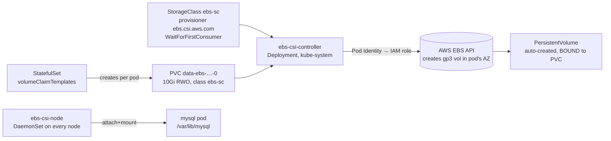

# Section 10 — Kubernetes Persistent Storage (EBS CSI → RDS MySQL)

> Transcripts: `10)` tail (1001) + `11) Kubernetes Storage & RDS MySQL` (1002–1003) · ~1.5h · Repo: [`../devops-real-world-project-implementation-on-aws/10_Kubernetes_Storage/`](../devops-real-world-project-implementation-on-aws/10_Kubernetes_Storage/)

## 0. 🧭 Beginner Follow-Along Guide (start here)

> Read this guide first; dive into the numbered sections after. Tags: **[Terminal]** = your laptop's shell · **[AWS Console]** = console.aws.amazon.com · **[Editor]** = the YAML files.
> Two fixes in order: ① give in-cluster MySQL a real disk (EBS) so data survives pod death → ② admit you shouldn't run databases yourself, and swap to RDS with a one-file DNS trick.

### Where you are in the course

```
S08's MySQL loses data on restart (emptyDir) ─▶ THIS: S10 EBS volumes, then RDS ─▶ S11 Ingress
```

**Must already exist/be running:**
```
[ ] S07 cluster up; kubectl connected
[ ] S09 completed: Secrets CSI + ASCP helm releases still installed, catalog-db-secret-1 exists
    (1002/1003 reuse the SAME SecretProviderClass + Pod Identity wiring untouched)
```

### Words you'll meet (plain English)

| Word | Plain meaning |
|---|---|
| emptyDir | scratch space that DIES with the pod — why S08's data vanished |
| EBS | an AWS network disk, tied to ONE availability zone |
| CSI driver | the plugin K8s uses to create/attach cloud disks |
| StorageClass | the blueprint: which provisioner, what disk type, WHEN to create |
| PVC → PV | the request ("10Gi please") → the actual provisioned disk object, bound 1:1 |
| `WaitForFirstConsumer` | "don't create the disk until the pod picks a node" — so disk and pod land in the SAME AZ |
| `volumeClaimTemplates` | StatefulSet stamping one personal PVC per replica |
| `reclaimPolicy: Delete` | deleting the PVC deletes the PV AND the EBS volume |
| ExternalName Service | a Service that's just a DNS alias — `catalog-mysql` → the RDS hostname |

### The simplified play-by-play (do this → see that)

1. **[Terminal]** 1001 — install the EBS CSI driver with the S09 recipe (identical 4 steps): trust-policy heredoc → role + `AmazonEBSCSIDriverPolicy` → association for `kube-system/ebs-csi-controller-sa` → `aws eks create-addon --addon-name aws-ebs-csi-driver …` (§6 has it verbatim).
   → **you should see:** `kubectl get pods -n kube-system | grep ebs-csi` — 2 controller pods + one node pod per node. Pod Identity, reuse #1.
2. **[Editor]** 1002 — exactly TWO changes vs S09's 0904 (diff the folders!): a new `StorageClass` (`ebs-sc`, `WaitForFirstConsumer`) and the STS swap `emptyDir` → `volumeClaimTemplates` mounting `/var/lib/mysql`.
3. **[Terminal]** Apply (SPC first, then manifests) and watch the objects: `kubectl get sc,pvc,pv`
   → **you should see:** PVC `data-ebs-catalog-mysql-0` **Bound**; **[AWS Console]** EC2 → Volumes shows a fresh 10 GiB gp3 tagged with the PVC name — YAML became a real disk. `(deep dive: §4 loop)`
4. **[Terminal]** THE durability proof: insert-check data via `kubectl run mysql-client … mysql -h catalog-mysql -u mydbadmin -pKalyanDB101` (`select * from products;` → 12 rows) → `kubectl delete pod catalog-mysql-0` → re-run the select.
   → **you should see:** same-name pod returns AND the 12 rows are still there — the EBS volume re-attached. emptyDir could never.
5. **[Terminal]** The lifecycle/cost lesson: `kubectl delete -f …` the whole app → `kubectl get pvc,pv`
   → **you should see:** PVC + PV **still exist** (and the EBS volume still bills!) — only `kubectl delete pvc data-ebs-catalog-mysql-0` kills the chain. Deleting apps ≠ deleting data. 💰
6. **[AWS Console]** 1003 — RDS the right way: SG `rds-mysql-sg` allowing 3306 **only from the EKS cluster SG** → DB subnet group over the 3 PRIVATE subnets → RDS MySQL `mydb101`, master `mydbadmin`/`KalyanDB101` (SAME creds as the S09 secret — so nothing else changes!), db.t4g.micro, Public access **No** (~5–10 min create). `(deep dive: 00B Climb 7 — SG references SG)`
7. **[Terminal]** Create the schema from inside the cluster: `kubectl run mysql-client … mysql -h <rds-endpoint> …` → `create database catalogdb;`
8. **[Editor]** The one new manifest: ExternalName Service named `catalog-mysql` (the SAME name the app already dials) pointing at your RDS endpoint. No StatefulSet, no headless service — MySQL left the cluster.
9. **[Terminal]** Apply → `kubectl get pods` (ONLY catalog — no DB pod!) → logs show "migration complete" → `port-forward 7080:8080` → `/topology`.
   → **you should see:** the app unchanged, storing rows in RDS — the endpoint moved, the NAME didn't. `(deep dive: 00B Climb 3)`

### ✅ Done-check

```
[ ] PVC Bound + the gp3 volume visible in the EC2 console by PVC name
[ ] 12 rows survived kubectl delete pod catalog-mysql-0
[ ] you saw PVC/PV outlive the app, then deleted the PVC and watched the EBS volume die
[ ] RDS reachable ONLY from the cluster (SG-from-SG); catalog runs with zero DB pods
[ ] you can explain WaitForFirstConsumer's AZ logic in one sentence
```

🧹 **Teardown before you stop (COSTS!):** delete app manifests + SPC → **delete the RDS instance** (it "costs heavily") → DB subnet group → `rds-mysql-sg` (undeleted SGs later BLOCK VPC destroy) → any leftover PVC. Keep the CSI driver + helm releases (S11+ reuse). 💰 RDS ≈ $0.017+/hr, orphaned EBS volumes ≈ $0.08/GB/mo — both bill silently.

---

## 1. Objective

Make MySQL's data **survive pod restarts and node failures**: install the **EBS CSI driver** (authenticated via Pod Identity), dynamically provision per-pod EBS volumes through a **StorageClass + volumeClaimTemplates**, verify data durability — then take the production step: **replace in-cluster MySQL entirely with Amazon RDS**, reached via an **ExternalName Service**.

## 2. Problem Statement

The S08 StatefulSet uses `emptyDir` — the moment the pod is rescheduled, **all data is gone**. Databases need storage that outlives pods. And even durable in-cluster MySQL leaves you owning backups, patching, replication, HA, and point-in-time recovery — none of which StatefulSets solve ("Kubernetes orchestrates containers; it doesn't solve database problems"). Two fixes, in order: EBS-backed PVs for durability, then RDS to shed database operations entirely.

## 3. Why This Approach

| Question | Options | Choice & why |
|---|---|---|
| Durable pod storage | emptyDir (ephemeral) / hostPath (node-tied) | **EBS via CSI** — dedicated disk per pod, reattached across restarts |
| How K8s talks to AWS storage | — | **CSI (Container Storage Interface)** — K8s owns no storage; each cloud ships a driver |
| When to create the volume | `Immediate` | **`WaitForFirstConsumer`** — provision only when the pod schedules, *in the same AZ as its node* (EBS is AZ-bound!) |
| Per-pod volumes in a StatefulSet | one shared PVC | **`volumeClaimTemplates`** — each replica gets its *own* PVC/PV (mysql-0, mysql-1… independent disks) |
| Driver auth | keys / node role | **Pod Identity** (S09's mechanism, reuse #1) |
| Run the DB where? | in-cluster STS+EBS | **RDS MySQL** for production — managed backups/patching/replication/HA/recovery; team focuses on microservices |
| Pod → RDS wiring | hardcode endpoint in Deployment | **ExternalName Service** — in-cluster DNS alias to the RDS endpoint; endpoint changes touch ONE Service object, no pod restarts |

## 4. How It Works — Under the Hood

### Dynamic provisioning — the full loop



```
create order:  pod scheduled (node/AZ known) → WaitForFirstConsumer fires → controller calls EBS API
               → volume born in SAME AZ → PV object created → PVC Bound → node plugin mounts it
delete order:  delete app/STS → PVC & PV REMAIN (and the EBS volume keeps billing!)
               → delete PVC → PV deleted → EBS volume deleted   (reclaimPolicy: Delete)
```

### The three storage objects (drilled twice by the instructor — it's the whole section)

| Object | Scope | Role |
|---|---|---|
| **StorageClass** | cluster | *how* storage is made (provisioner, gp3, binding mode) — the blueprint |
| **PVC** (PersistentVolumeClaim) | **namespaced** | the *request*: "10Gi, ReadWriteOnce, class ebs-sc" |
| **PV** (PersistentVolume) | cluster | the *actual* provisioned resource, bound 1:1 to a PVC |

### EBS CSI driver anatomy (installed in 1001)

| Piece | Kind | Job |
|---|---|---|
| `ebs-csi-controller` | Deployment (2 pods) | provision + attach/detach via AWS APIs |
| `ebs-csi-node` | DaemonSet (per node) | mount/unmount volumes on the node |
| `ebs-csi-controller-sa` | ServiceAccount | the Pod Identity hook → IAM role with `AmazonEBSCSIDriverPolicy` |

### RDS integration (1003)

```
catalog pod ──▶ Service "catalog-mysql" (type: ExternalName)
                    externalName: mydb101.xxxx.us-east-1.rds.amazonaws.com  ← DNS CNAME, nothing more
                        └▶ RDS MySQL (private subnets, SG allows 3306 FROM the EKS cluster SG only)
creds: SAME Secrets-Manager secret from S09 (mydbadmin / KalyanDB101 set as the RDS master creds)
        → SecretProviderClass, PIA, deployment args ALL unchanged. Only the endpoint moved.
```

### Vocabulary map

| Term | Plain English |
|---|---|
| CSI | the plugin standard K8s uses for any storage backend |
| `volumeBindingMode: WaitForFirstConsumer` | delay volume creation until the pod's AZ is known |
| `volumeClaimTemplates` | STS stamping one PVC per replica |
| `reclaimPolicy: Delete` | deleting the PVC deletes PV + the EBS volume |
| ExternalName Service | a K8s Service that's just a DNS alias to an outside endpoint |
| DB subnet group | which (private) subnets RDS may place instances in |
| gp3 | the default EBS volume type provisioned |

## 5. Instructor's Approach

1. **"emptyDir = temporary, EBS CSI = persistent"** — the one-line anchor he repeats before any YAML.
2. **1001 installs, 1002 uses** — same setup/apply split as the Secrets section; the PIA pattern is repeated *identically* (trust policy → role → managed policy `AmazonEBSCSIDriverPolicy` → association for `ebs-csi-controller-sa` in kube-system → install the **EKS add-on** with that role).
3. **Diff-based teaching**: 1002 is "0904 plus exactly two changes" — a StorageClass file and the STS swap from `emptyDir` to `volumeClaimTemplates`. He tells you to compare folders.
4. **Proof rituals**: `get sc/pvc/pv` (watch Bound), find the volume in the EC2→EBS console *by PVC name*, insert-check data, **delete the pod → data still there** — then the lifecycle lesson: delete the whole app → **PVC/PV/EBS volume remain** until you `kubectl delete pvc` (cost trap called out).
5. **Honest "when not to"**: in-cluster DBs mean you own backups/patching/replication/recovery — "don't reinvent the wheel; use RDS."
6. **Reuse over rework** (1003): sets the *same* username/password from the S09 secret as RDS master creds so the SecretProviderClass, PIA, deployment — everything — stays untouched; only an ExternalName Service is added.
7. **Cleanup urgency**: RDS "is going to cost us heavily" — instance deleted on camera, then subnet group and SG (and he warns undeleted SGs later block VPC destroy).

## 6. Code & Commands, Line by Line

### 1001 — install the EBS CSI driver (add-on + PIA)

```bash
export AWS_REGION=us-east-1 EKS_CLUSTER=retail-dev-eksdemo1 ACCOUNT_ID=$(aws sts get-caller-identity --query Account --output text)

cat > ebs-csi-driver-trust-policy.json <<'EOF'
{ "Version":"2012-10-17","Statement":[{ "Effect":"Allow","Action":["sts:AssumeRole","sts:TagSession"],
  "Principal":{"Service":"pods.eks.amazonaws.com"} }]}
EOF
aws iam create-role --role-name AmazonEKS_EBS_CSI_DriverRole_${EKS_CLUSTER} \
    --assume-role-policy-document file://ebs-csi-driver-trust-policy.json
aws iam attach-role-policy --role-name AmazonEKS_EBS_CSI_DriverRole_${EKS_CLUSTER} \
    --policy-arn arn:aws:iam::aws:policy/service-role/AmazonEBSCSIDriverPolicy   # AWS-managed

aws eks create-pod-identity-association --cluster-name $EKS_CLUSTER \
    --namespace kube-system --service-account ebs-csi-controller-sa \
    --role-arn arn:aws:iam::${ACCOUNT_ID}:role/AmazonEKS_EBS_CSI_DriverRole_${EKS_CLUSTER}

aws eks create-addon --cluster-name $EKS_CLUSTER --addon-name aws-ebs-csi-driver \
    --service-account-role-arn arn:aws:iam::${ACCOUNT_ID}:role/AmazonEKS_EBS_CSI_DriverRole_${EKS_CLUSTER}
# (console path: cluster → Add-ons → Get more add-ons → Amazon EBS CSI Driver)

kubectl get pods -n kube-system | grep ebs-csi   # 2× controller (Deployment) + 1/node (DaemonSet)
kubectl get ds  -n kube-system | grep ebs-csi
kubectl get deploy -n kube-system | grep ebs-csi
```

### 1002 — StorageClass + volumeClaimTemplates

```yaml
# 07-storage-class-ebs.yaml
apiVersion: storage.k8s.io/v1
kind: StorageClass
metadata: { name: ebs-sc }
provisioner: ebs.csi.aws.com            # the driver we just installed
volumeBindingMode: WaitForFirstConsumer # create the volume only when a pod schedules → same AZ
```
```yaml
# 04-catalog-statefulset-ebs.yaml — the ONLY change vs 0904:
#   volumes: [{ name: data, emptyDir: {} }]        ← REMOVED, replaced by:
  volumeClaimTemplates:                  # one PVC PER STATEFULSET POD
  - metadata: { name: data-ebs }
    spec:
      accessModes: ["ReadWriteOnce"]     # single-node read-write (EBS semantics)
      resources: { requests: { storage: 10Gi } }
      storageClassName: ebs-sc           # → provisioner + binding mode from above
# and in the container:
        volumeMounts:
        - { name: data-ebs, mountPath: /var/lib/mysql }   # MySQL's data directory
```
```bash
kubectl apply -f 01-secret-provider-class/ && kubectl apply -f 02-catalog-k8s-manifests/
kubectl get sc                     # ebs-sc | ebs.csi.aws.com | WaitForFirstConsumer
kubectl get pvc                    # data-ebs-catalog-mysql-0  Bound  pvc-xxxx  10Gi RWO ebs-sc
kubectl get pv                     # same volume, reclaim DELETE, Bound to default/data-ebs-…
kubectl get pods                   # mysql then catalog Running
# console: EC2 → Elastic Block Store → Volumes → 10GiB gp3 tagged with cluster + pvc-xxxx name
# durability proof:
kubectl run mysql-client --image=mysql:8.0 -it --rm -- mysql -h catalog-mysql -u mydbadmin -pKalyanDB101
  use catalogdb; select * from products;           # 12 rows
kubectl delete pod catalog-mysql-0 && kubectl get pods    # same-name pod returns…
#   re-run the select → 12 rows STILL THERE (the EBS volume re-attached) ✓
# lifecycle lesson:
kubectl delete -f 02-catalog-k8s-manifests/ && kubectl delete -f 01-secret-provider-class/
kubectl get pvc ; kubectl get pv   # STILL EXIST (so does the EBS volume + its bill!)
kubectl delete pvc data-ebs-catalog-mysql-0       # → PV gone → EBS volume gone (reclaim Delete)
```

### 1003 — RDS MySQL + ExternalName Service

```bash
# ① SG for RDS: allow 3306 ONLY from the EKS cluster SG
aws eks describe-cluster --name $EKS_CLUSTER \
  --query "cluster.resourcesVpcConfig.clusterSecurityGroupId" --output text
# EC2 → Security Groups → Create: rds-mysql-sg, VPC=dev-vpc,
#   inbound MYSQL/Aurora TCP 3306, source = <cluster SG>   (lab alt: 10.0.0.0/16)
# ② DB subnet group: RDS → Subnet groups → Create "devops-rds-private-subnets",
#   dev-vpc, all 3 AZs, the THREE PRIVATE subnets (10.0.10/11/12)
# ③ RDS instance: Standard create → MySQL 8.x → Free tier / Dev-Test
#   identifier mydb101 · master user mydbadmin · password KalyanDB101   ← SAME as the S09 secret!
#   db.t4g.micro · dev-vpc · the subnet group · Public access: No · SG: rds-mysql-sg
#   no automated backups (lab) · Create (~5–10 min)
# ④ create the schema from inside the cluster:
kubectl run mysql-client --image=mysql:8.0 -it --rm -- \
  mysql -h <rds-endpoint> -u mydbadmin -pKalyanDB101
  create database catalogdb; show schemas;
```
```yaml
# 05-catalog-mysql-externalname-service.yaml — the ONLY new manifest:
apiVersion: v1
kind: Service
metadata: { name: catalog-mysql }          # SAME name the app already dials!
spec:
  type: ExternalName
  externalName: mydb101.xxxxxx.us-east-1.rds.amazonaws.com   # your RDS endpoint
# (no StatefulSet, no headless service in this folder — MySQL left the cluster)
```
```bash
kubectl apply -f 01-secret-provider-class/ && kubectl apply -f 02-catalog-k8s-manifests/
kubectl get pods                   # ONLY the catalog pod — no DB pod at all
kubectl logs -f <catalog-pod>      # "using mysql … migration complete" → wrote to RDS
kubectl port-forward svc/catalog-service 7080:8080   # /health /topology /catalog/products ✓
# verify rows landed in RDS via the mysql-client (select * from products → 12 rows)
# 🧹 teardown (COSTS!): delete manifests + SPC → RDS instance (no snapshot, confirm "delete me")
#    → DB subnet group → rds-mysql-sg  (undeleted SGs later block VPC destroy!)
```

## 7. Complete Code Reference

```bash
# 1001: trust-policy → role + AmazonEBSCSIDriverPolicy → PIA (kube-system/ebs-csi-controller-sa) → create-addon
# 1002: apply SPC → apply manifests(StorageClass + STS w/ volumeClaimTemplates) → get sc/pvc/pv →
#        durability test → delete app → delete PVC (kills PV + EBS volume)
# 1003: RDS SG → subnet group → RDS instance (same creds as S09 secret) → create catalogdb →
#        ExternalName svc w/ endpoint → apply → verify → DELETE RDS + subnet group + SG
```
Manifests: repo `10_Kubernetes_Storage/1001…1003/`.

## 8. Hands-On Labs

> 💰 **Cost warning:** EBS 10 GiB gp3 ≈ $0.80/mo — *and it survives app deletion; delete the PVC!* RDS db.t4g.micro ≈ $0.016/hr + storage — **delete the instance same-day**. Plus the running EKS cluster.
> 🆓 Local variant: kind has a default `standard` StorageClass — the PVC/PV/volumeClaimTemplates mechanics (not EBS/RDS specifics) all work locally free.

### Lab A — Reproduce: 1001 → 1002 → 1003
- **Prerequisites:** S09 completed (CSI driver+ASCP installed, catalog-db-secret-1 exists).
- **Steps:** §6 in order.
- **Expected output:** Bound PVC/PV; data survives pod delete; then RDS serving the same app with zero manifest changes beyond one Service.
- **Verify:** EC2 console shows the tagged EBS volume; RDS shows connections from the cluster.
- 🧹 delete PVC after 1002; full RDS trio after 1003.

### Lab B — Variation: scale the StatefulSet with per-pod volumes
- **Steps (during 1002):** `kubectl scale sts catalog-mysql --replicas=3` → `kubectl get pvc` → three PVCs (`…-0,-1,-2`), three EBS volumes, possibly in different AZs.
- **Verify:** each pod has its own disk (that's `volumeClaimTemplates`); remember: no data replication between them — app-level concern.
- 🧹 scale back to 1, delete the extra PVCs explicitly.

### Lab C — Break it and fix it
1. **`Immediate` binding mode:** change the StorageClass → volume may be created in an AZ with no schedulable node → pod stuck `Pending` (volume affinity conflict). **Confirm:** `describe pod` events. **Fix:** `WaitForFirstConsumer` (recreate the SC).
2. **Skip the RDS SG rule:** omit the 3306-from-cluster-SG rule → catalog pod crash-loops on DB connect timeout. **Confirm:** `kubectl logs` connection errors. **Fix:** add the inbound rule — no pod changes needed.
3. **The orphan-volume bill:** delete the app, "finish" the lab, check EBS console next day → the volume is still there billing. **Fix:** `kubectl get pvc` must be empty before you call a storage lab done.
- 🧹 as Lab A.

## 9. Troubleshooting

| Symptom | Likely cause | Command to confirm | Fix |
|---|---|---|---|
| PVC stuck `Pending` | driver not installed / SC name typo / association missing | `kubectl describe pvc` events | 1001 steps; check `storageClassName` |
| Pod `Pending`: volume node affinity conflict | volume in AZ without capacity (Immediate mode) | `describe pod` | use WaitForFirstConsumer |
| ebs-csi-controller auth errors | PIA association missing/wrong SA | controller pod logs | associate `ebs-csi-controller-sa` in kube-system |
| Data gone after pod restart | still on emptyDir (old manifest) | `kubectl get pvc` (none) | apply the volumeClaimTemplates STS |
| Catalog can't reach RDS | SG source wrong / wrong endpoint in ExternalName | `kubectl logs` timeout; `nslookup catalog-mysql` from a pod | fix SG (cluster SG as source) / fix externalName |
| `Unknown database 'catalogdb'` | schema never created on RDS | mysql-client `show schemas` | `create database catalogdb;` |
| EBS volumes lingering after cleanup | PVC/PV not deleted | `kubectl get pvc,pv`; EBS console | delete PVCs |
| VPC destroy fails later | RDS SG / subnet group left behind | destroy error names the dependency | delete SG + subnet group |

## 10. Interview Articulation

**90-second explanation:**
> "Kubernetes doesn't ship storage — it defines the CSI interface, and on EKS we install the EBS CSI driver as an add-on: a controller deployment that provisions and attaches volumes through AWS APIs — authenticated with Pod Identity, no keys — and a node DaemonSet that mounts them. The objects are StorageClass, PVC, and PV: the class is the blueprint — provisioner `ebs.csi.aws.com` with `WaitForFirstConsumer`, which matters because EBS is AZ-bound, so the volume must be created only after the pod's node is known. StatefulSets use `volumeClaimTemplates` so *each replica* gets its own PVC and disk, mounted at `/var/lib/mysql` — data survives pod deletion, and the gotcha is that deleting the app does *not* delete the PVC, PV, or the billing EBS volume; you delete the PVC explicitly. Then the production move: StatefulSets don't solve backups, patching, replication, or point-in-time recovery, so we swap in-cluster MySQL for RDS — same credentials as our Secrets Manager secret so nothing else changes — and bridge it with an ExternalName Service, a pure DNS alias, so a future endpoint change touches one Service object and zero pods."

<details>
<summary>5 self-test questions</summary>

1. **Why `WaitForFirstConsumer`?** — EBS volumes live in one AZ; delaying provisioning until the pod schedules guarantees volume and node share an AZ.
2. **volumeClaimTemplates vs a plain volume?** — templates create a *separate* PVC (and disk) per StatefulSet replica; a plain volume would be shared/singular.
3. **You deleted the StatefulSet — is the EBS volume gone?** — no: PVC and PV persist until the PVC is deleted (then reclaimPolicy Delete removes PV + volume).
4. **What does an ExternalName Service actually do?** — returns a DNS CNAME to an external endpoint; no proxying, no endpoints — pods keep dialing `catalog-mysql` while RDS answers.
5. **Why RDS over StatefulSet+EBS in production?** — managed backups, patching, replication, HA, and point-in-time recovery — database operations Kubernetes doesn't provide; the team keeps focus on microservices.

</details>

---
### Related sections
[09 — Secrets](09-kubernetes-secrets.md) (PIA + the reused credentials) · [08 — Foundation](08-kubernetes-foundation.md) (the emptyDir being replaced) · [13 — TF Add-Ons](13-terraform-eks-addons.md) (this install automated) · [14 — AWS Data Plane](14-retailstore-aws-dataplane.md) (RDS for *everything*, via Terraform)
