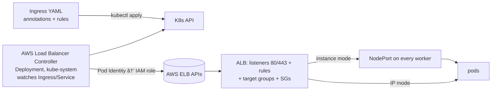

# Section 11 — Kubernetes Ingress (AWS Load Balancer Controller, HTTP → HTTPS)

> Transcript: `13) Ingress` · ~1h42m · Repo: [`../devops-real-world-project-implementation-on-aws/11_Kubernetes_Ingress/`](../devops-real-world-project-implementation-on-aws/11_Kubernetes_Ingress/) (demos `1101`–`1103`)

## 1. Objective

Expose the **whole retail store to the internet**: install the **AWS Load Balancer Controller** (via Helm + Pod Identity), understand **NodePort** (the prerequisite), deploy Ingress in **instance mode AND IP mode** side-by-side, then add **HTTPS** with an ACM certificate, Route 53 alias, and automatic HTTP→HTTPS redirect.

## 2. Problem Statement

Everything so far is reached via `kubectl port-forward` — fine for testing, useless for users: the app is unreachable from the internet. Production needs a public entry point with real routing (paths, hostnames, headers), TLS, and health checks — declared in YAML, not clicked together in the console.

## 3. Why This Approach

| Concept | Mapping / choice | Why |
|---|---|---|
| **Ingress = ALB** | K8s Ingress ⇒ AWS **Application** Load Balancer (L7/HTTP) | path/host/header routing, TLS termination — "everything ALB can do, Ingress YAML can express" |
| Service `type: LoadBalancer` = NLB | L4/TCP | when you just need a raw TCP LB — not this section's focus |
| **AWS Load Balancer Controller** | the bridge: watches Ingress/Service objects → provisions/updates/deletes ALBs+target groups+listeners+rules | "no manual setup, no console clicks"; keeps ALB ⇄ Ingress in sync |
| Auth for the controller | **Pod Identity** (reuse #2) | same trust-policy→role→association pattern as S09/S10 |
| NodePort — why learn it | not production (private node IPs here; static ports; SG exposure) | because **Ingress instance mode depends on it** |
| **instance mode** | ALB → node's NodePort → pod (extra hop) | default; targets = the 3 worker nodes |
| **IP mode** | ALB → **pod IP directly** (needs the AWS VPC CNI — default on EKS) | fewer hops → better under heavy traffic; targets = pod IPs |
| Demo app simplification | back to *basic* catalog (no EBS/RDS/SecretsMgr) but **all five microservices** | isolate the new concept (fronting with an LB); everything else is S08 knowledge repeated ×5 |

> 🐛 ASR NOTE: "ozone layer four/seven" = **OSI layer 4/7**; "Alb/amb" = ALB. Normalized throughout.

## 4. How It Works — Under the Hood

### The controller loop



```
edit/delete the Ingress → controller reconciles the ALB to match. Always in sync.
one target group per Kubernetes Service referenced in the Ingress.
```

### NodePort — the enabler for instance mode

```
user → workerNodeIP:30006 ──▶ Service port 80 ──▶ targetPort http (container 8080)
NodePort range 30000–32767, SAME static port opened on EVERY node (auto-assigned if unset)
limits: node IPs here are PRIVATE (no internet anyway); one port per service; SG exposure → not prod
targetPort can be a NUMBER (8080) or the container port's NAME ("http" from the deployment)
```

### Instance vs IP mode — the request path

```
INSTANCE (default):  user → ALB → nodeIP:nodePort → pod       targets = 3 worker instances
IP:                  user → ALB ───────────────────→ pod IP    targets = pod IPs (VPC CNI required —
                                                               default on EKS: the aws-node DaemonSet)
fewer hops in IP mode ⇒ bandwidth/performance win at scale
PROOF in the console: instance TG lists the 3 instance IDs + a 3xxxx port; IP TG lists the UI pod's IP
```

### Ingress anatomy (annotations do ALL the ALB config)

| Annotation (`alb.ingress.kubernetes.io/…`) | Controls |
|---|---|
| `load-balancer-name` | ALB's name in EC2 |
| `scheme: internet-facing \| internal` | public subnets vs internal-only (via the S07 subnet tags!) |
| `target-type: instance \| ip` | the two modes |
| `healthcheck-protocol/-port/-path` (`/actuator/health/readiness`) | ALB health checks |
| `listen-ports: '[{"HTTP":80},{"HTTPS":443}]'` | listeners (80 is default if omitted) |
| `certificate-arn: <ACM arn>` | TLS cert on the 443 listener |
| `ssl-redirect: '443'` | auto HTTP→HTTPS redirect |
| spec: `ingressClassName: alb`; `defaultBackend.service` (name+port) | which controller; where unmatched traffic goes (here: UI service — internal calls fan out from UI via its ConfigMap endpoints) |

### Vocabulary map

| Term | Plain English |
|---|---|
| Ingress resource vs controller | the YAML rules vs the pod that acts on them (rules do nothing alone!) |
| Target group | ALB's backend set — one per referenced Service |
| Listener | the ALB port (80/443) accepting traffic |
| ACM | AWS Certificate Manager — free public TLS certs, DNS-validated |
| Route 53 alias record | domain → ALB DNS mapping |
| `ingressClassName: alb` | selects the AWS LBC (check `kubectl get ingressclass`) |

## 5. Instructor's Approach

1. **Whiteboard first**: ALB=Ingress / NLB=Service-LB, L7 vs L4, then the three routing types (path `/app1`, hostname `app1.mydns.com`, header-based) — the *capability map* before any install.
2. **NodePort taught explicitly as a stepping stone** — "not production, but instance mode depends on it."
3. **Install = the S09/S10 PIA ritual, third time**: download AWS's official IAM policy JSON → create policy → trust policy → role → attach → association (`kube-system`/`aws-lb-controller service account`) → **helm install** with `clusterName`, `region`, `vpcId`, `serviceAccount.create=true`, name = default `aws-load-balancer-controller` ("keep defaults, avoid future troubleshooting").
4. **Deploys BOTH modes at once** and walks the console proof: instance TG = 3 node IDs + dynamic 3xxxx port; IP TG = the UI pod's IP (`kubectl get pods -o wide` cross-check) — even hits a console-cache blip and re-verifies rather than hand-waving.
5. **Back-to-basics app bundle on purpose**: five microservices with plain in-cluster stores; "review 02–05 folders yourself — same concepts you already know from catalog."
6. **HTTPS demo with a cost disclaimer**: don't buy a domain just for this — watch the demo. ACM request → DNS-validate via "Create records in Route 53" → cert ARN into the annotation → alias record → verify padlock + auto-redirect. Then the deliberate error: hitting the IP-mode ALB **by its raw DNS name** throws a cert mismatch (CN ≠ hostname) — teaching that certs bind to *names*, not LBs.
7. **Troubleshooting pointer he repeats**: if an Ingress never gets an ALB — read the **controller pod logs** in kube-system.
8. Cleanup order: delete Ingress **first** (controller deletes ALBs), then record + cert.

## 6. Code & Commands, Line by Line

### 1101 — install the AWS Load Balancer Controller

```bash
export AWS_REGION=us-east-1 EKS_CLUSTER=retail-dev-eksdemo1 ACCOUNT_ID=$(aws sts get-caller-identity --query Account --output text)

# â‘  official policy (big JSON of ELB/EC2/ACM/WAF permissions):
curl -o aws-lb-controller-policy.json \
  https://raw.githubusercontent.com/kubernetes-sigs/aws-load-balancer-controller/main/docs/install/iam_policy.json
aws iam create-policy --policy-name AWSLoadBalancerControllerIAMPolicy_${EKS_CLUSTER} \
  --policy-document file://aws-lb-controller-policy.json
# ② trust policy (pods.eks.amazonaws.com — same as S09/S10) → role → attach:
aws iam create-role --role-name AmazonEKS_LBC_Role_${EKS_CLUSTER} --assume-role-policy-document file://trust-policy.json
aws iam attach-role-policy --role-name AmazonEKS_LBC_Role_${EKS_CLUSTER} \
  --policy-arn arn:aws:iam::${ACCOUNT_ID}:policy/AWSLoadBalancerControllerIAMPolicy_${EKS_CLUSTER}
# ③ association — SA name is the chart's DEFAULT:
aws eks create-pod-identity-association --cluster-name $EKS_CLUSTER \
  --namespace kube-system --service-account aws-load-balancer-controller \
  --role-arn arn:aws:iam::${ACCOUNT_ID}:role/AmazonEKS_LBC_Role_${EKS_CLUSTER}
# â‘£ helm install:
helm repo add eks https://aws.github.io/eks-charts && helm repo update
VPC_ID=$(aws eks describe-cluster --name $EKS_CLUSTER --query "cluster.resourcesVpcConfig.vpcId" --output text)
helm install aws-load-balancer-controller eks/aws-load-balancer-controller -n kube-system \
  --set clusterName=$EKS_CLUSTER --set region=$AWS_REGION --set vpcId=$VPC_ID \
  --set serviceAccount.create=true --set serviceAccount.name=aws-load-balancer-controller
helm list -n kube-system                          # alongside csi + ascp releases
kubectl get deploy,pods -n kube-system | grep aws-load-balancer
kubectl logs -f -n kube-system <lbc-pod>          # THE debug surface for all Ingress problems
```

### 1102 — HTTP Ingress, both modes (full 5-service app)

App bundle `HTTP-retail-store-k8s-manifests/`: folders 01–05 = catalog / carts(+DynamoDB-local) / checkout(+Redis) / orders(+PostgreSQL+RabbitMQ) / UI — each just SA+CM(+Secret)+Deployment/STS+ClusterIP; UI's ConfigMap holds the four endpoint URLs. Folder 06 = the new pieces:

```yaml
# ui-nodeport service (for INSTANCE mode):
apiVersion: v1
kind: Service
metadata: { name: ui-nodeport }
spec:
  type: NodePort
  selector: { app.kubernetes.io/name: ui }
  ports: [{ port: 80, targetPort: http }]      # http = the container port's NAME; nodePort auto-assigned
---
# Ingress — INSTANCE mode:
apiVersion: networking.k8s.io/v1
kind: Ingress
metadata:
  name: retailstore-http-instancemode
  annotations:
    alb.ingress.kubernetes.io/load-balancer-name: retailstore-http-instancemode
    alb.ingress.kubernetes.io/scheme: internet-facing        # → public subnets (S07 tags!)
    alb.ingress.kubernetes.io/target-type: instance          # nodes as targets
    alb.ingress.kubernetes.io/healthcheck-protocol: HTTP
    alb.ingress.kubernetes.io/healthcheck-port: traffic-port
    alb.ingress.kubernetes.io/healthcheck-path: /actuator/health/readiness
spec:
  ingressClassName: alb
  defaultBackend: { service: { name: ui-nodeport, port: { number: 80 } } }
---
# Ingress — IP mode: same but target-type: ip and defaultBackend service = ui (the CLUSTERIP svc)
```
```bash
kubectl apply -R -f HTTP-retail-store-k8s-manifests/     # -R recurses the folders
kubectl get deploy,sts,svc,cm,sa,secrets,pods            # everything from the 5 apps
kubectl get ingress                                       # both, each with an ALB DNS name
# EC2 console: two ALBs provisioning→active; listeners HTTP:80 (default); public subnets confirmed
# Target groups: instance TG = 3 instance IDs : <nodePort>;  IP TG = UI pod IP (kubectl get pods -o wide)
# browse BOTH DNS names: full purchase flow works; /topology all healthy
kubectl delete -R -f HTTP-retail-store-k8s-manifests/    # cleanup before 1103
```

### 1103 — HTTPS

```bash
# prerequisite: a Route 53 registered domain + hosted zone (watch-only if you don't own one!)
# ① ACM: Request public cert → retailstore.stacksimplify.com → DNS validation
#        → "Create records in Route 53" → status Issued (minutes if the zone is ready)
# ② the ONLY manifest change — three annotations on both Ingresses:
#    alb.ingress.kubernetes.io/listen-ports: '[{"HTTP": 80}, {"HTTPS": 443}]'
#    alb.ingress.kubernetes.io/certificate-arn: arn:aws:acm:us-east-1:<acct>:certificate/<id>
#    alb.ingress.kubernetes.io/ssl-redirect: '443'      # HTTP auto-redirects to HTTPS
kubectl apply -R -f HTTPS-retail-store-k8s-manifests/
# ③ Route 53 → hosted zone → Create record: retailstore → Alias → ALB (instance mode) → us-east-1
nslookup retailstore.stacksimplify.com          # resolves to the ALB
# browse https://retailstore.stacksimplify.com → padlock ✓, cert = ACM cert, http:// auto-redirects ✓
# hitting the OTHER ALB by its RAW DNS name → cert-mismatch warning (CN ≠ hostname) — expected lesson
# 🧹 delete ingresses (waits for ALB teardown) → delete the Route 53 record → delete the ACM cert
```

## 7. Complete Code Reference

```bash
# 1101: policy(json) → role(trust) → attach → PIA(kube-system/aws-load-balancer-controller) → helm install eks/aws-load-balancer-controller
# 1102: kubectl apply -R -f HTTP-…/ → get ingress → verify 2 ALBs + TG membership → browse → delete -R
# 1103: ACM cert(DNS-validated) → 3 SSL annotations → apply -R → Route53 alias → verify padlock/redirect → cleanup
```
Manifests: repo `11_Kubernetes_Ingress/1101…1103/`. Annotation catalog: the AWS LBC docs "Ingress annotations" page.

## 8. Hands-On Labs

> 💰 **Cost warning:** each ALB ≈ **$0.0225/hr + LCUs** (two run in these demos) + the EKS cluster. ACM certs are free; Route 53 hosted zone $0.50/mo; **domain purchase NOT required** (instructor: watch the HTTPS demo if you don't own one). **Delete Ingress objects to delete ALBs.**
> 🆓 Local variant: kind + ingress-nginx exercises the Ingress *resource* concepts (class, backends, paths) free — but the LBC/ALB/ACM behavior is AWS-only.

### Lab A — Reproduce: controller + dual-mode HTTP + HTTPS
- **Prerequisites:** S07 cluster; helm; (optional) a Route 53 domain.
- **Steps:** §6 in order.
- **Expected output:** two working ALBs with correct target types; padlocked domain with auto-redirect.
- **Verify:** instance TG shows 3 nodes:nodePort; IP TG shows the UI pod IP; LBC logs clean.
- 🧹 delete ingresses → confirm ALBs gone in EC2 → record + cert → (day's end) EKS+VPC.

### Lab B — Variation: path-based routing
- **Steps:** replace `defaultBackend` with rules: `path: /catalog → catalog svc:8080`, default → ui. Apply; check the ALB's **Rules** tab mirrors your YAML; edit a path and watch the controller reconcile.
- **Verify:** `curl <alb-dns>/catalog/products` bypasses the UI.
- 🧹 as Lab A.

### Lab C — Break it and fix it
1. **No controller** (fresh cluster, skip 1101): apply the Ingress → no ALB, no ADDRESS on `kubectl get ingress`. **Confirm:** nothing to log — the resource is inert without its controller. **Fix:** install 1101.
2. **Missing subnet tags** (untag public subnets): Ingress applies but ALB creation fails. **Confirm:** LBC pod logs — subnet discovery error. **Fix:** restore `kubernetes.io/role/elb=1` tags (S07 c5).
3. **Cert/name mismatch:** browse the ALB's raw DNS while the cert is for `retailstore.…` → browser warning. **Lesson:** TLS binds to hostnames; always enter via the Route 53 name. **Fix:** use the domain (or add a SAN).
4. **Wrong SA name at install** (`--set serviceAccount.name=custom`): association targets the default name → controller gets no credentials → ALB creation AccessDenied in logs. **Fix:** keep defaults, or re-point the association.
- 🧹 as Lab A.

## 9. Troubleshooting

| Symptom | Likely cause | Command to confirm | Fix |
|---|---|---|---|
| Ingress has no ADDRESS | controller not installed / crashed | `kubectl get pods -n kube-system \| grep lb` | install/restart 1101 |
| ALB creation errors | PIA/IAM broken | `kubectl logs -n kube-system <lbc-pod>` — AccessDenied | role/policy/association per 1101 |
| "couldn't auto-discover subnets" | missing kubernetes.io subnet tags | LBC logs | S07 c5 tags |
| Targets unhealthy | wrong healthcheck path/port | TG health tab; annotation values | `/actuator/health/readiness`, traffic-port |
| Works via port-forward, 504 via ALB | instance mode without the NodePort svc / selector mismatch | `kubectl get svc ui-nodeport`; endpoints | create/fix the NodePort service |
| Cert warning in browser | hostname ≠ cert CN/SAN | inspect cert in browser | access via the Route 53 alias name |
| HTTP not redirecting | `ssl-redirect` annotation missing/typo | ALB listener rules | add `ssl-redirect: '443'` |
| Ingress delete hangs | ALB teardown in progress | EC2 LB console | wait; never orphan ALBs by force-deleting finalizers |
| IP mode targets empty | VPC CNI missing (non-EKS) | `kubectl get ds aws-node -n kube-system` | present by default on EKS; else install |

## 10. Interview Articulation

**90-second explanation:**
> "On EKS, a Kubernetes Ingress materializes as an AWS Application Load Balancer — but only because the AWS Load Balancer Controller is watching: it reconciles Ingress objects into ALBs, listeners, rules, and target groups, and keeps them in sync on every edit. It authenticates with Pod Identity — the same role-association pattern as the CSI drivers. All ALB configuration lives in annotations: scheme internet-facing or internal, health-check paths, listen ports, the ACM certificate ARN, and SSL redirect. The key design choice is target type: *instance mode*, the default, routes ALB → each node's NodePort → pod, which is why NodePort matters even though it's not production-grade by itself; *IP mode* registers pod IPs directly as targets via the VPC CNI — one less hop, better at high traffic. You can verify it in the console: instance target groups list your worker nodes on a 30000-range port, IP target groups list pod IPs. HTTPS is three annotations plus a DNS-validated ACM cert and a Route 53 alias — and the classic gotcha is hitting the ALB by its raw DNS name and getting a cert mismatch, because TLS binds to hostnames."

<details>
<summary>5 self-test questions</summary>

1. **Ingress resource vs Ingress controller?** — the resource is declarative rules; the controller (AWS LBC) is the pod that turns them into a real ALB. Without the controller the resource does nothing.
2. **Instance mode vs IP mode paths + prerequisites?** — ALB→nodePort→pod (needs a NodePort service) vs ALB→pod IP (needs the AWS VPC CNI); IP mode saves a hop.
3. **How does the ALB know which subnets to use?** — `scheme` annotation + the `kubernetes.io/role/elb` / `internal-elb` subnet tags from S07.
4. **How many target groups get created?** — one per Kubernetes Service referenced in the Ingress.
5. **The three annotations that turn HTTP into HTTPS-with-redirect?** — `listen-ports` (adding 443), `certificate-arn` (ACM), `ssl-redirect: '443'`.

</details>

---
### Related sections
[07 — TF EKS](07-terraform-eks-cluster.md) (the subnet tags used here) · [09 — Secrets](09-kubernetes-secrets.md) (PIA pattern) · [13 — TF Add-Ons](13-terraform-eks-addons.md) (LBC install automated) · [15/16 — ExternalDNS](15-terraform-eks-externaldns.md) (Route 53 records automated)
