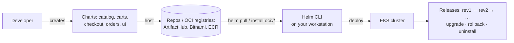

# Section 12 — Helm Package Manager (Basics → Custom Values → Chart Anatomy → Package & Publish)

> Transcript: `14) Helm` · ~2.5h · Repo: [`../devops-real-world-project-implementation-on-aws/12_Helm/`](../devops-real-world-project-implementation-on-aws/12_Helm/) (demos `1201`–`1205`)
> ⚠️ GAP: the curriculum's final sub-module ("Helm Retail Store Deployment — catalog/carts/checkout/orders/UI charts, ~61 min") is **not** in transcript `14)`; its content is folded into transcript `15)` / repo `1205` — the full-app Helm deployment is additionally covered by [S19](19-helm-retailstore-dataplane.md). Use repo folder `12_Helm/1205…` for those manifests.

## 0. 🧭 Beginner Follow-Along Guide (start here)

> Read this guide first; dive into the numbered sections after — it takes one small app (the store's UI) through Helm's whole life: install, upgrade, roll back, uninstall, then modify and publish your own chart version.
> Tags used below: **[Terminal]** = your Ubuntu laptop's shell · **[Editor]** = editing values-ui.yaml / chart files (VS Code) · **[AWS Console]** = console.aws.amazon.com in the browser · **[Browser]** = the retail-store UI (localhost:3080 or the ALB URL).

### 📊 The whole section at a glance — components & workflow

*Read top to bottom; boxes are components, arrows are the flow (the same shape as your terminal→shell→fork diagram).*

```
┌──────────────────────────────────────────────────────────────────────┐
│       CHART  (templates + values.yaml)  ◄── OCI registry (ECR)       │
│                                                                      │
│ helm pull / install oci://…                                          │
└──────────────────────────────────────────────────────────────────────┘
                                    │  helm install/upgrade -f values-ui.yaml
                                    ▼
┌──────────────────────────────────────────────────────────────────────┐
│        HELM  (merges values < -f < --set → renders templates)        │
│                                                                      │
│ values.yaml  <  custom file  <  --set   (last wins)                  │
└──────────────────────────────────────────────────────────────────────┘
                                    │  applies plain K8s YAML
                                    ▼
┌──────────────────────────────────────────────────────────────────────┐
│                RELEASE 'ui'  →  revisions 1 → 2 → 3 …                │
│                                                                      │
│ helm upgrade (rev++) · rollback · uninstall · helm status            │
│ ⚠ values-only change bumps revision but NEEDS rollout restart        │
└──────────────────────────────────────────────────────────────────────┘
                                    │  helm package + push
                                    ▼
┌──────────────────────────────────────────────────────────────────────┐
│              YOUR chart in private ECR  (version 1.3.1)              │
│                                                                      │
│ chart version ≠ image tag                                            │
└──────────────────────────────────────────────────────────────────────┘
```

### Where you are in the course

```
S11 Ingress (ALB controller) ──▶ THIS: S12 Helm on the ui chart ──▶ S13 Terraform EKS (full-app Helm returns in S19)
```

**Must already exist/be running:**
- [ ] An EKS cluster with `kubectl` pointing at it (runs throughout; demo 1203 alone is fully offline — no cluster needed)
- [ ] Section 11's Load Balancer Controller installed — check: `kubectl get deploy -n kube-system aws-load-balancer-controller`
- [ ] `helm` and the AWS CLI installed and configured on your laptop

### Words you'll meet (plain English)

| Word | Plain meaning |
|---|---|
| chart | the app as a package: YAML templates + a default settings file |
| release | one installed copy of a chart, under a name you pick (`ui`) |
| revision | a numbered history entry — every install/upgrade/rollback adds one |
| values file (`-f values-ui.yaml`) | your settings; `--set` beats the file, the file beats chart defaults |
| OCI registry | a Docker-style registry (ECR here) that also stores charts; needs `helm registry login` first |
| `helm template` / `--dry-run --debug` | print the final YAML without touching the cluster |
| `helm status <rel> --show-resources` | the gold-standard "what did this release create" command |
| chart version vs image tag | two different numbers — chart 1.3.1 still runs image 1.3.0 here |

### The simplified play-by-play (do this → see that)

1. **[Terminal]** Log Helm into AWS public ECR: `aws ecr-public get-login-password --region us-east-1 | helm registry login --username AWS --password-stdin public.ecr.aws` → you should see: `Login Succeeded` *(deep dive: §6 1201)*
2. **[Terminal]** Install: `helm install ui oci://public.ecr.aws/aws-containers/retail-store-sample-ui-chart --version 1.0.0` → you should see: `helm list` shows release `ui` at REVISION 1
3. **[Terminal] + [Browser]** `kubectl port-forward svc/ui 3080:80` → open http://localhost:3080 → the store loads; `/topology` shows no downstream services (standalone UI = the whole demo app in-memory)
4. **[Terminal]** Upgrade: `helm upgrade ui oci://…retail-store-sample-ui-chart --version 1.2.4 --set app.theme=orange` → `helm history ui`: rev1 `superseded`, rev2 `deployed`; refresh the browser → orange theme
5. **[Terminal]** Roll back: `helm rollback ui 1` → you should see: rev3 appears in history, theme back to default
6. ⚠️ **The trap:** a values-only upgrade (`--set app.theme=green`) bumps the revision but does **not** restart the pod — the browser never changes until `kubectl rollout restart deploy/ui`. Then `helm uninstall ui` *(deep dive: §6 1201, §9)*
7. **[Editor]** Create `values-ui.yaml`: theme `teal`, `ingress.enabled: true` + the three alb annotations — copy the block from §6 1202
8. **[Terminal]** Preview first, always: `helm install ui oci://… --version 1.3.0 -f values-ui.yaml --dry-run --debug | less` → you should see: merged values + every rendered manifest (incl. the Ingress), cluster untouched
9. **[Terminal]** Install for real with `-f values-ui.yaml`, then `helm status ui --show-resources` → svc, deploy, pod, **ingress**, sa, cm — all owned by this release; `kubectl get ingress` → an ALB DNS name → **[Browser]** the teal app via the ALB *(deep dive: §6 1202)*
10. **[Terminal]** Open the hood: `helm pull oci://public.ecr.aws/aws-containers/retail-store-sample-ui-chart --version 1.3.0 --untar` → `helm lint ui` → you should see: `1 chart(s) linted, 0 failed` *(anatomy: §4; deep dive: §6 1203)*
11. **[Editor]** Make it yours: bump `ui/Chart.yaml` `version:` 1.3.0 → 1.3.1, add the conditional `release-info.yaml` template from §6 1204, and set `image.tag: "1.3.0"` in your values — no 1.3.1 *image* exists (chart version ≠ image tag)
12. **[Terminal]** Package and publish to your private ECR (registry login + `aws ecr create-repository` first — §6 1204): `helm package ./ui` → `retail-store-sample-ui-chart-1.3.1.tgz` → `helm push retail-store-sample-ui-chart-1.3.1.tgz oci://$REGISTRY`
13. **[Terminal]** Consume your own chart: `helm install retail-ui oci://$REGISTRY/retail-store-sample-ui-chart --version 1.3.1 -f values-ui.yaml` → `kubectl get cm retail-ui-release-info -o yaml` → chartVersion `1.3.1` — your template worked

### ✅ Done-check

- [ ] `helm history ui` told the story: install → upgrade → rollback as revisions 1 → 2 → 3
- [ ] The green-theme upgrade changed nothing in the browser **until** `kubectl rollout restart deploy/ui`
- [ ] `helm status <rel> --show-resources` listed the Ingress among the release's resources (1202)
- [ ] `helm lint ui` → `1 chart(s) linted, 0 failed`
- [ ] `kubectl get cm retail-ui-release-info -o yaml` → chartVersion 1.3.1

🧹 **Teardown before you stop:** `helm uninstall` every release you created (`ui`, `ui-local`, `retail-ui`) → **[AWS Console]** EC2 → Load Balancers shows none left (and `kubectl get ingress` is empty) → delete the demo ECR repo.
💰 If forgotten: any ingress-enabled release keeps an **ALB** billing hourly ("ingress = ALB = surprise bill"), the private **ECR repo** bills for storage, and the EKS cluster itself bills while it runs.

---

## 1. Objective

Master Helm end-to-end on the retail UI chart: **install/upgrade/rollback/uninstall** from an OCI registry, **override values** (three ways + precedence), **read a chart like source code** (templates, values, helpers, hooks), **lint/template/dry-run/test** without touching the cluster, and finally **modify → repackage → publish** your own chart version to a private ECR.

## 2. Problem Statement

Raw `kubectl apply` on N YAML files per app × M environments means hand-editing manifests (replicas 2 in dev, 100 in prod), no version history, no one-command rollback, no packaging/sharing. Helm turns an app into a **chart** (templates + values), each install into a versioned **release**, and each config difference into a values override.

## 3. Why This Approach

| Need | Without Helm | With Helm |
|---|---|---|
| Per-env config | edit YAMLs by hand | one chart + `values-dev/qa/prod.yaml` |
| History/undo | none | releases + revisions; `helm rollback` restores *everything* |
| Distribution | copy YAML folders | charts in repositories / **OCI registries** (ECR, GHCR, Docker Hub) |
| Install complexity | many applies in order | one `helm install` |
| Preview before deploy | apply and pray | `helm template` / `--dry-run --debug` render locally |
| Chart source | build from scratch | **pull & modify** the existing UI chart — the real-world path |

**OCI registries**: standardized (Open Container Initiative) registries that hold container images *and* Helm charts vendor-neutrally — the retail charts live in **AWS public ECR** as OCI charts, so we `helm install oci://…` directly instead of `repo add`.

## 4. How It Works — Under the Hood

### The Helm workflow (5 stages)



### Chart anatomy (what `helm pull --untar` reveals)

```
ui/
├── Chart.yaml          # metadata: name, version (CHART version), appVersion, deps
│                       #   ~ the chart's package.json / setup.py
├── values.yaml         # DEFAULT config every template reads
├── .helmignore         # like .gitignore — excluded from the packaged .tgz
└── templates/
    ├── _helpers.tpl    # named template FUNCTIONS (ui.fullname, ui.labels…)
    ├── deployment.yaml # image: "{{ .Values.image.repository }}:{{ .Values.image.tag | default .Chart.Version }}"
    ├── configmap.yaml · service.yaml · serviceaccount.yaml · ingress.yaml · hpa.yaml · pdb.yaml · istio-*.yaml
    ├── NOTES.txt       # the friendly post-install message (templated!)
    └── tests/test-connection.yaml   # `helm test` pod: wget the app's health URL
```

### Rendering — how a template becomes a manifest

```
helm install/upgrade/template
  → merge values:  chart values.yaml  <  -f custom.yaml  <  --set k=v   (LAST/HIGHEST WINS)
  → render Go templates: {{ .Values.x }} from merged values
                         {{ include "ui.fullname" . }} from _helpers.tpl
                         built-in objects: .Chart .Release .Values .Capabilities .Files
  → plain Kubernetes YAML → applied → recorded as a numbered RELEASE REVISION
```

### Vocabulary map

| Term | Plain English |
|---|---|
| chart / release / revision | package / an installed instance / its version history entry |
| `values.yaml` vs `-f` vs `--set` | defaults < file override < inline override |
| `helm template` | render locally, cluster untouched |
| `--dry-run --debug` | render + show merged values *through the server path* |
| `helm lint` | chart syntax validation ("Terraform validate for charts") |
| `helm test` | run the chart's test pods against a live release |
| `helm status <rel> --show-resources` | **the gold-standard command** — every K8s resource this release owns |
| `.Chart.Version` vs `appVersion` vs image tag | chart's own version / app version metadata / the Docker tag — three different numbers! |
| `helm package` / `helm push` | fold the chart dir into `name-version.tgz` / upload to an OCI registry |

## 5. Instructor's Approach

1. **Four escalating demos**: 1201 lifecycle basics → 1202 custom values + Ingress → 1203 read the chart's internals → 1204 modify/package/publish. Consume → configure → understand → produce.
2. **The theme trick as the visible diff**: every upgrade/rollback/values change flips the UI color (default→orange→teal→green) — you *see* releases working.
3. **Two lessons he repeatedly hammers**: (a) **config-only changes don't restart pods** — a `--set app.theme=green` upgrade bumps the revision but the pod keeps the old env until `kubectl rollout restart deploy/ui` ("we go troubleshooting somewhere else instead of the real cause"); (b) **`helm status <rel> --show-resources` is the gold standard** for "what did this release create."
4. **Preview before deploy, always**: `helm show values/chart/readme` (peek without pulling) → `helm lint` → `helm template -f values-ui.yaml` → `--dry-run --debug | less`.
5. **Chart-version discipline** (1204): any change — even adding one template — requires bumping `Chart.yaml version` (1.3.0→1.3.1). And the honest note: this chart conflates chart version and image tag (no `appVersion`), so pushing chart 1.3.1 while the image is still 1.3.0 forces `image.tag: 1.3.0` in your values — "ideally they'd maintain appVersion separately."
6. **Conditional templates taught by building one**: `release-info.yaml` wrapped in `{{- if .Values.releaseInfo.enabled }}` — off by default in values.yaml, on in the custom file: the standard optional-feature pattern.
7. **Cost reflexes**: uninstall releases promptly ("ingress = ALB = surprise bill"), delete the demo ECR repo.

## 6. Code & Commands, Line by Line

### 1201 — Helm basics (OCI install → upgrade → rollback → uninstall)

```bash
# auth for AWS PUBLIC ECR (OCI charts):
aws ecr-public get-login-password --region us-east-1 | helm registry login --username AWS --password-stdin public.ecr.aws

helm install ui oci://public.ecr.aws/aws-containers/retail-store-sample-ui-chart --version 1.0.0
helm list [-n <ns>] [--output yaml]        # release, REVISION 1, chart+app versions, timestamp
kubectl get pods,deploy,svc,cm             # what the chart created (UI standalone = whole demo app in-memory)
kubectl port-forward svc/ui 3080:80        # browse; /topology shows no downstream services (none configured)

# upgrade: new chart version + a value override
helm upgrade ui oci://…retail-store-sample-ui-chart --version 1.2.4 --set app.theme=orange
helm history ui                            # rev1 superseded, rev2 deployed
helm get values ui                         # USER-SUPPLIED values only (app.theme: orange)
helm get values ui --all                   # + all defaults (computed values)
helm get manifest ui                       # the exact rendered YAML Kubernetes received

helm rollback ui 1                         # instant; helm history → rev3 = rollback (theme back to default)

# THE TRAP: config-only upgrade
helm upgrade ui … --version 1.3.0                       # version change → pod RESTARTS ✓
helm upgrade ui … --version 1.3.0 --set app.theme=green # rev bumps, but pod does NOT restart!
kubectl rollout restart deploy/ui                       # ← required for the env change to land
helm uninstall ui                          # removes every resource the chart created
```

### 1202 — Custom values + Ingress

```yaml
# values-ui.yaml (the custom file)
app: { theme: teal }
ingress:
  enabled: true                    # default values.yaml has false — the override flips the template on
  className: alb
  annotations:
    alb.ingress.kubernetes.io/scheme: internet-facing
    alb.ingress.kubernetes.io/target-type: ip                       # IP mode (S11)
    alb.ingress.kubernetes.io/healthcheck-path: /actuator/health/liveness
```
```bash
# precedence: --set  >  -f file  >  chart values.yaml
helm show values oci://…retail-store-sample-ui-chart --version 1.3.0    # peek defaults w/o pulling
helm install ui oci://… --version 1.3.0 -f values-ui.yaml --dry-run --debug | less
#   → user-supplied vs computed values + EVERY rendered manifest (incl. the Ingress) — before touching the cluster
kubectl get deploy -n kube-system aws-load-balancer-controller          # prereq from S11!
helm install ui oci://… --version 1.3.0 -f values-ui.yaml
helm status ui --show-resources          # ★ svc, deploy, pod, INGRESS, sa, cm — all owned by this release
kubectl get ingress                      # ALB DNS; target group holds the POD IP (ip mode)
# browse → teal-themed app via the ALB. helm uninstall ui (kills the ALB too).
```

### 1203 — Chart exploration, lint, template, test

```bash
mkdir charts && cd charts
helm pull oci://public.ecr.aws/aws-containers/retail-store-sample-ui-chart --version 1.3.0 --untar
mv retail-store-sample-ui-chart ui && tree ui          # the anatomy in §4

helm lint ui                                # "1 chart(s) linted, 0 failed" — syntax/required values
helm template ui ./ui -f ../values-ui.yaml | less      # rendered manifests, NO cluster
#   edit theme in values-ui.yaml → re-template → watch the ConfigMap line change: pure local iteration
helm install ui-local ./ui -f ../retail-store-apps/values-ui.yaml       # install from LOCAL directory
helm status ui-local --show-resources
helm upgrade ui-local ./ui -f …            # value change → remember: rollout restart for env changes
helm test ui-local                         # runs templates/tests/test-connection.yaml → Phase: Succeeded
kubectl get pods                           # the test pod shows Completed
helm uninstall ui-local
```

Key template lines decoded (deployment.yaml):
```gotemplate
image: "{{ .Values.image.repository }}:{{ .Values.image.tag | default .Chart.Version }}"
#        from values.yaml            tag if set, ELSE the chart's own version (the 1204 gotcha!)
name: {{ include "ui.fullname" . }}          # calls the _helpers.tpl function
labels: {{- include "ui.labels" . | nindent 4 }}   # helper output, newline+indent 4
```

### 1204 — Modify → package → publish to private ECR

```bash
# ① pull + rename + BUMP THE CHART VERSION (any change requires it):
#    ui/Chart.yaml: version: 1.3.0 → 1.3.1
# ② new conditional template — ui/templates/release-info.yaml:
```
```gotemplate
{{- if .Values.releaseInfo.enabled }}          # render ONLY when enabled
apiVersion: v1
kind: ConfigMap
metadata:
  name: {{ include "ui.fullname" . }}-release-info
  labels: {{- include "ui.labels" . | nindent 4 }}
data:
  chartName:    {{ .Chart.Name }}              # built-in objects: .Chart / .Release /
  chartVersion: {{ .Chart.Version }}           #   .Values / .Capabilities / .Files
  appVersion:   {{ .Chart.AppVersion }}
  releaseName:  {{ .Release.Name }}
  namespace:    {{ .Release.Namespace }}
  revision:     "{{ .Release.Revision }}"
  releasedAt:   {{ now | date "2006-01-02T15:04:05Z07:00" }}
{{- end }}
```
```yaml
# ui/values.yaml:        releaseInfo: { enabled: false }   # off by default
# values-ui.yaml:        releaseInfo: { enabled: true }    # on for our install
#                        image: { tag: "1.3.0" }  # ★ no 1.3.1 IMAGE exists — chart ver ≠ image tag!
```
```bash
# ③ PRIVATE ECR + package + push:
export AWS_REGION=us-east-1 ACCOUNT_ID=$(aws sts get-caller-identity --query Account --output text)
export REGISTRY=${ACCOUNT_ID}.dkr.ecr.${AWS_REGION}.amazonaws.com
aws ecr get-login-password --region $AWS_REGION | helm registry login --username AWS --password-stdin $REGISTRY
aws ecr create-repository --repository-name retail-store-sample-ui-chart --region $AWS_REGION
helm package ./ui                                   # → retail-store-sample-ui-chart-1.3.1.tgz  (name-version from Chart.yaml)
helm push retail-store-sample-ui-chart-1.3.1.tgz oci://$REGISTRY   # repo name auto-matches the chart name
# ④ consume your own chart:
helm install retail-ui oci://$REGISTRY/retail-store-sample-ui-chart --version 1.3.1 -f values-ui.yaml
helm status retail-ui --show-resources             # note the NEW …-release-info ConfigMap
kubectl get cm retail-ui-release-info -o yaml      # chartVersion 1.3.1, revision, timestamp — the template worked
# 🧹 helm uninstall retail-ui ; verify the ALB is gone ; DELETE the ECR repo (it bills)
```

## 7. Complete Code Reference

```bash
# lifecycle
helm registry login … | helm install <rel> oci://<path> --version X [-f f.yaml] [--set k=v]
helm list / history <rel> / status <rel> --show-resources
helm upgrade <rel> <chart> --version Y [--set …]   ;  helm rollback <rel> [REV]
helm uninstall <rel>
# introspection
helm get values <rel> [--all] ; helm get manifest <rel>
helm show values|chart|readme <chart> --version X
# local dev
helm pull <oci> --version X --untar ; helm lint <dir> ; helm template <name> <dir> -f vals.yaml
helm install … --dry-run --debug | less ; helm test <rel>
# produce
helm package <dir> ; helm push <tgz> oci://<registry>
# the recurring fix
kubectl rollout restart deploy/<name>      # after config-only upgrades
```

## 8. Hands-On Labs

> 💰 1202/1204 create an **ALB** (uninstall promptly) + a private **ECR repo** (delete after). EKS cluster running throughout.
> 🆓 Local variant: 1203 (pull/lint/template/anatomy) is **fully offline** — no cluster at all. 1201 works on kind minus the ingress bits.

### Lab A — Reproduce: 1201 → 1204
- **Prerequisites:** S11's Load Balancer Controller installed; helm; AWS CLI.
- **Steps:** §6 in order; record each `helm history` state.
- **Expected output:** theme flips on cue; release-info ConfigMap materializes only from your 1.3.1 chart.
- **Verify:** `helm status <rel> --show-resources` at each step matches expectations.
- 🧹 uninstall releases, delete ECR repo, confirm ALBs gone.

### Lab B — Variation: environment values files
- **Steps:** create `values-dev.yaml` (theme green, ingress off) and `values-prod.yaml` (teal, ingress on); install two releases `ui-dev`/`ui-prod` from the same chart with different `-f` files; then `--set app.theme=orange` on one and confirm `--set` beat the file.
- **Verify:** `helm get values <rel>` per release shows exactly its overrides.
- 🧹 uninstall both.

### Lab C — Break it and fix it
1. **The no-restart trap:** upgrade with only `--set app.theme=…` → browser unchanged. **Confirm:** `kubectl get pods` age didn't reset; revision did bump. **Fix:** `kubectl rollout restart deploy/ui`.
2. **Push without version bump:** repackage 1.3.0 unchanged and push → registry conflict / consumers can't tell versions apart. **Fix:** always bump `Chart.yaml version` per change.
3. **The tag/version conflation:** install your 1.3.1 chart *without* `image.tag` override → pod `ImagePullBackOff` (image `…ui:1.3.1` doesn't exist — template defaults tag to `.Chart.Version`!). **Confirm:** `kubectl describe pod`. **Fix:** `image.tag: 1.3.0` in values.
4. **Ingress template with no controller:** enable ingress on a cluster without the LBC → release deploys, Ingress never gets an address. **Fix:** S11 install first.
- 🧹 as Lab A.

## 9. Troubleshooting

| Symptom | Likely cause | Command to confirm | Fix |
|---|---|---|---|
| `unauthorized` pulling OCI chart | no registry login (public vs private differ!) | error text | `aws ecr[-public] get-login-password … \| helm registry login …` |
| Upgrade "did nothing" | config-only change; pod not restarted | pod AGE vs `helm history` | `kubectl rollout restart deploy/<n>` |
| ImagePullBackOff after installing your chart | image tag defaulted to chart version | `describe pod` image ref | set `image.tag` in values |
| Don't know what a release created | — | `helm status <rel> --show-resources` | the gold standard |
| Values not what you expected | precedence misunderstood | `helm get values <rel> --all` | remember `--set` > `-f` > defaults |
| Chart errors before deploy | template/syntax bug | `helm lint <dir>`; `helm template … \| less` | fix locally, never debug in-cluster |
| `helm test` fails | app not ready / bad test URL | test pod logs | check readiness; fix tests/*.yaml |
| Bill surprise after demos | ALB from ingress-enabled release left running | EC2 → Load Balancers | `helm uninstall` (controller removes the ALB) |
| Push rejected / wrong repo | ECR repo name ≠ chart name | `aws ecr describe-repositories` | repo must match `Chart.yaml name` |

## 10. Interview Articulation

**90-second explanation:**
> "Helm is Kubernetes' package manager: a chart is templates plus a values file, an install is a release, and every change is a numbered revision you can roll back atomically. Values merge with clear precedence — chart defaults, then `-f` files, then `--set`, last wins — which is how one chart serves every environment. Charts today ship as OCI artifacts, so we `helm install oci://…` from ECR after a registry login. Inside a chart, templates are Go templating over built-in objects — `.Values`, `.Chart`, `.Release` — with shared naming functions in `_helpers.tpl`, and you can gate whole templates behind `{{ if .Values.feature.enabled }}` for optional features. My workflow is preview-first: `helm show values` to peek, `lint` to validate, `template` or `--dry-run --debug` to render locally, and `helm status --show-resources` to audit what a release owns. Two production gotchas: a values-only upgrade bumps the revision but does *not* restart pods — you need a rollout restart for env changes to land; and chart version and image tag are different numbers — the template defaults the tag to the chart version, so publishing chart 1.3.1 against image 1.3.0 requires an explicit tag override. Publishing itself is bump-version, `helm package`, `helm push` to ECR."

<details>
<summary>5 self-test questions</summary>

1. **Values precedence, and the command to see the final merge?** — `--set` > `-f file` > chart `values.yaml`; `helm get values <rel> --all`.
2. **You upgraded with `--set app.theme=green`; the UI didn't change — why?** — env/ConfigMap changes don't restart pods; `kubectl rollout restart deploy/ui`.
3. **Difference between `helm template` and `--dry-run --debug`?** — both render without deploying; dry-run goes through the install path and prints merged user-supplied + computed values with the manifests.
4. **What's in `_helpers.tpl` and how is it used?** — named template functions (`ui.fullname`, `ui.labels`) invoked with `{{ include "…" . }}` for consistent naming/labels across all templates.
5. **Why did the pushed 1.3.1 chart need `image.tag: 1.3.0`?** — the deployment template falls back to `.Chart.Version` for the tag; no 1.3.1 *image* exists — chart version ≠ app image version.

</details>

---
### Related sections
[09 — Secrets](09-kubernetes-secrets.md) (Helm's first appearance) · [11 — Ingress](11-kubernetes-ingress.md) (the LBC these charts assume) · [19 — Helm + AWS Data Plane](19-helm-retailstore-dataplane.md) (full-app charts, versioned v1→v2) · [21 — CI/CD](21-cicd-gitops.md) (ArgoCD deploying these charts)
