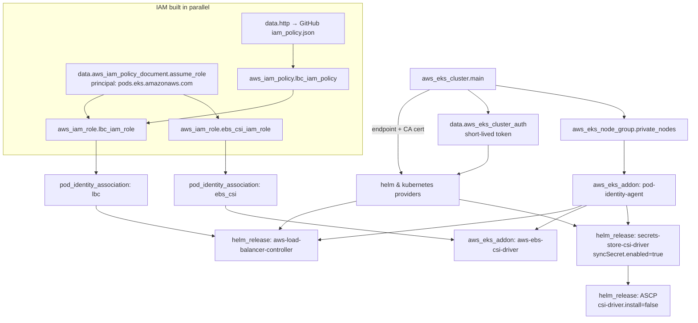

# Section 13 — Terraform EKS Cluster with Add-Ons (One-Command Platform)

> Source: transcript `15) Persistent Dataplane` (first half, ~lectures 1301–1306) + repo folder `13_Terraform_EKS_Cluster_with_AddOns/`.
> Builds directly on Section 07 (Terraform EKS cluster) — same VPC + EKS code, **plus 5 add-ons automated in Terraform** so you never run `helm install` or `aws eks create-addon` by hand again.

---

## 0. 🧭 Beginner Follow-Along Guide (start here)

> Read this guide first; dive into the numbered sections after. Tags: **[Terminal]** = your laptop's shell · **[Editor]** = VS Code on the .tf files · **[AWS Console]** = console.aws.amazon.com.
> The whole section is one idea: everything you installed BY HAND in S09–11 (add-ons, Helm charts, IAM) becomes code, so one `terraform apply` = a complete platform.

### 📊 The whole section at a glance — components & workflow

*Read top to bottom; boxes are components, arrows are the flow (the same shape as your terminal→shell→fork diagram).*

```
┌──────────────────────────────────────────────────────────────────────┐
│                ONE  terraform apply  (~33 resources)                 │
│                                                                      │
│ S07 cluster  +  everything you used to install by hand               │
└──────────────────────────────────────────────────────────────────────┘
                                    │  providers wired to the cluster it's creating
                                    ▼
┌──────────────────────────────────────────────────────────────────────┐
│                       EKS CLUSTER + NODE GROUP                       │
│                                                                      │
│ then, in dependency order:                                           │
└──────────────────────────────────────────────────────────────────────┘
                   │                 │               │
                   ▼                 ▼               ▼
            ┌─────────────┐  ┌───────────────┐  ┌─────────┐
            │  PIA agent  │  │      LBC      │  │ EBS CSI │
            │ (auth base) │  │ (Ingress→ALB) │  │ (disks) │
            └─────────────┘  └───────────────┘  └─────────┘

                         │                    │
                         ▼                    ▼
                ┌─────────────────┐   ┌───────────────┐
                │   Secrets CSI   │   │      ASCP     │
                │ syncSecret=true │   │ (Secrets Mgr) │
                └─────────────────┘   └───────────────┘

  rule: AWS managed add-on → aws_eks_addon ; else → helm_release
  depends_on REVERSES on destroy (LBC dies last → cleans up ALBs)
```

### Where you are in the course

```
S07 cluster (bare) + S09–11 manual add-on installs ─▶ THIS: S13 the same, AS CODE ─▶ S14 AWS data plane on top
```

**Must already exist/be running:**
```
[ ] S06 tfstate bucket
[ ] The S07 cluster DESTROYED first if still up (two clusters = double cost, and both use state keys vpc/dev + eks/dev)
[ ] Bucket name updated in THREE places before any init: 01_VPC/c1 (backend), 02_EKS/c1 (backend), 02_EKS/c3 (remote-state)
```

### Words you'll meet (plain English)

| Word | Plain meaning |
|---|---|
| add-on (EKS managed) | a cluster component AWS installs & patches for you (`aws_eks_addon`) |
| `helm_release` | Terraform acting as your Helm CLI — installs charts as code |
| Pod Identity Agent (PIA) | the in-cluster agent that hands pods their IAM credentials — everything else authenticates through it |
| Load Balancer Controller (LBC) | the pod that turns Ingress YAML into real ALBs |
| EBS CSI driver | the plugin that creates/attaches EBS disks for PVCs |
| Secrets Store CSI + ASCP | the plugin pair that mounts AWS Secrets Manager values into pods |
| `syncSecret.enabled=true` | the flag that ALSO mirrors mounted secrets into normal K8s Secrets — S14 depends on it |
| provider wiring | how Terraform authenticates Helm/kubectl against a cluster it's creating in the SAME apply |
| `depends_on` | explicit ordering — and it REVERSES on destroy (LBC dies last so it can clean up ALBs) |

### The simplified play-by-play (do this → see that)

1. **[Editor]** The ritual first: update the S3 **bucket name in all three files** (VPC c1, EKS c1, EKS c3). Skipping this is the #1 fresh-clone failure.
2. **[Terminal]** Apply the VPC project: `terraform init && terraform apply -auto-approve` in `01_VPC…`
   → **you should see:** the familiar 18 resources.
3. **[Editor]** Read the NEW files c11→c16 in order with §6 open — each maps to a manual step you did before: c11 PIA (was console clicks, S09) → c12 providers (Terraform's kubeconfig) → c13 ONE shared trust policy → c14 LBC in 4 files (was S11's 4 manual steps) → c15 EBS CSI (managed-addon path) → c16 Secrets CSI + ASCP with `syncSecret.enabled=true`.
   → **you should see:** the rule of thumb: AWS publishes it as managed add-on → `aws_eks_addon`; otherwise → `helm_release`. `(deep dive: §3)`
4. **[Terminal]** `terraform init && terraform validate && terraform plan` in `02_EKS…`
   → **you should see:** **~33 to add** (S07's 21 + the add-on layer).
5. **[Terminal]** `terraform apply` — ~15–20 min. 💰 Meter running from here.
   → **you should see:** cluster → nodes → PIA → IAM → LBC (waits until its pods are actually Ready — `wait=true`) → EBS CSI → Secrets CSI → ASCP, in dependency order. `(deep dive: §4 ASCII flow)`
6. **[Terminal]** Connect + verify the platform: `aws eks update-kubeconfig --name retail-dev-eksdemo1 --region us-east-1` then `kubectl get pods -n kube-system`
   → **you should see:** aws-load-balancer-controller, ebs-csi-controller, csi-secrets-store + ASCP pods, eks-pod-identity-agent DaemonSet — ALL Running, none of them installed by hand.
7. **[Terminal]** `aws eks list-pod-identity-associations --cluster-name retail-dev-eksdemo1`
   → **you should see:** associations for `aws-load-balancer-controller` and `ebs-csi-controller-sa` in kube-system — the IAM wiring, also code.
8. **[Terminal]** Note the wrapper scripts for later sections: `create-cluster.sh` / `destroy-cluster.sh` — from now on the course treats this whole platform as one create/destroy unit.

### ✅ Done-check

```
[ ] plan showed ~33 resources; apply completed in one shot
[ ] kube-system shows LBC + EBS CSI + Secrets CSI + ASCP + PIA all Running
[ ] two Pod Identity associations listed
[ ] you can state why syncSecret.enabled=true matters for S14
[ ] you know why the LBC helm_release has depends_on (nodes + PIA + association; and destroy-order for ALBs)
```

🧹 **Teardown before you stop:** if not continuing straight to S14: `terraform destroy` in `02_EKS…` then `01_VPC…` (or `destroy-cluster.sh`). The `depends_on` chain destroys the LBC BEFORE the cluster so it can deprovision any ALBs — never delete the cluster around it by hand. 💰 Left running ≈ $8–10/day; orphaned ALBs bill separately.

---

## 1. Objective

Extend the Section 07 Terraform EKS project so that **one `terraform apply` produces a fully production-ready cluster**: EKS + node group **and** Pod Identity Agent, AWS Load Balancer Controller, EBS CSI Driver, Secrets Store CSI Driver, and the AWS Secrets Provider (ASCP) — with all IAM roles, policies, and Pod Identity associations wired automatically (~33 resources total).

By the end you can:
- Install **EKS-managed add-ons** (`aws_eks_addon`) with automatic version discovery.
- Install **Helm charts from Terraform** (`helm_release`) by wiring the Helm/Kubernetes providers to a cluster *created in the same apply*.
- Fetch the LBC IAM policy **live from GitHub** with the `http` provider — no copy-pasted JSON.
- Control create **and destroy** ordering with `depends_on`.
- Enable the Secrets Store CSI Driver's **sync-to-Kubernetes-Secret** feature (`syncSecret.enabled=true`) — the foundation Section 14 depends on.

---

## 2. Problem Statement

In Sections 09–11 you installed everything **manually**, one component at a time:

| Component | How you installed it before | Section |
|---|---|---|
| Pod Identity Agent | AWS console → EKS → Add-ons → Create | 09 |
| Secrets Store CSI Driver + ASCP | Two `helm install` commands | 09 |
| EBS CSI Driver | Console add-on + manual IAM role | 10 |
| AWS Load Balancer Controller | `helm install` + manually created IAM policy/role/association | 11 |

That's ~30 minutes of clicking and typing **every time you create a cluster**, it's not reviewable in Git, it drifts, and teardown is error-prone (forget the LBC's leftover ALB → surprise bill). A real platform team needs *cluster + add-ons* to be **one idempotent, versioned unit**.

---

## 3. Why This Approach

Three ways to install cluster add-ons — the instructor deliberately uses **both** of the first two, choosing per component:

| | EKS Managed Add-on (`aws_eks_addon`) | Helm chart via Terraform (`helm_release`) | Manual (console / `helm` CLI) |
|---|---|---|---|
| Works for | Only AWS-curated add-ons (PIA, EBS CSI, VPC CNI, CoreDNS…) | Anything with a chart (LBC, CSI driver, ASCP…) | Anything |
| Version management | `aws_eks_addon_version` datasource picks compatible version automatically | You pin `version` (or take latest) | You remember |
| IAM wiring | `service_account_role_arn` built in | Separate `aws_eks_pod_identity_association` resource | By hand |
| Upgrades | `resolve_conflicts_on_update = "OVERWRITE"` | `terraform apply` with new version | By hand |
| In Git / reviewable | ✅ | ✅ | ❌ |
| Used here for | **Pod Identity Agent, EBS CSI** | **LBC, Secrets Store CSI, ASCP** | nothing (that's the point) |

Rule of thumb the course teaches: **if AWS publishes it as a managed add-on, use `aws_eks_addon`; otherwise `helm_release`.** (LBC exists as a preview managed add-on now, but the chart is the mature, configurable path — see 🔄 note in §6.)

---

## 4. How It Works — Under the Hood

### Vocabulary map

| AWS / Terraform term | Kubernetes equivalent | Plain English |
|---|---|---|
| `aws_eks_addon` | DaemonSet/Deployment managed by EKS | "AWS installs & patches this component for me" |
| `aws_eks_addon_version` datasource | — | "Ask AWS which add-on version fits my cluster version" |
| `helm_release` (TF resource) | `helm install/upgrade` | "Terraform is my Helm CLI" |
| Helm/Kubernetes **provider** | kubeconfig | "How Terraform authenticates to the cluster API" |
| `data.aws_eks_cluster_auth` | `aws eks get-token` | Short-lived bearer token for the cluster |
| `data.http` | `curl` | Fetch a URL at plan time (LBC IAM policy JSON) |
| Pod Identity association | ServiceAccount annotation (IRSA world) | "This SA gets that IAM role" |
| `resolve_conflicts_on_create = "OVERWRITE"` | `kubectl apply --force` (rough analogy) | "If a self-managed copy exists, take ownership" |

### The provider-wiring trick (the heart of this section)

Terraform creates the cluster **and** talks to it *in the same apply*. That works because provider configuration is evaluated lazily — by the time `helm_release` runs, `aws_eks_cluster.main.endpoint` is known:



### ASCII flow — what one `terraform apply` does, in order

```
terraform apply
 ├─ 1. VPC outputs read from remote state (vpc/dev/terraform.tfstate)
 ├─ 2. EKS cluster + IAM roles + node group        (same as Section 07)
 ├─ 3. eks-pod-identity-agent add-on               ← everything below authenticates through this
 ├─ 4. IAM: one shared assume-role doc (pods.eks.amazonaws.com)
 │      ├─ LBC policy (fetched from GitHub) + role + association (kube-system/aws-load-balancer-controller)
 │      └─ EBS CSI role (AWS-managed policy) + association (kube-system/ebs-csi-controller-sa)
 ├─ 5. helm_release: aws-load-balancer-controller  (waits until pods Ready, 10-min timeout)
 ├─ 6. aws_eks_addon: aws-ebs-csi-driver           (latest compatible version)
 ├─ 7. helm_release: secrets-store-csi-driver      (syncSecret.enabled=true, PIA token audience)
 └─ 8. helm_release: secrets-provider-aws (ASCP)   (csi-driver.install=false — driver already there)
      ≈ 33 resources, ~15–20 min wall clock
```

**Why one shared `assume_role` document?** Every Pod-Identity-consuming role (LBC, EBS CSI, and later the Section 14 data-plane roles) trusts the *same* principal `pods.eks.amazonaws.com` with `sts:AssumeRole` + `sts:TagSession`. Define the trust policy once as a datasource, reference it from every role. The *permissions* policies differ; the *trust* policy never does.

**Why `depends_on` matters twice:** Terraform derives most ordering from references, but `helm_release.loadbalancer_controller` has no code reference to the node group or the PIA add-on — without explicit `depends_on`, Helm could try to schedule LBC pods before nodes exist. And `depends_on` also reverses on **destroy**: Terraform destroys the Helm release *before* the node group and cluster, so the LBC can deprovision any ALBs while it's still alive. Miss this and `terraform destroy` orphans load balancers (💸).

---

## 5. Instructor's Approach

His sequence (and why it's the highest-value ordering):

1. **Recap the pain** — lists every manual step from Sections 09–11 you're about to delete. Motivation first.
2. **Copy Section 07's project wholesale** — VPC folder untouched, EKS folder gets new files `c11`–`c16`. Reinforces "extend working code, don't rewrite".
3. **c11 Pod Identity Agent first** — because *every* other add-on's IAM auth flows through it. He shows both the `default` and `latest` version datasources and prints both as outputs so you *see* the version-discovery mechanism.
4. **c12 providers next** — nothing Helm-based can install until Terraform can authenticate to the cluster. He stresses the token comes from `aws_eks_cluster_auth` (short-lived, never in state as a long-term secret).
5. **c13 shared trust policy** — extracted *before* any role that needs it, teaching DRY IAM.
6. **c14 LBC in 4 files** (policy datasource → policy+role → association → helm_release) — mirrors exactly the 4 manual steps from Section 11, so you can map old→new one-to-one.
7. **c15 EBS CSI** — shows the *managed add-on* path for contrast (AWS-managed policy `AmazonEBSCSIDriverPolicy`, `service_account_role_arn` argument).
8. **c16 Secrets CSI + ASCP** — two charts, and he calls out `syncSecret.enabled=true` as **new versus Section 09** ("this is what Section 14 needs").
9. **Apply, verify, and only then** point out the `create-cluster.sh` / `destroy-cluster.sh` wrapper scripts.
10. **Bucket-name discipline**: before any init, update the S3 state bucket name in **three places** — `01_VPC/c1-versions.tf` (backend), `02_EKS/c1_versions.tf` (backend), `02_EKS/c3_remote-state.tf` (VPC remote-state datasource). He also reminds you to **destroy the Section 07 cluster first** if it's still running — two clusters = double cost, and both projects share state keys `vpc/dev` and `eks/dev`.

> 🐛 **TRANSCRIPT ERRORS (ASR):** "Pia / PIA agent" = Pod Identity Agent; "terraform log dot HTML" = `.terraform.lock.hcl`; "helm underscore release" dictated with garbled block syntax — the repo files above are authoritative.

---

## 6. Code & Commands — Line by Line

### c11 — Pod Identity Agent add-on

```hcl
data "aws_eks_addon_version" "pia_latest" {
  addon_name         = "eks-pod-identity-agent"
  kubernetes_version = aws_eks_cluster.main.version  # ask: "what fits MY cluster version?"
  most_recent        = true                          # latest compatible, not default
}

resource "aws_eks_addon" "podidentity" {
  depends_on                  = [aws_eks_node_group.private_nodes]  # agent = DaemonSet → needs nodes
  cluster_name                = aws_eks_cluster.main.id
  addon_name                  = "eks-pod-identity-agent"
  resolve_conflicts_on_create = "OVERWRITE"   # take ownership if a copy already exists
  resolve_conflicts_on_update = "OVERWRITE"
  addon_version               = data.aws_eks_addon_version.pia_latest.version
}
```

- The `pia_default` twin datasource (without `most_recent`) exists purely to output/compare the *default* vs *latest* version — a teaching device you can keep or drop.
- The agent runs as a **DaemonSet in `kube-system`** exposing a link-local credential endpoint (`169.254.170.23`) that AWS SDKs inside pods hit automatically.

### c12 — Helm & Kubernetes providers

```hcl
data "aws_eks_cluster_auth" "cluster" {
  name = aws_eks_cluster.main.id      # generates a short-lived bearer token
}

provider "helm" {
  kubernetes = {                       # helm provider v3.x: this is a MAP (= {...}), not a block
    host                   = aws_eks_cluster.main.endpoint
    cluster_ca_certificate = base64decode(aws_eks_cluster.main.certificate_authority[0].data)
    token                  = data.aws_eks_cluster_auth.cluster.token
  }
}

provider "kubernetes" {
  host                   = aws_eks_cluster.main.endpoint
  cluster_ca_certificate = base64decode(aws_eks_cluster.main.certificate_authority[0].data)
  token                  = data.aws_eks_cluster_auth.cluster.token
}
```

> 🔄 **CURRENT PRACTICE:** In helm provider **v2.x** this was `kubernetes { ... }` (a block); **v3.x** (used here, `~> 3.1.0`) changed it to `kubernetes = { ... }` (an attribute). Same for `set = [ { name=..., value=... } ]` — v2 used repeated `set { }` blocks. If you copy older blog snippets against provider v3 you'll get syntax errors; this is one of the most common breakages.

### c13 — Shared Pod Identity trust policy

```hcl
data "aws_iam_policy_document" "assume_role" {
  statement {
    effect  = "Allow"
    principals {
      type        = "Service"
      identifiers = ["pods.eks.amazonaws.com"]   # THE Pod Identity principal (vs OIDC federated for IRSA)
    }
    actions = ["sts:AssumeRole", "sts:TagSession"]  # TagSession = required for Pod Identity
  }
}
```

### c14 — AWS Load Balancer Controller (4 files)

```hcl
# c14-01: fetch the official policy JSON at plan time — always current, never stale copy-paste
data "http" "lbc_iam_policy" {
  url             = "https://raw.githubusercontent.com/kubernetes-sigs/aws-load-balancer-controller/main/docs/install/iam_policy.json"
  request_headers = { Accept = "application/json" }
}

# c14-02: policy from the fetched JSON + role from the shared trust doc
resource "aws_iam_policy" "lbc_iam_policy" {
  name   = "${local.name}-AWSLoadBalancerControllerIAMPolicy"
  policy = data.http.lbc_iam_policy.response_body
}
resource "aws_iam_role" "lbc_iam_role" {
  name               = "${local.name}-lbc-iam-role"
  assume_role_policy = data.aws_iam_policy_document.assume_role.json
}
resource "aws_iam_role_policy_attachment" "lbc_iam_role_policy_attach" {
  policy_arn = aws_iam_policy.lbc_iam_policy.arn
  role       = aws_iam_role.lbc_iam_role.name
}

# c14-03: SA ↔ role mapping (replaces `aws eks create-pod-identity-association`)
resource "aws_eks_pod_identity_association" "lbc" {
  cluster_name    = aws_eks_cluster.main.name
  namespace       = "kube-system"
  service_account = "aws-load-balancer-controller"   # must match serviceAccount.name below EXACTLY
  role_arn        = aws_iam_role.lbc_iam_role.arn
}

# c14-04: the Helm install itself
resource "helm_release" "loadbalancer_controller" {
  depends_on = [
    aws_iam_role.lbc_iam_role,
    aws_eks_node_group.private_nodes,       # pods need nodes
    aws_eks_pod_identity_association.lbc,   # association BEFORE pod starts → creds available at boot
    aws_eks_addon.podidentity               # agent must be running
  ]
  name       = "aws-load-balancer-controller"
  repository = "https://aws.github.io/eks-charts"
  chart      = "aws-load-balancer-controller"
  namespace  = "kube-system"
  # version  = "1.13.0"   # pin in prod; unpinned = latest at apply time

  wait            = true    # block until pods Ready (turns "helm said OK" into "it actually runs")
  timeout         = 600     # seconds; default 300 is tight for LBC on small nodes
  cleanup_on_fail = true    # failed install → auto-rollback, no half-installed junk

  set = [
    { name = "serviceAccount.create", value = "true" },
    { name = "serviceAccount.name",   value = "aws-load-balancer-controller" },
    { name = "clusterName",           value = "${aws_eks_cluster.main.id}" },
    { name = "vpcId",                 value = "${data.terraform_remote_state.vpc.outputs.vpc_id}" },
    { name = "region",                value = "${var.aws_region}" }
  ]
}
```

Line-by-line rationale:
- **`data "http"`** — the LBC policy JSON is ~260 lines and changes with controller releases. Fetching from the canonical repo means `terraform apply` always installs a policy matching current controller expectations. Trade-off: plan now needs internet + GitHub availability (fine for a course; in prod many teams vendor the file).
- **`vpcId` and `region` sets** — the controller normally auto-discovers these from IMDS, but IMDSv2 hop limits on nodes can break that; passing them explicitly is the reliability fix (same lesson as Section 11).
- **`clusterName`** — mandatory; the controller tags/filters AWS resources by it.

### c15 — EBS CSI Driver (managed add-on path)

```hcl
resource "aws_iam_role" "ebs_csi_iam_role" {
  name               = "${local.name}-ebs-csi-iam-role"
  assume_role_policy = data.aws_iam_policy_document.assume_role.json   # same shared trust doc
}
resource "aws_iam_role_policy_attachment" "ebs_csi_managed_policy_attach" {
  policy_arn = "arn:aws:iam::aws:policy/service-role/AmazonEBSCSIDriverPolicy"  # AWS-managed — no JSON to write
  role       = aws_iam_role.ebs_csi_iam_role.name
}
resource "aws_eks_pod_identity_association" "ebs_csi" {
  cluster_name    = aws_eks_cluster.main.name
  namespace       = "kube-system"
  service_account = "ebs-csi-controller-sa"        # the add-on creates this SA with exactly this name
  role_arn        = aws_iam_role.ebs_csi_iam_role.arn
}

resource "aws_eks_addon" "ebs_csi" {
  depends_on = [aws_iam_role.ebs_csi_iam_role, aws_eks_pod_identity_association.ebs_csi,
                aws_eks_addon.podidentity, aws_eks_node_group.private_nodes]
  cluster_name             = aws_eks_cluster.main.name
  addon_name               = "aws-ebs-csi-driver"
  addon_version            = data.aws_eks_addon_version.ebs_csi_latest.version
  service_account_role_arn = aws_iam_role.ebs_csi_iam_role.arn   # belt-and-braces with the association
  resolve_conflicts_on_create = "OVERWRITE"
  resolve_conflicts_on_update = "OVERWRITE"
}
```

Contrast with LBC: **no chart, no repository, no `set` values** — AWS owns packaging and upgrades. This is why you prefer `aws_eks_addon` whenever it exists.

### c16 — Secrets Store CSI Driver + ASCP

```hcl
# c16-01: the Kubernetes-SIGs driver
resource "helm_release" "secrets_store_csi_driver" {
  depends_on = [aws_eks_addon.podidentity, aws_eks_node_group.private_nodes]
  name       = "csi-secrets-store"
  repository = "https://kubernetes-sigs.github.io/secrets-store-csi-driver/charts"
  chart      = "secrets-store-csi-driver"
  namespace  = "kube-system"
  set = [
    { name = "syncSecret.enabled",          value = "true" },                  # ← NEW vs Section 09
    { name = "tokenRequests[0].audience",   value = "pods.eks.amazonaws.com" } # ← Pod Identity audience
  ]
  wait = true; timeout = 600; cleanup_on_fail = true
}

# c16-02: the AWS provider plugin (ASCP)
resource "helm_release" "aws_secrets_provider" {
  depends_on = [aws_eks_addon.podidentity, aws_eks_node_group.private_nodes,
                helm_release.secrets_store_csi_driver]          # driver first, plugin second
  name       = "secrets-provider-aws"
  repository = "https://aws.github.io/secrets-store-csi-driver-provider-aws"
  chart      = "secrets-store-csi-driver-provider-aws"
  namespace  = "kube-system"
  set = [{ name = "secrets-store-csi-driver.install", value = "false" }]  # don't install the driver twice
  wait = true; timeout = 600; cleanup_on_fail = true
}
```

Two settings that make or break Section 14:
- **`syncSecret.enabled=true`** — deploys the driver's secret-sync controller. Without it, `secretObjects:` in a SecretProviderClass is silently ignored and your `envFrom: secretRef:` deployments crash-loop on "secret not found".
- **`tokenRequests[0].audience=pods.eks.amazonaws.com`** — when the driver is installed standalone (not via the AWS umbrella chart), it must mint SA tokens with the **Pod Identity** audience so ASCP can exchange them for IAM credentials. (IRSA would use `sts.amazonaws.com` — this course is Pod-Identity-only.)

---

## 7. Complete Code Reference (execution order)

Repo: [13_Terraform_EKS_Cluster_with_AddOns/](devops-real-world-project-implementation-on-aws/13_Terraform_EKS_Cluster_with_AddOns/)

```
13_Terraform_EKS_Cluster_with_AddOns/
├── create-cluster.sh                    # VPC init+apply → EKS init+apply
├── destroy-cluster.sh                   # EKS destroy → VPC destroy (+ rm -rf .terraform*)
├── 01_VPC_terraform-manifests/          # identical to Section 07 (module "vpc")
└── 02_EKS_terraform-manifests_with_addons/
    ├── c1_versions.tf        # TF >=1.12, aws >=6.0, kubernetes ~>2.38, helm ~>3.1, http ~>3.5
    │                         #   backend s3: key eks/dev/terraform.tfstate, use_lockfile=true
    ├── c2_variables.tf / terraform.tfvars / env/*.tfvars
    ├── c3_remote-state.tf    # data.terraform_remote_state.vpc  (key vpc/dev/terraform.tfstate)
    ├── c4_datasources_and_locals.tf
    ├── c5_eks_tags.tf … c9_eks_nodegroup_private.tf     # Section 07 cluster core
    ├── c10_eks_outputs.tf
    ├── c11-podidentityagent-eksaddon.tf                 # add-on #1
    ├── c12-helm-and-kubernetes-providers.tf             # provider wiring
    ├── c13-podidentity-assumerole.tf                    # shared trust policy
    ├── c14-01..04 (lbc-*)                               # add-on #2: LBC (http→policy→role→assoc→helm)
    ├── c15-01..03 (ebscsi-*)                            # add-on #3: EBS CSI (role→assoc→eks_addon)
    └── c16-01..02 (secretstorecsi-*)                    # add-ons #4+5: CSI driver + ASCP
```

Full workflow:

```bash
# 0. PRE-FLIGHT: destroy any Section 07 cluster still running (double cluster = double cost)
#    Update the S3 bucket name in THREE files: 01_VPC/c1-versions.tf, 02_EKS/c1_versions.tf, 02_EKS/c3_remote-state.tf

cd 13_Terraform_EKS_Cluster_with_AddOns

# 1. VPC
cd 01_VPC_terraform-manifests
terraform init && terraform apply -auto-approve

# 2. EKS + all add-ons (~33 resources, 15–20 min)
cd ../02_EKS_terraform-manifests_with_addons
terraform init && terraform apply -auto-approve

# 3. kubeconfig + verification
aws eks update-kubeconfig --region us-east-1 --name eksdemo-dev
kubectl get nodes
kubectl get pods -n kube-system            # expect: eks-pod-identity-agent-*, aws-load-balancer-controller-*(2),
                                           #         ebs-csi-controller-*(2)+ebs-csi-node-*, csi-secrets-store-*,
                                           #         secrets-provider-aws-* — all Running
aws eks list-addons --cluster-name eksdemo-dev --region us-east-1        # pod-identity + ebs-csi
helm list -n kube-system                                                 # LBC, csi-secrets-store, secrets-provider-aws
aws eks list-pod-identity-associations --cluster-name eksdemo-dev --region us-east-1  # lbc + ebs-csi SAs

# 4. Teardown (reverse order — Helm releases destroyed BEFORE cluster thanks to depends_on)
terraform destroy -auto-approve            # in 02_EKS...
cd ../01_VPC_terraform-manifests && terraform destroy -auto-approve
# or just: ./destroy-cluster.sh
```

---

## 8. Hands-On Labs

### Lab A — Reproduce: one-command production cluster

> 💰 **Cost warning:** EKS control plane (~$0.10/h) + 2× t3.medium nodes + NAT Gateway + (once you deploy an Ingress) an ALB. **Run the teardown the same day.**

**Prerequisites:** AWS CLI configured, Terraform ≥1.12, an S3 state bucket, Section 07 cluster destroyed.

**Steps**
1. Update the bucket name in the three files listed above.
2. `./create-cluster.sh` (or the two init/apply pairs manually).
3. Verify with the four commands from §7 step 3.
4. Prove the add-ons actually work — deploy any Section 11 Ingress app and any Section 10 StatefulSet:
   - Ingress gets an `ADDRESS` (ALB DNS) within ~3 min → LBC works.
   - PVC goes `Bound` → EBS CSI works.

**Expected output:** `kubectl get pods -n kube-system` shows all five add-on workloads `Running`; `terraform output` prints `pod_identity_agent_eksaddon_lastest_version`, `lbc_iam_role_arn`, `ebs_csi_addon_arn`, and both Helm metadata blocks with `status = deployed`.

**Verify**
```bash
kubectl get sa -n kube-system aws-load-balancer-controller ebs-csi-controller-sa   # both exist
kubectl get crd | grep -E 'secretproviderclass|targetgroupbinding'                  # CRDs installed
```

🧹 **Teardown:** `./destroy-cluster.sh`. Then check the console: EC2 → Load Balancers (none), EC2 → Volumes (no orphans), CloudFormation clean.

---

### Lab B — Variation: pin versions & prove the upgrade path

1. In `c14-04`, uncomment `version = "1.13.0"` (or one minor behind latest) and re-apply — watch Terraform do an in-place `helm upgrade`.
2. In `c11`, change `addon_version` to `data.aws_eks_addon_version.pia_default.version` and run `terraform plan` — read the diff between *default* and *latest* versions.
3. Add a `values` file instead of `set` for LBC:
   ```hcl
   values = [file("${path.module}/lbc-values.yaml")]
   ```
   and move `region`/`vpcId` there. Confirms Helm precedence works identically from Terraform (`set` > `values`).

**Verify:** `helm list -n kube-system` shows the pinned chart version; `terraform plan` afterwards says "No changes".

🧹 Same as Lab A.

*(No free local variant for this section — EKS add-ons and Pod Identity don't exist on kind/k3d. The nearest local drill: `helm install` the secrets-store-csi-driver chart on kind with `--set syncSecret.enabled=true` and inspect the extra `secrets-store-csi-driver` RBAC rules the sync controller adds.)*

---

### Lab C — Break-it-and-fix-it

1. **Break the audience.** In `c16-01`, change `tokenRequests[0].audience` to `sts.amazonaws.com` and apply. Deploy any Section 09 SecretProviderClass pod → stuck `ContainerCreating`; `kubectl describe pod` shows a mount failure with an STS/credentials error from the provider. **Fix:** restore `pods.eks.amazonaws.com`, apply, delete the pod.
2. **Break destroy ordering.** Comment out the `depends_on` in `c14-04`, deploy an Ingress (ALB exists), then `terraform destroy`. Destroy may delete the node group while the ALB still exists — the LBC is dead and can't clean up → destroy hangs on subnets/SGs or leaves an orphan ALB. **Fix:** restore `depends_on`; manually delete the orphan ALB + target groups in the console, then re-run destroy.
3. **Break the SA name.** In `c14-03`, change `service_account` to `aws-lbc`. Apply. LBC pods run but every Ingress event logs `AccessDenied` — the association points at a SA that doesn't match the pods' SA, so they fall back to the node role. **Fix:** names must match `serviceAccount.name` exactly.

---

## 9. Troubleshooting

| Symptom | Likely cause | Command to confirm | Fix |
|---|---|---|---|
| `Error: Kubernetes cluster unreachable` on first apply | helm/kubernetes provider evaluated with stale/empty credentials (often after cluster was replaced) | `terraform state show aws_eks_cluster.main` | Re-run `terraform apply` (token datasource refreshes); never hardcode kubeconfig paths |
| `Unsupported block type "kubernetes"` in provider | helm provider v3 syntax used with v2 pinned (or vice-versa) | `terraform version` output lists provider versions | v3: `kubernetes = { }` map + `set = [ ]` list; v2: nested blocks |
| helm_release times out `context deadline exceeded` | Nodes not Ready / image pulls slow / missing `depends_on` node group | `kubectl get nodes; kubectl get pods -n kube-system` | Add node-group `depends_on`; `timeout = 600`; `cleanup_on_fail = true` then re-apply |
| `Error acquiring the state lock` | Previous apply interrupted; S3 lockfile left behind (`use_lockfile = true`) | `aws s3 ls s3://<bucket>/eks/dev/ \| grep tflock` | Confirm no other apply is running → `terraform force-unlock <ID>` |
| SecretProviderClass mounts work but K8s Secret never appears | `syncSecret.enabled` left false → sync controller not deployed | `kubectl get pods -n kube-system \| grep csi-secrets-store` then check its RBAC: `kubectl get clusterrole secretprovidersyncing-role` | Set `syncSecret.enabled=true`, `terraform apply` |
| `AccessDenied ... sts:AssumeRole` in add-on pod logs | Trust policy missing `sts:TagSession`, or association SA name mismatch | `aws eks list-pod-identity-associations --cluster-name eksdemo-dev` | Trust doc must have both actions; SA names must match exactly |
| `data.http` fails `404`/timeout at plan | GitHub unreachable or LBC repo moved the file | `curl -I https://raw.githubusercontent.com/kubernetes-sigs/aws-load-balancer-controller/main/docs/install/iam_policy.json` | Retry; or vendor the JSON locally with `file()` |
| Destroy leaves ALB / `DependencyViolation` on subnets | Ingress apps deleted after LBC, or LBC destroyed after its ALB's deps | `aws elbv2 describe-load-balancers` | `kubectl delete ingress --all` **before** destroy; keep helm_release `depends_on` intact; manually delete orphan ALB then re-destroy |
| Two clusters billing simultaneously | Section 07 project never destroyed | `aws eks list-clusters` | Destroy 07 first — this section *replaces* it |

---

## 10. Interview Articulation

**90-second spoken answer — "How do you provision EKS clusters with all platform add-ons?"**

> "We treat the cluster and its platform add-ons as one Terraform unit — a single apply gives us EKS, the node group, and five add-ons: Pod Identity Agent, the AWS Load Balancer Controller, EBS CSI, the Secrets Store CSI driver, and the AWS secrets provider. For anything AWS ships as a managed add-on — Pod Identity, EBS CSI — we use `aws_eks_addon` with a version datasource that picks the latest release compatible with our cluster version. For the rest we use `helm_release`, with the Helm provider authenticated straight off the cluster resource's endpoint, CA cert, and a short-lived token from `aws_eks_cluster_auth` — so Terraform can install charts into a cluster it created in the same apply. All IAM is Pod Identity: one shared trust document for `pods.eks.amazonaws.com`, per-component roles, and `aws_eks_pod_identity_association` resources binding each role to its service account. Two details I always call out: the LBC IAM policy is fetched live from the controller's GitHub repo with the `http` provider so it never goes stale, and explicit `depends_on` on the Helm releases matters for *destroy* order too — Terraform tears the controller down before the nodes so it can deprovision its ALBs, which is how you avoid orphaned load balancers and surprise bills."

<details>
<summary>Self-test Q&A (5)</summary>

**Q1. Why can Terraform install Helm charts into a cluster it hasn't created yet at plan time?**
A: Provider configuration is evaluated lazily. The helm provider's `host`/`token`/`ca` reference `aws_eks_cluster.main` attributes and a `aws_eks_cluster_auth` token; by the time any `helm_release` executes, the cluster exists and those values resolve. The dependency graph guarantees ordering.

**Q2. When do you choose `aws_eks_addon` vs `helm_release`?**
A: `aws_eks_addon` whenever AWS publishes the component as a managed add-on (PIA, EBS CSI, VPC CNI, CoreDNS) — AWS handles packaging, compatible versions come from the `aws_eks_addon_version` datasource, and `resolve_conflicts_*=OVERWRITE` handles ownership. `helm_release` for everything else (LBC, Secrets Store CSI, ASCP), where you control chart values.

**Q3. What breaks if you omit `depends_on` from the LBC helm_release?**
A: Two things. On create, Helm may install before nodes or the PIA agent exist → pods Pending / no credentials → release timeout. On destroy, Terraform may kill the node group before the LBC, so nobody deprovisions ALBs the controller created → destroy hangs on VPC dependencies or leaks a billed ALB.

**Q4. Why does the standalone Secrets Store CSI install need `tokenRequests[0].audience = pods.eks.amazonaws.com`?**
A: The driver requests projected service-account tokens on behalf of workloads. Pod Identity's credential exchange only accepts tokens minted for its own audience (`pods.eks.amazonaws.com`). The AWS umbrella chart sets this for you; installing the SIGs chart directly, you must set it or ASCP's credential exchange fails and secret mounts error out.

**Q5. What's the operational significance of `syncSecret.enabled=true`?**
A: It deploys the driver's sync controller, enabling `secretObjects:` in a SecretProviderClass to mirror mounted provider secrets into native Kubernetes Secrets — which is what lets deployments consume Secrets-Manager values as env vars (`envFrom`/`secretKeyRef`). The K8s Secret is created when the first pod mounts the CSI volume and garbage-collected when the last one unmounts. Without the flag, `secretObjects` is silently ignored.

</details>

---

*Previous: [12 — Helm Package Manager](12-helm-package-manager.md) · Next: [14 — Retail Store on AWS Data Plane](14-retailstore-aws-dataplane.md) · [Index](00-INDEX.md)*
