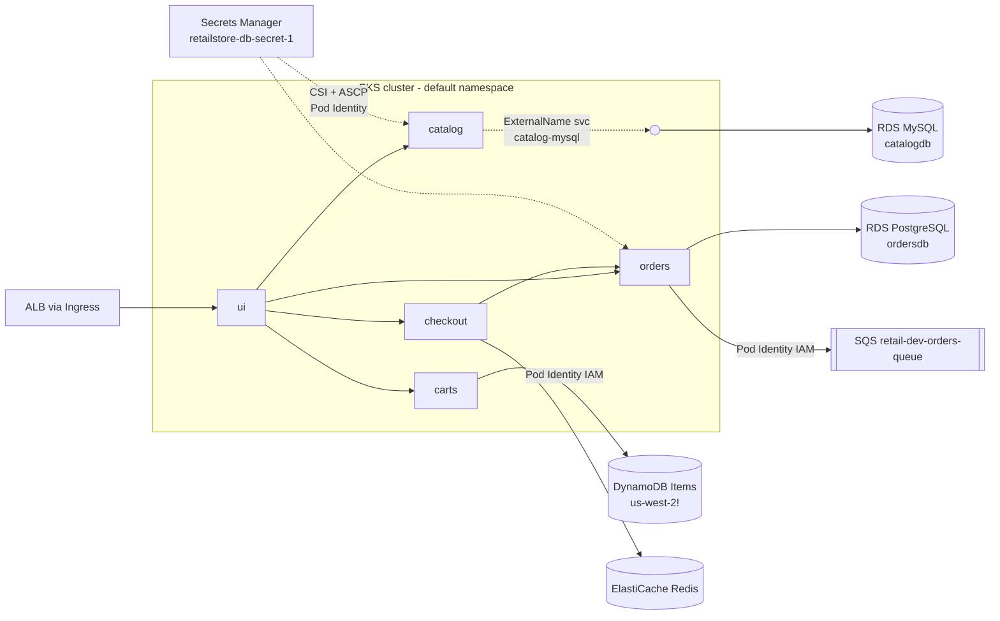

# Section 14 — Retail Store Microservices with AWS Data Plane

> Source: transcript `15) Persistent Dataplane` (second half, lectures 1401–1402) + repo folder `14_RetailStore_Microservices_with_AWS_Data_Plane/`.
> Requires the Section 13 cluster (Pod Identity, LBC, Secrets CSI with `syncSecret.enabled=true`, ASCP all running). This is the course's **capstone integration**: every microservice gets a real managed AWS backend.

---

## 0. 🧭 Beginner Follow-Along Guide (start here)

> Read this guide first; dive into the numbered sections after. Tags: **[Terminal]** = your laptop's shell · **[AWS Console]** = console.aws.amazon.com · **[Editor]** = pasting endpoints into YAML · **[Browser]** = the store + `/topology`.
> This is the course's **capstone integration**: every microservice gets a REAL AWS backend (RDS ×2, DynamoDB, ElastiCache, SQS), with zero credentials in YAML. Two halves: 1401 Terraform builds the data plane; 1402 deploys the services one by one while you watch `/topology` go green.

### Where you are in the course

```
S13 platform-as-code cluster ─▶ THIS: S14 real AWS databases for all 5 services ─▶ S15/16 domain+DNS
```

**Must already exist/be running:**
```
[ ] Section 13 cluster UP (PIA, LBC, Secrets CSI with syncSecret.enabled=true, ASCP — all of it)
[ ] MANUAL STEP FIRST: Secrets Manager secret `retailstore-db-secret-1`
    (console → Secrets Manager → Store new secret → key/value: username=mydbadmin, password=<yours>)
[ ] S3 bucket name updated in THREE files: c1_versions.tf + c3_01 (VPC remote state) + c3_02 (EKS remote state)
```

### Words you'll meet (plain English)

| Word | Plain meaning |
|---|---|
| data plane | the set of databases/cache/queue the apps depend on — now AWS-managed |
| RDS | AWS runs MySQL/PostgreSQL for you (backups, patching, HA) |
| DynamoDB / ElastiCache / SQS | AWS's NoSQL table / managed Redis / message queue |
| ExternalName Service | in-cluster DNS alias (`catalog-mysql` → the RDS hostname) |
| SecretProviderClass + sync | fetches the AWS secret AND mirrors it into a normal K8s Secret the pod reads |
| Pod Identity association | pod's ServiceAccount ↔ IAM role — how carts/orders call AWS with no keys |
| SG references SG | "port 3306 open ONLY to things carrying the EKS cluster's security group" |
| provider alias (us-west-2) | Terraform trick to create ONE resource in another region |
| verification pod | a throwaway mysql/redis/psql client pod to prove connectivity from inside |

### The simplified play-by-play (do this → see that)

1. **[AWS Console]** THE manual step (do it first, on purpose): create secret `retailstore-db-secret-1` with `username=mydbadmin` + a password. Credentials must never be born in Git/Terraform — IaC only READS this. `(deep dive: §4 the secret's journey)`
2. **[Terminal]** 1401 — build the data plane: `cd 14_01_…/03_AWS_Data_Plane_terraform-manifests && terraform init && terraform apply -auto-approve` (~24 resources, **~12 min** — RDS is slow; read §6 while it runs).
   → **you should see:** per service the same 4-step pattern repeat: SG → subnet group → instance → IAM role+association.
3. **[Terminal]** Capture the outputs you'll paste: `terraform output` → catalog RDS endpoint, Redis endpoint, PostgreSQL endpoint, SQS queue name.
4. **[Editor]** Paste them in THREE places: catalog's **ExternalName** service (RDS MySQL endpoint), checkout's ConfigMap (Redis `:6379`), orders' ConfigMap (PostgreSQL `:5432` + SQS queue **NAME**, not URL). Carts needs nothing (DynamoDB endpoint is regional).
5. **[Terminal]** 1402 — deploy incrementally, the instructor's teaching device: `kubectl apply -f 01_secretproviderclass/` then `kubectl apply -f 02_RetailStore_Microservices/05_ui/ -f 03_ingress/` → **[Browser]** open the ALB `/topology`.
   → **you should see:** everything RED — correct! Now watch it turn green service by service.
6. **[Terminal]** Catalog: `kubectl apply -f 02_…/01_catalog/` → verify with the mysql client pod (§6.7): `select * from products;`
   → **you should see:** 12 rows (auto-migrated on first boot); `/topology` catalog green. Also `kubectl get secrets` → `catalog-db` EXISTS — the CSI sync created it on first mount.
7. **[Terminal]** Carts: apply → add items in the UI → **[AWS Console]** DynamoDB → **⚠️ switch region to us-west-2** → Items table.
   → **you should see:** your cart rows live. (The app hardcodes us-west-2 — the course created the table where the app looks. Real-world workaround lesson.)
8. **[Terminal]** Checkout: apply → verify via the redis client pod: `redis-cli -h $REDIS_HOST ping` → `PONG`, `keys *` shows session JSON. Purchase still fails — orders isn't there yet. Failure as checkpoint.
9. **[Terminal]** Orders (slow — Spring Boot): apply → wait Ready → **[Browser]** complete a purchase → verify BOTH sides: psql client pod `select * from orders;` AND **[AWS Console]** SQS → poll messages.
   → **you should see:** the same order ID as a PostgreSQL row AND an SQS message — the database+event double-write from S01, real.
10. **[Browser]** `/topology` fully green + one complete purchase end-to-end.

### ✅ Done-check

```
[ ] terraform output shows all endpoints; ~24 resources applied
[ ] /topology went red → green in YOUR apply order
[ ] products=12 rows (RDS), cart rows in us-west-2 DynamoDB, PONG from ElastiCache
[ ] purchase → row in psql AND matching SQS message
[ ] kubectl get secrets shows catalog-db + orders-db (the sync worked)
```

🧹 **Teardown before you stop (ORDER MATTERS):** `kubectl delete -R -f .` (all k8s incl. Ingress) → `kubectl get ingress` MUST be empty (ALB bills!) → `terraform destroy -auto-approve` in the data-plane folder (RDS takes 5–10 min — normal) → keep the S13 cluster only if continuing to S15. Console sweep: RDS ×2, ElastiCache, **DynamoDB in us-west-2**, SQS. 💰 Running data plane ≈ **$0.40–0.50/h**; same-session teardown is the rule.

---

## 1. Objective

Replace every in-cluster database (the MySQL/DynamoDB-local/Redis/PostgreSQL pods you ran as StatefulSets/Deployments in Sections 08–12) with **fully managed AWS services**, provisioned by Terraform (~24 resources), and wire each microservice to its backend with **zero credentials in Kubernetes YAML or Terraform state**:

| Microservice | AWS backend | Auth mechanism | Endpoint wiring |
|---|---|---|---|
| Catalog | **RDS MySQL** (`mydb3`, db `catalogdb`) | DB user/pass via Secrets Manager → CSI sync → K8s Secret | **ExternalName Service** |
| Carts | **DynamoDB** table `Items` (+ GSI) | IAM via **Pod Identity** (no password at all) | ConfigMap |
| Checkout | **ElastiCache Redis** | none (network-level SG only) | ConfigMap |
| Orders | **RDS PostgreSQL** (`ordersdb`) + **SQS** queue | Secrets Manager (DB) + Pod Identity (SQS) | ConfigMap |
| UI | — (calls the four above) | — | ConfigMap of service DNS names |

---

## 2. Problem Statement

Running databases *inside* the cluster was fine for learning, but in production it means: you patch MySQL yourself, you design backups yourself, node loss can take your data hot-path down, and EBS-backed StatefulSets pin pods to AZs. Meanwhile the naive way to connect apps to external databases — passwords in ConfigMaps/Secrets committed to Git, or worse in Terraform state — fails any security review.

The two problems this section solves together:
1. **Persistence** → move state to RDS/DynamoDB/ElastiCache/SQS (AWS handles HA, patching, backups).
2. **Credential hygiene** → the only secret (DB user/pass) lives in **AWS Secrets Manager, created manually by an admin** — it never appears in Git, YAML, or tfstate as a resource. Everything IAM-shaped (DynamoDB, SQS, reading the secret itself) uses **Pod Identity**, i.e. no long-lived keys anywhere.

---

## 3. Why This Approach

**Managed vs self-hosted data plane:**

| | In-cluster (Sections 08–12) | AWS managed (this section) |
|---|---|---|
| HA / backups / patching | you | AWS |
| Scaling | manual StatefulSet surgery | knobs / serverless (DynamoDB on-demand) |
| Cost at idle | node capacity you already pay | per-service (RDS ≈ $0.017/h t3.micro, DynamoDB per-request) |
| Data survives cluster deletion | ❌ (unless PV gymnastics) | ✅ — completely decoupled lifecycle |
| Network path | ClusterIP | private subnets + SG allowing **only the EKS cluster SG** |

**Endpoint wiring — the instructor deliberately shows both options:**

| Option | Used for | Pros | Cons |
|---|---|---|---|
| **ExternalName Service** | Catalog → RDS MySQL | DNS alias inside cluster; app config never changes | just DNS — no env-var control |
| **ConfigMap env vars** | Orders, Carts, Checkout | explicit, visible, supports many keys (orders needs DB *and* SQS) | must edit YAML when endpoint changes |

**Credential delivery — why Secrets-Manager-→-CSI-sync instead of plain K8s Secrets:** the retail-store containers read credentials from **environment variables** (`RETAIL_*_PERSISTENCE_USER/PASSWORD`), and env vars can only come from native K8s Secrets — but we refuse to hand-author those. The Section 13 `syncSecret.enabled=true` feature squares the circle: SecretProviderClass fetches from Secrets Manager and **mirrors into a native Secret** the deployment consumes.

---

## 4. How It Works — Under the Hood

### Vocabulary map

| AWS term | Kubernetes equivalent | Plain English |
|---|---|---|
| RDS instance endpoint | headless Service DNS of a DB StatefulSet | hostname your app connects to |
| DB subnet group | — (topology hint) | "which private subnets RDS may live in" |
| SG ingress from *cluster SG* | NetworkPolicy | "only pods/nodes of this cluster may reach port 3306" |
| Secrets Manager secret | Secret (the real source) | vaulted user/pass, admin-created |
| SecretProviderClass | — (CSI driver CRD) | "what to fetch, how to parse, what to sync" |
| `secretObjects:` | Secret (the mirrored copy) | CSI driver writes a native Secret on first mount |
| Pod Identity association | ServiceAccount → IAM role | pod gets AWS creds with no keys |
| ExternalName Service | CNAME | in-cluster DNS alias to an external hostname |
| SQS queue | — (like a minimal Kafka topic) | async buffer for order events |
| DynamoDB GSI | secondary index | query carts by `customerId`, not just `id` |

### Architecture



### The secret's full journey (the section's key mechanism)

```
Admin (console, ONCE, manual):  Secrets Manager secret "retailstore-db-secret-1"
                                { "username": "mydbadmin", "password": "..." }
        │
        ├──> terraform (data source only!) ── reads user/pass ──> aws_db_instance master creds
        │      (never a `resource` → never CREATED by IaC; values do land in state* → lock the bucket down)
        │
        └──> pod starts (catalog / orders)
               1. kubelet asks Secrets Store CSI driver to mount the volume
               2. driver asks ASCP; ASCP uses the pod SA's Pod Identity role
                  (role → policy allowing secretsmanager:GetSecretValue on retailstore-db-secret*)
               3. secret JSON parsed by jmesPath → username / password files in the mount
               4. syncSecret controller mirrors them into native Secret catalog-db / orders-db
               5. container env: RETAIL_*_PERSISTENCE_USER/PASSWORD  ← secretKeyRef on the synced Secret
               (delete the deployment → last unmount → synced Secret is garbage-collected)
```
> \* Terraform reading the secret via `data` still copies the values into the **state file** — that's why remote state is S3-encrypted with tight bucket policies, and why the debug outputs in `c6_03` are marked *remove after validation*.

### Request path after full deployment (ASCII)

```
Browser ──> ALB (Ingress, ip mode) ──> ui pod
   "add to cart"      ui ──> carts ──(SDK, Pod Identity creds, us-west-2)──> DynamoDB Items
   "checkout"         ui ──> checkout ──(redis protocol :6379)──> ElastiCache   (session cached)
   "purchase"         checkout ──> orders ──(jdbc :5432)──> RDS PostgreSQL  (row in orders table)
                                   orders ──(SDK, Pod Identity)──> SQS      (event message)
   "browse products"  ui ──> catalog ──(jdbc via catalog-mysql ExternalName :3306)──> RDS MySQL
```

---

## 5. Instructor's Approach

Two lectures, deliberately ordered *infrastructure → integration*:

**1401 — Terraform the data plane (folder `14_01`, ~24 resources, ~12 min apply):**
1. **Manual step first**: create `retailstore-db-secret-1` in the Secrets Manager console (username `mydbadmin` + password). He is explicit about *why manual*: "credentials should never be created by IaC — then they'd live in Git and state."
2. Update the S3 bucket name in **three files** (`c1_versions.tf` backend, `c3_01` VPC remote state, `c3_02` EKS remote state).
3. Walk files in c-number order: shared IAM (c5) → catalog/MySQL (c6) → carts/DynamoDB (c7) → checkout/Redis (c8) → orders/PostgreSQL+SQS (c9). Each service = SG → subnet group → instance → IAM role → association, so the *pattern* repeats four times and sticks.
4. The **carts region bug**: retail-store v1.3.0 hardcodes `Region.US_WEST_2` in `DynamoDBConfiguration.java`, so the table is created in **us-west-2 via a provider alias** rather than patching app code — a very real "work around the app you're given" lesson.
5. Apply, then verify each resource in the console *including* the Pod Identity associations list.

**1402 — Deploy microservices (folder `14_02`), strictly incremental with verification after every step:**
1. SecretProviderClasses first (`catalog-db`, `orders-db` sync definitions — nothing happens yet; sync waits for the first mount).
2. **UI + Ingress first**, topology page shows *everything unhealthy* — his teaching device: watch services go green one by one.
3. Catalog → update ExternalName to the RDS endpoint → deploy → **verification pod** `catalog-mysql-client` → `mysql -h $MYSQL_HOST`, `select * from products` (12 rows migrated automatically by the app's first-boot migration).
4. Carts → deploy → add items in UI → see live rows in the DynamoDB console (us-west-2!). Checkout expected to fail (not deployed yet) — failure as a checkpoint.
5. Checkout → update Redis endpoint from `terraform output` → deploy → redis-client verification pod → `redis-cli -h $REDIS_HOST -p $REDIS_PORT` → `ping`/`dbsize`/`keys *`/`get <id>` and match the cached session IDs against checkout logs. Purchase still fails (orders missing).
6. Orders → update ConfigMap with PostgreSQL endpoint **and** SQS queue name from `terraform output` → deploy (slow start — Java/Spring Boot) → synced `orders-db` Secret appears → purchase now succeeds → verify the order row via psql client pod (`\l`, `\c ordersdb`, `\dt`, `select * from orders`) **and** the message in the SQS console (poll messages; order IDs match).
7. Cleanup: `kubectl delete -R -f` the whole manifests tree, **confirm the Ingress/ALB is gone**, then `terraform destroy` the data plane.

> 🐛 **TRANSCRIPT ERRORS (ASR):** "cube CTL" = kubectl; "read this OS cash / reddest" = Redis; "PII/Pia association" = Pod Identity association; "pkg host" = `PGHOST`; "slash DT" = `\dt`; "Aqua Ace GT" = a product name rendering, ignore.
>
> ✅ **VERIFIED against the canonical repo** ([stacksimplify/devops-real-world-project-implementation-on-aws](https://github.com/stacksimplify/devops-real-world-project-implementation-on-aws)): the full k8s manifest tree lives in `14_RetailStore_Microservices_with_AWS_Data_Plane/14_02_Microservices_with_AWS_Data_Plane/RetailStore_k8s_manifests_with_Data_Plane/`, and the Pod-Identity **association** files `c6_06_catalog_sa_eks_pod_identity_association.tf` and `c9_05_orders_postgresql_sa_eks_pod_identity_association.tf` **do exist** in `14_01_RetailStore_AWS_Data_Plane/03_AWS_Data_Plane_terraform-manifests/` (an earlier partial clone had simply not checked them out). The §6 reconstructions below match the repo — use the repo files as the source of truth and this section as the explanation.

---

## 6. Code & Commands — Line by Line

### 6.1 Shared IAM (c5)

```hcl
# c5_01: identical trust doc to Section 13 — every Pod Identity role trusts pods.eks.amazonaws.com
# c5_02: ONE policy reused by both catalog and orders roles
resource "aws_iam_policy" "retailstore_db_secret_policy" {
  name   = "${local.name}-retailstore-db-secret-policy"
  policy = jsonencode({
    Version = "2012-10-17"
    Statement = [{
      Effect   = "Allow"
      Action   = ["secretsmanager:GetSecretValue", "secretsmanager:DescribeSecret"]
      Resource = "arn:aws:secretsmanager:${var.aws_region}:${data.aws_caller_identity.current.account_id}:secret:retailstore-db-secret*"
    }]                       #                                                    wildcard suffix ↑ because Secrets Manager
  })                         #                                                    appends -XXXXXX random chars to secret ARNs
}
```

### 6.2 Catalog → RDS MySQL (c6)

```hcl
# c6_01 SG: the ONLY ingress is the EKS cluster security group — not a CIDR.
ingress {
  from_port = 3306; to_port = 3306; protocol = "tcp"
  security_groups = [data.terraform_remote_state.eks.outputs.eks_cluster_security_group_id]
}

# c6_02: DB subnet group over the VPC project's PRIVATE subnets (no public DB, ever)
resource "aws_db_subnet_group" "rds_private" {
  subnet_ids = data.terraform_remote_state.vpc.outputs.private_subnet_ids
}

# c6_03: READ the manually created secret — data sources, not resources
data "aws_secretsmanager_secret" "retailstore_secret"          { name = "retailstore-db-secret-1" }
data "aws_secretsmanager_secret_version" "retailstore_secret_value" {
  secret_id = data.aws_secretsmanager_secret.retailstore_secret.id
}
locals { retailstore_secret_json = jsondecode(data.aws_secretsmanager_secret_version.retailstore_secret_value.secret_string) }

# c6_04: the instance
resource "aws_db_instance" "catalog_rds" {
  identifier          = "mydb3"
  engine              = "mysql";  engine_version = "8.0"
  instance_class      = "db.t3.micro";  allocated_storage = 20
  db_name             = "catalogdb"
  username            = local.retailstore_secret_json.username   # ← from Secrets Manager
  password            = local.retailstore_secret_json.password
  db_subnet_group_name   = aws_db_subnet_group.rds_private.name
  vpc_security_group_ids = [aws_security_group.rds_mysql_sg.id]
  skip_final_snapshot = true      # demo setting — NEVER in prod
  publicly_accessible = false
  multi_az            = false     # demo; prod = true
}
output "catalog_rds_endpoint" { value = aws_db_instance.catalog_rds.address }

# c6_05: role for the catalog SA (secret-read policy attached)
# c6_06 (✅ IN REPO: 14_01/03_AWS_Data_Plane_terraform-manifests/c6_06...): the association that makes the mount work
resource "aws_eks_pod_identity_association" "catalog_pod_identity" {
  cluster_name    = data.terraform_remote_state.eks.outputs.eks_cluster_name
  namespace       = "default"
  service_account = "catalog"                    # must equal the SA in 01_catalog_service_account.yaml
  role_arn        = aws_iam_role.catalog_getsecrets.arn
}
```

### 6.3 Carts → DynamoDB (c7) — the region-bug workaround

```hcl
# c1_versions.tf declares a SECOND provider for this one table:
provider "aws" { alias = "west2"  region = "us-west-2" }

# c7_03: retail-store v1.3.0 hardcodes Region.US_WEST_2 in DynamoDBConfiguration.java
#        → create the table WHERE THE APP LOOKS, not where you wish it looked
resource "aws_dynamodb_table" "items_west2" {
  provider     = aws.west2                 # ← the whole trick
  name         = "Items"
  billing_mode = "PAY_PER_REQUEST"         # serverless pricing, no capacity planning
  hash_key     = "id"
  attribute { name = "id";         type = "S" }
  attribute { name = "customerId"; type = "S" }
  global_secondary_index {                 # carts are looked up per customer
    name = "idx_global_customerId"; hash_key = "customerId"; projection_type = "ALL"
  }
}

# c7_01: IAM policy (broad dynamodb:* set, Resource "*" — course simplification; scope to the
#        table+GSI ARNs in prod) + role.   c7_02: association → SA "carts" in default ns.
```

> 🐛 **TRANSCRIPT/COURSE BUG (acknowledged by instructor):** the app, not the course, hardcodes us-west-2. Proper fixes: bump to an app version reading `AWS_REGION`, or patch `DynamoDBConfiguration.java`. The provider alias is the no-code-change workaround.

### 6.4 Checkout → ElastiCache Redis (c8)

```hcl
resource "aws_elasticache_cluster" "checkout_redis" {
  cluster_id      = "${local.name}-checkout-redis"     # retail-dev-checkout-redis
  engine          = "redis";  engine_version = "7.1";  parameter_group_name = "default.redis7"
  node_type       = "cache.t3.micro";  num_cache_nodes = 1;  port = 6379
  subnet_group_name  = aws_elasticache_subnet_group.redis_subnet_group.name
  security_group_ids = [aws_security_group.redis_sg.id]   # ingress 6379 from cluster SG only
}
output "checkout_redis_endpoint" { value = aws_elasticache_cluster.checkout_redis.cache_nodes[0].address }
```
No IAM role at all — plain Redis has no AWS auth; the security group *is* the auth boundary.

### 6.5 Orders → RDS PostgreSQL + SQS (c9)

```hcl
# c9_03: PostgreSQL 17.6, db.t4g.micro (Graviton), db_name ordersdb,
#        SAME Secrets Manager values as MySQL (one secret, two databases)
# c9_04: orders role + the shared secret-read policy
# c9_05 (✅ IN REPO, same folder): association → SA "orders", default ns
resource "aws_eks_pod_identity_association" "orders_pod_identity" {
  cluster_name    = data.terraform_remote_state.eks.outputs.eks_cluster_name
  namespace       = "default"
  service_account = "orders"
  role_arn        = aws_iam_role.orders_postgresql_getsecrets.arn
}

# c9_06: the queue
resource "aws_sqs_queue" "orders_sqs_queue" {
  name                       = "${local.name}-orders-queue"    # retail-dev-orders-queue
  message_retention_seconds  = 86400
  visibility_timeout_seconds = 30
  receive_wait_time_seconds  = 10      # long polling — fewer empty receives, lower cost
}

# c9_07: SQS policy attached to the SAME orders role (c9_04) —
#        one pod, one SA, one role, TWO capabilities (read secret + use queue)
resource "aws_iam_role_policy_attachment" "orders_sqs_policy_attach" {
  policy_arn = aws_iam_policy.orders_sqs_policy.arn
  role       = aws_iam_role.orders_postgresql_getsecrets.name
}
```

### 6.6 Kubernetes side (folder `14_02`, ✅ verified in repo — matches below)

**SecretProviderClass with sync (`01_secretproviderclass/01_catalog_db_secretproviderclass.yaml`):**

```yaml
apiVersion: secrets-store.csi.x-k8s.io/v1
kind: SecretProviderClass
metadata:
  name: catalog-db-secret-provider
  namespace: default
spec:
  provider: aws
  parameters:
    region: us-east-1
    usePodIdentity: "true"                      # Pod Identity, not IRSA
    objects: |
      - objectName: "retailstore-db-secret-1"   # the manually created secret
        objectType: "secretsmanager"
        jmesPath:                                # split the JSON into two mounted files
          - path: username
            objectAlias: username
          - path: password
            objectAlias: password
  secretObjects:                                 # ← the syncSecret.enabled=true feature
    - secretName: catalog-db                     # native K8s Secret to create on first mount
      type: Opaque
      data:
        - objectName: username                   # mounted alias → Secret key
          key: RETAIL_CATALOG_PERSISTENCE_USER
        - objectName: password
          key: RETAIL_CATALOG_PERSISTENCE_PASSWORD
```
`02_orders_db_secretproviderclass.yaml` is identical except `secretName: orders-db` and keys `RETAIL_ORDERS_PERSISTENCE_USERNAME` / `RETAIL_ORDERS_PERSISTENCE_PASSWORD`.

**Catalog wiring (3 pieces):**

```yaml
# 05_catalog_mysql_externalname_service.yaml — in-cluster DNS alias to RDS
apiVersion: v1
kind: Service
metadata: { name: catalog-mysql, namespace: default }
spec:
  type: ExternalName
  externalName: mydb3.XXXXXXXX.us-east-1.rds.amazonaws.com   # ← paste terraform output catalog_rds_endpoint

# 02_catalog_configmap.yaml (endpoint stays the ALIAS — never changes again)
data:
  RETAIL_CATALOG_PERSISTENCE_PROVIDER: mysql
  RETAIL_CATALOG_PERSISTENCE_ENDPOINT: catalog-mysql:3306
  RETAIL_CATALOG_PERSISTENCE_DB_NAME: catalogdb

# 03_catalog_deployment.yaml — the three connection points
spec:
  serviceAccountName: catalog                 # ← matches the Pod Identity association
  containers:
  - name: catalog
    envFrom:
    - configMapRef: { name: catalog }
    - secretRef:    { name: catalog-db }      # ← the SYNCED secret
    volumeMounts:
    - name: catalog-db-secret                 # mounting TRIGGERS the sync — do not remove
      mountPath: /mnt/secrets-store
      readOnly: true
  volumes:
  - name: catalog-db-secret
    csi:
      driver: secrets-store.csi.k8s.io
      readOnly: true
      volumeAttributes: { secretProviderClass: catalog-db-secret-provider }
```

**Orders / carts / checkout ConfigMaps (values from `terraform output`):**

```yaml
# orders (both DB and queue):
RETAIL_ORDERS_PERSISTENCE_PROVIDER: postgres
RETAIL_ORDERS_PERSISTENCE_ENDPOINT: orders-postgres-db.XXXX.us-east-1.rds.amazonaws.com:5432
RETAIL_ORDERS_PERSISTENCE_NAME: ordersdb
RETAIL_ORDERS_MESSAGING_PROVIDER: sqs
RETAIL_ORDERS_MESSAGING_SQS_TOPIC: retail-dev-orders-queue      # queue NAME, not URL

# checkout:
RETAIL_CHECKOUT_PERSISTENCE_PROVIDER: redis
RETAIL_CHECKOUT_PERSISTENCE_REDIS_HOST: retail-dev-checkout-redis.XXXX.0001.use1.cache.amazonaws.com
RETAIL_CHECKOUT_PERSISTENCE_REDIS_PORT: "6379"

# carts:
RETAIL_CART_PERSISTENCE_PROVIDER: dynamodb
RETAIL_CART_PERSISTENCE_DYNAMODB_TABLE_NAME: Items
# region is hardcoded us-west-2 in the app — nothing to set, just know it
```

### 6.7 Verification commands (per service, from the transcript)

```bash
# CATALOG — MySQL client pod
kubectl apply -f 04_Verification_Pods/01_catalog_mysql_client_pod.yaml
kubectl exec -it catalog-mysql-client -- /bin/bash
  env | grep MYSQL                    # endpoint injected from configmap/env
  mysql -h $MYSQL_HOST -u mydbadmin -p          # password from Secrets Manager
  show databases; use catalogdb; show tables; select * from products;   # 12 rows auto-migrated

# CARTS — no client needed: add items in the UI, then DynamoDB console (⚠ switch to us-west-2)
#          → Tables → Items → Explore table items → rows appear live

# CHECKOUT — Redis client pod
kubectl apply -f 04_Verification_Pods/03_checkout_elasticache_redis_client_pod.yaml
kubectl exec -it checkout-redis-client -- /bin/sh
  env | grep -i redis                 # REDIS_URL from the checkout configmap
  redis-cli -h $REDIS_HOST -p $REDIS_PORT
  ping          # → PONG
  dbsize        # number of cached checkout sessions
  keys *        # quick check only — never on big datasets
  get <key>     # session JSON; the ID matches checkout pod logs

# ORDERS — psql client pod + SQS console
kubectl apply -f 04_Verification_Pods/04_orders_postgresql_client_pod.yaml
kubectl exec -it orders-postgresql-client -- /bin/bash
  psql -h $PGHOST -U mydbadmin -d ordersdb
  \l            # list databases
  \dt           # tables: orders, order_items
  \d orders     # table structure
  select * from orders;               # every purchase = one row
# SQS: console → us-east-1 → retail-dev-orders-queue → Send and receive → Poll for messages
#      message body order IDs match the psql rows 1:1
aws sqs receive-message --queue-url https://sqs.us-east-1.amazonaws.com/<acct>/retail-dev-orders-queue \
  --max-number-of-messages 5 --output json | jq -r '.Messages[].Body' | jq
```

---

## 7. Complete Code Reference (execution order)

Repo: [14_RetailStore_Microservices_with_AWS_Data_Plane/](devops-real-world-project-implementation-on-aws/14_RetailStore_Microservices_with_AWS_Data_Plane/)

```
14_01_RetailStore_AWS_Data_Plane/
├── create-aws-dataplane.sh / delete-aws-dataplane.sh
└── 03_AWS_Data_Plane_terraform-manifests/
    ├── c1_versions.tf            # backend key retail-persistent-endpoints/dev/terraform.tfstate
    │                             # + provider alias "west2" for the carts table
    ├── c2_variables.tf  c4_datasources_and_locals.tf     # local.name = "retail-dev"
    ├── c3_01_vpc_remote_state.tf  c3_02_eks_remote_state.tf
    ├── c5_01 assume-role doc     c5_02 secret-read policy
    ├── c6_01..05 catalog: SG → subnet grp → secret datasource → RDS MySQL → SA role
    │   (c6_06 association — ✅ present in repo, §6.2)
    ├── c7_01..03 carts: policy+role → association → DynamoDB Items (us-west-2)
    ├── c8_01..03 checkout: SG → subnet grp → ElastiCache Redis
    └── c9_01..07 orders: SG → subnet grp → RDS PostgreSQL → role → (c9_05 assoc ⚠) → SQS queue → SQS policy

14_02_Microservices_with_AWS_Data_Plane/            # README only in repo — YAML tree per §6.6
└── RetailStore_k8s_manifests_with_Data_Plane/
    ├── 01_secretproviderclass/   (catalog-db, orders-db — with secretObjects sync)
    ├── 02_RetailStore_Microservices/ 01_catalog … 05_ui   (SA, CM, Deploy, Svc [, ExternalName])
    ├── 03_ingress/01_ingress_http_ip_mode.yaml
    └── 04_Verification_Pods/     (mysql, dynamodb-awscli, redis, psql, sqs-awscli clients)
```

Full workflow:

```bash
# 0. Section 13 cluster running. Manually create Secrets Manager secret retailstore-db-secret-1
#    (key/value: username=mydbadmin, password=<yours>). Update bucket name in c1, c3_01, c3_02.

# 1. Data plane (~24 resources, ~12 min — RDS instances dominate)
cd 14_01_RetailStore_AWS_Data_Plane/03_AWS_Data_Plane_terraform-manifests
terraform init && terraform apply -auto-approve
terraform output          # capture: catalog_rds_endpoint, checkout_redis_endpoint,
                          #          orders_rds_postgresql_endpoint, orders_sqs_queue_url

# 2. Paste endpoints into: catalog ExternalName, checkout CM, orders CM (queue NAME too)

# 3. Deploy incrementally, verifying after each (order matters for the topology-page demo):
cd ../../14_02_Microservices_with_AWS_Data_Plane/RetailStore_k8s_manifests_with_Data_Plane
kubectl apply -f 01_secretproviderclass/
kubectl apply -f 02_RetailStore_Microservices/05_ui/ -f 03_ingress/
kubectl get ingress                                    # ALB DNS → http://<alb>/topology (all red)
kubectl apply -f 02_RetailStore_Microservices/01_catalog/   # → verify mysql (§6.7)
kubectl apply -f 02_RetailStore_Microservices/02_cart/      # → verify DynamoDB console us-west-2
kubectl apply -f 02_RetailStore_Microservices/03_checkout/  # → verify redis-cli
kubectl apply -f 02_RetailStore_Microservices/04_orders/    # slow (Spring Boot) → purchase works
kubectl get secrets       # catalog-db + orders-db present = sync worked

# 4. End-to-end: browse → add to cart → checkout → purchase → row in psql + message in SQS

# 5. 🧹 Teardown (ORDER MATTERS)
kubectl delete -R -f .                       # all k8s incl. Ingress
kubectl get ingress                          # MUST be empty — ALB bills hourly
cd ../../14_01_RetailStore_AWS_Data_Plane/03_AWS_Data_Plane_terraform-manifests
terraform destroy -auto-approve              # (keep the Section 13 cluster only if continuing to Section 15)
```

---

## 8. Hands-On Labs

### Lab A — Reproduce the full data plane

> 💰 **Cost warning:** 2× RDS + ElastiCache + ALB + the Section 13 cluster ≈ **$0.40–0.50/h**. DynamoDB/SQS are pennies at demo volume. **Do the full teardown the same session.** RDS also blocks `terraform destroy` for ~5–10 min while instances delete — that's normal.

**Prerequisites:** Section 13 cluster up; Secrets Manager secret created manually; three bucket names updated.
**Steps:** the §7 workflow verbatim.
**Expected output:** `/topology` page fully green; `select * from products` → 12 rows; DynamoDB items appear as you click; `redis-cli dbsize` grows during checkout; every purchase = one `orders` row **and** one SQS message with the same order ID.
**Verify:** `kubectl get secrets catalog-db orders-db` both exist; `kubectl get pods` all Running; five `terraform output` endpoints resolve from inside a debug pod (`nslookup`).
🧹 **Teardown:** §7 step 5, then console sweep: EC2 Load Balancers, RDS, ElastiCache, **DynamoDB in us-west-2**, SQS, Secrets Manager (delete the manual secret last — 7-day recovery window is fine).

### Lab B — Variation: swap the wiring styles

1. Convert **orders** to an ExternalName Service (`orders-postgres`) and point its ConfigMap `ENDPOINT` at `orders-postgres:5432` — prove both styles are interchangeable.
2. Convert **catalog** the other way: delete the ExternalName, put the raw RDS endpoint in the ConfigMap.
3. Scope the carts IAM policy from `Resource: "*"` down to the table + GSI ARNs (`arn:aws:dynamodb:us-west-2:<acct>:table/Items` and `.../table/Items/index/*`) and prove carts still works — the prod-hardening version.

**Verify:** topology stays green after each `kubectl rollout restart deployment <svc>`.
🧹 Same as Lab A.

**Free local variant:** on kind/k3d, run the Section 08 in-cluster dependencies but reproduce *the secret-sync pattern* with the CSI driver + [Vault provider or fake provider], or simply hand-create `catalog-db`/`orders-db` Secrets and observe identical app behavior — the app only sees env vars either way; that's the point of the pattern.

### Lab C — Break-it-and-fix-it

1. **Delete the Pod Identity association** for catalog (`terraform destroy -target=aws_eks_pod_identity_association.catalog_pod_identity`), then `kubectl rollout restart deployment catalog`. Pod sticks in `ContainerCreating`; `kubectl describe pod` → `FailedMount ... secretsmanager: AccessDenied`. **Fix:** re-apply; delete the pod. (This is exactly what the missing c6_06 file causes on a fresh clone.)
2. **Create the DynamoDB table in us-east-1** instead (remove `provider = aws.west2`). Carts pod runs but "add to cart" 500s; carts logs show `ResourceNotFoundException` from `dynamodb.us-west-2.amazonaws.com`. **Fix:** the app told you where it looks — put the table back in us-west-2.
3. **Wrong SG source:** change the MySQL SG ingress from the cluster SG to your laptop CIDR. Catalog crash-loops with connect timeout; `catalog-mysql-client` also times out. Confirm with `kubectl logs deploy/catalog | grep -i timeout`. **Fix:** ingress source must be the **EKS cluster SG** (node ENIs carry it).
4. **Queue URL vs name:** put the full SQS URL into `RETAIL_ORDERS_MESSAGING_SQS_TOPIC`. Purchases store the DB row but messaging errors appear in orders logs. **Fix:** the app expects the queue *name* and resolves the URL itself via `GetQueueUrl` (that's why the IAM policy includes it).

---

## 9. Troubleshooting

| Symptom | Likely cause | Command to confirm | Fix |
|---|---|---|---|
| Catalog/orders pod `ContainerCreating` forever, event `FailedMount: rpc error ... AccessDenied` | Missing/wrong Pod Identity association (SA name or namespace mismatch), or secret-policy ARN doesn't match secret name | `aws eks list-pod-identity-associations --cluster-name eksdemo-dev`; `kubectl describe pod <p>` | Association: ns `default`, SA exactly `catalog`/`orders`; policy resource `retailstore-db-secret*` |
| Mount works but `catalog-db` Secret never created → pod `CreateContainerConfigError: secret "catalog-db" not found` | Section 13 driver installed without `syncSecret.enabled=true`, or `secretObjects` names don't match mounted aliases | `kubectl get clusterrole \| grep secretprovidersyncing` | Re-apply S13 with the flag; `objectName` in `secretObjects` must equal the `objectAlias` |
| Catalog `CrashLoopBackOff`, logs `dial tcp ... i/o timeout` on 3306 | RDS SG ingress not from cluster SG / DB in wrong subnets | run `01_catalog_mysql_client_pod` and try `mysql -h ...` | SG source = EKS cluster SG; subnet group = private subnets |
| Catalog healthy but products empty | Wrong DB name or app couldn't run first-boot migration | `select * from products;` in client pod | `db_name=catalogdb` must match CM `RETAIL_CATALOG_PERSISTENCE_DB_NAME` |
| Carts logs `ResourceNotFoundException: Requested resource not found` | Table created in us-east-1 but app hardcodes us-west-2 (v1.3.0) | `aws dynamodb list-tables --region us-west-2` | Create `Items` in us-west-2 via provider alias |
| Carts `AccessDeniedException ... dynamodb:PutItem` | Association missing or policy not attached | `aws eks list-pod-identity-associations ...` filter SA `carts` | c7_01+c7_02 applied; SA name `carts` |
| Checkout page hangs / no shipping options | Wrong Redis endpoint in CM, or Redis SG blocks 6379 | redis client pod: `redis-cli -h $HOST ping` | Endpoint = `terraform output checkout_redis_endpoint`; SG source = cluster SG |
| Purchase fails with `get address ... order info` UI error | Orders service not deployed / still booting (Spring Boot is slow) | `kubectl get pods \| grep orders; kubectl logs -f deploy/orders` | Wait for Ready; it's the last deploy step by design |
| Order row in psql but no SQS message | Queue name (not URL) wrong in CM, or SQS policy not attached to the orders role | orders logs; `aws sqs get-queue-url --queue-name retail-dev-orders-queue` | CM key = queue **name**; c9_07 attaches to the c9_04 role |
| `terraform destroy` (data plane) hangs on SGs | You destroyed the data plane while k8s pods still hold connections, or ALB/ENIs remain | `kubectl get ingress` (must be empty) | Delete all k8s resources first, then destroy |
| Secret values visible via `terraform output` | Debug outputs from c6_03 left in place | `terraform output` | Delete the `debug_*` outputs after first validation |

---

## 10. Interview Articulation

**90-second spoken answer — "How did you integrate EKS microservices with managed AWS data stores securely?"**

> "Each microservice got the managed service that fits its access pattern — catalog on RDS MySQL, carts on DynamoDB with a customer-ID GSI, checkout on ElastiCache Redis, orders on RDS PostgreSQL plus an SQS queue for order events — all Terraformed in private subnets with security groups that only admit the EKS cluster's security group. The interesting part is credentials. The single database secret is created *manually* in Secrets Manager, so it never exists in Git or as a Terraform resource; Terraform only reads it via a data source to set the RDS master passwords. On the cluster side, pods get it through the Secrets Store CSI driver with the AWS provider: the pod's service account has an EKS Pod Identity association to a role that can only read that one secret, the SecretProviderClass parses the JSON with jmesPath, and — because we enabled the driver's sync feature — it mirrors the values into a native Kubernetes Secret, which the deployment consumes as env vars. The synced Secret is created on first mount and garbage-collected on last unmount. Everything IAM-shaped — DynamoDB, SQS, reading the secret — is Pod Identity, so there are zero static AWS keys anywhere. One war story: the carts service hardcoded us-west-2 for DynamoDB, so rather than fork the app we created the table in us-west-2 with a Terraform provider alias — sometimes the platform bends around the application."

<details>
<summary>Self-test Q&A (5)</summary>

**Q1. Why is the Secrets Manager secret created manually instead of by Terraform?**
A: A `resource "aws_secretsmanager_secret_version"` would put the plaintext into Git (the .tf) and the state file as managed values. Manual creation keeps it out of IaC; Terraform reads it via `data` sources only. (Reading still caches values in state, so the state bucket is encrypted and access-controlled — and the temporary debug outputs must be removed.)

**Q2. Walk the path from Secrets Manager to `RETAIL_CATALOG_PERSISTENCE_PASSWORD` in the catalog container.**
A: Pod mounts a CSI volume referencing the SecretProviderClass → ASCP authenticates with the pod SA's Pod Identity role → `GetSecretValue` on `retailstore-db-secret-1` → jmesPath splits JSON into `username`/`password` aliases → the sync controller (`syncSecret.enabled=true`) creates native Secret `catalog-db` mapping aliases to the `RETAIL_*` keys → the deployment's `envFrom secretRef` injects them. Removing the volume mount breaks it: no mount, no sync.

**Q3. Why does carts need IAM but checkout needs none?**
A: DynamoDB is an AWS API — every call is SigV4-signed, so carts needs credentials (Pod Identity role with DynamoDB permissions). ElastiCache Redis speaks the plain Redis protocol with no AWS auth layer (in this setup) — the security group restricting 6379 to the cluster SG is the entire access control.

**Q4. Why ExternalName for catalog but ConfigMap endpoints for orders?**
A: Deliberate contrast. ExternalName gives an in-cluster DNS alias (`catalog-mysql`) so app config never changes when the RDS endpoint does — but it's DNS-only. Orders needs multiple config keys (DB endpoint, DB name, SQS provider, queue name) that must be env vars anyway, so a ConfigMap is the natural home. Both are valid; know the trade-off.

**Q5. What's the correct teardown order and why?**
A: `kubectl delete` all manifests first (crucially the Ingress — the LBC must deprovision the ALB while it still runs), confirm `kubectl get ingress` is empty and the console shows no load balancer, then `terraform destroy` the data plane, then (if finished) the Section 13 cluster, then the VPC. Reversing it orphans the ALB (billed) or hangs destroy on ENI/SG dependencies. Also remember the DynamoDB table lives in **us-west-2** when sweeping the console.

</details>

---

*Previous: [13 — Terraform EKS with Add-Ons](13-terraform-eks-addons.md) · Next: [15 — Terraform EKS with ExternalDNS](15-terraform-eks-externaldns.md) · [Index](00-INDEX.md)*
