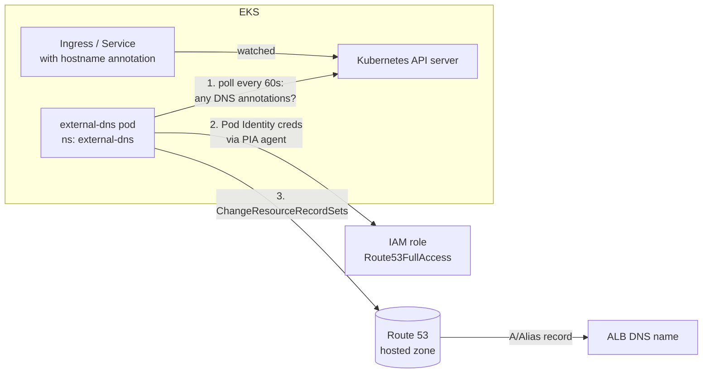

# Section 15 — Terraform EKS Cluster with ExternalDNS

> Source: transcript `16) External DNS` (first half, ~lectures 1501–1503).
> Extends the Section 13 project: same VPC + EKS-with-add-ons code, **plus three new files (`c17_01`–`c17_03`)** installing ExternalDNS as an EKS managed add-on with Pod Identity.
>
> ✅ **VERIFIED against the canonical repo:** the code lives in `15_Terraform_EKS_Cluster_ExternalDNS/02_EKS_terraform-manifests_with_addons/` as `c17-01-externaldns-iam-policy-and-role.tf`, `c17-02-externaldns-pod-identity-association.tf`, `c17-03-externaldns-eksaddon.tf` — **confirmed to match the walkthrough below** (the `depends_on` chain, `most_recent` version lookup, and `AmazonRoute53FullAccess` attachment are byte-for-byte). An earlier partial clone had only checked out folders `01–14`; the instructor's GitHub had 15+ all along. Use the repo files as source of truth.

---

## 0. 🧭 Beginner Follow-Along Guide (start here)

> Read this guide first; dive into the numbered sections after. Tags: **[Terminal]** = your laptop's shell · **[Editor]** = VS Code on the .tf files · **[AWS Console]** = console.aws.amazon.com.
> One sentence: install a robot (ExternalDNS) that watches your Ingresses and writes Route 53 records for `*.devopsinminutes.com` automatically — 3 new .tf files, 4 new resources, done.

### Where you are in the course

```
S13 platform-as-code (33 resources) ─▶ THIS: S15 + ExternalDNS (37) ─▶ S16 the store on YOUR domain + HTTPS
```

**Must already exist/be running:**
```
[ ] S13 cluster up (or you'll create fresh — both paths below)
[ ] devopsinminutes.com hosted zone created & GoDaddy delegation verified — one-time setup in
    [16 §5.5](16-retailstore-externaldns.md): `dig NS devopsinminutes.com +short` must show awsdns servers
[ ] Bucket name updated in the same THREE files as S13 (VPC c1, EKS c1, EKS c3)
```

### Words you'll meet (plain English)

| Word | Plain meaning |
|---|---|
| ExternalDNS | a pod that watches Ingress/Service annotations and writes matching Route 53 records |
| hosted zone | Route 53's record database for devopsinminutes.com (you made it in 16 §5.5) |
| hostname annotation | the one YAML line that says "please register this DNS name for me" |
| A / Alias record | "this name → that load balancer" |
| TXT ownership record | ExternalDNS's name-tag on records IT created — it never touches others |
| `upsert-only` vs `sync` | create/update only (default — never deletes) vs full cleanup too |
| `--domain-filter` | optional fence limiting which zones it may touch (unset here — fine for the course) |
| state reuse | new folder + same S3 backend = Terraform still knows all 33 existing resources |

### The simplified play-by-play (do this → see that)

1. **[Editor]** Copy S13's two projects, update the S3 **bucket name in the three files**, and add the three new files from §6: `c17_01` (IAM role — reusing the SAME shared trust doc as LBC/EBS), `c17_02` (Pod Identity association — namespace `external-dns`, SA `external-dns`, names the ADD-ON dictates), `c17_03` (the add-on + its `depends_on`).
2. **[Terminal]** The state-reuse lesson — run in `02_EKS…`: `terraform init` then `terraform state list`
   → **you should see:** all 33 Section-13 resources listed even though this is a fresh folder — **state follows the S3 backend, not the folder**. `(deep dive: §6 state-reuse block)`
3. **[Terminal]** `terraform plan`
   → **you should see:** **"Plan: 4 to add, 0 to change, 0 to destroy"** — the platform grows by delta, never rebuilt.
4. **[Terminal]** `terraform apply -auto-approve` (also `terraform init` the copied `01_VPC` folder once — you'll need it working for destroy later).
   → **you should see:** role → association → add-on created in order.
5. **[Terminal]** Verify the ladder (§6): `aws eks list-addons --cluster-name eksdemo-dev --region us-east-1` → `kubectl -n external-dns get pods` → `kubectl -n external-dns logs -l app.kubernetes.io/name=external-dns -f`
   → **you should see:** the add-on listed; pod Running; logs listing your `devopsinminutes.com` zone (no `--domain-filter` = it sees all zones) and every ~60 s: **"All records are already up to date"** — zero auth errors = the whole Pod Identity chain works.
6. **[Terminal]** Smoke-test it NOW (Lab B): deploy any S11 Ingress with the one magic line `external-dns.alpha.kubernetes.io/hostname: demo1.devopsinminutes.com` and keep the logs tailing.
   → **you should see:** within a minute, `CREATE demo1.devopsinminutes.com A` + a TXT record in the logs; **[AWS Console]** the record in your hosted zone; `nslookup demo1.devopsinminutes.com` resolves; browser hits the app.
7. **[Terminal]** Clean the smoke test: delete the Ingress — and notice the record STAYS (default policy `upsert-only` never deletes). Remove the `demo1` A + TXT records by hand in Route 53. That surprise is Section 16's closing lesson. `(deep dive: S16 §4)`

### ✅ Done-check

```
[ ] terraform state list showed 33 inherited resources; plan added exactly 4
[ ] external-dns pod Running; logs show your zone + "All records are already up to date" ticks
[ ] the demo1.devopsinminutes.com annotation produced a real Route 53 record you saw in the logs AND console
[ ] you deleted the smoke-test A + TXT records manually (and know WHY they didn't self-delete)
```

🧹 **Teardown before you stop:** if not continuing to S16 now: destroy EKS then VPC (S13's `destroy-cluster.sh` removes all 37 in the right order). **Keep the hosted zone** (16 §5.5 keep-the-zone rule). 💰 ExternalDNS itself adds no hourly cost; zone = $0.50/mo; cluster costs from S13 continue while up.

---

## 1. Objective

Add **ExternalDNS** to the Terraform-managed EKS platform so that DNS records in **Route 53 create themselves**: annotate an Ingress or Service with a hostname, and seconds later `retail-store1.devopsinminutes.com` resolves to your ALB — no console, no copy-paste, no forgotten cleanup. Installed as an **EKS managed add-on** via `aws_eks_addon`, authenticated with **Pod Identity**, fully in Terraform (4 new resources on top of Section 13's 33).

---

## 2. Problem Statement

Life without ExternalDNS, per app, per environment:

```
deploy app → kubectl get ingress (copy ALB DNS) → AWS console → Route 53 → hosted zone
→ Create record → type the name (typo risk) → pick Alias → find the ELB in the dropdown → save
→ ... and when the app is deleted, remember to come back and delete the record (nobody does)
```

Multiply by every app and every redeploy. Manual DNS is slow, error-prone, drifts from cluster reality, and leaves **orphaned records** pointing at dead load balancers (stale endpoints, and a security smell — dangling DNS can be hijacked if the ALB name is re-registered).

---

## 3. Why This Approach

| | Manual Route 53 | ExternalDNS (this section) |
|---|---|---|
| Record creation | console clicks per app | annotation in YAML — created in seconds |
| Consistency | drifts | continuously reconciled against cluster state (sync loop every 1 min) |
| Cleanup | manual, usually forgotten | automatic *(policy-dependent — see §6 in Section 16: the add-on default `upsert-only` does NOT delete)* |
| In Git | ❌ | ✅ (the hostname lives in the Ingress manifest) |
| Multi-cloud | n/a | same controller speaks Route 53, Azure DNS, Google Cloud DNS… |

**Install method:** ExternalDNS is available as an **EKS managed add-on** — so per the Section 13 rule ("if AWS ships it as an add-on, use `aws_eks_addon`"), that's what we use — versus the community Helm chart or raw manifests. Add-on gives version discovery via datasource, AWS-managed packaging, and native Pod Identity integration.

**IAM policy choice:** the instructor attaches AWS-managed **`AmazonRoute53FullAccess`** for simplicity and says so explicitly — in production you'd write a custom policy scoped to `route53:ChangeResourceRecordSets` on your hosted-zone ARN plus the two `List*` actions.

---

## 4. How It Works — Under the Hood

### Vocabulary map

| AWS / tool term | Kubernetes equivalent | Plain English |
|---|---|---|
| ExternalDNS | controller (Deployment) | robot that keeps Route 53 matching your cluster |
| Route 53 hosted zone | — | the DNS database for your domain |
| A / Alias record | — | "this name → that load balancer" |
| `external-dns.alpha.kubernetes.io/hostname` annotation | — | "please register this DNS name for me" |
| TXT registry record | ownership label | "this record is managed by cluster X" (prevents two clusters fighting) |
| Pod Identity association | SA → IAM role | how the controller signs Route 53 API calls, no keys |
| `--policy upsert-only` / `sync` | reconcile modes | create+update only vs full create+update+**delete** |

### Control loop



### ASCII flow — annotation to live DNS

```
1. You: kubectl apply ingress with
        external-dns.alpha.kubernetes.io/hostname: retail-store1.devopsinminutes.com
2. LBC provisions the ALB   →  Ingress status gets ADDRESS = k8s-xxxx.elb.amazonaws.com
3. external-dns sync tick (≤60s): sees the annotation + the ALB address
4. Pod Identity: SA external-dns/external-dns → IAM role → temp creds
5. Route 53 API: UPSERT  A/Alias  retail-store1.devopsinminutes.com → k8s-xxxx.elb.amazonaws.com
                 UPSERT  TXT     (ownership: "external-dns/owner=retail-dev-eksdemo1")
6. Browser: retail-store1.devopsinminutes.com → resolves → ALB → your app
   (logs each tick: "All records are already up to date" when nothing changed)
```

The **TXT ownership record** matters: ExternalDNS only ever touches records whose companion TXT says *it* created them — it will never clobber records you made by hand or ones owned by another cluster.

---

## 5. Instructor's Approach

1. **Concept lecture first** (what / why / how) with the manual-process pain spelled out step by step — so the annotation demo lands harder later.
2. **Copy Section 13's two projects** (`01_VPC`, `02_EKS...`) into Section 15 and add exactly three files — reinforcing the "platform grows by accretion, in Git" theme. Bucket-name check in the same three places (both `c1_versions.tf` + `c3_remote-state.tf`).
3. **Reuse the existing cluster instead of recreating** — the key Terraform lesson of the lecture: because state lives in the shared S3 backend, running `terraform init` + `terraform state list` in the *new* folder shows all 33 existing resources; `terraform plan` shows only the delta (4 adds, 0 destroys). Infrastructure evolves; you don't rebuild from scratch.
4. **File order mirrors dependency order:** c17_01 IAM role (+ reuse the shared c13 trust doc — he flips back to c13/LBC/EBS files to show the same `data.aws_iam_policy_document.assume_role.json` reference three times) → c17_02 association → c17_03 add-on.
5. **Live bug-fix moment:** the first `terraform plan` works, but he notices the add-on lacks a `depends_on` — then adds role, association, PIA add-on, and node group to it, explaining that even where Terraform infers dependencies implicitly, the explicit list protects **destroy ordering** ("first role deleted → then add-on can't delete" failures). Watch for this pattern — it's the second time (after LBC) the course teaches it.
6. **Verify at every layer:** `aws eks list-addons` + console → namespace → deployment → pod → SA → logs. In the logs he points out the 60-second sync ticks and that *all* hosted zones in the account are visible because **no `--domain-filter` was set** (fine for demo; set one in prod).

---

## 6. Code & Commands — Line by Line

*(✅ verified — matches `15_Terraform_EKS_Cluster_ExternalDNS/02_EKS_terraform-manifests_with_addons/c17-01…03`; patterns identical to `c11`/`c15` in Section 13)*

### c17_01 — IAM role + policy for ExternalDNS

```hcl
# Reuses the SHARED trust doc from c13 (pods.eks.amazonaws.com, AssumeRole+TagSession)
resource "aws_iam_role" "externaldns_role" {
  name               = "${local.name}-externaldns-role"
  assume_role_policy = data.aws_iam_policy_document.assume_role.json   # ← same doc as LBC & EBS CSI

  tags = {
    Name        = "${local.name}-externaldns-role"
    Environment = var.environment_name
    Component   = "ExternalDNS"
  }
}

# AWS-managed full-access policy (course simplification — scope it in prod)
resource "aws_iam_role_policy_attachment" "externaldns_route53_attach" {
  policy_arn = "arn:aws:iam::aws:policy/AmazonRoute53FullAccess"
  role       = aws_iam_role.externaldns_role.name
}

output "externaldns_iam_role_arn" { value = aws_iam_role.externaldns_role.arn }
```

Production-scoped alternative (mentioned by the instructor as the better practice):

```json
{ "Version": "2012-10-17", "Statement": [
  { "Effect": "Allow", "Action": ["route53:ChangeResourceRecordSets"],
    "Resource": ["arn:aws:route53:::hostedzone/<YOUR_ZONE_ID>"] },
  { "Effect": "Allow", "Action": ["route53:ListHostedZones","route53:ListResourceRecordSets"],
    "Resource": ["*"] } ] }
```

### c17_02 — Pod Identity association

```hcl
resource "aws_eks_pod_identity_association" "externaldns" {
  cluster_name    = aws_eks_cluster.main.name
  namespace       = "external-dns"      # ← the add-on installs into this namespace by default
  service_account = "external-dns"      # ← and creates a SA with this exact name
  role_arn        = aws_iam_role.externaldns_role.arn
}

output "externaldns_pod_identity_association_id" {
  value = aws_eks_pod_identity_association.externaldns.association_id
}
```

Namespace and SA name aren't yours to choose — they must match what the **add-on** creates (`external-dns`/`external-dns`). The instructor demonstrates this in the console's "Get more add-ons" screen.

### c17_03 — the ExternalDNS EKS add-on

```hcl
# latest add-on version compatible with the cluster's Kubernetes version
data "aws_eks_addon_version" "externaldns_latest" {
  addon_name         = "external-dns"
  kubernetes_version = aws_eks_cluster.main.version
  most_recent        = true
}

resource "aws_eks_addon" "externaldns" {
  # added LIVE in the lecture after the first plan — protects create AND destroy ordering
  depends_on = [
    aws_iam_role.externaldns_role,
    aws_eks_pod_identity_association.externaldns,
    aws_eks_addon.podidentity,          # agent must run before creds can flow
    aws_eks_node_group.private_nodes    # pods need nodes
  ]
  cluster_name                = aws_eks_cluster.main.name
  addon_name                  = "external-dns"
  addon_version               = data.aws_eks_addon_version.externaldns_latest.version
  service_account_role_arn    = aws_iam_role.externaldns_role.arn
  resolve_conflicts_on_create = "OVERWRITE"
  resolve_conflicts_on_update = "OVERWRITE"

  tags = { Name = "${local.name}-externaldns-addon", Environment = var.environment_name }
}

output "externaldns_addon_id"      { value = aws_eks_addon.externaldns.id }
output "externaldns_addon_version" { value = data.aws_eks_addon_version.externaldns_latest.version }
```

### Applying to the EXISTING cluster (the state-reuse lesson)

```bash
cd 15_.../02_EKS_terraform-manifests_with_addons

terraform init                # fresh folder copy → .terraform/ wasn't copied → re-init (same S3 backend!)
terraform state list          # ← all 33 Section-13 resources appear: state follows the BACKEND, not the folder
terraform validate            # checks the three new files parse
terraform plan                # "Plan: 4 to add, 0 to change, 0 to destroy"
                              #   + aws_eks_addon.externaldns
                              #   + aws_eks_pod_identity_association.externaldns
                              #   + aws_iam_role.externaldns_role
                              #   + aws_iam_role_policy_attachment.externaldns_route53_attach
terraform apply -auto-approve
```

> Also `terraform init` the copied `01_VPC` folder once — you'll want it working later for destroy.

### Verification ladder

```bash
aws eks list-addons --cluster-name eksdemo-dev --region us-east-1   # external-dns now listed (console: Active)
kubectl get ns                                                       # external-dns namespace created
kubectl -n external-dns get deployments                              # external-dns 1/1
kubectl -n external-dns get pods                                     # Running
kubectl -n external-dns get sa                                       # external-dns SA
kubectl -n external-dns logs -l app.kubernetes.io/name=external-dns -f
# expect: "Using inCluster-config based on serviceaccount-token"
#         "Created Kubernetes client" / "Applying provider record filter"
#         lists ALL hosted zones in the account (no --domain-filter set)
#         then every ~60s: "All records are already up to date"
# expect NO authorization/authentication errors — that proves the Pod Identity chain end to end
```

---

## 7. Complete Code Reference (execution order)

```
15_.../  (copy of Section 13 + 3 files)
├── 01_VPC_terraform-manifests/            # unchanged; re-init after copying
└── 02_EKS_terraform-manifests_with_addons/
    ├── c1..c16   ← Section 13 verbatim (cluster, PIA, providers, trust doc, LBC, EBS CSI, Secrets CSI+ASCP)
    ├── c17_01_externaldns_iam_role.tf     # role + AmazonRoute53FullAccess attachment
    ├── c17_02_externaldns_pod_identity_association.tf   # ns external-dns / SA external-dns
    └── c17_03_externaldns_eksaddon.tf     # version datasource + aws_eks_addon + depends_on
```

Bucket-name checklist before init (same trio as Section 13): `01_VPC/c1-versions.tf`, `02_EKS/c1_versions.tf`, `02_EKS/c3_remote-state.tf`.

Fresh-cluster path (nothing running): `./create-cluster.sh` equivalent — VPC apply, then EKS apply builds all **37** resources in one shot, `depends_on` guaranteeing PIA → roles/associations → add-ons order.

---

## 8. Hands-On Labs

### Lab A — Reproduce: add ExternalDNS to the running Section 13 cluster

> 💰 **Cost warning:** no new hourly cost from ExternalDNS itself (it's a pod). Route 53 hosted zone = $0.50/month. The cluster/NAT/ALB costs from Section 13 continue — teardown when done. **Requires a registered domain with a Route 53 hosted zone** (the instructor explicitly tells students without one to just watch — don't buy a domain only for this).

**Prerequisites:** Section 13 cluster up; hosted zone in Route 53 (registered there or delegated from GoDaddy/Namecheap/etc.).
**Steps:** create the three c17 files → `init`/`state list`/`validate`/`plan` (confirm 4-to-add) → `apply` → verification ladder from §6.
**Expected output:** add-on `Active`; pod logs list your hosted zone(s), then "All records are already up to date" every ~60s, zero auth errors.
**Verify:** `aws eks list-pod-identity-associations --cluster-name eksdemo-dev` now includes `external-dns/external-dns`.
🧹 **Teardown:** none extra — the add-on rides the cluster; Section 13's `destroy-cluster.sh` removes all 37 resources in the right order (Section 16 uses this install next, so keep it if continuing).

### Lab B — Variation: quick annotation smoke test (before the big Section 16 demo)

1. Deploy any Deployment + Service + Ingress from Section 11, adding to the Ingress metadata:
   ```yaml
   annotations:
     external-dns.alpha.kubernetes.io/hostname: demo1.devopsinminutes.com
   ```
2. `kubectl -n external-dns logs -l app.kubernetes.io/name=external-dns -f` — within a minute you'll see the CREATE for `demo1.devopsinminutes.com` + its TXT ownership record.
3. Route 53 console → the A/Alias record exists; `nslookup demo1.devopsinminutes.com` resolves.
4. Try the same annotation on a `Service type: LoadBalancer` (no Ingress) — ExternalDNS watches Services too.

**Verify:** browsing `http://demo1.devopsinminutes.com` hits the app.
🧹 Delete the Ingress/Service; note the Route 53 record **stays** (default `upsert-only` — Section 16 explains) → delete the A + TXT records manually in the console.

### Lab C — Break-it-and-fix-it

1. **Break the association:** `terraform destroy -target=aws_eks_pod_identity_association.externaldns`, then `kubectl -n external-dns rollout restart deployment external-dns`. Logs now show Route 53 `AccessDenied`/no-credentials errors on every sync tick. **Fix:** re-apply, restart the pod.
2. **Typo the SA name** in c17_02 (`external-dnss`). Apply. Same symptom — associations bind by *exact* namespace/SA string. **Fix:** revert; the add-on's names are fixed, yours must match.
3. **Annotation with a domain you don't own:** set `hostname: app.google.com`. Logs show it skipped/failed — no matching hosted zone in the account. Teaches that ExternalDNS can only write into zones it can see (and why a `--domain-filter` keeps logs clean).

---

## 9. Troubleshooting

| Symptom | Likely cause | Command to confirm | Fix |
|---|---|---|---|
| Add-on `CREATE_FAILED` / degraded | nodes not Ready or PIA agent absent (missing `depends_on` on fresh create) | `kubectl get nodes; kubectl -n kube-system get pods \| grep pod-identity` | Add the four `depends_on` entries; re-apply |
| Pod logs: `AccessDenied` on Route 53 calls | association missing / SA-namespace mismatch / policy not attached | `aws eks list-pod-identity-associations --cluster-name eksdemo-dev` | ns `external-dns`, SA `external-dns`, role has Route53 policy |
| Logs show zones but records never appear | annotation typo (`external-dns.alpha.kubernetes.io/hostname`) or hostname not under any hosted zone | `kubectl get ingress <n> -o yaml \| grep external-dns` | Fix annotation; hostname must be a subdomain of a zone in the account |
| Records created for wrong/extra zones | no `--domain-filter`; controller sees every zone in the account | `kubectl -n external-dns get deploy external-dns -o yaml \| grep -A10 args` | Add-on configuration values → set a domain filter (or accept, as the course does) |
| Two clusters overwrite each other's records | same TXT owner ID | check `--txt-owner-id` in the deployment args | Distinct owner IDs per cluster (add-on sets `<name>-<cluster>` by default) |
| Deleted Ingress but record remains | **expected**: default policy `upsert-only` never deletes | `kubectl -n external-dns get deploy external-dns -o yaml \| grep policy` | By design (safety). Manual cleanup, or switch policy to `sync` — full story in Section 16 |
| `terraform state list` empty in the new folder | forgot `terraform init` (`.terraform/` not copied) or wrong bucket/key in backend | `terraform init` output | Same bucket + key as Section 13 = same state |

---

## 10. Interview Articulation

**90-second spoken answer — "How do you manage DNS for workloads on EKS?"**

> "DNS is fully automated with ExternalDNS, which we install as an EKS managed add-on through Terraform — three resources on top of our cluster stack: an IAM role trusting `pods.eks.amazonaws.com`, a Pod Identity association binding it to the `external-dns` service account in the `external-dns` namespace, and the `aws_eks_addon` itself with a version datasource that always picks the latest release compatible with our cluster version. From then on, developers just annotate an Ingress or Service with `external-dns.alpha.kubernetes.io/hostname`, and the controller — polling the API server every minute — upserts the A/Alias record in Route 53 against the ALB, plus a TXT ownership record so two clusters can never fight over the same name. Two nuances I always mention: the EKS add-on defaults to `upsert-only` policy, meaning it creates and updates but deliberately never deletes records — safe for production, but you either clean up manually or opt into `sync` for full reconciliation. And the demo-grade `AmazonRoute53FullAccess` policy should be scoped in production to `ChangeResourceRecordSets` on your specific hosted zone. The nice side effect of doing this in Terraform against shared S3 state was zero cluster downtime — `terraform plan` in the extended project showed exactly four resources to add, nothing to change or destroy."

<details>
<summary>Self-test Q&A (5)</summary>

**Q1. How does ExternalDNS know which records it's allowed to modify?**
A: Via its TXT registry — for every record it creates it also writes a TXT record encoding its owner ID. On reconcile it only touches records whose TXT matches its own owner ID, so manual records and other clusters' records are safe.

**Q2. Why did adding three .tf files to a copy of the Section 13 project not recreate the cluster?**
A: State lives in the S3 backend keyed by `eks/dev/terraform.tfstate`, not in the folder. After `terraform init`, the new folder reads the same state; plan diffs desired (36+ resources) vs actual (33) and adds only the 4 new ones.

**Q3. Why must the association use namespace `external-dns` and SA `external-dns` specifically?**
A: The EKS add-on installs the controller into that namespace with that SA name — they're the add-on's choice, not yours. Pod Identity binds on exact (namespace, SA) strings; any mismatch means the pod falls back to the node role and gets AccessDenied on Route 53.

**Q4. The first plan succeeded without `depends_on` on the add-on — why add it anyway?**
A: Terraform infers *some* ordering from references (the role ARN), but not the node group or PIA agent, and inferred edges also don't fully protect **destroy** order. Explicit `depends_on` guarantees create order on a fresh cluster and reverse order on destroy, avoiding "role deleted before add-on" failures.

**Q5. What happens DNS-wise when you `kubectl delete` an annotated Ingress under the default policy?**
A: The ALB is deleted (LBC), but the Route 53 A and TXT records remain — `upsert-only` never deletes. The record now dangles until manually removed or until a `sync`-policy controller reconciles it away.

</details>

---

*Previous: [14 — Retail Store on AWS Data Plane](14-retailstore-aws-dataplane.md) · Next: [16 — Retail Store with ExternalDNS & HTTPS](16-retailstore-externaldns.md) · [Index](00-INDEX.md)*
