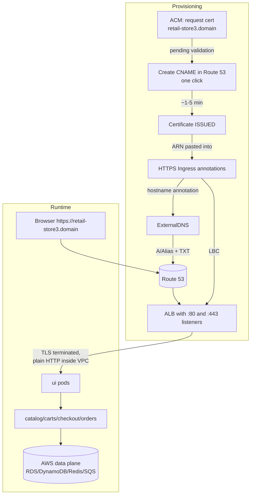

# Section 16 — Retail Store with ExternalDNS, Custom Domain & HTTPS

> Source: transcript `16) External DNS` (second half, lecture 16xx demo).
> The end-to-end payoff demo: the Section 14 retail store, reachable at `https://retail-store3.yourdomain.com` with a valid certificate — DNS registered automatically by the Section 15 ExternalDNS, TLS terminated at the ALB with an ACM certificate.
>
> ⚠️ **GAP (repo):** like Section 15, the Section 16 folder isn't in the cloned repo snapshot. It is the Section 14 `RetailStore_k8s_manifests_with_Data_Plane/` tree (see [14-retailstore-aws-dataplane.md](14-retailstore-aws-dataplane.md) §6.6) with the Ingress manifests extended by the annotations shown in §6 below.

---

## 1. Objective

Serve the full retail store (UI + 4 microservices + AWS data plane) on **your own domain over HTTPS**:
- `http://retail-store1.<domain>` — HTTP Ingress, DNS record auto-created by ExternalDNS.
- `https://retail-store3.<domain>` — HTTPS Ingress with an **ACM public certificate**, HTTP→HTTPS redirect, DNS auto-created.
- Understand the ExternalDNS **`upsert-only` vs `sync`** deletion policies — and why deleted apps leave DNS records behind by default.

---

## 2. Problem Statement

After Section 14 the app works — but users reach it at `k8s-default-retailst-xxxxxxxxxx.us-east-1.elb.amazonaws.com`, over plain HTTP. No real product ships like that: you need a human-readable domain (marketing, cookies, OAuth redirect URIs all depend on it) and TLS (browsers mark HTTP "Not secure"; checkout forms over HTTP are unacceptable). Doing DNS by hand re-introduces exactly the toil Section 15 eliminated, and running your own TLS means certificate renewal pain — unless ACM does it.

---

## 3. Why This Approach

| Concern | Chosen tool | Alternative | Why this one |
|---|---|---|---|
| DNS record | ExternalDNS annotation | manual Route 53 / Terraform `aws_route53_record` | record lifecycle follows the Ingress; nothing to remember |
| Certificate | **ACM public cert** (free, auto-renews) | Let's Encrypt + cert-manager in-cluster | ALB integrates natively with ACM; zero renewal ops; keys never leave AWS |
| TLS termination | **at the ALB** (Ingress annotation) | in-pod TLS / service mesh | offloads crypto, one cert config for all pods behind the Ingress |
| Domain validation | DNS validation (one-click CNAME into Route 53) | email validation | automatic, renewable without humans |
| HTTP→HTTPS | ALB `ssl-redirect` annotation | app-level redirect | edge redirect, app stays protocol-unaware |

---

## 4. How It Works — Under the Hood

### Vocabulary map

| AWS term | Kubernetes equivalent | Plain English |
|---|---|---|
| ACM certificate | `kubernetes.io/tls` Secret (rough analogy) | TLS cert AWS issues, stores, renews for you |
| DNS validation CNAME | ACME DNS-01 challenge | "prove you control the domain" record |
| ALB HTTPS listener :443 | Ingress TLS section | where TLS terminates |
| `ssl-redirect` annotation | 308 redirect rule | port 80 → 443 bounce at the edge |
| Alias A record | — | Route 53's free, health-aware pointer to the ALB |

### Full request + provisioning picture



### ASCII — the two Ingresses

```
retail-store1 (HTTP)                       retail-store3 (HTTPS)
Ingress: listen 80                         Ingress: listen 80 + 443, certificate-arn, ssl-redirect=443
   │ external-dns annotation                  │ external-dns annotation
   ▼                                          ▼
ALB #1  ──A record── retail-store1.domain  ALB #2 ──A record── retail-store3.domain
   │                                          │  :80 ──308──▶ :443 (TLS: ACM cert)
   ▼                                          ▼
 ui svc ──▶ microservices ──▶ data plane    ui svc ──▶ microservices ──▶ data plane
```

### The deletion-policy surprise (the lecture's closing lesson)

```
kubectl delete ingress ─▶ LBC deletes the ALB      ✅ (stops billing)
                       ─▶ ExternalDNS policy check:
                            upsert-only (EKS add-on DEFAULT) → record LEFT BEHIND ❌
                            sync                              → record deleted    ✅
```
`kubectl -n external-dns get deploy external-dns -o yaml` shows the container args: `--log-level=info`, `--interval=1m`, `--source=service --source=ingress`, `--registry=txt --txt-owner-id=retail-dev-eksdemo1`, `--provider=aws`, **`--policy=upsert-only`**. AWS ships the add-on with `upsert-only` deliberately — a controller that can *delete* DNS in production is a foot-gun; safe-by-default means create/update only. Trade-off: you now own record cleanup (or reconfigure to `sync`).

---

## 5. Instructor's Approach

1. **Prerequisite gate, checked live** — this demo composes *everything*:
   - Secrets Manager secret `retailstore-db-secret-1` exists (Section 14 manual step).
   - **Data plane provisioned**: `terraform state list` + `terraform output` in `14_01/03_AWS_Data_Plane_terraform-manifests` — endpoints must exist and be pasted into the catalog ExternalName, checkout CM, orders CM (carts needs nothing: DynamoDB endpoint is regional).
   - Section 15 ExternalDNS installed and healthy.
   - **You own a domain** with a Route 53 hosted zone (registered in Route 53, or registered at GoDaddy/Namecheap and delegated). Explicit note: students without one should *watch only* — don't buy a domain for a demo.
2. **HTTP first**: add just the ExternalDNS annotation to the Section 14 HTTP Ingress → `retail-store1`.
3. **Certificate before HTTPS Ingress**: request in ACM → shows the `Pending validation` state deliberately (his first cert auto-validated because a prior CNAME existed — so he requests a *second* one, `retail-store3`, to show the real flow: "Create records in Route 53" → CNAME → Issued in ~1–5 min). Lesson: DNS validation = proving zone ownership.
4. Paste the cert **ARN** into the HTTPS Ingress; walk the annotation trio (cert ARN, listen-ports, ssl-redirect).
5. **Deploy in the fixed order** (SPC → microservices recursively → ingress) while **tailing ExternalDNS logs** — you watch the records get created, then confirm in Route 53, then `kubectl get ingress`, then `nslookup`, then browser: HTTP works; HTTPS URL redirects from HTTP, padlock shows an Amazon-issued cert; full purchase flow tested on both.
6. **Cleanup with a twist**: `kubectl delete -R -f` … then he waits ~5 minutes and the Route 53 records are *still there* — which he uses to teach `upsert-only` vs `sync` (see §4). Records removed by hand; earlier leftover `retail-store2` record explained the same way.
7. **Cost discipline epilogue**: destroy the 14_01 data plane now — Section 17 (Karpenter) doesn't need it and takes a long time; recreate the data plane when Demo 18 needs it.

> 🐛 **TRANSCRIPT ERRORS (ASR):** "stack simplify calm" = stacksimplify.com; "zinc/sink" = `sync` (the ExternalDNS policy); "Reddis" = Redis; "Irca" = IRSA; "CHT as manifest" = k8s manifests; "ECS add on" = EKS add-on (recurring).

---

## 6. Code & Commands — Line by Line

### 6.1 HTTP Ingress + ExternalDNS annotation (`03_ingress/01_ingress_http_ip_mode.yaml`)

```yaml
apiVersion: networking.k8s.io/v1
kind: Ingress
metadata:
  name: retailstore-http-ip-mode
  annotations:
    alb.ingress.kubernetes.io/scheme: internet-facing
    alb.ingress.kubernetes.io/target-type: ip            # pods as targets (Section 11 lesson)
    alb.ingress.kubernetes.io/healthcheck-path: /actuator/health
    # THE one-line change that replaces the whole manual Route 53 workflow:
    external-dns.alpha.kubernetes.io/hostname: retail-store1.stacksimplify.com   # ← your domain
spec:
  ingressClassName: alb
  defaultBackend:
    service: { name: ui, port: { number: 80 } }
```

### 6.2 Request the ACM certificate (console, one-time per hostname)

```
ACM → Request certificate → Public → Fully qualified domain name: retail-store3.<yourdomain>
    → DNS validation (default) → Request
Status: Pending validation
    → button "Create records in Route 53"   ← adds the validation CNAME into your hosted zone
Wait 1–5 min → Status: Issued → copy the ARN
```
CLI equivalent:
```bash
aws acm request-certificate --domain-name retail-store3.<yourdomain> --validation-method DNS
aws acm describe-certificate --certificate-arn <arn> \
  --query 'Certificate.DomainValidationOptions[0].ResourceRecord'   # CNAME to create
aws acm wait certificate-validated --certificate-arn <arn>
```
What DNS validation proves: only someone controlling the zone can plant that CNAME → ACM will issue (and silently **auto-renew** while the CNAME stays in place — never delete it).

### 6.3 HTTPS Ingress (`03_ingress/02_ingress_https_ip_mode.yaml`)

```yaml
apiVersion: networking.k8s.io/v1
kind: Ingress
metadata:
  name: retailstore-https-ip-mode
  annotations:
    alb.ingress.kubernetes.io/scheme: internet-facing
    alb.ingress.kubernetes.io/target-type: ip
    alb.ingress.kubernetes.io/healthcheck-path: /actuator/health
    # 1. both listeners on the ALB:
    alb.ingress.kubernetes.io/listen-ports: '[{"HTTP": 80}, {"HTTPS": 443}]'
    # 2. the ACM cert for the :443 listener (paste YOUR issued ARN):
    alb.ingress.kubernetes.io/certificate-arn: arn:aws:acm:us-east-1:<acct>:certificate/<id>
    # 3. bounce all :80 traffic to :443 at the edge:
    alb.ingress.kubernetes.io/ssl-redirect: '443'
    # 4. and register the name automatically:
    external-dns.alpha.kubernetes.io/hostname: retail-store3.stacksimplify.com
spec:
  ingressClassName: alb
  defaultBackend:
    service: { name: ui, port: { number: 80 } }
```
Note the demo runs **two Ingresses → two ALBs** (HTTP demo + HTTPS demo). In real life you'd have one HTTPS Ingress only — or share one ALB across Ingresses with `alb.ingress.kubernetes.io/group.name`.

### 6.4 Deploy + watch DNS happen

```bash
cd RetailStore_k8s_manifests_with_Data_Plane      # Section 16 copy (endpoints already pasted!)

kubectl apply -f 01_secretproviderclass/
kubectl get secretproviderclass                    # catalog + orders SPCs

kubectl apply -R -f 02_RetailStore_Microservices/  # -R = recursive: YAMLs live in nested per-service folders
kubectl get pods,deploy,svc,sa,cm                  # all five services up
kubectl get secrets                                # catalog-db + orders-db (CSI sync fired on mount)

# tail ExternalDNS BEFORE applying ingress — watch the records get created live:
kubectl -n external-dns logs -l app.kubernetes.io/name=external-dns -f &
kubectl apply -f 03_ingress/
# logs: "Desired change: CREATE retail-store1.<domain> A" + TXT ... same for retail-store3
```

### 6.5 Verify end to end

```bash
kubectl get ingress            # both ALBs' DNS names in ADDRESS
# Route 53 console → hosted zone → search "retail-store" → A records exist,
#   values = the two ALB DNS names (match the EC2 → Load Balancers view)
nslookup retail-store1.<yourdomain>     # resolves to ALB IPs
nslookup retail-store3.<yourdomain>
# Browser:
#   http://retail-store1.<domain>  → app works (Not secure — expected)
#   http://retail-store3.<domain>  → 308 → https://retail-store3.<domain>, padlock:
#       "Connection is secure", cert issued by Amazon RCA
# Full flow on both: browse → add to cart → checkout → purchase ✔ (data plane confirmed live)
```

### 6.6 Cleanup + the upsert-only lesson

```bash
kubectl delete -R -f RetailStore_k8s_manifests_with_Data_Plane/
kubectl get ingress            # gone; EC2 console: ALBs deleted (billing stopped)

# ~5 min later: Route 53 records STILL EXIST. Why?
kubectl -n external-dns get deploy external-dns -o yaml | grep -A12 'args:'
#   --interval=1m  --source=service --source=ingress
#   --registry=txt --txt-owner-id=retail-dev-eksdemo1
#   --provider=aws --policy=upsert-only        ← create/update, NEVER delete (add-on default, by design)
# → delete retail-store1/retail-store3 A+TXT records manually in Route 53
# (alternative: configure the add-on with policy=sync for full create/update/delete reconciliation)

# 💰 Destroy the data plane until Demo 18 needs it again:
cd 14_01_RetailStore_AWS_Data_Plane/03_AWS_Data_Plane_terraform-manifests
terraform destroy -auto-approve       # RDS x2, ElastiCache, DynamoDB, SQS all go
# (cluster + ExternalDNS stay up for Section 17 — Karpenter)
```

---

## 7. Complete Code Reference (execution order)

```
Section 16 folder = Section 14's RetailStore_k8s_manifests_with_Data_Plane/ PLUS:
├── 03_ingress/01_ingress_http_ip_mode.yaml    + external-dns hostname annotation (retail-store1)
└── 03_ingress/02_ingress_https_ip_mode.yaml   + listen-ports 80/443, certificate-arn, ssl-redirect,
                                                 external-dns hostname (retail-store3)
```

One-page runbook:
1. Prereqs: cluster w/ add-ons + ExternalDNS (S13+S15) · data plane applied (S14 `terraform state list` non-empty) · endpoints pasted into ExternalName/CMs · Secrets Manager secret exists · hosted zone exists.
2. ACM: request cert for `retail-store3.<domain>` → Create records in Route 53 → wait Issued → copy ARN into HTTPS Ingress.
3. `kubectl apply -f 01_secretproviderclass/` → `kubectl apply -R -f 02_RetailStore_Microservices/` → `kubectl apply -f 03_ingress/`.
4. Verify: ExternalDNS logs → Route 53 records → `nslookup` → browser HTTP + HTTPS + purchase.
5. Teardown: `kubectl delete -R -f .` → confirm ALBs gone → **manually delete the DNS records** (upsert-only) → `terraform destroy` the data plane.

---

## 8. Hands-On Labs

### Lab A — Reproduce the HTTPS storefront

> 💰 **Cost warning:** everything from Section 14 (≈$0.40–0.50/h) **plus a second ALB** (~$0.02/h + LCU). ACM public certs are free. Requires a domain (~$3–12/yr if you must buy one — the instructor says don't, just for a demo). **Teardown same session; remember DNS records don't self-delete.**

**Prerequisites / Steps / Expected output / Verify:** §7 runbook; success = padlocked `https://retail-store3.<domain>` completing a purchase that lands in PostgreSQL + SQS.
🧹 **Teardown:** §6.6 in full — the three-step check is ALBs gone, DNS records manually removed, data plane destroyed.

### Lab B — Variation: one ALB, host-based routing, sync policy

1. Merge both Ingresses into one HTTPS Ingress and add a second host rule (`retail-store1` → ui, `retail-store3` → ui) — or keep two Ingresses but give both `alb.ingress.kubernetes.io/group.name: retail` → **one shared ALB**, half the cost.
2. Request a **wildcard cert** `*.yourdomain.com` instead of per-host certs; reuse one ARN for all hostnames.
3. Reconfigure the ExternalDNS add-on with `policy: sync` (add-on configuration values / `--set policy=sync` if Helm-installed), redeploy an annotated Ingress, delete it, and watch the record disappear this time.

**Verify:** both hostnames serve from a single ALB DNS (compare `kubectl get ingress` ADDRESS values); after step 3's delete, Route 53 is clean with no manual work.
🧹 Same as Lab A.

**Free local variant:** on kind + ingress-nginx, approximate the flow with `cert-manager` + a self-signed ClusterIssuer and entries in `/etc/hosts` (`127.0.0.1 retail-store3.local`) — same Ingress TLS mechanics, zero AWS cost. What you *can't* reproduce locally: ACM auto-renewal and ExternalDNS↔Route 53.

### Lab C — Break-it-and-fix-it

1. **Use the cert ARN while "Pending validation."** LBC events on the Ingress show a listener-creation failure (cert not issued). **Fix:** click *Create records in Route 53*, wait for `Issued`, re-apply. Confirm: `aws acm describe-certificate ... --query 'Certificate.Status'`.
2. **Hostname/cert mismatch:** annotation `retail-store1...` with the `retail-store3` cert on :443. DNS and ALB work, but the browser throws `NET::ERR_CERT_COMMON_NAME_INVALID`. **Fix:** hostname must match the cert's CN/SAN (or use a wildcard cert).
3. **Delete the validation CNAME after issuance.** Nothing breaks today — but renewal will silently fail in ~13 months (ACM emails warnings). Teaches: the validation record is *permanent* infrastructure. **Fix:** restore the CNAME (ACM console shows it).
4. **Deploy Ingress before the data plane exists.** DNS + ALB come up fine, but the app's topology page shows all backends unhealthy and purchases fail — DNS automation can't save an app with no databases. **Fix:** apply `14_01` first; order of §7 runbook matters.

---

## 9. Troubleshooting

| Symptom | Likely cause | Command to confirm | Fix |
|---|---|---|---|
| Record never appears in Route 53 | annotation typo / hostname not under any hosted zone in this account | `kubectl -n external-dns logs -l app.kubernetes.io/name=external-dns` | Correct `external-dns.alpha.kubernetes.io/hostname`; must be a subdomain of your zone |
| Cert stuck `Pending validation` | validation CNAME never created (or zone is elsewhere) | `aws acm describe-certificate --certificate-arn <arn>` | "Create records in Route 53" button; if domain is at GoDaddy etc., create the CNAME there or delegate the zone |
| Ingress created but no ALB, events mention certificate | cert ARN invalid / wrong region (ACM cert must be in the ALB's region) / not yet Issued | `kubectl describe ingress <n>` | Use the Issued ARN from the same region as the cluster |
| Browser `ERR_CERT_COMMON_NAME_INVALID` | cert CN/SAN ≠ hostname | click the padlock → cert details | Per-host cert or wildcard `*.domain` |
| `http://` on the HTTPS host doesn't redirect | `ssl-redirect` annotation missing or listen-ports lacks HTTP 80 | `kubectl get ingress <n> -o yaml` | Need **both** `listen-ports: '[{"HTTP":80},{"HTTPS":443}]'` and `ssl-redirect: '443'` |
| DNS resolves but site times out | stale record from a previous ALB (upsert-only leftovers) or ALB SG issue | `nslookup <host>` vs `kubectl get ingress` ADDRESS | Delete stale A+TXT records; redeploy Ingress |
| App loads but backends unhealthy | data plane not provisioned / endpoints not pasted after recreate | `terraform state list` in `14_01/03_...`; `/topology` page | Apply data plane; update ExternalName + checkout/orders CMs with fresh `terraform output` values |
| Deleted everything but records remain | **expected** — `--policy=upsert-only` | `kubectl -n external-dns get deploy external-dns -o yaml \| grep policy` | Manual cleanup, or run the controller with `policy=sync` |
| Old unexpected records in the zone (e.g. `retail-store2`) | prior demo deleted the whole cluster before the Ingress → nothing existed to clean up | Route 53 console search | Manual deletion; in prod, periodic zone audits or `sync` policy |

---

## 10. Interview Articulation

**90-second spoken answer — "How do you expose a Kubernetes app on a custom domain with TLS on AWS?"**

> "Three pieces, all declarative. The AWS Load Balancer Controller turns our Ingress into an internet-facing ALB in IP-target mode. TLS terminates at that ALB using a free ACM public certificate — requested once with DNS validation, where ACM gives you a CNAME to place in the Route 53 zone proving domain ownership; the cert then auto-renews forever as long as that CNAME stays. On the Ingress, three annotations wire it up: `certificate-arn`, `listen-ports` for 80 and 443, and `ssl-redirect: 443` so plain HTTP bounces to HTTPS at the edge. The DNS record itself is created by ExternalDNS — the Ingress carries an `external-dns.alpha.kubernetes.io/hostname` annotation, and the controller upserts the A/Alias record to the ALB within its one-minute sync loop, with a TXT ownership record alongside. The gotcha I always flag: the EKS add-on ships with `--policy=upsert-only`, so deleting the Ingress removes the ALB but deliberately leaves the DNS record — safe-by-default against accidental production DNS deletion, but it means teardown includes manual record cleanup unless you opt into `policy=sync` for full reconciliation. End state: developers ship a hostname and a cert ARN in YAML; nobody touches the Route 53 or ACM consoles per deployment."

<details>
<summary>Self-test Q&A (5)</summary>

**Q1. Walk through what happens between `kubectl apply -f ingress.yaml` and `https://retail-store3.domain` loading.**
A: LBC sees the Ingress → provisions ALB with :80/:443 listeners, attaches the ACM cert to :443, sets the 80→443 redirect, registers ui pods as IP targets → Ingress status gets the ALB address. ExternalDNS's next sync tick sees the hostname annotation + address → upserts A/Alias + TXT in Route 53. Browser resolves the name to the ALB, TLS handshakes against the ACM cert, request forwards as HTTP to a ui pod inside the VPC.

**Q2. How does ACM DNS validation work and why must the CNAME stay forever?**
A: ACM issues only after seeing a specific CNAME (random name/value) in the domain's DNS — plantable only by someone controlling the zone. ACM re-checks the same record at every auto-renewal (~13 months), so deleting it doesn't break today's cert but breaks the next renewal.

**Q3. Why did the Route 53 records survive `kubectl delete` of the Ingress?**
A: The EKS add-on runs ExternalDNS with `--policy=upsert-only` — create and update, never delete. AWS's safe default so a misconfigured controller can't wipe production DNS. `--policy=sync` enables full reconciliation including deletes; with the default, teardown includes manual record cleanup.

**Q4. HTTP and HTTPS demos created two ALBs — how would you avoid that in production?**
A: One HTTPS-only Ingress (with ssl-redirect covering HTTP), or `alb.ingress.kubernetes.io/group.name` so multiple Ingresses share one ALB with combined rules; plus a wildcard ACM cert to cover all hostnames on the shared listener.

**Q5. What prevents ExternalDNS from overwriting a record your DBA created manually?**
A: The TXT registry. ExternalDNS only modifies records that have a companion TXT record carrying its own `--txt-owner-id`. Manual records lack that TXT, so the controller treats them as foreign and leaves them alone.

</details>

---

*Previous: [15 — Terraform EKS with ExternalDNS](15-terraform-eks-externaldns.md) · Next: [17 — Autoscaling with Karpenter](17-karpenter-autoscaling.md) · [Index](00-INDEX.md)*
