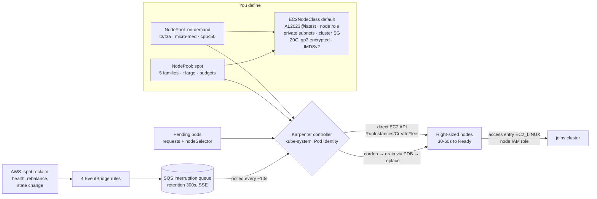

# Section 17 — Autoscaling with Karpenter

> Source: transcript `17) Karpenter` (demos 1701–1704).
> The course's flagship cost-optimization section: replace "locked, slow" node-group scaling with Karpenter's just-in-time, right-sized, spot-aware provisioning — installed by Terraform, configured by CRDs, proven with a zero-downtime interruption drill.
>
> ✅ **VERIFIED against the canonical repo:** the code lives in `17_Autoscaling_Karpenter/17_01_Karpenter_Install/` — the `03_KARPENTER_terraform-manifests/` folder contains exactly `c6_01_karpenter_controller_iam_role.tf` … `c6_08_karpenter_eventbridge_rules.tf` (controller IAM role/policy, PIA, node role, access entry, helm install, SQS queue, EventBridge rules) and `04_KARPENTER_k8s-manifests/` holds `01_ec2nodeclass.yaml` + the on-demand/spot NodePools — **matching the reconstruction below.** An earlier partial clone had only folders `01–14`. Karpenter CRD versions: `karpenter.sh/v1`, `karpenter.k8s.aws/v1`. Use the repo files as source of truth.

---

## 1. Objective

Install and operate **Karpenter** on the EKS cluster so worker nodes are provisioned *from pod requirements* rather than pre-defined node groups:

- 4-layer build: VPC → EKS+add-ons (with one **tag change**: `kubernetes.io/cluster/<name>` `shared`→`owned`) → **Karpenter infra via Terraform** (21 resources: controller IAM+PIA, node IAM+access entry, SQS+4 EventBridge rules, Helm release) → **Karpenter config via CRDs** (EC2NodeClass + on-demand & spot NodePools).
- Demos: right-sized on-demand scaling (5→10→2→0 replicas, nodes appear/disappear in 30–60s), spot provisioning (70–90% cheaper), and a **simulated spot interruption** handled with **zero downtime** thanks to a PodDisruptionBudget.

---

## 2. Problem Statement

Five pods deployed; two fit on existing nodes; three sit **Pending**. With the classic **Cluster Autoscaler** the fix is painful four ways:

1. **Locked sizes** — CA scales Auto Scaling Groups, and each node group has one instance type (our `t3.small` from `terraform.tfvars`). Pods needing 0.5 vCPU get a whole 2-vCPU node: paid-for waste.
2. **Slow** — ASG lifecycle + registration = 3–5 minutes per scale-up.
3. **Blind to price** — CA can't consider a cheaper type outside the node group's definition, and can't mix spot intelligently.
4. **Timid scale-down** — only removes *completely empty* nodes, after a ~10-minute wait; underutilized-but-not-empty nodes live forever.

Result: clusters chronically over-provisioned. Karpenter attacks all four at once.

---

## 3. Why This Approach

| | Cluster Autoscaler | **Karpenter** |
|---|---|---|
| Node source | pre-defined ASGs/node groups | **direct EC2 API calls** — any of hundreds of types |
| Sizing | fixed per node group | **bin-packs pending pods** → right-sized node (mixes t3.small + t3a.small in one scale-up) |
| Speed | 3–5 min | **30–60 s** |
| Cost levers | none beyond ASG mixed instances | type/size/AZ/price-aware; spot-first where allowed |
| Scale-down | empty nodes only, +10 min wait | **active consolidation**: drains underutilized nodes, replaces several small with one cheaper, can swap on-demand→spot |
| Spot interruption handling | external tool (node-termination-handler) | built-in via **SQS + EventBridge** |
| Config | ASG settings | Kubernetes CRDs (NodePool / EC2NodeClass) in Git |

Design decisions the instructor calls out:
- **Karpenter infra is a separate Terraform project** (`03_karpenter_terraform-manifests`, own state key) — optional layer you can destroy without touching the working VPC/EKS/add-ons stack.
- **Managed node group stays** — it hosts the *system* pods (Karpenter itself, LBC, CSI drivers, CoreDNS, PIA). Karpenter must never be scheduled on a node it manages (chicken-and-egg on consolidation). Application workloads target Karpenter pools via nodeSelector.
- **nodeSelector on workloads is optional but strongly recommended** — without it, pods land wherever there's room (managed group, either pool) and capacity becomes an unmanaged mess.

---

## 4. How It Works — Under the Hood

### Vocabulary map

| Karpenter / AWS term | Old-world equivalent | Plain English |
|---|---|---|
| **NodePool** (`karpenter.sh/v1`) | node group definition | the *menu*: what kinds of nodes may exist (arch, capacity type, families, sizes, zones, CPU cap, disruption rules) |
| **EC2NodeClass** (`karpenter.k8s.aws/v1`) | launch template | the *blueprint*: AMI, IAM role, subnets, SGs, disk, IMDS |
| **NodeClaim** | ASG desired-capacity bump | one requested node — watch these to see Karpenter think |
| `karpenter.sh/capacity-type` label | ASG purchase option | `on-demand` or `spot`, targetable via nodeSelector |
| Consolidation | scale-down | drain + repack pods onto fewer/cheaper nodes |
| Interruption queue (SQS) | node-termination-handler | 2-minute spot warnings land here; Karpenter polls it |
| **EKS access entry** (`EC2_LINUX`) | aws-auth ConfigMap entry | lets Karpenter-made nodes join the cluster |
| PodDisruptionBudget | — | "never let running replicas drop below N during voluntary evictions" |

### Architecture



### ASCII — the interruption drill's six stages (demo 1704)

```
T+0s    AWS: "spot instance i-abc reclaimed in 2 minutes" → EventBridge → SQS
T+10-20s Karpenter polls SQS → CORDONS old node (no new pods) → starts REPLACEMENT node (proactive!)
T+40-60s Wave 1: PDB (minAvailable: 3 of 5) permits evicting only 2 pods → they start on the new node
T+60-90s Wave 2: PDB sees 2 pods Running on new node → releases the last 3 → they migrate
T+90-120s Old node empty → terminated (inside AWS's 2-minute window)
Final    All 5 pods on the new node. Running count never dropped below 3. ZERO downtime.
Without the PDB: all 5 evicted at once → 30-40s user-visible outage while they restart.
```

### Why the `owned` tag matters (the c5 change)

Managed node groups are created *by the EKS service*, which doesn't care whether the subnet tag `kubernetes.io/cluster/<name>` says `shared` or `owned`. Karpenter bypasses EKS and calls **the EC2 API directly with your IAM role** — AWS requires subnets used that way to be tagged **`owned`**. Hence the one edit in `c5_eks_tags.tf` (all six subnets flip `shared`→`owned`; `terraform plan` shows *6 to change, 0 to add/destroy* — safe on the running cluster).

---

## 5. Instructor's Approach

1. **Why before what** — ~15 minutes purely on CA vs Karpenter with the pending-pods diagram, then the architecture (controller / NodePool / EC2NodeClass / NodeClaim), then a mini-lesson on **nodeSelector** (first time in the course) because the demos depend on it.
2. **Four-layer layout** stated explicitly: `01_VPC` + `02_EKS...` copied from Section 15 (bucket names in the usual three files!), `03_karpenter_terraform-manifests` new, `04_karpenter_k8s-manifests` new. Create in that order, destroy in reverse.
3. **The tag fix first** (c5 `shared`→`owned`) applied to the live cluster before anything Karpenter-shaped exists — so the failure mode never occurs.
4. **IAM in two halves, deliberately contrasted:**
   - *Controller* role — trust `pods.eks.amazonaws.com` (Pod Identity), ~500-line least-privilege policy transcribed from Karpenter's official `cloudformation.yaml` (scoped EC2 run/terminate, fleets, launch templates, pricing/SSM AMI lookups, SQS read, instance-profile management, EKS describe).
   - *Node* role — trust `ec2.amazonaws.com` (instance profile!), four **AWS-managed** policies: `AmazonEKSWorkerNodePolicy`, `AmazonEC2ContainerRegistryPullOnly`, `AmazonEKS_CNI_Policy`, `AmazonSSMManagedInstanceCore`.
   He hammers the distinction: controller role = *create/terminate nodes*; node role = *be a node*.
5. **Access entries as a topic** — console tour of the Access tab, `STANDARD` (humans/kubectl) vs `EC2_LINUX` (nodes) types, and the historical note that this replaced the aws-auth ConfigMap.
6. **Interruption plumbing before the controller** — SQS queue (300 s retention "because a 2-minute warning is stale after 5", SSE on, policy allowing `events.amazonaws.com` + deny non-TLS) and the four EventBridge rules (health events, **spot interruption warning**, rebalance recommendation, instance state change), each explained by scenario.
7. **Helm release last** with OCI chart `oci://public.ecr.aws/karpenter/karpenter` and a `depends_on` covering *everything* (roles, attachment, PIA, access entry, queue) — create and destroy safety again. Version-pinning recommended.
8. **Apply (21 resources) → verify at every layer**: IAM console, PIA association, access entry, SQS, EventBridge targets, `helm list`, pods, logs.
9. **CRDs reviewed line-by-line, then the three demos** — each one driven by watching `kubectl get nodeclaims` (his favorite lens) plus Karpenter logs, with 30-second consolidation timers pointed out live.
10. **1704 finale** — six-stage slide-walk first, then the live simulation: craft a fake `EC2 Spot Instance Interruption Warning` message with the *real instance ID* and send it to the SQS queue; watch four terminals (logs / nodes -w / pods -w / nodeclaims) prove the zero-downtime story; repeat with a second message to internalize it.

> 🐛 **TRANSCRIPT ERRORS (ASR):** "Carpenter" = Karpenter (throughout); "spark node pool" = spot node pool; "Army/mi/Ami" = AMI; "P3 small" = t3.small; "Pia/PII" = Pod Identity; "card on" = cordon; "Open Container Initial" = Open Container Initiative; "trains are used to repel pods" = **taints** are used to repel pods; "x axis entry / ECS access entry" = EKS access entry; "TSS enabled" = SSE (server-side encryption); "ozone/edges" = AZs.

---

## 6. Code & Commands — Line by Line

### 6.0 Prereq — the tag change (in the copied `02_EKS...` project)

```hcl
# c5_eks_tags.tf — private (and public, for consistency) subnet tags:
"kubernetes.io/cluster/${local.name}-eksdemo1" = "owned"   # was "shared"
# terraform plan → "6 to change, 0 to add, 0 to destroy" → apply. Live cluster unaffected.
```

### 6.1 Karpenter Terraform project (`03_karpenter_terraform-manifests`)

**c1–c5 (base):** providers `aws`, `helm`, `kubernetes`; backend key `karpenter/dev/terraform.tfstate`; VPC + EKS remote-state datasources (bucket name in **c1, c3_01, c3_02**); locals add `cluster_name` (pulled once from EKS remote state — referenced dozens of times in the big policy); helm/kubernetes providers fed from remote-state outputs (endpoint, CA) — the Section 13 pattern but **cross-project**.

**c6_01 — controller IAM role:**
```hcl
data "aws_iam_policy_document" "karpenter_controller_assume" {
  statement {
    actions = ["sts:AssumeRole", "sts:TagSession"]
    principals { type = "Service"  identifiers = ["pods.eks.amazonaws.com"] }  # Pod Identity
  }
}
resource "aws_iam_role" "karpenter_controller" {
  name               = "${local.name}-karpenter-controller-role"
  assume_role_policy = data.aws_iam_policy_document.karpenter_controller_assume.json
}
```

**c6_02 — the ~500-line controller policy** (from Karpenter's official CloudFormation, converted to a `aws_iam_policy_document` with statements like `AllowScopedEC2InstanceActions`, `AllowScopedEC2LaunchTemplateActions`, `AllowScopedResourceCreationTagging`, `AllowScopedDeletion`…). Permission groups, by purpose:

| Group | Representative actions | Why |
|---|---|---|
| Provisioning | `ec2:RunInstances`, `ec2:CreateFleet`, `ec2:CreateLaunchTemplate` | make nodes |
| Discovery | `ec2:DescribeInstanceTypes/Subnets/AvailabilityZones`, `pricing:GetProducts` | choose the cheapest fit |
| Lifecycle | `ec2:TerminateInstances` (tag-scoped) | consolidation/interruption |
| Interruption | `sqs:ReceiveMessage/DeleteMessage/GetQueueAttributes/GetQueueUrl` | poll the queue |
| IAM | `iam:CreateInstanceProfile/AddRoleToInstanceProfile/PassRole` (scoped) | wire node role onto instances |
| Cluster/AMI | `eks:DescribeCluster`, `ssm:GetParameter` | endpoint + `AL2023@latest` AMI resolution |

Then `aws_iam_policy` from the document + `aws_iam_role_policy_attachment` to the controller role. Note the **tag scoping**: destructive actions are conditioned on the `karpenter.sh/discovery` tag — least privilege in practice.

**c6_03 — Pod Identity association:** cluster `local.cluster_name`, namespace `kube-system`, SA **`karpenter`**, controller role ARN.

**c6_04 — node IAM role:**
```hcl
data "aws_iam_policy_document" "node_assume" {
  statement {
    actions = ["sts:AssumeRole"]
    principals { type = "Service"  identifiers = ["ec2.amazonaws.com"] }   # instance profile, NOT Pod Identity
  }
}
resource "aws_iam_role" "karpenter_node" { name = "${local.name}-karpenter-node-role"  assume_role_policy = ... }
resource "aws_iam_role_policy_attachment" "node_policies" {
  for_each = toset([
    "arn:aws:iam::aws:policy/AmazonEKSWorkerNodePolicy",           # join cluster, node status
    "arn:aws:iam::aws:policy/AmazonEC2ContainerRegistryPullOnly",  # pull images
    "arn:aws:iam::aws:policy/AmazonEKS_CNI_Policy",                # ENIs + pod IPs
    "arn:aws:iam::aws:policy/AmazonSSMManagedInstanceCore"         # SSM session/patching, no SSH
  ])
  policy_arn = each.value
  role       = aws_iam_role.karpenter_node.name
}
```

**c6_05 — EKS access entry** (what lets the new EC2 boxes *join*):
```hcl
resource "aws_eks_access_entry" "karpenter_node_access" {
  cluster_name  = local.cluster_name
  principal_arn = aws_iam_role.karpenter_node.arn
  type          = "EC2_LINUX"     # node entry (vs STANDARD for kubectl users); joins group system:nodes
}
```

**c6_07 — SQS interruption queue:**
```hcl
resource "aws_sqs_queue" "karpenter_interruption" {
  name                      = local.cluster_name          # Karpenter convention: queue == cluster name
  message_retention_seconds = 300    # warnings are useless after the 2-min window — don't hoard stale ones
  sqs_managed_sse_enabled   = true   # encryption at rest
}
resource "aws_sqs_queue_policy" "karpenter_interruption" {
  queue_url = aws_sqs_queue.karpenter_interruption.url
  policy = jsonencode({ Version = "2012-10-17", Statement = [
    { Sid = "AllowEventBridge", Effect = "Allow",
      Principal = { Service = ["events.amazonaws.com", "sqs.amazonaws.com"] },   # sqs.amazonaws.com kept for test-message injection
      Action = "sqs:SendMessage", Resource = aws_sqs_queue.karpenter_interruption.arn },
    { Sid = "DenyInsecure", Effect = "Deny", Principal = "*", Action = "sqs:*",
      Resource = aws_sqs_queue.karpenter_interruption.arn,
      Condition = { Bool = { "aws:SecureTransport" = "false" } } }               # HTTPS only
  ]})
}
```

**c6_08 — four EventBridge rules** (resource still named `aws_cloudwatch_event_rule` — EventBridge's old name), each with an `aws_cloudwatch_event_target` → the queue ARN:

| Rule | `event_pattern` | Scenario |
|---|---|---|
| Health | `source: aws.health` | scheduled maintenance / hardware failure → drain ahead of time |
| **Spot interruption** | `source: aws.ec2`, detail-type `EC2 Spot Instance Interruption Warning` | the 2-minute reclaim notice — the big one |
| Rebalance | detail-type `EC2 Instance Rebalance Recommendation` | "elevated risk" early signal — optional pre-drain, more runway than 2 min |
| State change | detail-type `EC2 Instance State-change Notification` | pending/running/stopped/terminated — keeps Karpenter's world-view honest (catches manual stops) |

**c6_06 — the controller itself (Helm from OCI):**
```hcl
resource "helm_release" "karpenter" {
  depends_on = [aws_iam_role.karpenter_controller, aws_iam_policy.karpenter_controller,
                aws_iam_role_policy_attachment.karpenter_controller,
                aws_eks_pod_identity_association.karpenter,
                aws_eks_access_entry.karpenter_node_access,
                aws_sqs_queue.karpenter_interruption]
  name             = "karpenter"
  repository       = "oci://public.ecr.aws/karpenter"    # OCI registry (Section 12's helm-OCI lesson, applied)
  chart            = "karpenter"
  namespace        = "kube-system"
  create_namespace = false
  # version = "1.x.y"   # pin in prod
  set = [
    { name = "settings.clusterName",       value = local.cluster_name },
    { name = "settings.clusterEndpoint",   value = data.terraform_remote_state.eks.outputs.cluster_endpoint },
    { name = "settings.interruptionQueue", value = aws_sqs_queue.karpenter_interruption.name },
    { name = "serviceAccount.create",      value = "true" },
    { name = "serviceAccount.name",        value = "karpenter" }    # must match the PIA association
  ]
}
```

Apply: `terraform init && terraform validate && terraform plan` (**21 to add**) `&& terraform apply -auto-approve`.

### 6.2 Layer 4 — the CRDs (`04_karpenter_k8s-manifests`)

**01 — EC2NodeClass (the blueprint):**
```yaml
apiVersion: karpenter.k8s.aws/v1
kind: EC2NodeClass
metadata:
  name: default-ec2nodeclass
spec:
  amiFamily: AL2023
  amiSelectorTerms:
    - alias: al2023@latest          # always latest Amazon Linux 2023 EKS AMI — no manual AMI chasing
  role: retail-dev-karpenter-node-role      # c6_04 — decides if nodes can join/pull/network
  subnetSelectorTerms:              # BOTH tags → matches ONLY the 3 private subnets
    - tags:
        kubernetes.io/cluster/retail-dev-eksdemo1: "owned"
        kubernetes.io/role/internal-elb: "1"        # drop this and nodes may land in PUBLIC subnets
  securityGroupSelectorTerms:
    - tags:
        kubernetes.io/cluster/retail-dev-eksdemo1: "owned"   # auto-discovers the cluster SG
  tags:
    karpenter.sh/discovery: retail-dev-eksdemo1    # stamped on every instance → "mine to manage/terminate"
  blockDeviceMappings:
    - deviceName: /dev/xvda
      ebs: { volumeSize: 20Gi, volumeType: gp3, encrypted: true, deleteOnTermination: true }  # no orphan volumes
  metadataOptions:
    httpTokens: required            # IMDSv2 only (v1 = SSRF risk)
    httpPutResponseHopLimit: 2      # pods can reach IMDS; deeper hops (SSRF chains) can't
```

**02 — on-demand NodePool (the menu, conservative):**
```yaml
apiVersion: karpenter.sh/v1
kind: NodePool
metadata: { name: ondemand-nodepool }
spec:
  template:
    spec:
      nodeClassRef: { group: karpenter.k8s.aws, kind: EC2NodeClass, name: default-ec2nodeclass }
      taints: []                    # open to all pods (use taints to reserve a pool for specific workloads)
      requirements:
        - { key: kubernetes.io/arch,               operator: In, values: ["amd64"] }
        - { key: kubernetes.io/os,                 operator: In, values: ["linux"] }
        - { key: karpenter.sh/capacity-type,       operator: In, values: ["on-demand"] }
        - { key: karpenter.k8s.aws/instance-family, operator: In, values: ["t3", "t3a"] }        # cost-capped for the course
        - { key: karpenter.k8s.aws/instance-size,  operator: In, values: ["micro", "small", "medium"] }  # ≤2 vCPU/4GB
        - { key: topology.kubernetes.io/zone,      operator: In, values: ["us-east-1a", "us-east-1b", "us-east-1c"] }
          # zones MUST be ones your VPC has subnets in — else provisioning fails
  limits:
    cpu: "50"                       # hard cap across the whole pool — the runaway-bill safety net
  disruption:
    consolidationPolicy: WhenEmptyOrUnderutilized
    consolidateAfter: 30s           # anti-thrash delay before repacking
```

**03 — spot NodePool** — same skeleton, three deliberate differences:
```yaml
- { key: karpenter.sh/capacity-type,        operator: In, values: ["spot"] }
- { key: karpenter.k8s.aws/instance-family, operator: In, values: ["t3", "t3a", "t2", "c5", "c6a"] }  # WIDER: spot availability varies
- { key: karpenter.k8s.aws/instance-size,   operator: In, values: ["micro", "small", "medium", "large"] }
# plus aggressive consolidation budgets — fault-tolerant workloads tolerate churn:
  disruption:
    consolidationPolicy: WhenEmptyOrUnderutilized
    consolidateAfter: 30s
    budgets:
      - nodes: "100%"               # allowed to disrupt everything for optimization
        reasons: [Drifted, Underutilized, Empty]
```

Deploy + verify:
```bash
kubectl apply -f 04_karpenter_k8s-manifests/
kubectl get ec2nodeclass            # READY True
kubectl describe ec2nodeclass default-ec2nodeclass    # AMI resolved, subnets/SGs discovered, no auth errors
kubectl get nodepools               # both True, NODECLASS default-ec2nodeclass
```

### 6.3 Demo 1702 — on-demand scale up/down

```yaml
# ondemand-autoscaling-test.yaml (essentials)
replicas: 5
spec:
  nodeSelector: { karpenter.sh/capacity-type: on-demand }   # target the pool explicitly
  containers:
  - resources: { requests: { cpu: 500m, memory: 256Mi } }   # requests DRIVE Karpenter's math
```
```bash
kubectl apply -f kube-manifests-ondemand/
kubectl get pods                    # Pending...
kubectl get nodeclaims              # ← THE lens: one t3.small + one t3a.small requested (mixed types!)
kubectl get nodes                   # 3 managed + 2 Karpenter nodes Ready in ~30-60s; pods Running
kubectl get nodepools               # ondemand-nodepool NODES=2

kubectl scale deploy karpenter-autoscale-demo-ondemand --replicas=10
kubectl get nodeclaims              # 2 more claims → 4 nodes; all 10 Running within ~60s

kubectl scale deploy karpenter-autoscale-demo-ondemand --replicas=2
# wait ≥30s (consolidateAfter) → nodes drain one by one; final state: ONE t3a.small
#   (t3a is cheaper than t3 — Karpenter kept the cheaper node)

kubectl delete -f kube-manifests-ondemand/   # 30s later the last node + claim vanish; only the 3 managed remain
```

### 6.4 Demo 1703 — spot

Same test app with `nodeSelector: { karpenter.sh/capacity-type: spot }` → NodeClaims show `capacity-type spot`; logs show the fit computation ("computed new nodeclaim to fit pods … cpu 1800m, memory 1128Mi"). Bonus filters:
```bash
kubectl get nodes --selector=karpenter.sh/capacity-type=spot          # only Karpenter spot nodes
kubectl get node <n> --show-labels                                    # inspect the karpenter.* labels
```

### 6.5 Demo 1704 — spot interruption + PDB, simulated

```yaml
# spot-interruption-handling.yaml
kind: Deployment      # spot-test-app, replicas: 5, labels app: spot-test
spec:
  template:
    spec:
      nodeSelector: { karpenter.sh/capacity-type: spot }
      terminationGracePeriodSeconds: 30
      containers: [{ name: app, image: nginx:alpine,
                     resources: { requests: { cpu: 100m, memory: 128Mi } } }]
---
apiVersion: policy/v1
kind: PodDisruptionBudget
metadata: { name: spot-test-app-pdb }
spec:
  minAvailable: 3                    # never fewer than 3 running during voluntary disruption
  selector: { matchLabels: { app: spot-test } }   # MUST match the deployment's pod labels
```

```bash
# prereqs
kubectl -n kube-system get pods | grep karpenter
helm get values karpenter -n kube-system      # settings.interruptionQueue = retail-dev-eksdemo1
aws sqs list-queues | grep retail-dev

kubectl apply -f spot-interruption-handling.yaml    # 1 spot node appears (note its IP, e.g. 10.0.12.98)

# 4 watch terminals:
kubectl -n kube-system logs -f -l app.kubernetes.io/name=karpenter | grep -Ei 'interrupt|cordon|drain|disrupt'
kubectl get nodes -w
kubectl get pods -o wide -w
kubectl get nodeclaims -w

# terminal 5 — forge the interruption for the REAL instance:
SPOT_INSTANCE_ID=$(aws ec2 describe-instances \
  --filters "Name=tag:karpenter.sh/discovery,Values=retail-dev-eksdemo1" \
            "Name=instance-state-name,Values=running" \
  --query 'Reservations[].Instances[].InstanceId' --output text)
QUEUE_URL=$(aws sqs get-queue-url --queue-name retail-dev-eksdemo1 --query QueueUrl --output text)
aws sqs send-message --queue-url "$QUEUE_URL" --message-body "{
  \"version\": \"0\", \"id\": \"test-$(date +%s)\",
  \"detail-type\": \"EC2 Spot Instance Interruption Warning\",
  \"source\": \"aws.ec2\", \"account\": \"123456789012\",
  \"time\": \"$(date -u +%Y-%m-%dT%H:%M:%SZ)\", \"region\": \"us-east-1\",
  \"resources\": [\"arn:aws:ec2:us-east-1:dummy:instance/$SPOT_INSTANCE_ID\"],
  \"detail\": { \"instance-id\": \"$SPOT_INSTANCE_ID\", \"instance-action\": \"terminate\" } }"
# detail.instance-id must be REAL; account/resources can be dummy.

# What you observe (matching the 6 stages):
#  logs: "initiating delete from interruption message" → "cordon and drain 10-0-12-98..."
#  nodes -w: new node (.97) appears NotReady→Ready; old (.98) cordoned
#  pods -o wide: FIRST only 2 pods move (PDB!), 3 keep serving on .98;
#                once the 2 are Running on .97 → remaining 3 migrate; old node terminates.
#  Repeat with a fresh $SPOT_INSTANCE_ID (it changed!) to watch it again.

kubectl delete -f spot-interruption-handling.yaml   # cleanup; node gone 30s later
```

---

## 7. Complete Code Reference (execution order)

```
17_AutoScaling_Karpenter/
├── 17_01_karpenter_install/
│   ├── 01_VPC_terraform-manifests/            # from S15 (bucket name!)
│   ├── 02_EKS_terraform-manifests_with_addons/ # from S15 + c5 tags shared→owned  → apply (6 changes)
│   ├── 03_karpenter_terraform-manifests/       # NEW project, own state key karpenter/dev
│   │   ├── c1..c5   versions/vars/remote-states(vpc,eks)/locals(cluster_name)/helm+k8s providers
│   │   ├── c6_01 controller role (pods.eks trust)      c6_02 ~500-line scoped policy + attach
│   │   ├── c6_03 PIA (kube-system/karpenter)           c6_04 node role (ec2 trust) + 4 managed policies
│   │   ├── c6_05 access entry EC2_LINUX                c6_06 helm_release (OCI, depends_on ALL)
│   │   └── c6_07 SQS queue + policy                    c6_08 4 EventBridge rules + targets
│   └── 04_karpenter_k8s-manifests/
│       ├── 01_ec2nodeclass.yaml   02_nodepool_ondemand.yaml   03_nodepool_spot.yaml
├── 17_02_karpenter_ondemand/   kube-manifests (5 replicas, nodeSelector on-demand)
├── 17_03_karpenter_spot/       kube-manifests (nodeSelector spot) + extra kubectl practice commands
└── 17_04_spot_interruption/    deployment + PDB + SQS test-message runbook
```

Order: VPC → EKS(+tag change) → Karpenter TF (21 res) → kubeconfig check → CRDs → demos. **Destroy in reverse** (delete test apps and CRDs, `terraform destroy` Karpenter project; VPC/EKS only when done with the course track — Section 18 reuses the cluster).

---

## 8. Hands-On Labs

### Lab A — Reproduce: install + on-demand scaling

> 💰 **Cost warning:** cluster + NAT as before, plus Karpenter-provisioned nodes while tests run (t3.small ≈ $0.02/h each — the pools deliberately cap at ≤ medium and 50 vCPU). **Delete test deployments promptly**: every idle Karpenter node consolidates away after 30 s, but only if the pods are gone. Verify EC2 console shows only the 3 managed nodes after each lab.

**Prerequisites:** Section 15 cluster; bucket names in c1/c3_01/c3_02 of all three TF projects.
**Steps:** §7 order; then demo 1702 (5→10→2→0).
**Expected output:** plan = 21 to add; `kubectl get nodeclaims` shows mixed `t3.small`/`t3a.small`; nodes Ready in 30–60 s; scale-down converges to a single t3a node; delete → zero Karpenter nodes.
**Verify:** `helm list -n kube-system` shows karpenter deployed; controller logs error-free; EC2 instances carry `karpenter.sh/discovery` tag.
🧹 **Teardown:** delete test app → CRDs → `terraform destroy` in `03_karpenter...` (keep cluster for S18); console sweep: EC2 (no stray nodes), EBS volumes (deleteOnTermination should have cleaned), SQS, EventBridge rules gone.

### Lab B — Variation: shape the pools

1. **Taint a pool:** give the spot NodePool `taints: [{key: workload-type, value: batch, effect: NoSchedule}]` and add the matching toleration to the test app — only tolerating pods land there (pool reservation pattern).
2. **Tighten limits:** set `limits.cpu: "4"` on the on-demand pool, scale to 20 replicas → watch pods stay Pending once the cap is hit and the NodePool report the exceeded limit (the anti-bill guardrail working).
3. **Bigger menu:** add `m5`/`m6a` families + `xlarge` size, deploy a pod requesting `cpu: 3` → Karpenter picks a larger type CA never could have.

**Verify:** `kubectl describe nodepool` events; `kubectl get nodeclaims -o wide` shows the chosen type per experiment.
🧹 Reset the YAMLs, re-apply, delete test apps.

**Free local variant:** Karpenter is AWS-coupled; no kind equivalent. Closest drill: run the PDB half locally — kind cluster, 5-replica deployment + `minAvailable: 3` PDB, then `kubectl drain <node> --ignore-daemonsets` and watch evictions get rate-limited exactly like stage 3/4 of the interruption flow.

### Lab C — Break-it-and-fix-it

1. **`shared` tags:** revert c5 to `shared`, apply, delete/re-create a test deployment → NodeClaims stall, controller logs show subnet-discovery/launch failures. **Fix:** `owned`, re-apply. (This is *the* classic Karpenter-on-existing-cluster failure.)
2. **Missing access entry:** `terraform destroy -target=aws_eks_access_entry.karpenter_node_access`, scale up → EC2 instances launch (visible in console!) but never appear in `kubectl get nodes`; NodeClaims stuck not-Ready. **Fix:** re-apply — nodes join within a minute. Teaches: launching ≠ joining.
3. **Zone not in VPC:** add `us-east-1f` to the NodePool zones and constrain a pod there (`nodeSelector: topology.kubernetes.io/zone: us-east-1f`) → provisioning fails with no-subnet errors. **Fix:** zones must mirror your VPC subnets.
4. **Delete the PDB, re-run 1704:** all 5 pods evicted in one wave — `kubectl get pods` shows 0/5 Running for ~30–40 s. The downtime you just avoided, made visible. **Fix:** PDB back; minAvailable must be < replicas or the drain deadlocks.

---

## 9. Troubleshooting

| Symptom | Likely cause | Command to confirm | Fix |
|---|---|---|---|
| Pods Pending forever, no NodeClaims | nodeSelector matches no NodePool (typo in `karpenter.sh/capacity-type`), or NodePool CPU limit reached | `kubectl describe pod` (FailedScheduling msg); `kubectl describe nodepool` | Fix label value; raise `limits.cpu` |
| NodeClaims created, nodes never Ready | access entry missing / node role broken → instances can't join | EC2 console shows running instances absent from `kubectl get nodes` | c6_05 access entry `EC2_LINUX` + node role's 4 policies |
| Launch fails: subnet/`UnauthorizedOperation` | subnets still tagged `shared`, or selector tags match nothing | `aws ec2 describe-subnets --filters "Name=tag:kubernetes.io/cluster/<name>,Values=owned"` | Flip c5 tags to `owned`; selector must match both tags |
| `EC2NodeClass` READY=False / Unknown | wrong `role:` name or AMI alias unresolvable | `kubectl describe ec2nodeclass` conditions | Exact node-role name; `al2023@latest` alias |
| Controller `AccessDenied` in logs | PIA association absent / SA name ≠ `karpenter` | `aws eks list-pod-identity-associations --cluster-name <c>` | Association kube-system/karpenter ↔ controller role |
| Interruption message ignored | wrong queue name in helm values, or `detail.instance-id` not a real managed instance | `helm get values karpenter -n kube-system`; instance ID vs console | `settings.interruptionQueue` = queue name; refetch the live instance ID |
| Nodes flap (create/destroy loop) | `consolidateAfter` too low + bursty workload | controller logs "disrupting nodes" frequency | Raise consolidateAfter; consider `WhenEmpty` policy for steady pools |
| Drain hangs during interruption | PDB `minAvailable` ≥ replicas (nothing evictable) | `kubectl get pdb` (ALLOWED DISRUPTIONS = 0) | minAvailable must leave headroom |
| Karpenter's own pod evicted | controller scheduled onto a Karpenter-managed node | `kubectl -n kube-system get pod -o wide` | Keep the managed node group for system pods; system pods shouldn't select Karpenter pools |
| Spot capacity unavailable errors | instance-family menu too narrow | controller logs "InsufficientInstanceCapacity" | Widen families/sizes in the spot NodePool (that's why it lists 5 families) |

---

## 10. Interview Articulation

**90-second spoken answer — "How do you handle cluster autoscaling and spot instances on EKS?"**

> "We run Karpenter instead of the Cluster Autoscaler. The difference is architectural: CA scales pre-defined ASGs, so you're locked into one instance type per node group and a 3-to-5-minute ASG lifecycle. Karpenter reads the *pending pods'* resource requests and calls the EC2 API directly, bin-packing them onto right-sized nodes from hundreds of instance types in 30 to 60 seconds — and it actively consolidates, draining underutilized nodes onto fewer, cheaper ones. Setup-wise there are two IAM identities people conflate: the *controller* role, trusted by Pod Identity, with a tightly tag-scoped policy to run and terminate instances; and the *node* role, trusted by ec2.amazonaws.com, with the four standard worker policies, registered to the cluster through an EC2_LINUX access entry. One gotcha: Karpenter launches through the EC2 API, so the cluster subnets must be tagged `owned`, not `shared`. Configuration is two CRDs — EC2NodeClass as the blueprint (AL2023@latest, private-subnet selectors, gp3 encrypted, IMDSv2) and NodePools as the menu, one on-demand and one spot with a wider instance-family list because spot availability varies, plus a CPU limit as a bill guardrail. For spot safety, EventBridge forwards the 2-minute interruption warnings to an SQS queue Karpenter polls; on a warning it cordons the node, *proactively* launches the replacement, and drains under the application's PodDisruptionBudget — we've simulated it end to end and never dropped below the PDB's minimum. That combination is how we run production traffic on capacity that's 70–90% cheaper."

<details>
<summary>Self-test Q&A (5)</summary>

**Q1. NodePool vs EC2NodeClass — who owns what?**
A: NodePool = *what* nodes may exist: requirements (arch/OS/capacity-type/families/sizes/zones), pool-wide resource limits, disruption policy. EC2NodeClass = *how* to build one: AMI selection, node IAM role, subnet/SG discovery tags, block devices, IMDS settings. NodePools reference a NodeClass; multiple pools can share one class.

**Q2. Why does Karpenter need subnets tagged `owned` when managed node groups don't care?**
A: Managed node groups are created by the EKS service itself, which is exempt. Karpenter provisions via direct EC2 API calls under a customer IAM role, and AWS requires subnets consumed that way to carry `kubernetes.io/cluster/<name>: owned` — `shared` launches fail.

**Q3. Walk through a spot interruption with Karpenter + PDB.**
A: AWS emits the 2-minute warning → EventBridge rule → SQS. Karpenter (polling ~10 s) cordons the node and immediately provisions a replacement — proactive, before evicting anything. Draining then respects the PDB: with 5 replicas and minAvailable 3, only 2 pods evict in wave one; once they're Running on the new node, the remaining 3 follow; the empty node terminates inside the window. Availability never dips below 3. Without the PDB, all 5 evict simultaneously ≈ 30–40 s outage.

**Q4. Two IAM roles are created — why can't one serve both purposes?**
A: Different principals and blast radii. The controller role is assumed by a *pod* via Pod Identity (`pods.eks.amazonaws.com`) and holds provisioning powers (RunInstances/TerminateInstances, tag-scoped). The node role is assumed by *EC2* via instance profile (`ec2.amazonaws.com`) and holds only be-a-node powers (join cluster, pull ECR, CNI, SSM). Merging them would hand every workload node the power to create and destroy instances.

**Q5. What guards against Karpenter bankrupting you?**
A: Layered: NodePool `limits.cpu` is a hard pool-wide cap; requirements restrict families/sizes to a vetted menu; consolidation (WhenEmptyOrUnderutilized, 30 s) reclaims idle capacity continuously; `deleteOnTermination` on EBS prevents orphan volumes; and the controller policy is tag-scoped so it can only terminate instances it created (`karpenter.sh/discovery`).

</details>

---

*Previous: [16 — Retail Store with ExternalDNS & HTTPS](16-retailstore-externaldns.md) · Next: [18 — Autoscaling with HPA](18-hpa-autoscaling.md) · [Index](00-INDEX.md)*
