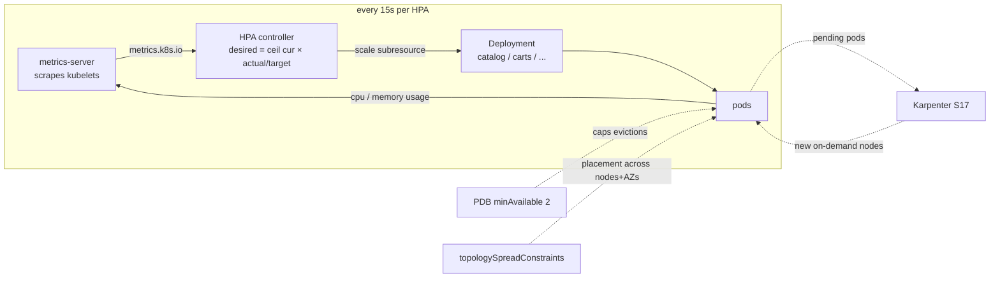

# Section 18 — Autoscaling with HPA (+ PDB, Topology Spread, on Karpenter)

> Source: transcript `18) HPA with retail store app`.
> Pod-level autoscaling layered on top of Section 17's node-level autoscaling — applied to the **real retail store app**, not a toy: HPA v2 with scaling behaviors, PodDisruptionBudgets, **topology spread constraints** (`ScheduleAnyway` vs `DoNotSchedule` compared live), and the metrics-server installed as a Terraform-managed EKS add-on.
>
> ⚠️ **GAP (repo):** section 18 folders (`01_metrics_server_terraform-manifests`, `02_AWS_Data_Plane...`, `03/04_RetailStore...`) are not in the cloned repo snapshot; code reconstructed from the transcript walkthrough. The data-plane TF is a verbatim copy of `14_01`'s (which *is* in the repo). Note: the transcript file repeats its deploy lecture verbatim in its second half — same content, processed once.

---

## 1. Objective

Make every retail-store microservice scale its **pods** automatically on real CPU/memory metrics, while surviving disruptions and zone failures:

- Install **metrics-server** as an EKS add-on via Terraform.
- One **HPA v2** per service (catalog, carts, checkout, orders, ui): min 3 / max 12, CPU 70% + memory 80% targets, tuned scale-up/scale-down `behavior`.
- One **PDB** per service (`minAvailable: 2`).
- **topologySpreadConstraints** in every deployment — spread across *nodes* and across *AZs* — demonstrating both `whenUnsatisfiable` modes.
- All pods pinned to Karpenter's **on-demand** pool via nodeSelector → the full chain: traffic ↑ → HPA adds pods → pods Pending → **Karpenter adds nodes** → traffic ↓ → HPA removes pods → Karpenter consolidates nodes.

---

## 2. Problem Statement

Retail traffic is never flat:

| Window | Traffic | Pods actually needed |
|---|---|---|
| 9 am–5 pm business hours | high | 10 |
| Lunch rush (~2–3 pm, drifts daily) | very high | 20 |
| Overnight 5 pm–9 am | low | 3 |
| Black Friday / New Year | extreme | 20+ (unknowable in advance) |
| Mid-week peaks (Wed/Thu) | elevated | 12 |

The non-options: **(a)** run 20 pods 24×7 → ~85% of compute wasted; **(b)** `kubectl scale` by hand → the rush drifts (1:30–3:30 one day, 2:30–4:30 the next) and spikes hit in seconds, humans react in minutes; **(c)** cron/scripted scaling → static predictions for unpredictable patterns (is this Black Friday a 20-pod or 30-pod one?). What's actually required: watch **live** CPU/memory per pod, scale **up in seconds** automatically, scale **down cautiously** after sustained calm, 24×7, adapting as patterns change. That is precisely the HPA control loop.

---

## 3. Why This Approach

| Concern | Tool chosen | Why not alternatives |
|---|---|---|
| Pod scaling | **HPA `autoscaling/v2`** | v1 is CPU-only; v2 adds memory + custom metrics + `behavior` tuning |
| Metrics source | **metrics-server EKS add-on (Terraform)** | not pre-installed on EKS; add-on = AWS-versioned, `aws_eks_addon_version` datasource, IaC — no `kubectl apply` of raw manifests |
| Node scaling underneath | Karpenter (S17) | HPA creates pods; *something* must create nodes for them |
| Availability during scaling/drains | **PDB `minAvailable: 2`** | HPA/Karpenter/upgrades all evict pods; PDB caps concurrent evictions |
| Zone/node failure blast radius | **topologySpreadConstraints** | without them, all replicas can land on one node/AZ — one hardware failure = full outage for that service |
| Capacity class | nodeSelector `on-demand` | this is the *critical* revenue path — spot's 2-min reclaims not welcome (spot + PDB is fine for stateless, S17 proved it) |

**HPA vs Karpenter — not competitors, layers:** HPA changes `replicas` on Deployments/StatefulSets (pods). Karpenter watches pods that don't fit and changes *nodes*. Production needs both.

---

## 4. How It Works — Under the Hood

### Vocabulary map

| Term | AWS analogy | Plain English |
|---|---|---|
| metrics-server | CloudWatch agent (rough) | scrapes kubelets every 15–60 s, serves the `metrics.k8s.io` API |
| HPA | Target-tracking ASG policy | control loop computing desired replicas every 15 s |
| `scaleTargetRef` | ASG name | which Deployment/ReplicaSet/StatefulSet to resize |
| `averageUtilization` | target-tracking setpoint | % of the pod's **request**, averaged across pods |
| `behavior` | scaling cooldowns | *how fast* to scale each direction (rate limiters + stabilization) |
| stabilization window | cooldown | "wait N s of sustained signal before acting" |
| topology key | placement group / AZ spread | node label the spread is computed over |
| `maxSkew` | — | max allowed difference between fullest and emptiest topology domain |

### The loop + the layered architecture



### The math (worked example from the lecture)

```
desiredReplicas = ceil( currentReplicas × currentMetric / targetMetric )
3 replicas at 80% CPU, target 50%  →  ceil(3 × 80/50) = ceil(4.8) = 5 pods
```
Asymmetric by design: **scale-up is urgent** (stabilization 0 s — users are waiting), **scale-down is skeptical** (5-min window — make sure the calm is real, protect against flapping).

### Topology spread — the two failure domains

```
constraint 1: topologyKey kubernetes.io/hostname   → spread across NODES
constraint 2: topologyKey topology.kubernetes.io/zone → spread across AZs

maxSkew: 1  →  (pods on fullest domain) − (pods on emptiest domain) ≤ 1
  5 pods / 3 nodes:  2-2-1 ✅ (skew 1)     3-2-0 ❌ (skew 3)

whenUnsatisfiable:
  ScheduleAnyway  = soft preference — run even if imbalanced (availability > tidiness)
  DoNotSchedule   = hard rule — pod stays Pending until the constraint CAN be met…
                    …and on Karpenter, a Pending pod is a work order: it will CREATE a node
                    in the missing AZ to satisfy the rule → guaranteed 1-pod-per-AZ.
```
That last line is the section's aha-moment: `DoNotSchedule` is dangerous on a fixed cluster (pods can hang forever) but **powerful with Karpenter**, which treats the Pending pod as a reason to provision exactly the node that satisfies the zone constraint.

---

## 5. Instructor's Approach

1. **Problem → mechanism → math → YAML** — the traffic table first, then the 4-component architecture (metrics-server / pods / controllers / HPA brain), then the formula, then a line-by-line HPA manifest for catalog with "the other four are identical except names."
2. **HPA doesn't create pods** — hammered repeatedly: it *commands* the Deployment controller, which does the actual ReplicaSet arithmetic.
3. **`behavior` framed as "production extra"** — "you could stop before this and HPA works," then rate-limiter policies and `selectPolicy` Min/Max explained with concrete numbers (3 pods: percent-100% adds 3, pods-policy adds 4 → Max picks 4).
4. **Three production hardeners in one lecture** — PDB (already known from S17), topology spread (new — taught from the "all 5 pods on one node, node dies" disaster story), nodeSelector on-demand — then a whiteboard recap of the whole production stack built so far (Ingress+LBC, ExternalDNS, ACM, Secrets CSI, data plane, Karpenter, HPA, TSC, PDB) — the course's "you now own a real architecture" moment.
5. **Metrics-server as its own small TF project** (state key `metrics-server/dev`) with an on-camera promise to fold it into the main EKS add-ons project as `c18` later (Section 19 does).
6. **Two deployment rounds to compare spread modes:** `03_...ScheduleAnyway` first — run his `check-topology.sh` and observe *uneven* spread (carts all in 1b!); then delete apps (keep SPC+ingress), wait for node claims to clear, deploy `04_...DoNotSchedule` — script now shows **exactly 1 pod per AZ per service**, Karpenter having provisioned nodes across 1a/1b/1c to make it true.
7. **Trigger HPA the pragmatic way** — no load-test tooling: orders is a hungry Spring Boot app, so he *lowers its memory request* 512Mi→256Mi → utilization climbs 36→48→68→**92%** past the 80% target → `kubectl describe hpa` shows `SuccessfulRescale` → 4 replicas. Then reverts the request; replicas settle back to 3. (Honest caveat on camera: this is to demonstrate the trigger, not a functional sizing recommendation.)
8. **Scorched-earth cleanup** — apps, HPA, PDB, data plane, metrics-server, and then the whole Karpenter/EKS/VPC stack via `destroy-cluster-with-karpenter.sh` (checks no Karpenter nodes remain → deletes node pools → nodeclass → Karpenter TF → EKS → VPC, strictly reverse order). Section 19 rebuilds fresh.

> 🐛 **TRANSCRIPT ERRORS (ASR):** "parts/pots" = pods (constant); "Hppa/HFPA" = HPA; "max Q / max skew" = `maxSkew`; "2:56 a.m. I" = 256Mi; "three 5512 MB" = 512 MB; "TSC" = topology spread constraints; "Scott's/courts" = carts; "carpenters" = Karpenter; "ECS" = EKS. Also 🐛 at ~line 1370 the skew arithmetic is misspoken ("three minus zero is zero") — 3−0=3, which violates maxSkew 1; the conclusion he draws is right.

---

## 6. Code & Commands — Line by Line

### 6.1 Metrics-server (Terraform, `01_metrics_server_terraform-manifests`)

```hcl
# c1: backend key metrics-server/dev/terraform.tfstate  (own state; folded into EKS project later)
# c3: EKS remote-state datasource (cluster name/version)
data "aws_eks_addon_version" "metrics_server_latest" {
  addon_name         = "metrics-server"
  kubernetes_version = data.terraform_remote_state.eks.outputs.cluster_version
  most_recent        = true
}
resource "aws_eks_addon" "metrics_server" {
  cluster_name                = data.terraform_remote_state.eks.outputs.eks_cluster_name
  addon_name                  = "metrics-server"
  addon_version               = data.aws_eks_addon_version.metrics_server_latest.version
  resolve_conflicts_on_create = "OVERWRITE"
  resolve_conflicts_on_update = "OVERWRITE"
}
```
Same `aws_eks_addon` pattern as PIA/EBS CSI/ExternalDNS — the fourth time the course uses it; by now it should feel mechanical. Verify: console → cluster → Add-ons → `metrics-server` Active; `kubectl top nodes` works.

### 6.2 The HPA manifest (catalog; other four identical except names)

```yaml
apiVersion: autoscaling/v2            # v2 = multi-metric (CPU+memory+custom) + behavior; v1 was CPU-only
kind: HorizontalPodAutoscaler
metadata:
  name: catalog-hpa
  namespace: default
spec:
  scaleTargetRef:                     # WHAT to scale — must name the Deployment exactly
    apiVersion: apps/v1
    kind: Deployment                  # (or StatefulSet / ReplicaSet)
    name: catalog
  minReplicas: 3                      # floor — never below, even at 5% CPU
  maxReplicas: 12                     # ceiling — never above, even at 100%: the DDoS/bug bill-guard
  metrics:
  - type: Resource
    resource:
      name: cpu
      target: { type: Utilization, averageUtilization: 70 }   # % of the pod's REQUEST, averaged
  - type: Resource
    resource:
      name: memory
      target: { type: Utilization, averageUtilization: 80 }
  behavior:                           # HOW to scale (v2 extra) — not WHEN
    scaleDown:
      stabilizationWindowSeconds: 300 # 5 min of sustained calm before removing anything
      policies:
      - { type: Percent, value: 50, periodSeconds: 15 }   # rate-limiter A: ≤50% of pods per 15s
      - { type: Pods,    value: 1,  periodSeconds: 60 }   # rate-limiter B: ≤1 pod per 60s
      selectPolicy: Min               # pick whichever removes FEWER → B wins → gentle drain
    scaleUp:
      stabilizationWindowSeconds: 0   # scale-up is urgent — users are waiting
      policies:
      - { type: Percent, value: 100, periodSeconds: 15 }  # can double every 15s
      - { type: Pods,    value: 4,   periodSeconds: 15 }  # or add 4 every 15s
      selectPolicy: Max               # pick whichever adds MORE (at 3 pods: +3 vs +4 → +4)
```
Two things people miss: **Utilization is relative to `resources.requests`** (no request → HPA can't compute → `<unknown>`), and with multiple metrics HPA computes desired replicas per metric and takes the **highest**.

### 6.3 PDB per service

```yaml
apiVersion: policy/v1
kind: PodDisruptionBudget
metadata: { name: catalog-pdb }
spec:
  minAvailable: 2                                   # HPA floor is 3 → one voluntary eviction at a time
  selector: { matchLabels: { app.kubernetes.io/name: catalog } }   # must match the pod labels
```

### 6.4 Deployment additions (all five services)

```yaml
spec:
  template:
    spec:
      nodeSelector:
        karpenter.sh/capacity-type: on-demand       # revenue path → guaranteed capacity
      topologySpreadConstraints:
      - maxSkew: 1
        topologyKey: kubernetes.io/hostname          # spread across NODES
        whenUnsatisfiable: ScheduleAnyway            # soft — never block on node balance
        labelSelector: { matchLabels: { app.kubernetes.io/name: catalog } }
      - maxSkew: 1
        topologyKey: topology.kubernetes.io/zone     # spread across AZs
        whenUnsatisfiable: ScheduleAnyway            # 03_ folder; the 04_ folder flips THIS one to DoNotSchedule
        labelSelector: { matchLabels: { app.kubernetes.io/name: catalog } }
```

### 6.5 Full run

```bash
# Prereqs: 17_01 stack up (VPC, EKS+add-ons, Karpenter TF, NodeClass+NodePools);
#          Secrets Manager secret present; kubeconfig configured (terraform output has the command).
kubectl get nodepools                     # ondemand + spot, 0 nodes — quiet cluster

# 1. metrics-server
cd 01_metrics_server_terraform-manifests && terraform init && terraform apply -auto-approve

# 2. data plane (copy of 14_01) — ~5–10 min; then paste endpoints:
cd ../02_AWS_Data_Plane_terraform-manifests && terraform init && terraform apply -auto-approve
terraform output    # → catalog ExternalName, checkout CM redis host, orders CM endpoint + SQS queue NAME

# 3. Round 1 — ScheduleAnyway variant
cd ../03_RetailStore_k8s-manifests_with_DataPlane_ScheduleAnyway
kubectl apply -f 01_secretproviderclass/
kubectl apply -R -f 02_RetailStore_Microservices/
kubectl apply -f 03_ingress/ -f 04_HPA/ -f 05_PDB/
kubectl get pods                          # Pending → Karpenter node claims → ~6 on-demand nodes → Running (3–4 min)
./check-topology.sh                       # nodes per AZ + per-service pod spread — note the IMBALANCE
                                          #   e.g. carts: ALL pods in us-east-1b  ← ScheduleAnyway allowed it

# 4. HPA in action
kubectl get hpa                           # 5 HPAs; cpu ~1%/70%, memory 60-70%/80%, replicas 3
#   memory-pressure trigger: orders deployment requests.memory 512Mi → 256Mi, re-apply orders/
kubectl get hpa -w                        # orders memory: 36% → 48% → 68% → 92% (>80%!)
kubectl describe hpa orders-hpa           # Events: SuccessfulRescale "memory resource utilization above target"
kubectl get hpa                           # orders REPLICAS 3 → 4
#   revert to 512Mi, re-apply → utilization drops → after the 5-min stabilization window → back to 3

# 5. Round 2 — DoNotSchedule variant
kubectl delete -R -f 02_RetailStore_Microservices/ -f 04_HPA/ -f 05_PDB/    # keep SPC + ingress
kubectl get nodeclaims                    # WAIT until empty (~2–3 min) — start clean or convergence takes 10-15 min
cd ../04_RetailStore_k8s-manifests_with_DataPlane_DoNotSchedule
kubectl apply -R -f 02_RetailStore_Microservices/ && kubectl apply -f 04_HPA/ -f 05_PDB/
kubectl get nodeclaims                    # nodes appear across 1a AND 1b AND 1c — Karpenter satisfying the hard rule
./check-topology.sh                       # ✔ every service: exactly 1 pod per AZ
kubectl get ingress                       # ALB → browse → add to cart → purchase (order ID) — full flow on both
                                          #   the ALB DNS and the ExternalDNS hostname

# 6. 🧹 Teardown (everything — Section 19 starts fresh)
kubectl delete -R -f .                                        # apps+HPA+PDB+ingress+SPC
cd ../02_AWS_Data_Plane_terraform-manifests && terraform destroy -auto-approve
cd ../01_metrics_server_terraform-manifests && terraform destroy -auto-approve
cd ../../17_AutoScaling_Karpenter/17_01_karpenter_install && ./destroy-cluster-with-karpenter.sh
#   script order: verify no Karpenter nodes → delete spot pool → on-demand pool → EC2NodeClass
#   → terraform destroy karpenter → destroy EKS → destroy VPC
```

---

## 7. Complete Code Reference (execution order)

```
18_AutoScaling_HPA/
├── 01_metrics_server_terraform-manifests/     # aws_eks_addon metrics-server (own state key)
├── 02_AWS_Data_Plane_terraform-manifests/     # verbatim copy of 14_01/03_... (24 resources)
├── 03_RetailStore_..._ScheduleAnyway/         # SPC / microservices(+TSC+nodeSelector) / ingress / 04_HPA / 05_PDB
│   └── check-topology.sh                      # nodes-per-AZ + per-service pod distribution report
└── 04_RetailStore_..._DoNotSchedule/          # same tree; zone constraint whenUnsatisfiable: DoNotSchedule
```

Dependency chain: 17_01 cluster+Karpenter → metrics-server → data plane (+endpoint paste) → SPC → microservices → ingress → HPA → PDB. Teardown in exact reverse, ending with the Karpenter destroy script.

---

## 8. Hands-On Labs

### Lab A — Reproduce the full stack + memory-pressure rescale

> 💰 **Cost warning:** the priciest demo yet — cluster + NAT + data plane (2×RDS, ElastiCache) + ALB + ~6 Karpenter on-demand nodes ≈ **$0.6–0.8/h** while deployed. The DoNotSchedule variant deliberately spins *more* nodes (one per AZ per constraint). **Run the complete §6 step-6 teardown the same session** and console-sweep EC2/RDS/ElastiCache/DynamoDB(us-west-2)/SQS.

**Steps:** §6 in full. **Expected output:** `kubectl top pods` returns numbers (metrics-server alive); 5 HPAs with live percentages; orders climbs past 80% → `SuccessfulRescale` → 4 replicas → reverts to 3 after ~5 min calm; check-topology shows imbalance (round 1) then perfect 1-per-AZ (round 2); purchases succeed throughout.
**Verify:** `kubectl describe hpa orders-hpa` events; `kubectl get pdb` shows ALLOWED DISRUPTIONS 1.

### Lab B — Variation: tune the knobs

1. **Load-test the CPU path** (the "proper" trigger): `kubectl run load --image=busybox -- /bin/sh -c "while true; do wget -qO- http://ui; done"` ×3 against the UI → watch `ui-hpa` cross 70% CPU and add pods, then kill the load pods and time the 5-minute scale-down.
2. Set `scaleDown.stabilizationWindowSeconds: 30` on one HPA and repeat — observe faster (and twitchier) downscaling; discuss why 300 s is the production default.
3. Change orders' memory target to `averageUtilization: 60` — a Spring Boot service idling near 65% now triggers immediately; teaches that targets must be set *relative to the app's idle profile*.
4. Give carts `minAvailable: 3` with `minReplicas: 3` and try `kubectl drain` on its node — the drain wedges (0 allowed disruptions). Undo.

🧹 Same as Lab A.

**Free local variant:** everything except Karpenter works on kind: `kind create cluster` → install metrics-server (`--kubelet-insecure-tls` arg needed on kind) → deploy any CPU-burning app + the exact HPA v2 manifest → `kubectl run load ...` → watch scaling; topology spread works against kind's multi-node topology labels too (`kind` supports multi-node clusters). This is the best free HPA practice environment.

### Lab C — Break-it-and-fix-it

1. **No metrics-server:** `terraform destroy` project 01, then `kubectl get hpa` → all targets `<unknown>`, `describe` shows `FailedGetResourceMetric`. HPA silently does nothing — the failure mode is *stasis*, not errors in your app. **Fix:** reinstall; metrics return within a minute.
2. **Missing resource requests:** delete `resources.requests` from ui's deployment → its HPA shows `<unknown>` for CPU (utilization is % *of request* — no denominator, no math). **Fix:** requests back; this is why every deployment in the course sets them.
3. **`DoNotSchedule` on a starved pool:** set the on-demand NodePool `limits.cpu: "4"` and deploy round 2 → some pods stay Pending forever: Karpenter *wants* to build the missing-AZ node but the pool cap forbids it. `kubectl describe pod` shows the unsatisfied constraint; `kubectl describe nodepool` shows the limit hit. **Fix:** raise the limit — hard placement rules need capacity headroom.
4. **HPA vs manual scale fight:** `kubectl scale deploy catalog --replicas=1` → within 15 s HPA restores minReplicas 3. Teaches: once an HPA owns a Deployment, `kubectl scale` is futile; change the HPA instead.

---

## 9. Troubleshooting

| Symptom | Likely cause | Command to confirm | Fix |
|---|---|---|---|
| HPA targets `<unknown>` | metrics-server missing/unhealthy, or pod has no `resources.requests` | `kubectl top pods`; `kubectl -n kube-system get pods \| grep metrics` | Install add-on; set requests on every container |
| HPA never scales up under load | target set above what the app ever reaches, or maxReplicas already hit | `kubectl get hpa` (current vs target; REPLICAS vs MAXPODS) | Lower target / raise maxReplicas |
| Replicas flap up/down | scaleDown window too short for a bursty app | `kubectl describe hpa` event timeline | `stabilizationWindowSeconds: 300`; gentler policies + `selectPolicy: Min` |
| Scale-up pods stuck Pending | Karpenter pool limit reached / nodeSelector matches nothing | `kubectl describe pod`; `kubectl describe nodepool` | Raise `limits.cpu`; fix `karpenter.sh/capacity-type` value |
| `kubectl scale` keeps reverting | an HPA owns the Deployment | `kubectl get hpa` | Expected — edit min/maxReplicas on the HPA |
| Drain/upgrade hangs | PDB `minAvailable` ≥ current replicas | `kubectl get pdb` (ALLOWED DISRUPTIONS: 0) | Keep minAvailable < minReplicas |
| Pods Pending with "didn't match pod topology spread constraints" | `DoNotSchedule` + no node in the missing domain (and Karpenter capped/absent) | `kubectl describe pod` | Raise pool limits; or soften to `ScheduleAnyway` |
| All of a service's pods in one AZ despite constraints | `ScheduleAnyway` chose availability over balance (working as designed) | `./check-topology.sh` | Use `DoNotSchedule` for the zone constraint (with Karpenter) |
| Memory % suspiciously high at idle | JVM apps grab heap at boot; % is of the *request* | `kubectl top pods` vs request | Size requests to the app (orders wants ≥512Mi); set targets with idle profile in mind |
| Round-2 demo converges slowly | old node claims still draining when you redeployed | `kubectl get nodeclaims` | Wait for empty claims between rounds (instructor's explicit tip) |

---

## 10. Interview Articulation

**90-second spoken answer — "How does autoscaling work end to end in your platform?"**

> "Two layers that hand off to each other. Pod-level is HPA autoscaling/v2 — one per microservice, scaling the Deployment between 3 and 12 replicas on two metrics, CPU at 70% and memory at 80% of the pod's requests, taking the higher of the two computed replica counts. The v2 `behavior` block is where production tuning lives: scale-up has a zero-second stabilization window and can add up to four pods or double every fifteen seconds — users are waiting; scale-down waits through a five-minute stabilization window and then removes at most one pod per minute via `selectPolicy: Min`, so a temporary lull never triggers a churn spiral. Metrics come from metrics-server, which we install as a Terraform-managed EKS add-on. When HPA's new pods don't fit, they go Pending — and that's the handoff to layer two, Karpenter, which provisions right-sized on-demand nodes in about a minute. Around that we run two guardrails: PodDisruptionBudgets with minAvailable 2 so consolidation and upgrades can never evict a service below quorum, and topologySpreadConstraints on both hostname and zone keys with maxSkew 1. For the zone constraint we use `DoNotSchedule` — normally risky because pods can hang Pending, but with Karpenter underneath it's a feature: a Pending pod makes Karpenter build a node in the missing AZ, so we get a guaranteed one-replica-per-AZ spread. Net effect: a lunch-hour spike scales pods in seconds and nodes in a minute, and overnight the whole thing quietly shrinks back to three replicas per service."

<details>
<summary>Self-test Q&A (5)</summary>

**Q1. 3 replicas at 90% CPU, target 60% — what does HPA do, exactly?**
A: `ceil(3 × 90/60) = ceil(4.5) = 5`. Because scaleUp stabilization is 0, it acts on the next 15 s tick, bounded by the scaleUp policies (Max of +100%→6 cap vs +4 pods→7 cap — both allow reaching 5) and by maxReplicas. HPA patches the Deployment's replicas; the Deployment controller creates the pods.

**Q2. Why is `resources.requests` mandatory for HPA?**
A: `averageUtilization` is usage ÷ **request** per pod, averaged. No request → no denominator → the metric reads `<unknown>` and that metric is skipped; if all metrics are unknown, the HPA does nothing at all — a silent failure.

**Q3. `ScheduleAnyway` vs `DoNotSchedule` — when each, and what changes with Karpenter?**
A: ScheduleAnyway = soft: prefer balance, never block scheduling — right default on fixed capacity, but can leave all replicas in one AZ. DoNotSchedule = hard: pod stays Pending until the domain spread is satisfiable — risky on static clusters. With Karpenter, Pending is a provisioning trigger, so DoNotSchedule *causes* a node in the under-represented AZ and yields a guaranteed spread.

**Q4. How do HPA, PDB, and Karpenter consolidation interact?**
A: HPA sets replica counts; Karpenter consolidation evicts pods to shrink nodes; PDB caps those evictions (minAvailable 2 → one at a time here). So consolidation proceeds as a rolling, PDB-throttled migration and service capacity never dips below quorum. Misconfigured (minAvailable ≥ replicas) it wedges drains entirely.

**Q5. Why is scale-down deliberately slower than scale-up?**
A: Asymmetric cost of being wrong. Under-provisioned = live user errors, immediately; over-provisioned = a few extra pod-minutes of spend. So up: 0 s window, aggressive Max policy. Down: 300 s sustained-calm window plus rate limiters with Min selection. It also prevents oscillation when traffic hovers near the target.

</details>

---

*Previous: [17 — Autoscaling with Karpenter](17-karpenter-autoscaling.md) · Next: [19 — Helm Retail Store + AWS Data Plane](19-helm-retailstore-dataplane.md) · [Index](00-INDEX.md)*
