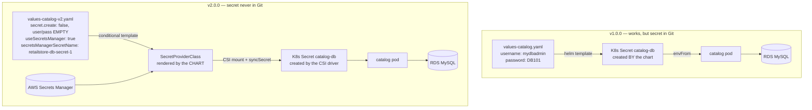

# Section 19 — Helm Charts for the Retail Store on the AWS Data Plane

> Source: transcript `19) Helm Charts with AWS Dataplane`.
> Section 12's Helm skills + Section 14's data plane + Sections 17–18's production hardening, converged: the whole retail store now deploys as **five `helm upgrade --install` commands** against charts hosted in a GitHub Helm repo — v1.0.0 with hardcoded DB credentials, then **v2.0.0 where the charts themselves template the SecretProviderClass** and pull credentials from AWS Secrets Manager. This also covers the sub-module `1205` the Section 12 transcript lacked (Helm-deploying the retail store) — in its final, data-plane-connected form.
>
> ✅ **VERIFIED against the canonical repo:** the code lives in `19_Helm_RetailStore_AWS_Dataplane/` — `01_EKS_Cluster_Environment/` (VPC + EKS-with-add-ons incl. the folded-in `c18_eksaddon_metrics_server.tf` + Karpenter), and the retail-store Helm values/charts — **confirming the S19 note that metrics-server became `c18` inside the main EKS project.** The published charts are also at `stacksimplify/helm-charts` (packaged `.tgz` per service, incl. `*-2.0.0` for catalog and orders). An earlier partial clone had only folders `01–14`. Use the repo files as source of truth.

---

## 0. 🧭 Beginner Follow-Along Guide (start here)

> Read this guide first; dive into the numbered sections after — this section redeploys the whole retail store as five Helm commands: two scripts rebuild the cluster and the AWS data plane, then values files + `helm upgrade --install` replace the ~30 raw YAMLs of S18 — first with passwords in values (v1.0.0), then pulled from Secrets Manager (v2.0.0).
> Tags used below: **[Terminal]** = your Ubuntu laptop's shell · **[Editor]** = editing values-*.yaml files (VS Code) · **[AWS Console]** = console.aws.amazon.com in the browser · **[Browser]** = the retail-store app pages.

### 📊 The whole section at a glance — components & workflow

*Read top to bottom; boxes are components, arrows are the flow (the same shape as your terminal→shell→fork diagram).*

```
┌──────────────────────────────────────────────────────────────────────┐
│          2 scripts: create-cluster  +  create-aws-dataplane          │
│                                                                      │
│ rebuild the whole platform + RDS/DynamoDB/Redis/SQS                  │
└──────────────────────────────────────────────────────────────────────┘
                                    │  paste terraform output → values-*.yaml
                                    ▼
┌──────────────────────────────────────────────────────────────────────┐
│              5 ×  helm upgrade --install  (idempotent)               │
│                                                                      │
│ catalog carts checkout orders ui  ·  values carry HPA/PDB/TSC        │
└──────────────────────────────────────────────────────────────────────┘
                       │                     │
                       ▼                     ▼
               ┌───────────────┐  ┌─────────────────────┐
               │ v1.0.0 charts │  │    v2.0.0 charts    │
               │ password in   │  │ SecretProviderClass │
               │ values (hack) │  │ → Secrets Manager   │
               └───────────────┘  └─────────────────────┘
                                    │
                                    ▼
┌──────────────────────────────────────────────────────────────────────┐
│         STORE running from charts  (helm status = one view)          │
│                                                                      │
│ teardown STRICT: apps → data plane → cluster                         │
└──────────────────────────────────────────────────────────────────────┘
```

### Where you are in the course

```
S18 HPA autoscaling ──▶ THIS: S19 Helm charts + AWS data plane ──▶ S20 Observability
```

**Must already exist/be running:**
- [ ] Nothing running — the scripts rebuild the cluster AND the data plane from scratch this session
- [ ] YOUR S3 bucket name updated in every project's `c1`/`c3` files (cluster environment + data plane) — the ritual first step
- [ ] Secrets Manager secret `retailstore-db-secret-1` still exists (created manually in S14) — v2.0.0 needs it
- [ ] The course repo cloned (`19_Helm_RetailStore_AWS_Dataplane/`); `helm`, `terraform`, `kubectl`, AWS CLI working

### Words you'll meet (plain English)

| Word | Plain meaning |
|---|---|
| chart repo | a GitHub-hosted index of packaged charts; `helm repo add` registers it, `helm repo update` refreshes your local copy |
| `helm upgrade --install` | one idempotent command: installs if absent, upgrades if present (revision goes up) |
| values file | per-service settings file — here it IS the deployment: endpoints, replicas, hardening, all knobs |
| release / revision | an installed chart under a name you pick / its numbered history entry (rollback target) |
| data plane | the S14 AWS backends (RDS, DynamoDB, Redis, SQS), recreated by script |
| SecretProviderClass (v2) | chart-rendered object that pulls DB creds from Secrets Manager — no password left in Git |
| Karpenter nodeclaims | the nodes Karpenter births on demand; `kubectl get nodeclaims` lists them |
| chart version vs appVersion | 1.0.0 → 2.0.0 = new templates; appVersion stays 1.3.0 = same app image |

### The simplified play-by-play (do this → see that)

1. **[Editor]** Bucket names first: put YOUR S3 bucket into every project's `c1`/`c3` files (cluster environment and data plane)
2. **[Terminal]** `./create-cluster-with-karpenter.sh` → VPC → EKS + all add-ons (38 resources, incl. the new `c18` metrics-server) → Karpenter TF (21 resources) → NodePools; ends with your kubeconfig set — a long run *(deep dive: §4, §7)*
3. **[Terminal]** `./create-aws-dataplane.sh` → the S14 data plane again (24 resources; RDS makes it slow) → then `terraform output` → copy every endpoint
4. **[Editor]** Paste the outputs into the five `values-*.yaml` — the values files ARE the product here: catalog = RDS MySQL endpoint; carts = `dynamodb: create: false` + endpoint `https://dynamodb.us-west-2.amazonaws.com` + region; checkout = Redis endpoint`:6379`; orders = Postgres endpoint + `queueName: retail-dev-orders-queue` (the NAME, not the URL); ui = backend endpoints + ingress — for its `external-dns.alpha.kubernetes.io/hostname` annotation you own `devopsinminutes.com`, so set a hostname under it (e.g. `retail-store.devopsinminutes.com`) instead of commenting it out *(deep dive: §6.2)*
5. **[Editor]** Memory gotcha BEFORE installing: the Spring Boot services (orders, carts) need `requests: { cpu: 100m, memory: 400Mi }` — 256Mi means CrashLoopBackOff; the instructor hit it live *(deep dive: §5.5, Lab C1)*
6. **[Terminal]** `helm repo add stacksimplify https://stacksimplify.github.io/helm-charts && helm repo update` → you should see: repo added + index refreshed
7. **[Terminal]** Run `03_v1.0.0_install_remote_helm_charts.sh` — per service it runs `helm upgrade --install $SVC stacksimplify/retailstore-sample-${SVC}-chart --version 1.0.0 -f values-${SVC}.yaml --wait --timeout 5m` → you should see: "installed successfully" five times; `helm list` → 5 releases `deployed` *(deep dive: §6.3)*
8. **[Terminal]** `kubectl get nodeclaims` → Karpenter nodes across 1a/1b/1c (the values' topology spread + minReplicas 3 force it); `kubectl get hpa` → 5 HPAs live
9. **[Browser]** `/topology` → all green → add to cart → **[AWS Console]** DynamoDB **us-west-2** rows appear → purchase → SQS message whose order ID matches *(deep dive: §6.5)*
10. **[Terminal]** `helm status ui` (Helm 4.x; on 3.x add `--show-resources`) → pods, HPA, PDB, SA, CM, Service, Ingress — one release owns them all
11. **[Editor]** v2 encore (a 10-minute change): in `values-{catalog,orders}-v2.0.0.yaml` set `secret: { create: false, name: catalog-db, username: "", password: "" }`, `useSecretsManager: true`, `secretsManagerSecretName: retailstore-db-secret-1` — nothing sensitive left in Git *(deep dive: §6.4)*
12. **[Terminal]** Run `05_v2.0.0_install_remote_helm_charts.sh` → catalog + orders now at chart `2.0.0`, the rest stay 1.0.0 → `kubectl get secretproviderclass` → two, rendered by the charts; `kubectl get secrets` → `catalog-db` + `orders-db` synced from Secrets Manager
13. **[Browser]** Full purchase flow once more → still works end to end — same app, zero passwords in any file

### ✅ Done-check

- [ ] `helm list` → five releases `deployed`; after script 05, catalog/orders show chart 2.0.0
- [ ] `/topology` all green; purchase → SQS message with a matching order ID
- [ ] `kubectl get hpa` → 5 HPAs with sane memory numbers (the 400Mi fix held)
- [ ] `kubectl get secretproviderclass` → 2, created by the charts, with their synced Secrets present

🧹 **Teardown before you stop (STRICT order — reversing it wedges the destroy):**
1. **[Terminal]** `./01_uninstall_retail_apps.sh` — helm-uninstalls in reverse order (ui first, so its Ingress/ALB dies)
2. **[Terminal]** `./delete-aws-dataplane.sh` — the data plane must go **before** the cluster: its DB/ElastiCache subnet groups live inside the VPC
3. **[Terminal]** `./destroy-cluster-with-karpenter.sh` — clean slate for S20

💰 If forgotten: full platform + data plane + ~6–9 Karpenter nodes ≈ **$0.6–0.8/h** — full teardown same session (cheaper test runs: `nodeSelector: spot`, `minReplicas: 1`, per Lab A)

---

## 1. Objective

- Rebuild the platform **with one script** (`create-cluster-with-karpenter.sh`: VPC → EKS+add-ons — now including a `c18` **metrics-server** add-on folded into the main project as promised in S18 — → Karpenter TF → Karpenter CRDs; 38 EKS-project resources), plus the data plane via its own script.
- **v1.0.0 charts:** take AWS's published retail-store sample charts, fix what's missing (carts: external DynamoDB endpoint/region; orders: SQS messaging block), version them 1.0.0 / appVersion 1.3.0, package, and push to a GitHub Helm repo — then deploy all five services with **custom values files** that point every service at the AWS data plane and carry the full S18 hardening (HPA, nodeSelector, topology spread, PDB) *as chart values*.
- **v2.0.0 charts (catalog & orders):** add a **SecretProviderClass template** to the charts so DB credentials come from **AWS Secrets Manager** instead of values-file plaintext.
- Verify end to end (topology page, DynamoDB console, SQS poll after purchase) and tear everything down.

---

## 2. Problem Statement

The S18 deployment worked, but it was **~30 raw YAML files applied in a strict order** with endpoints hand-pasted into ConfigMaps. That doesn't version, doesn't roll back, can't be templated per environment, and can't be handed to another team as an artifact. Meanwhile the *stock* AWS retail-store charts can't do what we need: carts has no way to point at an external DynamoDB (it only knows its bundled local one), orders knows RabbitMQ but not SQS, and neither catalog nor orders can source credentials from Secrets Manager. And v1.0.0's own workaround — DB username/password sitting in `values-*.yaml` in Git — fails the security bar Section 14 set.

---

## 3. Why This Approach

| Decision | Chosen | Why |
|---|---|---|
| Packaging | Helm charts in a **GitHub chart repo** | one `helm upgrade --install` per service; versioned, diffable, rollback-able; the artifact *is* the deployment |
| Base | fork AWS's sample charts, minimal edits | "changes, not building from scratch" — the S12 lesson applied |
| Install command | `helm upgrade --install --wait --timeout 5m` | idempotent: first run installs, re-run upgrades (revision 2, 3…) — one command for both lifecycle phases |
| Hardening | HPA/TSC/PDB/nodeSelector as **chart templates driven by values** | the S18 production posture becomes a per-environment knob (`values-*.yaml`), not copy-pasted YAML — the instructor even keeps "high-cost" (3–12 replicas, on-demand) and "low-cost" (1 replica, spot) values profiles |
| Credentials v1 → v2 | plaintext values → **SPC template + Secrets Manager** | v1 proves the wiring; v2 removes the last secret from Git — chart version bump = capability bump |
| Chart versioning | chart `1.0.0`/`2.0.0` vs `appVersion 1.3.0` | the S12 lesson in practice: chart version ≠ image version; v2 charts ship a new *template*, same app |

---

## 4. How It Works — Under the Hood

### Vocabulary map

| Helm term | Raw-YAML equivalent | Plain English |
|---|---|---|
| chart repo (GitHub Pages) | folder of YAML in Git | HTTP index of packaged `.tgz` charts |
| `helm repo add stacksimplify <url>` | `git clone` | register the repo locally |
| `helm upgrade --install` | `kubectl apply` (idempotent-ish) | install if absent, upgrade if present |
| custom values file | hand-edited ConfigMaps | per-environment inputs to the templates |
| `{{ if .Values.app.persistence.useSecretsManager }}` | deploying/not deploying a YAML file | conditional template — the v2 trick |
| `helm status <rel>` (v4; v3 needs `--show-resources`) | many `kubectl get`s | everything one release created, in one view |
| chart `version` vs `appVersion` | — | template packaging version vs container image version |

### The v1 → v2 credential paths


Same Secret name (`catalog-db`), same deployment reference — only the *producer* changes. That's why v2 is a drop-in chart upgrade.

### ASCII — the whole Section-19 run

```
./create-cluster-with-karpenter.sh      (19/01)
  └ VPC → EKS + add-ons (PIA, LBC, EBS CSI, Secrets CSI+ASCP, ExternalDNS, c18 metrics-server; 38 res)
    → Karpenter TF (21 res) → kubeconfig → EC2NodeClass + 2 NodePools
./create-aws-dataplane.sh               (19/02)   → 24 res; terraform output → paste endpoints into values-*.yaml
./03_v1.0.0_install_remote_helm_charts.sh (19/03)
  helm repo add stacksimplify https://stacksimplify.github.io/helm-charts && helm repo update
  for svc in catalog carts checkout orders ui:
      helm upgrade --install $svc stacksimplify/retailstore-sample-$svc-chart \
        --version 1.0.0 -f values-$svc.yaml --wait --timeout 5m
  (watch: helm list · kubectl get nodeclaims — Karpenter builds 1a/1b/1c nodes because
   the values carry TSC DoNotSchedule + HPA minReplicas 3)
verify: /topology all green · DynamoDB us-west-2 rows on add-to-cart · SQS message on purchase
        helm status ui  → pods, HPA, PDB, SA, CM, Service, Ingress — ALL from one release
./05_v2.0.0_install_remote_helm_charts.sh  → catalog+orders at chart 2.0.0 (SPC path), rest at 1.0.0
teardown: 01_uninstall → delete data plane → destroy-cluster-with-karpenter.sh   (STRICT order)
```

---

## 5. Instructor's Approach

1. **Recap-and-position** — a whiteboard of everything built through S18, then "this section is *pure Helm*": same end state, new delivery mechanism. Explicit callback to 12_05 (Helm retail store, then self-hosted data plane) — now the data plane is AWS.
2. **Scripts over ceremony for the environment** — cluster and data plane each get a create/destroy script ("straight-through commands, no clever if-else"), with the by-now-ritual warning: update the S3 bucket name in every project's `c1`/`c3` files first. Metrics-server is now `c18` inside the main EKS project — a promise kept from S18, and a lesson in consolidating platform add-ons.
3. **Chart surgery shown as diffs** — `charts_base` (pristine AWS download, version-locked) vs `charts_v1.0.0`: catalog/checkout/ui untouched except `Chart.yaml` (1.0.0 / appVersion 1.3.0); **carts** configmap gains an `else` branch (external DynamoDB endpoint + region — the stock chart literally couldn't express "use a real table in us-west-2"); **orders** configmap gains the `messaging.provider == sqs` branch (stock chart knew only RabbitMQ). "These are demo charts from AWS with bugs — our use case needs these two fixes." Then `helm package` and push to the GitHub repo; the `zero one` source tree is "reference only."
4. **Values files as the product** — line-by-line through `values-catalog.yaml`: image+tag, `mysql.create: false`, RDS endpoint from `terraform output`, DB name, `secret: {name: catalog-db, username: mydbadmin, password: DB101}` (v1's honest hack), then the hardening block — HPA (3/12, cpu 70/mem 80), nodeSelector on-demand, TSC, PDB (`minAvailable: 2`, and the rule: **minAvailable and maxUnavailable are mutually exclusive** — set the other to 0/omit). Carts/checkout/orders/ui variations called out (DynamoDB `create: false` + us-west-2 endpoint; Redis endpoint`:6379`; Postgres endpoint + `messaging: {provider: sqs, queueName: retail-dev-orders-queue}` — the *name*, not URL; ui ingress + ExternalDNS hostname annotation, comment it out if you have no domain).
5. **A live sizing incident, kept in the course** — he trims requests to 256Mi to save cost; orders (and carts) **CrashLoopBackOff** because Spring Boot needs ≥350Mi. Diagnose via `kubectl logs`/`describe` + `kubectl get hpa` (memory % pinned high) → fix to 400Mi, drop CPU to 100m ("2% used — CPU is costly, why waste it for a demo"), and rather than wait for rolling convergence, **uninstall-all + reinstall** — fast now because Karpenter's nodes already exist. Real debugging, plus a reminder that `helm upgrade --install` produced `revision 2` on the fixed services.
6. **`helm status` as the verification lens** — one command shows every resource a release owns (pods, HPA, PDB, SA, CM, SVC, Ingress, Secret); notes the CLI difference (Helm 3.x needs `--show-resources`, 4.x doesn't — he's on 4.0).
7. **v2.0.0 as a 10-minute encore** — because only the values change: `secret.create: false`, empty user/pass, `useSecretsManager: true` + secret name + region; script 05 installs catalog/orders at `--version 2.0.0`, rest at 1.0.0. Verify `kubectl get secretproviderclass` (two, chart-rendered) and `kubectl get secrets` (synced from Secrets Manager). Full purchase flow again.
8. **Teardown order taught as a dependency lesson** — apps (helm uninstall, reverse order UI→…→catalog) → **data plane before cluster** (its DB/cache subnet groups sit in the VPC; delete the VPC first and destroy wedges) → `destroy-cluster-with-karpenter.sh`. Clean slate for the S20 observability build.

> 🐛 **TRANSCRIPT ERRORS (ASR):** "SCS" = SQS; "cards/Cod service" = carts; "parts/bots" = pods; "ADRs" = orders; "Reddis" = Redis; "ECS" = EKS; "helm hyphen charts" = the `helm-charts` GitHub repo; "my DB admin and DB 101" = the demo credentials `mydbadmin`/`DB101`; "P" (in the S20 preview) = AMP (Amazon Managed Prometheus).

---

## 6. Code & Commands — Line by Line

### 6.1 Chart fixes (v1.0.0)

**carts configmap template — external DynamoDB support (the missing `else`):**
```yaml
{{- if .Values.app.persistence.dynamodb.create }}
  RETAIL_CART_PERSISTENCE_DYNAMODB_ENDPOINT: {{ ... local in-cluster dynamodb ... }}
{{- else }}
  {{- if .Values.app.persistence.dynamodb.endpoint }}
  RETAIL_CART_PERSISTENCE_DYNAMODB_ENDPOINT: {{ .Values.app.persistence.dynamodb.endpoint }}
  {{- end }}
  {{- if .Values.app.persistence.dynamodb.region }}
  AWS_REGION: {{ .Values.app.persistence.dynamodb.region }}     # app may run in one region, table in another
  {{- end }}
{{- end }}
```

**orders configmap template — SQS branch (stock chart only knew RabbitMQ):**
```yaml
{{- if eq .Values.app.messaging.provider "rabbitmq" }}
  ...existing...
{{- else if eq .Values.app.messaging.provider "sqs" }}
  RETAIL_ORDERS_MESSAGING_PROVIDER: sqs
  RETAIL_ORDERS_MESSAGING_SQS_TOPIC: {{ .Values.app.messaging.sqs.queueName }}
{{- end }}
```

**Every chart's `Chart.yaml`:** `version: 1.0.0`, `appVersion: 1.3.0` → `helm package` → push to the GitHub chart repo.

### 6.2 v1.0.0 values (catalog shown; others analogous)

```yaml
# values-catalog.yaml
image: { repository: public.ecr.aws/aws-containers/retail-store-sample-catalog, tag: "1.3.0" }
mysql: { create: false }                       # no in-cluster MySQL — we have RDS
app:
  persistence:
    provider: mysql
    endpoint: mydb3.XXXX.us-east-1.rds.amazonaws.com:3306   # ← terraform output catalog_rds_endpoint
    name: catalogdb
    secret:
      create: true                             # chart creates K8s Secret "catalog-db"...
      name: catalog-db
      username: mydbadmin                      # ...from PLAINTEXT values — v1's known flaw,
      password: DB101                          #    fixed by v2 below
resources: { requests: { cpu: 100m, memory: 400Mi } }   # ≥350Mi for the Spring Boot services!
autoscaling: { enabled: true, minReplicas: 3, maxReplicas: 12,
               targetCPUUtilizationPercentage: 70, targetMemoryUtilizationPercentage: 80 }
nodeSelector: { karpenter.sh/capacity-type: on-demand }  # or spot for cheap test runs
topologySpreadConstraints: [ ...hostname + zone, maxSkew 1... ]
podDisruptionBudget: { minAvailable: 2, maxUnavailable: 0 }  # exactly ONE of the two may be non-zero
```
Per-service deltas: **carts** `dynamodb: {create: false, tableName: Items, endpoint: https://dynamodb.us-west-2.amazonaws.com, region: us-west-2}`; **checkout** `redis endpoint <elasticache-host>:6379`; **orders** postgres endpoint+`ordersdb` + `messaging: {provider: sqs, sqs: {queueName: retail-dev-orders-queue}}`; **ui** backend endpoints + theme + ingress enabled with `external-dns.alpha.kubernetes.io/hostname` (comment out without a domain).

### 6.3 The install script (03, remote v1.0.0)

```bash
helm repo add stacksimplify https://stacksimplify.github.io/helm-charts
helm repo update
for SVC in catalog carts checkout orders ui; do
  helm upgrade --install $SVC stacksimplify/retailstore-sample-${SVC}-chart \
    --version 1.0.0 -f values-${SVC}.yaml --wait --timeout 5m \
  && echo "$SVC installed successfully"
done
```
`upgrade --install` = idempotent lifecycle: run again after editing values → in-place upgrade, revision++. Scripts 02/04 (local `.tgz` installs) exist purely for chart-dev inner loops; 01 uninstalls in reverse order (ui first).

### 6.4 v2.0.0 — Secrets Manager via the chart

**New conditional template in catalog/orders 2.0.0 charts (`templates/secretproviderclass.yaml`):**
```yaml
{{- if and (eq .Values.app.persistence.provider "mysql") .Values.app.persistence.useSecretsManager }}
apiVersion: secrets-store.csi.x-k8s.io/v1
kind: SecretProviderClass
metadata: { name: {{ include "catalog.fullname" . }}-db-secret-provider }
spec:
  provider: aws
  parameters:
    region: {{ .Values.app.persistence.secretsManagerRegion }}
    usePodIdentity: "true"
    objects: |
      - objectName: "{{ .Values.app.persistence.secretsManagerSecretName }}"
        objectType: "secretsmanager"
        jmesPath: [{path: username, objectAlias: username}, {path: password, objectAlias: password}]
  secretObjects:
    - secretName: {{ .Values.app.persistence.secret.name }}     # same "catalog-db" the deployment expects
      type: Opaque
      data: [{objectName: username, key: RETAIL_CATALOG_PERSISTENCE_USER},
             {objectName: password, key: RETAIL_CATALOG_PERSISTENCE_PASSWORD}]
{{- end }}
```
(The Section-14 SPC, promoted from static YAML to a values-driven template — plus the CSI volume/mount added to the deployment template under the same condition.)

**v2 values delta (catalog; orders identical in shape):**
```yaml
app:
  persistence:
    secret: { create: false, name: catalog-db, username: "", password: "" }  # nothing sensitive in Git
    useSecretsManager: true
    secretsManagerSecretName: retailstore-db-secret-1     # must exist (manual, S14)
    secretsManagerRegion: us-east-1
```
**Script 05:** catalog & orders at `--version 2.0.0` with the v2 values; carts/checkout/ui unchanged at 1.0.0.

### 6.5 Verification & status

```bash
helm list                                     # 5 releases deployed
helm status ui                                # Helm 4.x: resources listed by default
helm status ui --show-resources               # Helm 3.x equivalent
kubectl get hpa                               # 5 HPAs live; memory sane after the 400Mi fix
kubectl get nodeclaims                        # Karpenter nodes across 1a/1b/1c (TSC at work)
./check-topology.sh                           # 1 pod per AZ per service
kubectl get secretproviderclass               # v2: two, rendered by the charts
kubectl get secrets                           # catalog-db + orders-db (v1: chart-created; v2: CSI-synced)
# UI: /topology all healthy → add to cart (DynamoDB us-west-2 rows) → purchase (SQS message, order ID)
```

---

## 7. Complete Code Reference (execution order)

```
19_Helm_RetailStore_AWS_DataPlane/
├── 01_EKS_Cluster_Environment/          # VPC + EKS(+c18 metrics-server, 38 res) + Karpenter TF + CRDs
│   ├── create-cluster-with-karpenter.sh / destroy-cluster-with-karpenter.sh
├── 02_RetailStore_AWS_Data_Plane/       # copy of 14_01 + create/delete scripts
└── 03_RetailStore_Helm_with_DataPlane/
    ├── 01_retailstore_chart_updates/    # reference only: charts_base / charts_v1.0.0 / charts_v2.0.0
    │   └── download-and-untar-helm-charts.sh
    └── 02_retailstore_values_helm_aws_dataplane/
        ├── values-{catalog,carts,checkout,orders,ui}.yaml
        ├── values-{catalog,orders}-v2.0.0.yaml
        ├── 01_uninstall_retail_apps.sh          03_v1.0.0_install_remote_helm_charts.sh
        ├── 02/04 local-install variants          05_v2.0.0_install_remote_helm_charts.sh
        └── check-topology.sh
```

Run order: bucket names → cluster script → data plane script → `terraform output` → paste endpoints into values → script 03 (v1) → verify → script 05 (v2) → verify → **teardown: script 01 → delete data plane → destroy cluster script** (data plane strictly before cluster: its DB/ElastiCache subnet groups live in the VPC).

---

## 8. Hands-On Labs

### Lab A — Reproduce v1 → v2

> 💰 **Cost warning:** full platform + data plane + ~6–9 Karpenter nodes (~$0.6–0.8/h). To cut it: values → `nodeSelector: spot`, `minReplicas: 1`, TSC `ScheduleAnyway` (the instructor's "low-cost" profile). **Full teardown same session, in the §7 order.**

**Steps:** §7 run order. **Expected output:** five `deployed` releases; `/topology` green; purchase produces a DynamoDB row earlier, an SQS message and order ID now; after script 05, `helm list` shows catalog/orders at chart 2.0.0 and two SecretProviderClasses exist with synced Secrets.
**Verify:** `helm status catalog` lists Secret/CM/HPA/PDB/SA/SVC/Deployment all owned by the release; `helm history orders` shows the upgrade revisions.

### Lab B — Variation: exploit the chart-ness

1. **Values-only environment fork:** copy the five values files to `values-*-staging.yaml`, drop replicas to 1 + spot, install with release names `catalog-staging` etc. — two environments from identical charts.
2. **Rollback drill:** break checkout's Redis endpoint in values, `helm upgrade` it, watch `/topology` go red → `helm rollback checkout 1` → green. (This is the whole argument for Helm over raw YAML in one minute.)
3. **v2 everywhere:** author the same SPC-template change for a third service or bump only orders to 2.0.0 and leave catalog at 1.0.0 — mixed chart versions coexist happily; confirm with `helm list`.

🧹 Same as Lab A.

**Free local variant:** kind + the local-install scripts (02/04) against `charts_v1.0.0/` with a values file pointing at in-cluster MySQL/Redis (set the `create: true` paths) — everything except the AWS data plane and Secrets Manager works, including HPA (with metrics-server), PDB, TSC templates.

### Lab C — Break-it-and-fix-it

1. **The instructor's own bug, on purpose:** set orders `requests.memory: 256Mi`, upgrade → CrashLoopBackOff; `kubectl logs`/`describe` show OOM-ish JVM startup failure; `kubectl get hpa` shows memory pinned. **Fix:** 400Mi, `helm upgrade --install` again (revision++). Lesson: requests are a floor for JVM apps, and HPA percentages made the misconfiguration visible.
2. **Both PDB knobs set:** `minAvailable: 2` *and* `maxUnavailable: 1` → chart/API rejects it. **Fix:** exactly one.
3. **v2 with a wrong secret name:** `secretsManagerSecretName: retail-db-secret-1` (missing "store") → catalog pod stuck ContainerCreating, mount error `ResourceNotFoundException`. **Fix:** exact Secrets Manager name; the SPC is only as good as its `objectName`.
4. **Skip `helm repo update`** after the repo owner pushes a new chart → `--version 2.0.0` "not found" though it's on GitHub. **Fix:** `helm repo update` — local index caches.

---

## 9. Troubleshooting

| Symptom | Likely cause | Command to confirm | Fix |
|---|---|---|---|
| `chart not found` / wrong version | repo not added or index stale | `helm repo list; helm search repo retailstore -l` | `helm repo add` + `helm repo update` |
| Release stuck `pending-install`, then timeout | `--wait` watching pods that can't become Ready (bad endpoint, low memory, no nodes) | `kubectl get pods; kubectl describe pod <p>` | Fix root cause; `cleanup_on_fail`-style: `helm uninstall` then reinstall |
| Spring Boot services CrashLoopBackOff | memory request < ~350Mi (orders, carts) | `kubectl logs deploy/orders`; `kubectl get hpa` (memory ≫ target) | requests.memory ≥ 400Mi, upgrade |
| Catalog pods restart once at first boot | 3 replicas raced the DB migration; one won | `kubectl logs` ("insert… already exists") | Benign — they stabilize; expected with minReplicas 3 |
| App deploys but backend unhealthy in `/topology` | endpoint not pasted into values after data-plane recreate | `terraform output` vs values file | Update values, `helm upgrade --install` |
| v2: Secret `catalog-db` missing / pod ContainerCreating | SPC name/region wrong, PIA association absent, or `syncSecret` off in cluster | `kubectl get secretproviderclass; kubectl describe pod` | Exact secret name+region; S13 flags; S14 associations |
| `kubectl scale`/edits keep reverting | HPA (chart-created) owns replicas | `kubectl get hpa` | Change `autoscaling.*` values, upgrade |
| Uninstall leaves ALB | ui release (owns the Ingress) not uninstalled last/at all | `helm list; kubectl get ingress` | `helm uninstall ui`; confirm LB gone in EC2 console |
| VPC destroy fails `DependencyViolation` | data plane (DB/cache subnet groups) still exists | `aws rds describe-db-subnet-groups` | Delete data plane **before** cluster/VPC — the §7 order |
| Helm status shows no resources | Helm 3.x without the flag | `helm version` | `helm status <rel> --show-resources` |

---

## 10. Interview Articulation

**90-second spoken answer — "How do you package and deploy your microservices?"**

> "Everything ships as Helm charts hosted in a Git-backed chart repository, and each environment is just a values file. We started from the vendor's sample charts but had to extend them — the carts chart couldn't point at an external DynamoDB table and the orders chart only knew RabbitMQ, so we added values-driven config-map branches for a real DynamoDB endpoint-plus-region and for SQS, repackaged as chart 1.0.0 with appVersion pinned to the container release — chart version and app version are deliberately independent. Deployment is one idempotent command per service: `helm upgrade --install --wait`, so first run installs and every later run is a tracked, rollback-able revision. The production posture — HPA min/max and targets, Karpenter capacity-type nodeSelector, topology spread constraints, PodDisruptionBudgets — is all templated and driven from values, so a low-cost test profile is a values swap, not new YAML. The interesting evolution was credentials: chart 1.0.0 created the DB Secret from plaintext values, which fails review, so 2.0.0 adds a conditional SecretProviderClass template — flip `useSecretsManager: true` and the chart renders the CSI/ASCP resources that pull from AWS Secrets Manager via Pod Identity and sync into the *same* Kubernetes Secret name the deployment already references. Upgrading catalog and orders to 2.0.0 removed the last secret from Git with zero application changes. And teardown order matters: helm-uninstall the apps, destroy the data plane, *then* the cluster — the data plane's subnet groups live in the cluster's VPC."

<details>
<summary>Self-test Q&A (5)</summary>

**Q1. Why `helm upgrade --install` instead of `helm install`?**
A: Idempotency — absent release → install; existing → upgrade with a new revision. One command serves first deploy, config changes, and chart-version bumps, and every change lands in `helm history` for rollback.

**Q2. Chart 1.0.0 → 2.0.0 while appVersion stays 1.3.0 — what does that signal?**
A: The *packaging/templates* changed (new SecretProviderClass capability), not the application image. Conflating them (the S12 anti-pattern) would force fake app releases for template changes and vice versa.

**Q3. How does the v2 chart deliver Secrets Manager credentials without touching the deployment's secret reference?**
A: The conditional SPC template's `secretObjects.secretName` reuses the exact Secret name v1's static Secret had (`catalog-db`). Producer swaps from "chart-created Secret from values" to "CSI-synced Secret from Secrets Manager"; the consumer (`envFrom`/`secretKeyRef`) is untouched — a drop-in upgrade.

**Q4. What did the stock AWS charts lack, and why did that force a fork?**
A: (1) carts: no external-DynamoDB endpoint/region path (only its bundled local DynamoDB) — needed for the us-west-2 table; (2) orders: no SQS messaging branch (RabbitMQ only); (3) both: no Secrets Manager/SPC support. Sample charts demo the app, not a production AWS data plane.

**Q5. Why must the data plane be destroyed before the cluster's VPC?**
A: RDS/ElastiCache subnet groups are created *inside* the VPC's private subnets. VPC deletion hits `DependencyViolation` while they exist. Reverse-order teardown: helm releases (ALB first via ui's Ingress) → data plane → Karpenter → EKS → VPC.

</details>

---

*Previous: [18 — Autoscaling with HPA](18-hpa-autoscaling.md) · Next: [20 — Observability with OpenTelemetry](20-observability-opentelemetry.md) · [Index](00-INDEX.md)*
