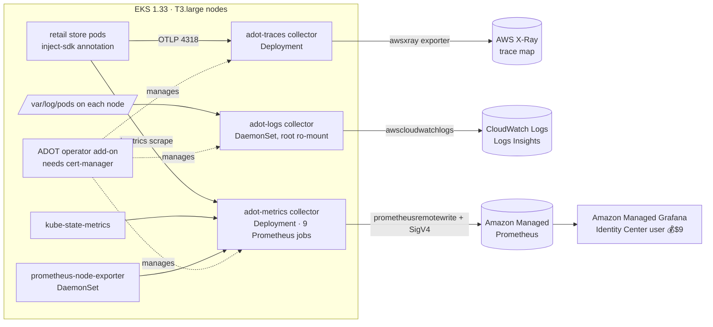

# Section 20 — Observability with OpenTelemetry (ADOT → X-Ray, CloudWatch, AMP/AMG)

> Source: transcript `20) Observability` (demos 2001–2004, ~270 min).
> All three observability pillars for the retail store, collected the vendor-neutral way: **AWS Distro for OpenTelemetry (ADOT)** collectors ship **traces → X-Ray**, **logs → CloudWatch Logs**, **metrics → Amazon Managed Prometheus**, visualized in **Amazon Managed Grafana**. Zero application-code changes — one annotation per deployment.
>
> ⚠️ **GAP (repo):** Section 20 folders aren't in the cloned repo snapshot; all YAML/TF below reconstructed from the instructor's line-by-line walkthrough. 💰 This is the most cost-sensitive section: the **AMG user costs $9 the moment you associate an Identity Center user** — the instructor explicitly says *watch, don't do* that part unless you want to pay.

---

## 1. Objective

- Understand the three pillars (metrics = *what/when*, logs = *what went wrong where*, traces = *where/why across services*) and why **OpenTelemetry** kills vendor lock-in.
- Extend the platform Terraform (`05_opentelemetry_terraform-manifests`, 19 resources) with: **cert-manager**, **ADOT operator**, **kube-state-metrics**, **prometheus-node-exporter** EKS add-ons; the ADOT-collector IAM role/policy/PIA + ServiceAccount + ClusterRole(Binding) (first use of the **Terraform kubernetes provider** for in-cluster resources); and **AMP + AMG workspaces** with Grafana's IAM role.
- Deploy three purpose-built **OpenTelemetryCollector** CRs: traces (Deployment mode), logs (**DaemonSet** mode), metrics (Deployment + 9 Prometheus scrape jobs), plus an **Instrumentation** CR that auto-injects the OTel SDK.
- Verify: X-Ray trace map of a full purchase; CloudWatch Logs Insights queries; AMP metrics via a verify script; Grafana dashboard `15661` over the whole cluster.

---

## 2. Problem Statement

The store works — but when "the API is slow at 3 PM," you have nothing. Metrics alone say *what/when* (response time jumped) but not *why*. Logs say *what broke in one component* ("DB connection timed out") but with 5+ microservices they never tell the request's whole story. Only traces show the journey — UI→catalog→carts→checkout→orders→DB/SQS — where each hop's time went and where it failed (e.g. "checkout made 50 DB calls instead of 1").

And the classic implementation trap: instrument 100 microservices with the Jaeger SDK + Prometheus client, then the org standardizes on AWS (X-Ray/CloudWatch) — and you're rewriting **application code** in 100 services. Vendor lock-in via SDK.

---

## 3. Why This Approach

| Decision | Chosen | Alternative | Why |
|---|---|---|---|
| Instrumentation | **OTel SDK, auto-injected** by operator annotation | per-vendor SDKs in code | swap backends by editing collector YAML — never touch app code again |
| Distribution | **ADOT** (EKS add-on) | upstream OTel Helm chart | AWS-managed operator, versioned via `aws_eks_addon`, native exporters |
| Traces backend | X-Ray | Jaeger self-hosted | managed, integrated trace map; exporters make it swappable anyway |
| Logs backend | CloudWatch Logs | ELK/Loki | zero-ops here; the *collection* (filelog daemonset) is backend-agnostic |
| Metrics backend | **AMP + AMG** | CloudWatch Container Insights | "the most interview-relevant, generalized setup" — real Prometheus/Grafana, managed |
| Collector topology | per-pillar collectors: traces=Deployment, logs=**DaemonSet**, metrics=Deployment | one mega-collector | logs live on each node's disk (`/var/log/pods`) → must run per node; traces/metrics are pushed/scraped centrally |
| Grafana auth | IAM **Identity Center** user (+MFA) | IAM users | AMG doesn't accept classic IAM users — humans need SSO/SAML |

---

## 4. How It Works — Under the Hood

### Vocabulary map

| OTel / AWS term | Plain English |
|---|---|
| ADOT operator (EKS add-on) | the *manager*: watches `OpenTelemetryCollector` CRs and creates the actual workloads |
| OpenTelemetryCollector CR | the *data pipeline*: receivers → processors → exporters, in a chosen mode |
| modes: Deployment / DaemonSet / StatefulSet / Sidecar | central gateway / one-per-node / buffered+persistent / per-pod |
| receiver (`otlp`, `filelog`, `prometheus`) | how data comes IN (pushed on 4317 gRPC / 4318 HTTP; tailed from disk; scraped) |
| processor (`memory_limiter`, `filter`, `k8sattributes`, `batch`, `resourcedetection`) | transform/enrich/limit in strict pipeline ORDER |
| exporter (`awsxray`, `awscloudwatchlogs`, `prometheusremotewrite`, `debug`) | where data goes OUT |
| `service.pipelines` | the wiring — a component defined but not listed in a pipeline **does nothing** |
| Instrumentation CR + `instrumentation.opentelemetry.io/inject-sdk` annotation | auto-attach the OTel SDK to app containers at startup |
| propagator `tracecontext` | W3C headers carrying trace-ID between services |
| sampler `always_on` / `traceidratio` | keep every trace (learning) / keep N% (production cost control) |
| SigV4 auth extension | collector signs AMP writes with its Pod Identity role — no keys |

### Architecture



### ASCII — one purchase becomes a trace

```
browser → ALB → ui → catalog → carts → checkout → orders → PostgreSQL
each service (SDK injected): span {trace-id, parent-id, timing} ──OTLP/4318──▶ traces collector
pipeline: memory_limiter → filter(drop /actuator/health, ELB-HealthChecker, kube-probe…)
          → k8sattributes(+namespace,+deployment,+pod) → batch(50 spans or 10s)
          → awsxray (indexed attrs searchable; ~$0.50/M traces per attr) [+ debug → collector log]
X-Ray console: client→ui→catalog→carts→checkout→orders(+db) map, per-node latency,
segment timeline per HTTP call. (carts→DynamoDB / checkout→Redis / orders→SQS spans absent —
the sample app's auto-instrumentation doesn't emit them; the calls still happen. ⚠️ app quirk.)
```

---

## 5. Instructor's Approach

1. **Concepts stack**: pillars → OTel's vendor-lock-in story (before/after diagrams) → ADOT (operator vs collector, four deployment modes) — only then folders and code.
2. **Everything platform-shaped goes into Terraform first** (`05_opentelemetry...`): one **combined IAM policy** for the collector SA (CloudWatch logs write/read, AMP remote-write, X-Ray PutTraceSegments/PutTelemetryRecords) + PIA (default/adot-collector); cert-manager add-on **before** the ADOT add-on (`depends_on`); kube-state-metrics ("what's happening *in Kubernetes*") vs node-exporter ("what's happening *on the machines*") distinction taught explicitly; SA + ClusterRole/Binding created via the **kubernetes provider** so the k8sattributes processor can query the API; AMP + AMG workspaces (Grafana role: AMP read, SNS publish for alerts, X-Ray read; auth `AWS_SSO`; `plugin_admin` + unified alerting on). Two version notes: **cluster pinned to 1.33** (ADOT add-on didn't support 1.34 yet — check before you build) and **nodes bumped to t3.large** to host the growing add-on fleet.
3. **App environment** reuses S19's Helm machinery with a **low-cost values profile** (1 replica, spot, PDB off, TSC ScheduleAnyway) — because observability demos don't need 15 pods — plus the one flag that matters: `opentelemetry.enabled=true` + `instrumentation: default-instrumentation` in every values file → chart adds the inject-sdk annotation → SDK auto-attached, "no code change, no image rebuild."
4. **Traces demo (2002)** — collector CR reviewed field by field, with three teaching highlights: the **filter processor** he built iteratively by watching debug logs ("health checks were bombarding X-Ray and costing money — 80–90% noise filtered"); **k8sattributes pod-association** (pod-IP → UID → connection fallbacks; needs the ClusterRole); **batch=50/10 s** ("one HTTPS call instead of fifty"). Instrumentation CR: protocol choice `http/protobuf` ("gRPC most efficient, http/json most problematic — we pick the middle"), `OTEL_METRICS/LOGS_EXPORTER: none` (per-pillar collectors), sampler `always_on` for learning vs `traceidratio 0.1` for production. Deploy collector → deploy instrumentation → **rollout-restart all five services** → purchase → X-Ray trace map, metrics per node, segment timeline, raw trace. Then **delete** both CRs ("we learned it, why keep paying").
5. **Logs demo (2003)** — the *mode* is the lesson: DaemonSet because logs are files on each node; root securityContext (only root reads `/var/log/pods`), tolerations `operator: Exists` (miss a tainted node = miss its logs), read-only hostPath. `filelog` receiver includes `/var/log/pods/*/*/*.log`, **excludes** its own and kube-system logs, `start_at: end` (no historical backfill flood). Practical fix he narrates: Karpenter pools re-limited to **medium/large** so nodes can host app pods *plus* the daemonset. Verify in Log group `/aws/eks/retail-dev-eksdemo1/application` (stream `-v4`) and **Logs Insights** filter queries (`/catalog/`).
6. **Metrics demo (2004)** — biggest YAML in the course: `prometheus` receiver with global 30 s scrape + `external_labels: cluster` ("critical when many clusters share one AMP/Grafana"), and **nine standard scrape jobs** (API server — with bearer-token auth, endpoint relabel keep-filter, TLS notes; nodes/kubelet; cAdvisor; service-endpoints + slow 5-min variant; pushgateway; blackbox-style service probes; **pods** — driven by the `prometheus.io/scrape|path|port` annotations the Helm charts already set, with an `action: drop` on non-running pods; pods-slow). Processors order hammered again (memory_limiter first *in the pipeline*); exporter `prometheusremotewrite` to the AMP endpoint (**paste your workspace ID!**) with the `sigv4auth` extension. A `verify-amp-metrics.sh` awscurl script proves data: lists scrape jobs, retail services, ~1259 unique metrics.
7. **Grafana finale, with the $9 gate** — enable IAM **Identity Center**, create a user (email invite, password, **MFA via authenticator app**), explain *why* not IAM (AMG accepts only Identity Center/SAML humans), associate the user to the AMG workspace (💰 **the $9/user moment**), promote to admin, sign in via the workspace URL, add the AMP data source through the AWS Data Sources app, **import dashboard `15661`** → cluster-wide workloads/pods/nodes/CPU/memory, per-service and per-container panels.
8. **Cleanup discipline**: delete the metrics collector; uninstall retail apps; data plane + cluster kept only if continuing straight to Section 21, otherwise destroy.

> 🐛 **TRANSCRIPT ERRORS (ASR):** "a dot / Adot" = ADOT; "hotel/Otel/OTC/what LP/OT LP" = OTel / OTLP; "jogger/Jageer/Jaguar" = Jaeger; "z database / z request" = etcd; "See advisor/Si advisor" = cAdvisor; "reliable configs" = relabel_configs; "faces" = traces; "amp/a p/AMC" = AMP; "seek for/SIG for" = SigV4; "1313" = 13133 (health check port); "five MB / phi to MB" = 512 MiB; "Azure Authenticator" (he says while showing) = an authenticator app; "K test" = k8s.

---

## 6. Code & Commands — Line by Line

### 6.1 Platform Terraform additions (`05_opentelemetry_terraform-manifests`, 19 resources)

```hcl
# c6_01..03 — ADOT collector identity (ONE role for all three pillars)
resource "aws_iam_policy" "adot_collector" {           # CloudWatch Logs write/read +
  policy = ...                                          # aps:RemoteWrite (AMP) +
}                                                       # xray:PutTraceSegments/PutTelemetryRecords
resource "aws_eks_pod_identity_association" "adot" {
  namespace = "default"  service_account = "adot-collector"  role_arn = ...
}

# c6_04..07 — four EKS add-ons, standard version-datasource pattern:
#   cert-manager  →  adot (depends_on cert-manager!)  →  kube-state-metrics  →  prometheus-node-exporter
resource "aws_eks_addon" "adot" {
  addon_name = "adot"
  depends_on = [aws_eks_addon.cert_manager]
  configuration_values = jsonencode({ manager = { resources = {...}, replicaCount = 1 } })
}

# c6_08..09 — in-cluster RBAC via the *kubernetes* provider (first time in the course):
resource "kubernetes_service_account" "adot_collector" { metadata { name = "adot-collector" namespace = "default" } }
resource "kubernetes_cluster_role" "adot" { ... get/list/watch on core, apps, nodes, /metrics ... }
resource "kubernetes_cluster_role_binding" "adot" { ... SA ↔ role ... }

# c7 — AMP:  resource "aws_prometheus_workspace" "amp" { alias = "${local.name}-amp" }
# c8_01..03 — AMG: IAM role (trust grafana.amazonaws.com) + policies (AMP read, SNS publish,
#   AWSXrayReadOnlyAccess) + workspace: auth AWS_SSO, permission_type CUSTOMER_MANAGED,
#   data_sources [PROMETHEUS, CLOUDWATCH, XRAY], plugin_admin + unified alerting enabled
```
Environment notes: `cluster_version = "1.33"` (ADOT add-on ceiling at recording time) and `node_instance_type = "t3.large"` (add-on fleet needs headroom). One script builds everything: VPC → EKS(+add-ons, 38 res) → Karpenter → CRDs → OTel TF.

### 6.2 Traces (2002)

**Collector CR (essentials with the why):**
```yaml
apiVersion: opentelemetry.io/v1beta1
kind: OpenTelemetryCollector
metadata: { name: adot-traces, namespace: default }
spec:
  mode: deployment            # central gateway; replicas: 1 (learning)
  serviceAccount: adot-collector          # ← Pod Identity → X-Ray permissions
  resources: { requests: { cpu: 200m, memory: 512Mi }, limits: {...} }
  config:
    receivers:
      otlp: { protocols: { grpc: { endpoint: 0.0.0.0:4317 }, http: { endpoint: 0.0.0.0:4318 } } }
    processors:               # ORDER MATTERS (enforced in service.pipelines below)
      memory_limiter: { check_interval: 5s, limit_mib: 512, spike_limit_mib: 128 }  # drop before OOM
      filter/healthchecks:    # built iteratively from debug logs — Spring /actuator/health,
        traces: { span: [ ... url.path == "/health", ELB-HealthChecker user-agent,
                          kube-probe, express middleware health ... ] }             # ~80-90% noise gone
      k8sattributes:
        auth_type: serviceAccount               # ← needs the c6_09 ClusterRole
        extract: { metadata: [k8s.namespace.name, k8s.deployment.name, k8s.pod.name, k8s.pod.uid, k8s.node.name] }
        pod_association: [ by pod IP → by pod UID → by connection ]   # primary + fallbacks
      batch: { send_batch_size: 50, timeout: 10s }   # 50 spans / 1 API call vs 50 calls
    exporters:
      awsxray:
        region: us-east-1
        indexed_attributes: [k8s.namespace.name, k8s.deployment.name, k8s.pod.name,
                             http.status_code, http.method]   # searchable; ~$0.50/M traces per attr
      debug: { verbosity: detailed }             # learning only — REMOVE in prod (log volume!)
    extensions: { health_check: { endpoint: 0.0.0.0:13133 } }  # operator wires liveness/readiness to it
    service:
      extensions: [health_check]
      pipelines:
        traces: { receivers: [otlp],
                  processors: [memory_limiter, filter/healthchecks, k8sattributes, batch],
                  exporters: [awsxray, debug] }   # defined-but-unlisted components are INERT
```

**Instrumentation CR (how apps find the collector):**
```yaml
apiVersion: opentelemetry.io/v1alpha1
kind: Instrumentation
metadata: { name: default-instrumentation, namespace: default }
spec:
  exporter: { endpoint: http://adot-traces-collector:4318 }   # CR name + "-collector" = the Service
  env:
    - { name: OTEL_SDK_DISABLED, value: "false" }             # global kill-switch
    - { name: OTEL_EXPORTER_OTLP_PROTOCOL, value: http/protobuf }  # gRPC=fastest, http/json=painful → middle
    - { name: OTEL_RESOURCE_PROVIDERS_AWS_ENABLED, value: "true" } # enrich: cluster ARN, instance, AZ, account
    - { name: OTEL_TRACES_EXPORTER, value: otlp }
    - { name: OTEL_METRICS_EXPORTER, value: none }            # per-pillar collectors — traces only here
    - { name: OTEL_LOGS_EXPORTER, value: none }
  propagators: [tracecontext, baggage]   # W3C trace headers; baggage = custom k/v (unencrypted — no secrets, keep small)
  sampler: { type: always_on }           # learning. Prod: traceidratio / parentbased_traceidratio, arg 0.05–0.1
```
Helm values did the app side already: `opentelemetry: {enabled: true, instrumentation: default-instrumentation}` → chart adds `instrumentation.opentelemetry.io/inject-sdk: default-instrumentation` to the pod template (verify: `kubectl get deploy carts -o yaml | grep -A3 annotations`).

**Run:**
```bash
kubectl apply -f 01_adot-collector-traces.yaml
kubectl get opentelemetrycollector            # adot-traces, MODE deployment, MANAGED
kubectl -n opentelemetry-operator-system get deploy   # the operator the add-on installed
kubectl apply -f 02_adot-instrumentation-traces.yaml
kubectl get instrumentation
./restart-retail-app.sh                      # rollout restart catalog carts checkout orders ui — SDK injects at startup
kubectl exec -it <ui-pod> -- env | grep OTEL # injected env vars visible
# purchase in the UI → CloudWatch → Application Signals → Traces → run query → open the k8s trace:
#   map client→ui→catalog→carts→checkout→orders(+orders-db); node metrics; segment timeline; raw trace
kubectl logs -f deploy/adot-traces-collector # debug exporter mirrors spans (trace-id, parent-id, http attrs)
# cleanup: kubectl delete -f 02_... -f 01_...
```

### 6.3 Logs (2003)

```yaml
kind: OpenTelemetryCollector
metadata: { name: adot-logs }
spec:
  mode: daemonset                       # logs are FILES on each node — must run everywhere
  serviceAccount: adot-collector
  securityContext: { runAsUser: 0, runAsGroup: 0 }   # /var/log/pods is root-readable only
  tolerations: [{ operator: Exists }]                # run even on tainted nodes or you miss logs
  volumeMounts: [{ name: varlogpods, mountPath: /var/log/pods, readOnly: true }]  # read, NEVER write
  volumes: [{ name: varlogpods, hostPath: { path: /var/log/pods } }]
  resources: { requests: { cpu: 50m, memory: 128Mi } }   # deliberately tiny — one per node
  config:
    receivers:
      filelog:
        include: [/var/log/pods/*/*/*.log]
        exclude: [/var/log/pods/default_adot-logs*/**, /var/log/pods/kube-system_*/**]  # no self-logs, no system noise
        start_at: end                    # only NEW lines — don't flood CloudWatch with history on startup
    processors: { memory_limiter: {limit_mib: 400}, k8sattributes: {...}, batch: {} }
    exporters:
      awscloudwatchlogs:
        region: us-east-1
        log_group_name: /aws/eks/retail-dev-eksdemo1/application
        log_stream_name: retail-dev-eksdemo1-v4     # single stream = simple; per-node possible
    service: { pipelines: { logs: { receivers: [filelog],
                                    processors: [memory_limiter, k8sattributes, batch],
                                    exporters: [awscloudwatchlogs] } } }
```
Sizing gotcha he fixes on camera: Karpenter NodePool sizes narrowed to **medium/large** — a micro node can't host app pods *plus* the daemonset pod (pending collectors = missed logs). Verify: `kubectl get ds` (4/4), CloudWatch → Log groups → stream `-v4` fills after a purchase; **Logs Insights**: `fields @timestamp, @message | filter @message like /catalog/ | sort @timestamp desc`.

### 6.4 Metrics → AMP → AMG (2004)

**Collector highlights (the full CR is ~9 scrape jobs of standard Prometheus config):**
```yaml
kind: OpenTelemetryCollector
metadata: { name: adot-metrics-prometheus }
spec:
  mode: deployment  replicas: 1  serviceAccount: adot-collector
  config:
    receivers:
      prometheus:
        config:
          global:
            scrape_interval: 30s  scrape_timeout: 10s
            external_labels: { cluster: retail-dev-eksdemo1 }   # CRITICAL with multi-cluster AMP/Grafana
          scrape_configs:        # the nine standard jobs:
          - job_name: kubernetes-apiservers    # bearer_token_file auth; kubernetes_sd role: endpoints;
            #   relabel keep: default;kubernetes;https  → ONLY the apiserver endpoint; scheme https + CA + skip-verify
          - job_name: kubernetes-nodes         # kubelet metrics (node resources, pod counts)
          - job_name: kubernetes-nodes-cadvisor  # per-container CPU/mem/net/fs
          - job_name: kubernetes-service-endpoints        # apps exposing metrics via Services
          - job_name: kubernetes-service-endpoints-slow   # same, scrape_interval: 5m
          - job_name: prometheus-pushgateway
          - job_name: kubernetes-services      # blackbox-style probes (availability/latency)
          - job_name: kubernetes-pods          # ← OUR APPS: driven by pod annotations
            #   prometheus.io/scrape: "true", /path, /port (the Helm charts set these!)
            #   relabel action: drop on phase Pending|Succeeded|Failed|Completed
          - job_name: kubernetes-pods-slow     # 5m variant
    processors:
      memory_limiter: { limit_mib: 512, spike_limit_mib: 128 }   # FIRST in pipeline
      resourcedetection: { detectors: [eks, ec2, system] }        # cluster/instance/OS attrs
      resource: { attributes: [{key: cluster, value: retail-dev-eksdemo1, action: upsert},
                               {key: deployment.environment, value: development, action: upsert}] }
      batch: { send_batch_size: 1000, timeout: 60s }              # 1 call per 1000 metrics
    exporters:
      prometheusremotewrite:
        endpoint: https://aps-workspaces.us-east-1.amazonaws.com/workspaces/<WORKSPACE_ID>/api/v1/remote_write
        auth: { authenticator: sigv4auth }     # ← signs with the Pod Identity role. PASTE YOUR WORKSPACE ID.
      debug: {}                                 # comment out of the pipeline in prod
    extensions: { health_check: {}, pprof: {}, zpages: {}, sigv4auth: { region: us-east-1, service: aps } }
    service:
      extensions: [health_check, pprof, zpages, sigv4auth]
      pipelines:
        metrics: { receivers: [prometheus],
                   processors: [memory_limiter, resourcedetection, resource, batch],
                   exporters: [prometheusremotewrite] }   # add debug here to mirror into pod logs
```

**Verify + Grafana:**
```bash
# workspace ID: terraform output in 05_opentelemetry... (or AMP console)
kubectl apply -f 01_adot-collector-prometheus-full-cluster.yaml
kubectl logs -f deploy/adot-metrics-prometheus-collector       # metrics flowing (if debug enabled)
./verify-amp-metrics.sh        # awscurl to the AMP query API: connectivity, scrape jobs list,
                               # retail services present, ~1259 unique metric names

# Grafana (💰 $9/user on association — WATCH-ONLY unless you accept the charge):
#  IAM Identity Center → enable → Users → add (email invite → set password → MFA authenticator app)
#  AMG workspace → Assign user  ← the $9 moment → promote to Admin
#  open the workspace URL → Sign in with AWS IAM Identity Center (+MFA)
#  Apps → AWS Data Sources → Amazon Managed Service for Prometheus → us-east-1 → your workspace → Add
#  Dashboards → Import → ID 15661 → select the AMP data source → Import
#  → cluster overview: workloads/pods/nodes, per-namespace, per-pod CPU & memory panels
```
Why Identity Center, not IAM: IAM users = programmatic (keys); Identity Center = **human** access (username+password+MFA, SSO across accounts, IdP federation) — and AMG simply doesn't accept classic IAM users.

---

## 7. Complete Code Reference (execution order)

```
20_Observability_OpenTelemetry/
├── 20_01_EKS_Environment_with_ADOT/
│   ├── 01_EKS_Cluster_Environment/          # VPC → EKS 1.33 (t3.large, 38 res) → Karpenter →
│   │   ├── 05_opentelemetry_terraform-manifests/   # + 19 res: collector IAM/PIA, cert-manager,
│   │   │                                            #   adot, kube-state-metrics, node-exporter,
│   │   │                                            #   SA+RBAC (kubernetes provider), AMP, AMG(+role)
│   │   └── create/destroy-cluster-with-karpenter-and-opentelemetry.sh
│   └── 02_RetailStore_App_Environment/      # data plane + S19 Helm values (low-cost profile,
│                                            #   opentelemetry.enabled=true everywhere)
├── 20_02_OpenTelemetry_Traces/    01_collector (deployment) · 02_instrumentation · restart script
├── 20_03_OpenTelemetry_Logs/      01_collector (daemonset, filelog → CloudWatch)
└── 20_04_OpenTelemetry_AMP_AMG/   01_collector (prometheus → AMP remote_write) · verify-amp-metrics.sh
```

Run order: cluster script → data plane → Helm apps (OTel enabled) → traces demo (deploy CRs, restart apps, X-Ray, delete CRs) → logs demo (daemonset, CloudWatch, delete) → metrics demo (paste workspace ID, deploy, verify, [Grafana — $9 gate]) → cleanup (collector → apps → data plane → cluster).

---

## 8. Hands-On Labs

### Lab A — Reproduce traces + logs (skip the $9)

> 💰 **Cost warning:** cluster (t3.large ×3) + data plane + spot app node ≈ $0.5–0.7/h; X-Ray ~$5/M traces (the health-check filter exists to protect this); CloudWatch log ingest $0.50/GB; AMP is pennies at this scale. **AMG user = $9 flat on association — the instructor says watch-only.** Full teardown same session.

**Steps:** §7 order through the logs demo; use `always_on` sampler; make one purchase per verification.
**Expected output:** X-Ray trace map shows client→ui→catalog→carts→checkout→orders with latency per node; injected `OTEL_*` env vars visible in app pods; `kubectl get ds` shows one log collector per node; Logs Insights returns your `/catalog/` lines; `verify-amp-metrics.sh` reports the nine jobs and 1000+ metric names.
**Verify:** collector pods Running with zero `AccessDenied` (Pod Identity chain works); deleting the Instrumentation + restarting apps removes the `OTEL_*` env (clean rollback).

### Lab B — Variation: production-tune the pipelines

1. **Sampling:** switch the Instrumentation to `sampler: {type: parentbased_traceidratio, argument: "0.1"}`, restart apps, make 20 purchases → ~2 traces land in X-Ray. The cost knob in action.
2. **Drop the debug exporters** from every pipeline (comment in `service.pipelines`, re-apply) — observe collector log volume collapse; this is the prod posture.
3. **Add your own filter:** extend `filter/healthchecks` to drop spans for `/topology` and confirm they vanish while purchases still trace.
4. **Second export target:** add a `logging`-style or second region `awsxray` exporter to the traces pipeline — the whole OTel pitch (backend swap = YAML edit) made tangible.

🧹 Same as Lab A.

**Free local variant:** kind + upstream `opentelemetry-operator` (Helm) + cert-manager + a Jaeger all-in-one pod as the trace backend; same Collector/Instrumentation CRs with a `otlp` exporter pointed at Jaeger — every OTel concept (modes, pipelines, inject-sdk, sampling) rehearses identically; only the AWS exporters/IAM differ.

### Lab C — Break-it-and-fix-it

1. **Skip cert-manager:** create the ADOT add-on with the cert-manager add-on absent → add-on/webhook failures (the operator's admission webhook needs certs). **Fix:** cert-manager first — the `depends_on` exists for a reason.
2. **Wrong SA on a collector:** change `serviceAccount: default` on the traces collector → spans arrive but X-Ray export loops `AccessDenied` in collector logs (no Pod Identity role). **Fix:** `adot-collector` — the SA *is* the credential.
3. **Break pipeline order:** put `batch` before `memory_limiter` in `service.pipelines` → collector may OOM under burst because batching buffers ahead of the limiter. **Fix:** memory_limiter always first.
4. **Non-root logs collector:** remove the `runAsUser: 0` securityContext → filelog receiver logs `permission denied` on `/var/log/pods`, zero logs ship. **Fix:** root + readOnly mount is the accepted trade for node-log collection.
5. **Forgot the workspace ID:** deploy the metrics collector with the placeholder → remote-write 404s in the collector log; AMP query returns nothing. **Fix:** paste the real ID from `terraform output`.

---

## 9. Troubleshooting

| Symptom | Likely cause | Command to confirm | Fix |
|---|---|---|---|
| No traces in X-Ray after purchase | apps not restarted post-Instrumentation, or annotation absent | `kubectl exec <pod> -- env \| grep OTEL`; `kubectl get deploy <s> -o yaml \| grep inject-sdk` | values `opentelemetry.enabled=true`; run the restart script |
| Collector exports fail `AccessDenied` | SA ≠ `adot-collector` / PIA association missing / policy lacks the pillar's actions | collector logs; `aws eks list-pod-identity-associations` | One SA, one role, all three permission blocks (c6_01) |
| `kubectl get opentelemetrycollector` empty / CR rejected | ADOT operator not installed (add-on failed — often cert-manager missing) | `kubectl -n opentelemetry-operator-system get deploy`; add-on status in console | cert-manager → adot order; cluster ≤ the add-on's max K8s version (1.33 here) |
| Spans flood X-Ray, bill climbing | health-check filter not in the pipeline / `always_on` in prod | X-Ray trace count; collector debug | filter in `service.pipelines`; `traceidratio` sampling |
| k8sattributes adds nothing (no pod/namespace on traces) | ClusterRole/Binding missing → API queries denied | operator/collector logs "forbidden" | apply c6_08/09 (SA RBAC) |
| Logs daemonset pods Pending on some nodes | node too small (micro) or taint w/o toleration | `kubectl get ds; kubectl describe pod` | NodePool sizes ≥ medium; tolerations `operator: Exists` |
| `permission denied` reading /var/log/pods | collector not running as root | `kubectl get pod <p> -o yaml \| grep runAsUser` | `runAsUser: 0` + readOnly hostPath |
| CloudWatch flooded with old logs on deploy | `start_at: beginning` (or unset) | log group ingestion spike | `start_at: end` |
| AMP empty though collector Running | workspace ID placeholder / sigv4auth extension not listed in `service.extensions` | collector logs 404/403 on remote_write | paste ID; extension must be *activated* in service |
| App metrics absent from AMP (cluster metrics fine) | pods lack `prometheus.io/scrape` annotations | `kubectl get pod <p> -o yaml \| grep prometheus.io` | Helm charts set them — check values/chart version |
| Can't log into Grafana | using an IAM user, or Identity Center user not associated / no MFA set | AMG workspace → users tab | Identity Center user (+MFA) associated (💰) and role ≥ viewer |
| Grafana dashboard empty | wrong data source selected at import, or `external_labels.cluster` filter mismatch | panel query inspector | pick the AMP source at import; consistent cluster label |

---

## 10. Interview Articulation

**90-second spoken answer — "How is observability set up on your EKS platform?"**

> "OpenTelemetry end to end, via the AWS distro, so the applications are completely backend-agnostic — the operator injects the OTel SDK through a single pod annotation our Helm charts set, no code or image changes. We run three purpose-built collectors, each a receivers→processors→exporters pipeline. Traces: a central Deployment-mode collector receives OTLP on 4318, drops health-check noise with a filter processor — that alone cut 80-plus percent of span volume and real X-Ray cost — enriches spans with pod, deployment and namespace via the k8sattributes processor, batches fifty at a time, and exports to X-Ray with a handful of indexed attributes so we can search by status code or deployment. Logs: DaemonSet mode by necessity, because container logs are files on each node — a root, read-only mount of /var/log/pods into a filelog receiver, `start_at: end` so startup never floods CloudWatch. Metrics: a Prometheus-receiver collector running the nine standard scrape jobs — API server, kubelet, cAdvisor, service endpoints, annotated pods — plus kube-state-metrics and node-exporter add-ons, remote-writing to Amazon Managed Prometheus with SigV4 auth off its Pod Identity role, external cluster labels for multi-cluster Grafana. Dashboards live in Amazon Managed Grafana behind IAM Identity Center with MFA — AMG doesn't take classic IAM users. Ordering discipline matters everywhere: memory_limiter first in every pipeline, cert-manager before the ADOT add-on, and a component that isn't listed in `service.pipelines` silently does nothing. In production we swap the always-on sampler for a trace-ID ratio and delete the debug exporters — both are one-line YAML changes, which is exactly the vendor-neutrality OTel promises."

<details>
<summary>Self-test Q&A (5)</summary>

**Q1. Why three collectors in three modes instead of one?**
A: The data's physics differ. Traces/metrics are pushed/scraped over the network → a central Deployment gateway scales fine. Logs are files on each node's disk (`/var/log/pods`) → only a DaemonSet with a hostPath mount can read them all without shipping raw files across nodes. (StatefulSet mode exists for buffered/persistent pipelines; sidecar for per-app custom config.)

**Q2. Trace the path from "user clicks purchase" to a span in X-Ray.**
A: The inject-sdk annotation had the operator attach the OTel SDK at container start, configured by the Instrumentation CR (OTLP http/protobuf → `adot-traces-collector:4318`, W3C tracecontext propagation). Each service emits spans sharing the trace-ID; the collector pipeline runs memory_limiter → health-check filter → k8sattributes (pod-IP association, via its ClusterRole) → batch(50/10s) → `awsxray` exporter, signed by the SA's Pod Identity role. X-Ray assembles spans into the trace map.

**Q3. What breaks if a processor is defined under `config.processors` but omitted from `service.pipelines`?**
A: Nothing errors — it's silently inert. The pipeline list is the *activation* and *ordering*: only listed components run, in listed order. Classic bug: filter defined, bill still climbing, because it was never wired into the traces pipeline.

**Q4. How do metrics get from an app pod into Grafana with no keys anywhere?**
A: Helm charts annotate pods `prometheus.io/scrape|path|port`; the metrics collector's `kubernetes-pods` scrape job discovers and scrapes them (dropping non-Running pods via relabel); processors add cluster/environment labels; `prometheusremotewrite` sends to the AMP workspace, authenticated by the `sigv4auth` extension using the collector SA's Pod-Identity IAM role; Grafana (IAM-role-based data source) queries AMP.

**Q5. Production changes vs the demo config?**
A: Sampler `always_on` → `parentbased_traceidratio` (~5–10%); remove `debug` exporters from all pipelines; keep/extend the health-check span filter; pin the collector CR versions and right-size `memory_limiter`/resources; per-cluster `external_labels` mandatory with shared AMP; restrict indexed X-Ray attributes to what you actually search (each costs per-trace); consider multiple collector replicas + StatefulSet buffering for burst tolerance.

</details>

---

*Previous: [19 — Helm Retail Store + AWS Data Plane](19-helm-retailstore-dataplane.md) · Next: [21 — CI/CD with GitOps](21-cicd-gitops.md) · [Index](00-INDEX.md)*
