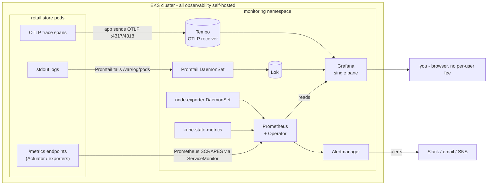

# Section 20.5 — Observability with the Prometheus & Grafana Stack (self-hosted LGTM)

> **What this section is:** the *exact same observability project* as [Section 20](20-observability-opentelemetry.md) — same retail store app, same three pillars (metrics, logs, traces), same EKS cluster — **re-implemented with the self-hosted Prometheus + Grafana stack instead of ADOT → AWS-managed backends.** Section 20 shipped traces → X-Ray, logs → CloudWatch, metrics → Amazon Managed Prometheus + Grafana. This section keeps everything *inside the cluster*: **Prometheus** (metrics), **Loki** (logs), **Tempo** (traces), all visualized in one self-hosted **Grafana** — the "LGTM" stack (Loki, Grafana, Tempo, Metrics).
>
> Section 20 is **not altered** — this is a parallel implementation you can do *instead of* (or after) it to master the second, and more common, observability toolchain. In real DevOps/SRE interviews, **Prometheus + Grafana is the answer they expect** for metrics/SLOs; ADOT + AWS-managed is one valid variant. Learn both; lead with this one.
>
> ℹ️ **Note (this is original — not the instructor's code):** the course does observability with ADOT (Section 20). This Prometheus/Grafana version is an **authored alternative**, so its manifests are *not* in the instructor's repo — but the **base it runs on is fully repo-verified**: the same Section-13 EKS cluster + Section-14/19 retail store app (folders `13_…`, `14_…`, `19_…` in [the canonical repo](https://github.com/stacksimplify/devops-real-world-project-implementation-on-aws)). The Helm-values below are standard kube-prometheus-stack / Loki / Tempo — check upstream chart versions before installing.

---

## 0. 🧭 Beginner Follow-Along Guide (start here)

> Read this guide first; dive into the numbered sections after. Tags: **[Terminal]** = your laptop's shell · **[Editor]** = the values/CR YAML files · **[Browser]** = Grafana at localhost:3000 + the store.
> Same goal as S20 (see inside the app: metrics/logs/traces), but everything self-hosted IN the cluster — no $9 Grafana users, no per-trace fees, and it's the toolchain interviews expect. If you're choosing one to do hands-on, do THIS one.

### 📊 The whole section at a glance — components & workflow

*Read top to bottom; boxes are components, arrows are the flow (the same shape as your terminal→shell→fork diagram).*

```
┌──────────────────────────────────────────────────────────────────────┐
│          RETAIL PODS  (/metrics · stdout logs · OTLP spans)          │
│                                                                      │
│ everything self-hosted IN the cluster — no per-user fee              │
└──────────────────────────────────────────────────────────────────────┘
                     │                │              │
                     ▼                ▼              ▼
            ┌────────────────┐ ┌────────────┐ ┌────────────┐
            │   Prometheus   │ │    Loki    │ │   Tempo    │
            │ PULLS via      │ │ ← Promtail │ │ ← app OTLP │
            │ ServiceMonitor │ │ DaemonSet  │ │ :4317/4318 │
            └────────────────┘ └────────────┘ └────────────┘
                                    │  all three are data sources
                                    ▼
┌──────────────────────────────────────────────────────────────────────┐
│           GRAFANA  (single pane: PromQL · LogQL · TraceQL)           │
│                                                                      │
│ Alertmanager → Slack  ·  spike → exemplar → trace → logs (one pane)  │
└──────────────────────────────────────────────────────────────────────┘
```

### Where you are in the course

```
S20 (ADOT → AWS backends, watch-friendly) ─▶ THIS: 20.5 same pillars, self-hosted LGTM stack ─▶ S21 CI/CD
```

**Must already exist/be running:**
```
[ ] The S13-style cluster + the retail store running (S14/19 Helm form is fine)
[ ] helm working; ~3 spare GB of cluster capacity for the monitoring namespace
[ ] 💚 Fully free-able: the WHOLE stack also runs on a local kind cluster (§8's free variant) — $0 practice
```

### Words you'll meet (plain English)

| Word | Plain meaning |
|---|---|
| LGTM stack | Loki (logs) + Grafana (UI) + Tempo (traces) + Metrics (Prometheus) — all in-cluster |
| kube-prometheus-stack | ONE Helm chart bundling Prometheus + Grafana + Alertmanager + exporters + the operator |
| pull vs push | Prometheus SCRAPES `/metrics` on a schedule (pull) — no metrics collector to run at all |
| ServiceMonitor | a small CRD: "scrape these pods' /metrics" — add it and scraping just starts |
| Promtail | the DaemonSet tailing `/var/log/pods` on every node → ships to Loki |
| Loki | "Prometheus for logs" — indexes only labels, cheap to run, queried with LogQL |
| Tempo | the trace store — apps push OTLP spans to it (replaces X-Ray) |
| PromQL / LogQL / TraceQL | the three query languages, one Grafana over all of them |
| Alertmanager | routes/dedupes alert notifications (Slack/email) from Prometheus rules |

### The simplified play-by-play (do this → see that)

1. **[Terminal]** One command installs the metrics world: `helm install kps prometheus-community/kube-prometheus-stack -n monitoring --create-namespace -f 01-kube-prometheus-stack/kps-values.yaml`
   → **you should see:** `kubectl get pods -n monitoring` — Prometheus, Grafana, Alertmanager, node-exporter (one per node), kube-state-metrics all Running. `(deep dive: §6.1)`
2. **[Terminal]** First look: `kubectl -n monitoring port-forward svc/kps-grafana 3000:80` → **[Browser]** `localhost:3000`, login **admin / admin** (lab default).
   → **you should see:** built-in Kubernetes dashboards already populating — node CPU/memory for free.
3. **[Terminal]** Point Prometheus at the store: `kubectl apply -f 02-servicemonitors/`
   → **you should see:** **[Browser]** Prometheus → Status → Targets: the retail services appear and turn **UP** — pull-based scraping started with NO app change and NO collector. `(deep dive: §6.2)`
4. **[Terminal]** Logs: `helm install loki grafana/loki …` + `helm install promtail grafana/promtail …`
   → **you should see:** one promtail pod per node (the DaemonSet-tails-files shape, same as S20's logs collector); Grafana → Explore → Loki → query `{namespace="default"}` returns live pod logs.
5. **[Terminal]** Traces: `helm install tempo grafana/tempo …`, then `kubectl apply -f 05-app-otlp/` (points the apps' OTLP at Tempo) and rollout-restart the services.
   → **you should see:** after a **[Browser]** purchase: Grafana → Explore → Tempo → a trace ui→catalog→carts→checkout→orders with per-span timings, and the service graph rendering.
6. **[Terminal]** The production extra S20 didn't give you: `kubectl apply -f 06-rules/` — SLO recording rules + alerts in PromQL.
   → **you should see:** Alertmanager showing your rules; fire one by breaking something small (stop a service, watch the alert). `(deep dive: §6.5)`
7. **[Browser]** The correlation superpower: from a latency panel spike → exemplar dot → the exact trace → its logs — three pillars, one pane. Import dashboards `315`/`6417` for the classic cluster views.

### ✅ Done-check

```
[ ] all monitoring pods Running; Grafana reachable on :3000
[ ] Prometheus Targets shows retail ServiceMonitors UP (pull, no collector)
[ ] Loki query returns pod logs; promtail = one pod per node
[ ] a purchase produced a Tempo trace with per-span timings
[ ] you can explain pull-vs-push and why ONLY logs need a DaemonSet
```

🧹 **Teardown before you stop:** `helm uninstall kps loki promtail tempo -n monitoring && kubectl delete ns monitoring` (frees the cluster capacity), then the usual store/cluster teardown if ending the session. 💰 Nothing here bills per-user or per-trace — the cost IS the cluster's compute/storage; on kind it's literally $0.

---

## 1. Objective

Give the retail store all three observability pillars **without any AWS-managed observability service**, entirely on the EKS cluster:

| Pillar | Section 20 (ADOT → AWS) | **This section (self-hosted)** |
|---|---|---|
| **Metrics** | ADOT collector → Amazon Managed Prometheus → Amazon Managed Grafana ($9/user) | **kube-prometheus-stack**: Prometheus scrapes directly → Grafana in-cluster (free) |
| **Logs** | ADOT DaemonSet → CloudWatch Logs (per-GB ingest) | **Loki + Promtail/Alloy**: DaemonSet tails pod logs → Loki → Grafana (LogQL) |
| **Traces** | ADOT deployment → AWS X-Ray | **Tempo**: apps send OTLP → Tempo → Grafana (TraceQL + service graph) |
| **Alerting** | (X-Ray/CW alarms) | **Alertmanager** (bundled) + Grafana alerts → Slack/email/SNS |

By the end you can: install the whole LGTM stack via Helm, scrape retail-store app metrics with **ServiceMonitors/PodMonitors** (Prometheus *pull*, no collector to run for metrics), aggregate all pod logs into Loki, capture distributed traces of a purchase in Tempo, correlate all three in a single Grafana pane, and write SLO recording/alerting rules in **PromQL**.

---

## 2. Problem Statement

Same core problem as Section 20 — *"the pods are green but is the app actually healthy, and when a purchase is slow, where did the time go?"* — but with a second, equally important business question this section answers head-on:

**AWS-managed observability has real, recurring cost and lock-in.** Amazon Managed Grafana bills **$9 per active user/month**; X-Ray charges per trace + per indexed attribute; CloudWatch Logs charges per-GB ingested and stored. For a small team or a cost-sensitive platform, self-hosting Prometheus + Grafana + Loki + Tempo trades those per-use fees for *cluster compute + storage you already run* — and keeps every signal portable across any Kubernetes, not just EKS.

The trade you're making (and must be able to defend in an interview): **you now operate the observability backends** (Prometheus/Loki/Tempo storage, retention, HA) instead of AWS operating them for you. This section is where you learn to run them.

---

## 3. Why This Approach

| Concern | Self-hosted Prometheus/Grafana (this section) | ADOT + AWS-managed (Section 20) |
|---|---|---|
| **Metrics collection** | **Pull** — Prometheus scrapes `/metrics` endpoints on a schedule. No per-app collector for metrics. | **Push** — apps/collector push to AMP via remote-write |
| Cost | Cluster compute + EBS/S3 storage; **no per-user Grafana fee** | AMG $9/user, X-Ray per-trace, CW per-GB |
| Portability | Runs on any K8s (kind, EKS, on-prem) unchanged | EKS/AWS-coupled |
| Ops burden | **You run the storage** (retention, HA, backups) | AWS runs it |
| Query languages | **PromQL** (metrics), **LogQL** (logs), **TraceQL** (traces) — one Grafana, three DSLs | PromQL, CloudWatch Insights, X-Ray |
| Interview default | **The expected answer for metrics/SLOs** | A valid managed variant |

**Why pull beats push for metrics (the key mental model):** Prometheus *scrapes* targets it discovers via Kubernetes service discovery. This means the collection config lives in **Prometheus**, not in every app — add a `ServiceMonitor` and Prometheus starts scraping; no app redeploy, no collector sidecar. For metrics specifically this is *simpler* than Section 20's ADOT metrics collector. (Logs still need a DaemonSet — Promtail — because pod logs are files on each node; traces still need the app to emit spans, which Tempo receives via OTLP. So two of the three pillars mirror Section 20's collector shape; metrics is where pull wins.)

**Why Loki over ELK (the field-guide note, applied):** Loki is *"Prometheus, but for logs"* — it indexes only labels (namespace/pod/container), not full-text, so it's dramatically cheaper to run than Elasticsearch and shares Grafana + label-selectors with your metrics. For a K8s platform it's the modern, light choice.

---

## 4. How It Works — Under the Hood

### Vocabulary map

| Term | What it is | Section-20 analogue |
|---|---|---|
| **kube-prometheus-stack** | Helm chart bundling Prometheus + Grafana + Alertmanager + node-exporter + kube-state-metrics + the Prometheus Operator | (replaces AMP + AMG + the metrics ADOT collector) |
| **Prometheus Operator** | Operator that turns CRDs (ServiceMonitor/PodMonitor/PrometheusRule) into live Prometheus scrape/rule config | (the "wiring" AMP didn't give you declaratively) |
| **ServiceMonitor / PodMonitor** | CRD: "scrape these pods/services' `/metrics` on this port/path/interval" | (replaces ADOT's Prometheus scrape_configs) |
| **kube-state-metrics** | Exposes K8s object state (deploy replicas, pod phase) as metrics | same add-on as Section 20 |
| **node-exporter** | DaemonSet exposing node CPU/mem/disk/network | same add-on as Section 20 |
| **Loki** | Log store; indexes labels, not text; queried with LogQL | replaces CloudWatch Logs |
| **Promtail / Grafana Alloy** | DaemonSet that tails `/var/log/pods` and ships to Loki | replaces the ADOT logs DaemonSet |
| **Tempo** | Trace store; receives OTLP/Jaeger/Zipkin; queried with TraceQL | replaces AWS X-Ray |
| **Grafana** | Single UI over Prometheus + Loki + Tempo data sources | replaces Amazon Managed Grafana |
| **Alertmanager** | Routes/dedupes/silences alerts from Prometheus rules | (new — X-Ray/CW alarms in S20) |
| **PromQL / LogQL / TraceQL** | Query languages for metrics / logs / traces | PromQL / CW Insights / X-Ray filter |
| **Exemplars** | Trace IDs attached to metric samples → jump metric→trace | (the metric↔trace correlation) |

### Architecture



### The three collection shapes (why each pillar is wired differently)

```
METRICS  = PULL   Prometheus discovers targets via ServiceMonitor → scrapes /metrics every 30s.
                  The config lives in Prometheus. Add a ServiceMonitor → scraping starts.
                  → NO collector to run for metrics (this is the simplification vs ADOT).

LOGS     = TAIL   Pod logs are FILES on each node (/var/log/pods). A DaemonSet (Promtail)
                  must run on every node to read them → ship to Loki with namespace/pod labels.
                  → same DaemonSet shape as Section 20's ADOT logs collector.

TRACES   = PUSH   A trace is produced INSIDE the app; the app emits OTLP spans to Tempo's
                  receiver (:4317 gRPC / :4318 HTTP). Tempo stores; Grafana queries with TraceQL.
                  → same app-instrumentation as Section 20, only the backend changes (Tempo, not X-Ray).
```

### The correlation superpower (the reason for one Grafana)

```
A purchase is slow. In ONE Grafana:
  1. Metrics panel: e2e latency p95 spiked at 14:32  (PromQL)
  2. Click the exemplar dot on that spike → jumps to the exact Tempo TRACE  (metric→trace)
  3. Trace shows: orders → PostgreSQL span took 3.8s
  4. "Logs for this trace" → LogQL filter by trace_id → the orders pod's error log line
  what / where / why — in three clicks, no context-switching between tools.
```

---

## 5. Instructor's Approach (adapted — this is the Prometheus/Grafana re-implementation)

Section 20's flow was *concepts → ADOT collectors → three demos*. This re-implementation keeps the same spine, swapping the backends:

1. **Same pillars, same app.** The retail store (catalog/carts/checkout/orders/ui) and the Section-13 cluster are unchanged. Only the observability plane differs.
2. **Metrics first, because pull is the big simplification.** Install `kube-prometheus-stack` (one Helm release = Prometheus + Grafana + Alertmanager + node-exporter + kube-state-metrics). The retail store's Spring Boot services already expose `/actuator/prometheus`; add **ServiceMonitors** and Prometheus scrapes them — *no metrics collector to configure*, unlike Section 20's ADOT Prometheus config.
3. **Logs via Loki.** Install `loki` + `promtail` (or Grafana Alloy). Promtail's DaemonSet tails `/var/log/pods` with the same root/tolerations/hostPath pattern as Section 20's ADOT logs collector — but ships to in-cluster Loki instead of CloudWatch. Add Loki as a Grafana data source; query with **LogQL**.
4. **Traces via Tempo.** Install `tempo`. The apps emit OTLP spans (same instrumentation annotation idea as Section 20) but point the exporter endpoint at **Tempo's OTLP receiver** (`tempo:4317`) instead of the ADOT traces collector. Add Tempo as a Grafana data source; view the purchase trace with **TraceQL** and the service graph.
5. **Wire the three together** in Grafana: metrics dashboards (import the same DCGM/Kubernetes dashboards + retail-store panels), Explore for logs, trace view — plus **exemplars** so a metric spike links straight to its trace, and Loki's derived-fields so a trace links to its logs.
6. **Alerting** (new vs S20): PrometheusRules for SLO burn + Alertmanager routing to Slack — the piece AWS-managed made you reach for CloudWatch alarms.
7. **The cost punchline:** everything runs on the cluster; **zero per-user Grafana fee, zero X-Ray/CloudWatch ingest bill** — you traded managed-service cost for running the storage yourself. Say that trade explicitly in interviews.

> 🐛 **Note:** the retail store's Spring Boot microservices expose Prometheus metrics at `/actuator/prometheus` when the Micrometer Prometheus registry is on the classpath (it is, in the sample app); the Go catalog and Node checkout expose `/metrics`. If a service doesn't, that's where you'd add an exporter sidecar — called out in Troubleshooting.

---

## 6. Code & Commands — Line by Line

### 6.1 Metrics — kube-prometheus-stack (one Helm release)

```bash
helm repo add prometheus-community https://prometheus-community.github.io/helm-charts
helm repo update
kubectl create namespace monitoring

helm install kps prometheus-community/kube-prometheus-stack \
  -n monitoring -f kps-values.yaml
```

`kps-values.yaml` — the values that matter:

```yaml
prometheus:
  prometheusSpec:
    # scrape EVERY ServiceMonitor/PodMonitor in the cluster, not just ones with the release label:
    serviceMonitorSelectorNilUsesHelmValues: false
    podMonitorSelectorNilUsesHelmValues: false
    retention: 15d                       # how long metrics live (you own this now)
    storageSpec:                         # Prometheus needs a PV — you run the storage
      volumeClaimTemplate:
        spec:
          storageClassName: gp3          # EBS CSI from the course
          resources: { requests: { storage: 50Gi } }
    enableFeatures: [exemplar-storage]   # lets metric samples carry trace IDs → metric→trace jump
grafana:
  adminPassword: admin                   # lab only — use a Secret in prod
  defaultDashboardsEnabled: true         # K8s cluster dashboards out of the box
  # data sources (Prometheus is auto-added; we add Loki + Tempo below via a sidecar or values)
  additionalDataSources:
    - name: Loki
      type: loki
      url: http://loki-gateway.monitoring.svc:80
    - name: Tempo
      type: tempo
      url: http://tempo.monitoring.svc:3200
alertmanager:
  enabled: true                          # bundled — SLO alert routing
# node-exporter + kube-state-metrics are enabled by default in this chart
```

This one chart replaces Section 20's **AMP workspace + AMG workspace + metrics ADOT collector + node-exporter add-on + kube-state-metrics add-on** — five things become one Helm release, self-hosted.

### 6.2 Scrape the retail store — ServiceMonitors (the pull config)

```yaml
# catalog-servicemonitor.yaml — "Prometheus, scrape catalog's metrics"
apiVersion: monitoring.coreos.com/v1
kind: ServiceMonitor
metadata:
  name: catalog
  namespace: monitoring          # or use namespaceSelector to reach the app namespace
  labels: { release: kps }
spec:
  namespaceSelector: { matchNames: [default] }   # where the retail store runs
  selector:
    matchLabels: { app.kubernetes.io/name: catalog }   # matches the catalog Service's labels
  endpoints:
    - port: http                 # the named Service port
      path: /actuator/prometheus # Spring Boot Micrometer endpoint (Go/Node use /metrics)
      interval: 30s
```

Repeat for `carts`, `checkout`, `orders`, `ui`. **That's the whole metrics wiring** — apply the ServiceMonitors and Prometheus auto-discovers and scrapes. Verify targets: Grafana → Explore, or Prometheus UI → Status → Targets → all `UP`.

Key PromQL you should explain cold (retail-store SLIs):

```promql
# request rate per service
sum by (app) (rate(http_server_requests_seconds_count[5m]))
# p95 latency (Spring Boot Micrometer histogram)
histogram_quantile(0.95, sum by (le, app) (rate(http_server_requests_seconds_bucket[5m])))
# error ratio (SLI)
sum(rate(http_server_requests_seconds_count{status=~"5.."}[5m]))
  / sum(rate(http_server_requests_seconds_count[5m]))
# pod restarts (from kube-state-metrics)
increase(kube_pod_container_status_restarts_total{namespace="default"}[15m])
```

### 6.3 Logs — Loki + Promtail

```bash
helm repo add grafana https://grafana.github.io/helm-charts && helm repo update

# Loki (single-binary mode for the lab; scalable/S3-backed in prod)
helm install loki grafana/loki -n monitoring -f loki-values.yaml
# Promtail — the DaemonSet that tails pod logs (same shape as S20's ADOT logs collector)
helm install promtail grafana/promtail -n monitoring -f promtail-values.yaml
```

`loki-values.yaml` (lab — filesystem; prod would use S3):

```yaml
loki:
  auth_enabled: false
  commonConfig: { replication_factor: 1 }
  storage: { type: filesystem }         # PROD: type: s3 + a bucket (cheap, durable)
  limits_config: { retention_period: 168h }   # 7 days — you own retention now
singleBinary: { replicas: 1 }           # lab; prod = read/write/backend split
```

`promtail-values.yaml` (the tail-from-each-node pattern):

```yaml
config:
  clients:
    - url: http://loki-gateway.monitoring.svc/loki/api/v1/push
  # Promtail auto-discovers pods and labels each stream with namespace/pod/container
# runs as a DaemonSet, mounts /var/log/pods read-only, runs as root to read them
#   — EXACTLY the securityContext + tolerations + hostPath pattern from Section 20's log collector
```

LogQL you'll use in Grafana → Explore (replaces CloudWatch Logs Insights):

```logql
{namespace="default", app="catalog"}                      # all catalog logs
{namespace="default"} |= "ERROR"                          # errors across the app
{namespace="default", app="orders"} | json | status="500" # structured filter
sum(rate({namespace="default"} |= "ERROR" [5m])) by (app) # error-log RATE, graphed like a metric
```

### 6.4 Traces — Tempo

```bash
helm install tempo grafana/tempo -n monitoring -f tempo-values.yaml
```

`tempo-values.yaml`:

```yaml
tempo:
  storage: { trace: { backend: local } }   # lab; PROD: backend: s3
  receivers:
    otlp:
      protocols:
        grpc: { endpoint: 0.0.0.0:4317 }    # apps send OTLP spans here
        http: { endpoint: 0.0.0.0:4318 }
  metricsGenerator:                         # Tempo can DERIVE the service graph + RED metrics from traces
    enabled: true
    remoteWriteUrl: http://kps-prometheus.monitoring:9090/api/v1/write
```

**App side (the only app change):** the retail store services already emit OTLP traces (Micrometer Tracing / OpenTelemetry SDK). Point their exporter endpoint at Tempo instead of the Section-20 ADOT collector:

```yaml
# in each service's ConfigMap / env (the ONE endpoint swap vs Section 20):
env:
  - name: OTEL_EXPORTER_OTLP_ENDPOINT
    value: http://tempo.monitoring.svc:4317     # was: the ADOT traces collector in S20
  - name: OTEL_TRACES_EXPORTER
    value: otlp
  - name: OTEL_SERVICE_NAME
    valueFrom: { fieldRef: { fieldPath: metadata.labels['app'] } }
```

TraceQL in Grafana (replaces X-Ray console):

```traceql
{ name = "POST /checkout" }                      # find checkout traces
{ duration > 2s }                                # slow requests
{ .service.name = "orders" && status = error }   # failed orders spans
```

Tempo's metrics-generator also produces a **service graph** (ui→catalog→carts→checkout→orders) and RED metrics — the equivalent of X-Ray's trace map, rendered in Grafana.

### 6.5 SLO recording + alerting rules (new vs Section 20)

```yaml
# retailstore-slo-rules.yaml
apiVersion: monitoring.coreos.com/v1
kind: PrometheusRule
metadata: { name: retailstore-slo, namespace: monitoring, labels: { release: kps } }
spec:
  groups:
    - name: retailstore.slo
      rules:
        # recording rule: availability SLI
        - record: retailstore:availability:ratio_rate5m
          expr: |
            sum(rate(http_server_requests_seconds_count{status!~"5..",namespace="default"}[5m]))
              / sum(rate(http_server_requests_seconds_count{namespace="default"}[5m]))
        # fast-burn alert: burning the error budget 14.4x (SLO 99.9%)
        - alert: RetailStoreErrorBudgetFastBurn
          expr: (1 - retailstore:availability:ratio_rate5m) > (14.4 * (1 - 0.999))
          for: 2m
          labels: { severity: critical }
          annotations: { summary: "Retail store burning error budget fast (p1)" }
```

`alertmanager` (bundled) routes these to Slack/email/SNS — the piece Section 20 handed to CloudWatch alarms.

---

## 7. Complete Code Reference (execution order)

```
observability-prometheus-grafana/
├── 01-kube-prometheus-stack/
│   └── kps-values.yaml               # Prometheus + Grafana + Alertmanager + node-exporter + KSM + exemplars
├── 02-servicemonitors/
│   ├── catalog-servicemonitor.yaml   carts-... checkout-... orders-... ui-servicemonitor.yaml
├── 03-loki/  loki-values.yaml  promtail-values.yaml
├── 04-tempo/ tempo-values.yaml
├── 05-app-otlp/                      # env/ConfigMap patch: OTEL_EXPORTER_OTLP_ENDPOINT → tempo:4317
├── 06-rules/ retailstore-slo-rules.yaml   alertmanager-slack.yaml
└── 07-dashboards/                    # import IDs: 315/6417 (K8s), 12239 (DCGM if GPU), + retail-store panels
```

Full workflow (against the Section-13 cluster with the retail store deployed):

```bash
# 1. metrics stack (one release)
helm install kps prometheus-community/kube-prometheus-stack -n monitoring --create-namespace -f 01-kube-prometheus-stack/kps-values.yaml
# 2. tell Prometheus to scrape the app
kubectl apply -f 02-servicemonitors/
# 3. logs
helm install loki grafana/loki -n monitoring -f 03-loki/loki-values.yaml
helm install promtail grafana/promtail -n monitoring -f 03-loki/promtail-values.yaml
# 4. traces
helm install tempo grafana/tempo -n monitoring -f 04-tempo/tempo-values.yaml
kubectl apply -f 05-app-otlp/          # point apps' OTLP at tempo, rollout restart the services
kubectl rollout restart deploy -n default   # so the new OTLP endpoint takes effect
# 5. rules + alerting
kubectl apply -f 06-rules/
# 6. open Grafana
kubectl -n monitoring port-forward svc/kps-grafana 3000:80    # admin / admin
#    add nothing — Prometheus auto-wired; Loki + Tempo added via kps-values additionalDataSources
# 7. generate signal: browse the store, add to cart, purchase → watch all three pillars light up
# 8. teardown
helm uninstall kps loki promtail tempo -n monitoring && kubectl delete ns monitoring
```

---

## 8. Hands-On Labs

### Lab A — Reproduce all three pillars self-hosted

> 💰 **Cost note (the whole point):** **no AWS-managed observability charges** — no AMG $9/user, no X-Ray, no CloudWatch ingest. The only cost is the EBS PVs for Prometheus/Loki/Tempo (~50–100Gi gp3) and the pods' compute on your existing nodes. Tear down the `monitoring` namespace when done to reclaim the PVs.

**Prerequisites:** the Section-13 cluster + retail store app (Section 14/19) running.
**Steps:** §7 workflow. **Expected output:** Prometheus → Status → Targets shows all retail-store ServiceMonitors `UP`; Grafana's Kubernetes dashboards populate; Explore→Loki returns pod logs; a purchase produces a Tempo trace ui→catalog→carts→checkout→orders with per-span timings; the service graph renders.
**Verify:** `kubectl -n monitoring get pods` all Running; Grafana Explore returns data on all three data sources.

### Lab B — The correlation trick (metric → trace → log)

1. Load-test checkout (or click through several purchases) to create a latency spike.
2. In a Grafana metrics panel with **exemplars** on, click the exemplar dot on the p95 spike → jumps to the exact **Tempo trace**.
3. In the trace, find the slowest span (e.g. orders→PostgreSQL); click **"Logs for this span"** (Loki derived field on `trace_id`) → the orders pod's log lines for that request.
4. **Verify:** you went *metric → trace → log* in three clicks, no tool-switching — the single-pane payoff self-hosted Grafana gives you.

🧹 Same teardown as Lab A.

**Free local variant:** the *entire* stack runs on **kind** — `helm install` kube-prometheus-stack + loki + promtail + tempo on a local kind cluster, deploy any app that exposes `/metrics` and emits OTLP, and rehearse all three pillars for **$0**. This is the best free way to master the LGTM stack before running it on EKS.

### Lab C — Break-it-and-fix-it

1. **Missing ServiceMonitor label:** remove `labels: { release: kps }` from a ServiceMonitor → Prometheus never scrapes it (target absent). **Fix:** the selector match is what the operator uses — restore it, or set `serviceMonitorSelectorNilUsesHelmValues: false` (already in values) so *all* SMs are picked up.
2. **Promtail can't read logs:** remove Promtail's root securityContext → `permission denied` on `/var/log/pods`, zero logs in Loki. **Fix:** DaemonSets tailing node logs must run as root with the hostPath mount (identical lesson to Section 20's log collector).
3. **Traces don't arrive:** point the app's `OTEL_EXPORTER_OTLP_ENDPOINT` at the wrong port (`:3200` instead of `:4317`) → no spans in Tempo. **Fix:** OTLP gRPC is `:4317`, HTTP `:4318`; `:3200` is Tempo's *query* API, not the receiver.
4. **Prometheus OOM / disk full:** set retention `90d` on a 10Gi PV → Prometheus crashloops on disk. **Fix:** size the PV to retention × ingest, or shorten retention — *you own the storage now* (the ops burden you traded for the managed fee).

---

## 9. Troubleshooting

| Symptom | Likely cause | Command to confirm | Fix |
|---|---|---|---|
| ServiceMonitor target not scraped | label selector mismatch, or `serviceMonitorSelector` restricting | Prometheus UI → Status → Targets | `serviceMonitorSelectorNilUsesHelmValues: false`; SM `labels.release: kps`; SM `selector` matches the Service's labels |
| App has no `/metrics` | Micrometer Prometheus registry absent (or wrong path) | `kubectl exec <pod> -- curl localhost:8080/actuator/prometheus` | Enable the registry / correct the `path`; or add a Prometheus exporter sidecar |
| Grafana "No data" on Loki | Promtail not shipping (RBAC/perms) or wrong Loki URL | `kubectl -n monitoring logs ds/promtail` | Root securityContext + hostPath; Loki gateway URL correct |
| `permission denied` reading pod logs | Promtail not root | `kubectl get pod <promtail> -o yaml \| grep runAsUser` | `runAsUser: 0` + readOnly hostPath mount |
| No traces in Tempo | wrong OTLP endpoint/port, or app not restarted after env change | `kubectl exec <pod> -- env \| grep OTEL` | `tempo:4317` (gRPC); `rollout restart` the service |
| Service graph empty | Tempo metrics-generator disabled or no remote-write | Tempo config | `metricsGenerator.enabled: true` + remote-write to Prometheus |
| Exemplar jump doesn't work | exemplar storage off, or app not emitting exemplars | Grafana panel → exemplars toggle | `enableFeatures: [exemplar-storage]`; app must attach trace IDs to metrics |
| Prometheus pod CrashLoop / disk full | PV too small for retention | `kubectl -n monitoring describe pod <prom>` | Bigger PV or shorter `retention` |
| Alertmanager not paging | route/receiver misconfigured | `kubectl -n monitoring logs alertmanager-...` | Fix the Alertmanager config Secret (Slack webhook / SNS) |
| Grafana asks for login unexpectedly | using default admin/admin in a shared env | — | Set `grafana.adminPassword` from a Secret |

---

## 10. Interview Articulation

**90-second spoken answer — "How do you do observability on Kubernetes?"**

> "Three pillars, all self-hosted with the Prometheus and Grafana stack — the LGTM stack. Metrics are pull-based: I run kube-prometheus-stack, which is Prometheus plus Grafana plus Alertmanager plus node-exporter and kube-state-metrics in one Helm release, and I tell Prometheus what to scrape with ServiceMonitor CRDs — so adding a service to monitoring is a one-object change, no collector per app and no app redeploy. Logs go to Loki, which is 'Prometheus for logs' — it indexes only labels like namespace and pod, not full text, so it's far cheaper than Elasticsearch and shares Grafana and label-selectors with my metrics; a Promtail DaemonSet tails each node's pod logs. Traces go to Tempo — the apps emit OTLP spans to Tempo's receiver, and Tempo even derives a service graph and RED metrics from them. The payoff is one Grafana over all three: a latency spike's exemplar links straight to its trace, and the trace's span links to its logs — metric to trace to log in three clicks. SLOs are recording and burn-rate alerting rules in PromQL, routed by Alertmanager to Slack. The trade versus AWS-managed — Amazon Managed Grafana, X-Ray, CloudWatch — is that I run the storage and retention myself instead of paying per user and per GB, which for a cost-sensitive platform is the right call, and it keeps everything portable across any Kubernetes."

<details>
<summary>Self-test Q&A (5)</summary>

**Q1. Pull vs push — why does Prometheus scrape instead of receive, and what does that simplify?**
A: Prometheus discovers targets via Kubernetes service discovery and scrapes their `/metrics` on a schedule; the collection config lives centrally in Prometheus (as ServiceMonitors), so onboarding a service is one CRD with no per-app collector and no redeploy. (Logs still need a DaemonSet and traces still need the app to emit spans — pull only wins for metrics.)

**Q2. Why Loki over Elasticsearch/ELK for a K8s platform?**
A: Loki indexes only labels (namespace/pod/container), not full text, so it's dramatically cheaper to store and run, and it reuses Grafana and the same label-selectors as your metrics. ELK's full-text index is powerful but heavy; for cloud-native logs Loki is the light, standard choice.

**Q3. What replaced X-Ray, and how does a trace even get there?**
A: Tempo. The app emits OTLP spans to Tempo's receiver (`:4317` gRPC / `:4318` HTTP) — the same instrumentation as the ADOT version, only the backend endpoint changes. Tempo stores traces (queried with TraceQL) and its metrics-generator derives the service graph.

**Q4. How do you correlate the three pillars, and what makes it possible?**
A: Exemplars (trace IDs attached to metric samples, enabled with `exemplar-storage`) let a metric spike link to its exact Tempo trace; Loki derived-fields on `trace_id` link a trace span to its logs. One Grafana over Prometheus+Loki+Tempo makes metric→trace→log a three-click path.

**Q5. What did you give up by self-hosting instead of AWS-managed, and when is each right?**
A: You give up AWS operating the backends — you now own Prometheus/Loki/Tempo storage, retention, HA, and backups (size PVs to retention × ingest, or you'll OOM). In exchange: no $9/user Grafana fee, no X-Ray/CloudWatch ingest bill, and full portability. Self-host for cost-sensitive or multi-cloud platforms; use AWS-managed (Section 20) when you'd rather pay to offload the ops entirely.

</details>

---

*Alternative to: [20 — Observability with OpenTelemetry (ADOT → AWS)](20-observability-opentelemetry.md) — same project, self-hosted Prometheus/Grafana/Loki/Tempo instead of AWS-managed backends. · Next in the main chain: [21 — CI/CD with GitOps](21-cicd-gitops.md) · [Index](00-INDEX.md)*
