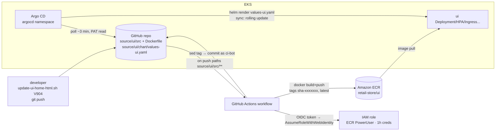

# Section 21 — CI/CD with GitHub Actions, ECR & Argo CD (GitOps)

> Source: transcript `21) CICD` (demos 2101–2104).
> The course finale: a complete **GitOps pipeline**. CI = GitHub Actions builds the UI image on every push and updates the Helm values file with the new tag (keyless, via **OIDC**). CD = **Argo CD** watches that file in Git and syncs the cluster to match — Git is the single source of truth, drift self-heals, rollback is `git revert`.
>
> ⚠️ **GAP (repo):** Section 21 folders aren't in the cloned repo snapshot; reconstructed from the transcript. The demo's Git repo is the instructor's `stacksimplify/aws-devops-github-actions-ecr-argocd-3` — you create your own equivalent.

---

## 1. Objective

Build and prove, end to end:

```
dev commits UI change → GitHub Actions: docker build → push to ECR (tag = sha-<7 chars of commit>)
                        → sed the new tag into source/ui/chart/values-ui.yaml → commit back to Git
Argo CD (in-cluster):   polls the repo (~3 min) → sees the values change → helm-renders → syncs
                        → rolling update to the new image → app shows V904 → V505 ...
```

- **2101 CI:** ECR repo, GitHub **OIDC provider + trust policy + IAM role** (no stored AWS keys), the workflow YAML line by line, two live runs.
- **2102:** Argo CD concepts (drift, pull-vs-push) + install + UI/CLI login.
- **2103:** register the **private** repo (PAT), author the **Application** manifest (automated sync, prune, selfHeal), deploy the UI via Argo CD.
- **2104:** full-flow test — version bumps ride the whole pipeline with zero manual deploys; config changes (replicas 1→3) sync too; rollback demo; total cleanup.

---

## 2. Problem Statement

Two classic failures this section kills:

1. **Deployment drift / mystery clusters.** `kubectl apply` today, someone's "quick fix" via `kubectl edit` in two weeks, a ConfigMap tweak a month later — now Git says one thing, the cluster runs another, there's no audit trail, no one knows if prod is 1.2 or 1.3, and rollback is archaeology.
2. **CI credentials sprawl.** The traditional pipeline stores long-lived AWS access keys in GitHub Secrets — leakable, never expiring, manually rotated. And a *push-model* CD needs cluster credentials living inside the CI system too.

---

## 3. Why This Approach

| Decision | Chosen | Alternative | Why |
|---|---|---|---|
| CI runner | GitHub Actions | Jenkins/CodeBuild | lives with the code; `on: push: paths:` scoping; OIDC federation built-in |
| CI → AWS auth | **OIDC assume-role** | access keys in secrets | temp creds (≤1 h), auto-expiring, zero storage, trust-policy-scoped to *one repo* |
| Image tag | **`sha-<7-char commit>`** (+ `latest` for convenience) | mutable `latest` only | immutable, traceable (image ↔ commit), same artifact promoted everywhere |
| CI/CD boundary | CI **ends** by committing the new tag to the values file | CI runs `kubectl`/`helm` | clean separation; CI never touches the cluster; **Git is the handoff** |
| CD engine | **Argo CD, pull model** (runs *in* the cluster) | push from pipeline | no cluster creds outside; continuous reconciliation, drift self-heal, UI + history |
| Source of truth | `values-ui.yaml` in Git | pipeline state | "want to know what's in prod? read Git" — history = audit trail; rollback = revert |

**Pull vs push, the lecture's key picture:** push-model CD needs kubeconfig/credentials in the CI system (attack surface, drift-blind). Argo CD sits inside EKS, *pulls* manifests every ~3 minutes, diffs desired (Git) vs live (cluster), and syncs — including reverting **manual** cluster edits (`selfHeal`).

---

## 4. How It Works — Under the Hood

### Vocabulary map

| Term | Plain English |
|---|---|
| OIDC provider (`token.actions.githubusercontent.com`) | AWS-side registration of GitHub as an identity issuer |
| trust policy + `sts:AssumeRoleWithWebIdentity` | "tokens from *this repo* may become *this role* for ≤1 h" |
| `permissions: id-token: write` | lets the workflow mint the OIDC token |
| GitOps | cluster state = Git state, continuously reconciled |
| Argo CD **Application** CR | one app's contract: which repo/path/values → which cluster/namespace, and how to sync |
| `automated` / `prune` / `selfHeal` | auto-sync on Git change / delete resources removed from Git / revert manual cluster edits |
| refresh interval (~3 min) | Argo CD's Git poll cadence (configurable) |
| PAT (classic) | token Argo CD uses to *read* your private repo |
| cascade (foreground) vs non-cascading delete | delete app **and** its k8s resources vs unhook Argo CD only |

### Architecture



### The two loops that never meet

```
CI loop (stateless, per push):   code → image → tag written to Git → done. Never talks to the cluster.
CD loop (continuous):            Git ⟷ cluster reconciliation, forever. Never builds anything.
The values-ui.yaml file is the ONLY interface between them.
Consequence the demo proves twice: a values-only change (replicas 1→3, or 3→1) deploys
with NO CI run at all — Argo CD syncs any change in the watched path, not just image tags.
```

---

## 5. Instructor's Approach

1. **One diagram first** — the seven-step CI→CD flow, with the explicit teaching points: clean CI/CD separation, Git as source of truth, immutable sha tags, zero-downtime rolling updates.
2. **CI plumbing in strict order:** ECR repo (`aws ecr create-repository retail-store/ui`) → env vars (region, account, repo path, role name) → **trust policy JSON** generated with variable substitution → IAM role → attach `AmazonEC2ContainerRegistryPowerUser` → **OIDC provider** created last with a "why this exists" explainer (the whole trust chain is inert without it). A full two-column comparison of access-keys-in-secrets vs OIDC (leak risk, rotation, expiry) — interview gold.
3. **Workflow YAML line by line** (§6.2), stressing: the `paths:` trigger scope; the two `permissions:`; two tags and why only `sha-` matters; *no hardcoding* (registry from the login step's outputs); the Dockerfile must exist at `source/ui/`; the `ci-bot` git identity for the write-back; and deliberately **no build caching** — "it would complexify the use case; add it yourself later."
4. **The git-pull lesson, hammered:** the workflow commits to the *remote* repo, so your local clone is instantly behind — always `git pull` before the next change or your push conflicts. He ships three helper scripts (`git-pull.sh`, `git-push.sh [msg]`, `update-ui-home-html.sh <version>` which seds a version string into the UI's `home.html` "Secret shop" section) so students test the *pipeline*, not their sed skills.
5. **Two live CI runs** — first push (V801) walks every job step in the Actions UI; ECR shows both tags; the values file shows the new sha *committed by the workflow one minute ago*; then pull + V802 push to prove repeatability (commit message threading through `git-push.sh`).
6. **Argo CD taught from pain:** the drift story (three unrecorded changes, "what's running today? nobody knows") → definition ("Git = steering wheel; Git history = deployment history") → 3-component architecture → with/without comparison table → install (namespace + official manifest + port-forward `8080:443` + initial-admin-secret password + CLI login) — all on the T3.large cluster kept from Section 20.
7. **Private-repo reality:** Argo CD can't read your repo without auth — GitHub **PAT (classic)**, scopes `repo` + `read:packages` only ("Argo CD never writes"), short expiry, `argocd repo add <url> --username <user> --password <PAT>`, then verify Settings→Repositories = *Successful*. He deletes stale tokens on camera — hygiene modeled, not just mentioned.
8. **Application manifest reviewed field by field** (§6.4), then deployed — the Argo CD UI tree (ConfigMap, SA, Service, Deployment, ReplicaSet, Pod, HPA, Ingress) *is* the verification. Expectation-setting: the UI alone may error — the backends aren't there yet, and that's fine for this demo.
9. **2104 full flow:** install the other four services via the S19 low-cost scripts *with UI commented out* ("UI is Argo CD's job now") → topology green at V802 → `git pull` → V904 → push → Actions run → ECR new sha → **wait out the ~3-min poll** → sync animation: new ReplicaSet, pod rotation → browser shows V904. Then the two encores: **rollback** via History (requires disabling auto-sync — else the next poll re-overrides you), and the **replicas 1→3** values change bundled with V505 (a config+code commit: HPA minReplicas jump first under the old release, then pods roll to the new image one by one — his impromptu validation that rolling updates behave). Finally 3→1 again — synced with **no build**, proving Argo CD watches the whole file.
10. **Cleanup as a dependency chain:** Argo CD app delete with **foreground cascade** (vs non-cascading explained) → confirm Ingress gone (billing!) → uninstall the four Helm releases → data plane → the whole S20 cluster stack (reverse order) → delete ECR repo + IAM roles/OIDC leftovers.

> 🐛 **TRANSCRIPT ERRORS (ASR):** "20 101/20 104" = 21-01…21-04; "Asia/Sha/a hyphen" = the `sha-` tag prefix; "QT colon colon seven" = `${GITHUB_SHA::7}`; "or DC/Oidc" = OIDC; "CLE/CI" (in "Argo CD CLE") = CLI; "parts/ports/pots" = pods; "sinking" = syncing; "value siphon UI" = `values-ui.yaml`; "ECS cluster" = EKS; "VAT 01" = V801; "cruds" = CRDs.

---

## 6. Code & Commands — Line by Line

### 6.1 CI prerequisites (one-time)

```bash
# 1. ECR repository
aws ecr create-repository --repository-name retail-store/ui --region us-east-1
#    note the repositoryUri — it goes into values-ui.yaml image.repository

# 2. Variables
export AWS_REGION=us-east-1
export AWS_ACCOUNT_ID=$(aws sts get-caller-identity --query Account --output text)
export GITHUB_REPO="<your-gh-user>/aws-devops-github-actions-ecr-argocd-3"
export ROLE_NAME="github-actions-oidc-role-ui-3"

# 3. Trust policy — the security handshake (repo-scoped!)
cat > trust-policy.json <<EOF
{ "Version": "2012-10-17", "Statement": [{
    "Effect": "Allow",
    "Principal": { "Federated": "arn:aws:iam::${AWS_ACCOUNT_ID}:oidc-provider/token.actions.githubusercontent.com" },
    "Action": "sts:AssumeRoleWithWebIdentity",
    "Condition": {
      "StringEquals": { "token.actions.githubusercontent.com:aud": "sts.amazonaws.com" },
      "StringLike":   { "token.actions.githubusercontent.com:sub": "repo:${GITHUB_REPO}:*" }
    } }]}
EOF

# 4. Role + ECR permissions (build & push is ALL it can do)
aws iam create-role --role-name $ROLE_NAME --assume-role-policy-document file://trust-policy.json
aws iam attach-role-policy --role-name $ROLE_NAME \
  --policy-arn arn:aws:iam::aws:policy/AmazonEC2ContainerRegistryPowerUser

# 5. The OIDC provider itself — without it, none of the above works
aws iam create-open-id-connect-provider \
  --url https://token.actions.githubusercontent.com \
  --client-id-list sts.amazonaws.com
# verify: IAM console → Identity providers
```
Why OIDC beats stored keys: workflow starts → GitHub mints a short-lived token → AWS validates it against the trust policy (right issuer? right repo?) → STS issues **1-hour** credentials → they expire on their own. No secret to leak, nothing to rotate.

### 6.2 The workflow (`.github/workflows/build-push-ui.yaml`)

```yaml
name: Build and Push UI Service to ECR
on:
  push:
    branches: [main]
    paths: ["source/ui/src/**"]        # ONLY UI source changes trigger this (per-service pipelines scale this way)
permissions:
  id-token: write                      # mint the OIDC token
  contents: write                      # push the values-file commit back
env:
  AWS_REGION: us-east-1
  ECR_REPOSITORY: retail-store/ui
jobs:
  build-and-push-ui:
    runs-on: ubuntu-latest
    steps:
    - uses: actions/checkout@v4                         # 1. code
    - uses: aws-actions/configure-aws-credentials@v4    # 2. keyless AWS auth
      with:
        role-to-assume: arn:aws:iam::<ACCOUNT_ID>:role/github-actions-oidc-role-ui-3   # ← YOURS
        aws-region: ${{ env.AWS_REGION }}
    - id: login-ecr                                     # 3. docker login to ECR
      uses: aws-actions/amazon-ecr-login@v2
    - name: Define image tags                           # 4. immutable + convenience
      run: |
        echo "TAG=sha-${GITHUB_SHA::7}" >> $GITHUB_ENV                       # first 7 chars of the commit
        echo "IMAGE_BASE=${{ steps.login-ecr.outputs.registry }}/${{ env.ECR_REPOSITORY }}" >> $GITHUB_ENV
    - name: Build and push                              # 5. plain build (no cache — add later)
      run: |
        docker build -t $IMAGE_BASE:$TAG -t $IMAGE_BASE:latest source/ui/    # Dockerfile lives in source/ui/
        for t in $TAG latest; do docker push $IMAGE_BASE:$t; done
    - name: Update Helm values with new tag             # 6. THE CI→CD HANDOFF
      run: |
        git config user.name  "ci-bot"
        git config user.email "ci-bot@stacksimplify.com"
        sed -i "s/^  tag: .*/  tag: $TAG/" source/ui/chart/values-ui.yaml
        git add source/ui/chart/values-ui.yaml
        git commit -m "ci: update ui image tag to $TAG"
        git push                                        # remote now AHEAD of your laptop → git pull next time!
    - run: echo "CI complete — image pushed, git updated, tag $TAG"
```
Repo layout that makes it work: `source/ui/{Dockerfile,src/...}` (app 1.3.0 source), `source/ui/chart/values-ui.yaml` (**edit `image.repository` to YOUR ECR URI before first push**), helper scripts at the root.

### 6.3 Argo CD install + repo registration

```bash
kubectl create namespace argocd
kubectl apply -n argocd -f https://raw.githubusercontent.com/argoproj/argo-cd/stable/manifests/install.yaml
kubectl -n argocd get pods                     # server, repo-server, application-controller, dex, redis...
kubectl -n argocd port-forward svc/argocd-server 8080:443 &
kubectl -n argocd get secret argocd-initial-admin-secret -o jsonpath='{.data.password}' | base64 -d
# UI: https://localhost:8080 (admin / that password)
brew install argocd                            # CLI (per-OS instructions on the Argo CD docs page)
argocd login localhost:8080 --username admin --password '<pwd>' --insecure

# private repo → PAT (classic): GitHub → Settings → Developer settings → Tokens (classic)
#   scopes: repo + read:packages ONLY (Argo CD reads, never writes) · short expiry
argocd repo add https://github.com/<user>/aws-devops-github-actions-ecr-argocd-3.git \
  --username <user> --password <PAT> --name argocd-3
# verify: UI → Settings → Repositories → CONNECTION STATUS: Successful
```

### 6.4 The Application manifest (`argocd-manifests/application-ui.yaml`)

```yaml
apiVersion: argoproj.io/v1alpha1
kind: Application
metadata:
  name: ui
  namespace: argocd                 # managed BY the Argo CD instance living here
spec:
  project: default
  source:
    repoURL: https://github.com/<user>/aws-devops-github-actions-ecr-argocd-3.git
    targetRevision: main
    path: source/ui/chart           # the Helm chart directory
    helm:
      valueFiles: [values-ui.yaml]  # ← THE watched file — CI writes it, Argo CD reads it
  destination:
    server: https://kubernetes.default.svc    # same cluster Argo CD runs in
    namespace: default
  syncPolicy:
    automated:
      prune: true                   # resource removed from Git → removed from cluster
      selfHeal: true                # kubectl edit by a human → reverted to Git within minutes
    syncOptions:
      - CreateNamespace=true        # future-proofing (default ns always exists)
```
```bash
kubectl apply -f argocd-manifests/application-ui.yaml
# Argo CD UI → Applications → ui → Healthy/Synced; resource tree shows
# ConfigMap, SA, Service, Deployment, ReplicaSet, Pod, HPA, Ingress — the whole chart
# (UI pod may error until backends exist — expected at this stage)
```

### 6.5 Full-flow test (2104)

```bash
# backends via S19 scripts with UI commented out ("UI belongs to Argo CD now"):
./05_v2.0.0_install_remote_helm_charts.sh      # catalog carts checkout orders (secrets-manager variant)
kubectl get ingress → browse → /topology all green → page footer shows V802

# THE loop:
./git-pull.sh                                  # sync the CI-bot's last commit first — critical!
./update-ui-home-html.sh V904                  # seds the version into home.html (simulated dev change)
./git-push.sh "V904 commit"
# GitHub → Actions: run completes → ECR: new sha- tag → wait ≤3 min →
# Argo CD UI: sync spins, new ReplicaSet, pod rotates → browser: V904 ✔

# Rollback (feature demo): app → History and Rollback → pick previous revision
#   → prompt: "auto-sync must be disabled" — else the next poll re-applies Git. (Shown, not executed.)

# Config-only + code change together:
./git-pull.sh
./update-ui-home-html.sh V505
#   ALSO edit source/ui/chart/values-ui.yaml → autoscaling minReplicas: 1 → 3
./git-push.sh "V505 commit"
# result: replicas scale to 3 (old release) then roll one-by-one to the new image → V505 with no downtime
# later: set minReplicas back to 1, push → Argo CD syncs it with NO CI RUN (no source/ui/src change!)
```

### 6.6 Cleanup (order matters)

```bash
# Argo CD UI → ui app → Delete → type "ui" → propagation: Foreground (CASCADE: app + all its k8s resources)
#   (Non-cascading = remove only the Argo CD Application; Deployment/Ingress stay — know the difference)
kubectl get ingress                    # MUST be empty — the ALB bills hourly
./01_uninstall_retail_apps.sh          # orders → checkout → carts → catalog
cd .../20_01/02_.../01_retailstore_aws_dataplane && ./delete-aws-dataplane.sh
cd .../20_01/01_eks_cluster_environment && ./destroy-cluster-with-karpenter-and-opentelemetry.sh
# console sweep: ECR repo/images deleted, IAM role + OIDC provider removed, no ALBs, no orphan nodes
```

---

## 7. Complete Code Reference (execution order)

```
21_DevOps_CICD/
├── 21_01_CI_GitHubActions_AWS/
│   ├── github-files/                       # copied INTO your new GitHub repo:
│   │   ├── .github/workflows/build-push-ui.yaml
│   │   ├── source/ui/{Dockerfile, src/..., chart/values-ui.yaml}   # app 1.3.0 + chart
│   │   ├── git-pull.sh · git-push.sh [msg] · update-ui-home-html.sh <version>
│   │   └── README.md
│   └── trust-policy.json (generated)
├── 21_02_CD_ArgoCD/            install-argocd.sh (ns + manifest + wait + password)
├── 21_03_CD_ArgoCD_Helm/       argocd-manifests/application-ui.yaml
└── 21_04_CICD_FullFlow_Test/   low-cost helm values with UI commented out + uninstall script
```

Environment: the Section 20 cluster (T3.large, all add-ons) + data plane + Secrets Manager secret. Prereq chain: ECR repo → OIDC trio → GitHub repo populated (+ ECR URI in values) → first CI run → Argo CD install → PAT + repo add → Application → backends → E2E.

---

## 8. Hands-On Labs

### Lab A — Reproduce the pipeline

> 💰 **Cost warning:** cluster + data plane as in S20 (~$0.5–0.7/h) — Argo CD itself and GitHub Actions (public-repo minutes / free-tier) add ~nothing; ECR storage is cents. **Teardown per §6.6 the same session; the Ingress/ALB check is the money step.** GitHub account + (for the demo flow) a private repo + PAT required.

**Steps:** §7 chain; two version pushes minimum.
**Expected output:** Actions run green end to end; ECR holds `sha-*` + `latest`; the values file shows a `ci-bot` commit; Argo CD app Healthy/Synced; browser footer tracks V-numbers within ~3 minutes of each push.
**Verify:** `argocd app get ui` shows Synced/Healthy + the exact revision; `kubectl get deploy ui -o jsonpath='{.spec.template.spec.containers[0].image}'` matches the newest ECR tag.

### Lab B — Variation: exercise GitOps properties

1. **Self-heal proof:** `kubectl scale deploy ui --replicas=5` → watch Argo CD flag drift and snap it back to Git within the poll window. Then try `kubectl delete svc ui` — resurrected. (This is the demo that sells GitOps to a team.)
2. **Prune proof:** delete the HPA block from the chart/values, push → Argo CD *removes* the HPA from the cluster (`prune: true`).
3. **Second service:** clone the workflow to `build-push-catalog.yaml` (paths `source/catalog/src/**`, its own ECR repo + OIDC role) and a second Application — the per-service pipeline pattern.
4. **Git revert as rollback:** instead of the UI rollback button, `git revert HEAD && git push` — the auditable rollback; auto-sync stays on.

🧹 Same as Lab A.

**Free local variant:** kind + Argo CD (same install manifest) + a public GitHub repo + Docker Hub (or GH Container Registry with `GITHUB_TOKEN` — no OIDC/AWS needed): identical Application/sync/selfHeal/prune mechanics, zero cloud cost. The only unreproducible piece is the AWS OIDC federation.

### Lab C — Break-it-and-fix-it

1. **Wrong repo in the trust policy:** set `sub` to another repo name → workflow fails at `configure-aws-credentials` with `Not authorized to perform sts:AssumeRoleWithWebIdentity`. **Fix:** trust policy `repo:<owner>/<name>:*` must match exactly — that string *is* the security boundary.
2. **Skip `git pull`, push again:** local behind the ci-bot's commit → `git push` rejected (non-fast-forward). **Fix:** `./git-pull.sh` first — the lesson the instructor repeats three times.
3. **PAT expired / missing scope:** Argo CD app goes `Unknown`/ComparisonError, repo status *Failed*. **Fix:** regenerate PAT (repo + read:packages), `argocd repo add ... --upsert`.
4. **Rollback with auto-sync on:** roll back via UI without disabling auto-sync → within 3 minutes Argo CD re-syncs to Git and undoes it. **Fix:** disable auto-sync for the rollback, or (better) revert in Git.
5. **Wrong `image.repository` in values:** pod `ImagePullBackOff` (`ErrImagePull` from a nonexistent registry path). `kubectl describe pod` shows the bad URI. **Fix:** your ECR URI in `values-ui.yaml` — the one manual edit everyone forgets.

---

## 9. Troubleshooting

| Symptom | Likely cause | Command to confirm | Fix |
|---|---|---|---|
| Workflow: `Not authorized ... AssumeRoleWithWebIdentity` | OIDC provider missing, trust-policy repo mismatch, or `id-token: write` absent | `aws iam list-open-id-connect-providers`; run logs | Create provider; `sub` = your repo; permissions block |
| Workflow: ECR push `denied` | role lacks ECR policy / wrong account in role ARN | run logs at the push step | Attach `AmazonEC2ContainerRegistryPowerUser`; correct ARN |
| Workflow: git push step fails 403 | `contents: write` missing | run logs at the write-back step | Add the permission |
| Workflow never triggers | change outside `source/ui/src/**` (values-only edits don't rebuild — by design!), or wrong branch | Actions tab | Touch the source path; branch `main` |
| Local `git push` rejected | remote ahead (ci-bot's tag commit) | `git status` / push error | `git pull` first — always |
| Argo CD app `Unknown` / repo unreachable | PAT expired/wrong scopes; repo not registered | Settings→Repositories status | New PAT (repo, read:packages); `argocd repo add --upsert` |
| App Synced but pod `ImagePullBackOff` | `image.repository` ≠ your ECR URI, or node can't pull (rare — node role has pull-only) | `kubectl describe pod ui-...` | Fix values; tag must exist in ECR |
| Change pushed but cluster unchanged after 5+ min | app not auto-synced (policy missing) or watching wrong path/values file | `argocd app get ui`; Application spec | `syncPolicy.automated`; `path`/`valueFiles` exact |
| Manual `kubectl` fixes keep disappearing | **working as designed** — `selfHeal: true` | Argo CD app events | Make the change in Git — that's the whole point |
| Rollback won't take | auto-sync re-applies Git | UI prompt | Disable auto-sync for the rollback, or `git revert` |
| Delete left Deployment/Ingress behind | non-cascading delete chosen | `kubectl get all,ingress` | Delete with **foreground** propagation; sweep ALBs |
| First UI pod errors after 2103 | backends not deployed yet | `kubectl logs deploy/ui` | Expected — resolved in 2104 when the other services install |

---

## 10. Interview Articulation

**90-second spoken answer — "Describe your CI/CD setup for Kubernetes."**

> "It's a GitOps pipeline with a hard boundary between CI and CD, and Git as the only interface. CI is GitHub Actions, path-scoped per microservice: a push to the UI's source triggers a workflow that authenticates to AWS via **OIDC** — GitHub mints a short-lived token, AWS's trust policy checks it came from exactly our repo, and STS returns one-hour credentials, so there are no stored keys to leak or rotate. It builds the image, pushes it to ECR tagged with the first seven characters of the commit SHA — immutable and traceable — and then does the one thing that hands off to CD: it seds that tag into the service's Helm values file and commits it back as a CI bot. CI never touches the cluster. CD is Argo CD running *inside* the cluster — pull model, so no cluster credentials exist anywhere outside. An Application CR points it at the chart path and values file; automated sync with prune and selfHeal means any Git change deploys within the poll interval, resources removed from Git get removed from the cluster, and any manual `kubectl edit` is reverted — configuration drift is structurally impossible. That also means values-only changes, like bumping replicas, deploy with no build at all. What's in production is answered by reading Git; the audit trail is `git log`; rollback is `git revert` — the UI rollback exists too, but it makes you disable auto-sync first, because otherwise the reconciler faithfully puts Git back. We proved the whole loop live: commit a version string, watch Actions build, watch Argo CD roll the pods, see the new version in the browser — no human touched the cluster."

<details>
<summary>Self-test Q&A (5)</summary>

**Q1. Walk through GitHub Actions authenticating to AWS with zero stored secrets.**
A: The workflow declares `permissions: id-token: write` and calls `configure-aws-credentials` with a role ARN. GitHub's OIDC issuer signs a token whose `sub` claim encodes the repo; AWS validates it against the registered OIDC provider and the role's trust policy (`aud: sts.amazonaws.com`, `sub: repo:<owner>/<repo>:*`) and STS issues ~1-hour credentials via `AssumeRoleWithWebIdentity`. Nothing persists; scope is one repo → one role → ECR-only permissions.

**Q2. Where exactly does CI end and CD begin, and why is that boundary valuable?**
A: CI's last act is committing the new image tag into `values-ui.yaml`. CD's only input is that file. Value: CI holds no cluster credentials (smaller blast radius), CD works identically whether a human or a pipeline edited Git, every deployment is a commit (audit/rollback for free), and the two halves scale/replace independently.

**Q3. What do `prune` and `selfHeal` each do, and what surprised the team in the demo?**
A: `prune` deletes cluster resources that disappear from Git (removing the HPA block removes the HPA). `selfHeal` reverts out-of-band cluster edits to Git's state within the poll interval. The surprise: rollback via the Argo CD UI demands disabling auto-sync — otherwise the reconciler immediately restores Git's version, which is selfHeal doing its job.

**Q4. Why `sha-<commit>` tags instead of just `latest`?**
A: Immutability and traceability. `latest` is mutable — the cluster can silently run different bits under the same name, and Argo CD can't detect a change (the values file wouldn't change). A sha tag maps 1:1 to a commit, makes the Git diff *be* the deployment event, and lets the identical artifact promote across environments.

**Q5. Pull-model CD vs push-model — trade-offs?**
A: Push (pipeline runs kubectl/helm): simple, immediate, but cluster credentials live in the CI system, and nothing reconciles afterwards — drift accumulates invisibly. Pull (Argo CD in-cluster): no external cluster creds, continuous reconciliation with drift correction, per-app RBAC via Application/Project, UI with history — at the cost of running the controller, registering repos (PAT for private ones), and a poll-interval deployment latency (webhooks can shrink it).

</details>

---

*Previous: [20 — Observability with OpenTelemetry](20-observability-opentelemetry.md) · **Course complete** · [Index](00-INDEX.md)*
