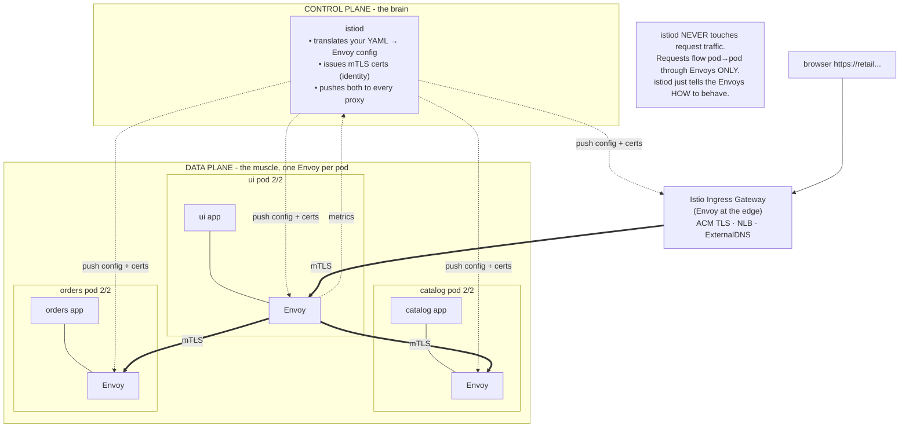

# Section 22 — Production-Grade Service Mesh with Istio (Capstone Extension)

> **What this section is:** a **new capstone project** that continues the course *past* CI/CD ([Section 21](21-cicd-gitops.md)). You've built the retail store on EKS (S07–S14), exposed it (S11/S16), autoscaled it (S17/S18), Helm-packaged it (S19), observed it (S20 / [20.5](20.5-observability-prometheus-grafana.md)), and shipped it via GitOps (S21). Now you put a **production-grade Istio service mesh** in front of and between those microservices — the layer that gives you zero-trust mTLS, canary traffic management, resilience (retries/timeouts/circuit-breaking), fine-grained access policy, and a live service map — **without changing a single line of the retail store's application code.**
>
> **Why it's here:** service mesh is the senior-level differentiator these microservice platforms run, and it's a *real, showable, resume-grade* implementation on top of everything you already built. It reuses the **exact same cluster and the same 5 microservices** (catalog · carts · checkout · orders · ui), so you follow along hands-on from Section 01 straight through to 22.
>
> ℹ️ **Note (this is original — an authored capstone, not the instructor's code):** there's no course transcript for a mesh, so these manifests aren't in the instructor's repo — but the **platform they layer onto is fully repo-verified**: the same Section-13 EKS cluster + Section-14/19 retail store + the ACM cert & ExternalDNS from Sections 15–16 (all in [the canonical repo](https://github.com/stacksimplify/devops-real-world-project-implementation-on-aws)). The mesh YAML below is production-shaped; Istio's API is stable (`networking.istio.io/v1`, `security.istio.io/v1`) — check the current Istio release before installing (targets Istio ≥1.22).
>
> **Resume line this earns you:** *"Deployed a production-grade Istio service mesh on EKS for a 5-service retail platform: STRICT mesh-wide mTLS, deny-by-default authorization policies, weighted canary releases gated on latency, circuit breaking and retries, an ACM-terminated ingress gateway with ExternalDNS, and full mesh observability (Kiali + distributed tracing + Grafana) — all with zero application code changes."*

---

## 1. Objective

Wrap the retail store in a mesh so that **networking behavior — security, routing, resilience, observability — is controlled by the platform from outside the apps**, and make every piece *production-grade*, not a demo:

| Capability | What you'll implement | Production bar |
|---|---|---|
| **Sidecar mesh** | Envoy injected into all 5 services (2/2 pods) | mesh-wide, automatic injection by namespace label |
| **Zero-trust mTLS** | `PeerAuthentication` STRICT | encrypted + mutually-authenticated service-to-service, **default deny plaintext** |
| **Edge (north-south)** | Istio **Gateway** + `VirtualService`, TLS via ACM, NLB via AWS LBC, DNS via ExternalDNS | HTTPS-only, HTTP→HTTPS redirect, real domain |
| **Traffic management** | `DestinationRule` subsets + weighted `VirtualService` | 90/10 canary, header-based routing, instant rollback |
| **Resilience** | retries, timeouts, `outlierDetection` circuit breaking | one slow/failing service can't cascade |
| **Authorization** | `AuthorizationPolicy` deny-by-default + least-privilege allows | ui→catalog allowed; random pod→orders denied |
| **Observability** | Kiali service graph, distributed traces, Istio metrics in Grafana | live map + golden signals per service, no app changes |

By the end you can whiteboard the mesh, demo each capability live, and articulate *why the mesh architecture makes each one possible* — the senior-level interview conversation.

---

## 2. Problem Statement

The retail store's 5 microservices talk to each other constantly over the network (ui→catalog, ui→carts, checkout→orders, …). That east-west traffic has three unsolved problems the course hasn't addressed:

1. **It's plaintext and unauthenticated.** Any pod that lands in the cluster can call `orders` or `catalog` directly, and traffic between services isn't encrypted. A security audit asking *"is all internal traffic encrypted and is service-to-service access controlled?"* has no good answer today. (Kubernetes `NetworkPolicy` can allow/deny by IP — but IPs are spoofable and it can't encrypt or route by identity.)

2. **Rollouts are coarse and app-coupled.** Section 21's GitOps canary works at the *Deployment* level (Argo Rollouts shifting replica ratios). There's no way to send *10% of live traffic* to a new `catalog` version, or route one test user to it, or split by header — without baking that logic into the app or the load balancer.

3. **One slow service cascades.** If `orders`→PostgreSQL hangs, `checkout` threads block waiting, then `ui` blocks waiting on `checkout` — a single slow dependency browns out the whole store. There's no consistent retry/timeout/circuit-breaking layer; each service would have to implement it, in its own language, inconsistently.

**What breaks without a mesh:** unencrypted, unauthenticated internal traffic (compliance risk), all-or-nothing deploys, and cascading failures — and the only "fixes" are per-service libraries in 3 languages that drift and that developers resent maintaining.

**Who feels the pain most:** the platform/SRE team (you) — you're the one holding the bag at the 3 AM incident and the security review, and you can't ask every app team to re-implement networking survival logic.

---

## 3. Why This Approach

**Istio vs the tools the course already has (Ingress + NetworkPolicy):**

| The task | AWS LBC Ingress + NetworkPolicy (what you have) | **Istio** | Why the difference |
|---|---|---|---|
| Get external traffic in | ✅ | ✅ | both have an edge proxy |
| Isolate pods by IP | ✅ (NetworkPolicy) | ✅ | NetPolicy is an L3/4 firewall |
| Route *internal* traffic by version/% | ❌ | ✅ | needs an L7 proxy on **every** hop |
| Encrypt service-to-service | ❌ | ✅ | needs a proxy pair + a CA |
| Retry / timeout / circuit-break | ❌ | ✅ | needs logic *in the request path* |
| Isolate by cryptographic **identity** | ❌ (IPs, spoofable) | ✅ (certs) | mesh identity vs IP |
| Live service map with golden signals | ❌ | ✅ | every Envoy emits metrics automatically |

The pattern in the "why" column is always the same: **the extra powers all require a smart proxy sitting in the path of every request.** NetworkPolicy has no such thing for east-west traffic, so it *structurally cannot* offer these — it's a missing architecture, not a missing feature.

**Why a mesh over per-service libraries:** the pre-mesh world put retry/TLS/metrics logic *inside* each app as a language-specific library (Hystrix, Ribbon, …). That means rewriting it per language (the retail store is Spring Boot + Go + Node.js — 3 implementations), redeploying every service to change retry logic, and inconsistent behavior no one audits. Istio moves that logic into a sidecar proxy the platform controls — **change networking behavior without touching or redeploying the apps.**

**When NOT to use Istio (be honest in interviews):** tiny clusters / few services with no compliance pressure (the per-pod proxy overhead — CPU/RAM + a control plane + more moving parts — may outweigh the benefit); north-south-only needs (a plain Gateway/Ingress is simpler); ultra-latency-critical hot paths (each mTLS hop adds sub-ms but non-zero latency). The retail store — 5 services, real east-west traffic, a security story to tell — is squarely in the "yes" zone.

---

## 4. How It Works — Under the Hood

### Vocabulary map

| Term | What it actually is | Role in the mesh |
|---|---|---|
| **Service mesh** | The whole pattern: proxies everywhere + a brain controlling them | the two-plane system |
| **Sidecar / Envoy** | The extra proxy container injected into each pod (the "2/2") | data plane, per pod |
| **Data plane** | The collective set of all Envoy proxies | where live traffic flows |
| **Control plane / istiod** | The brain that configures every proxy and issues certs | pushes config + mTLS certs |
| **Sidecar injection** | Auto-adding Envoy to pods in a labeled namespace | how pods become 2/2 |
| **istio-init + iptables** | Init container rewriting pod routing so all traffic goes through Envoy | the interception trick |
| **Gateway** | Config for the edge proxy (cluster front door) | where external traffic enters |
| **VirtualService** | Rules for **where** traffic goes (routing, weights, retries, timeouts) | instructions istiod gives Envoy |
| **DestinationRule** | Defines version **subsets** + traffic policy (circuit breaking, LB) | targets + how to behave |
| **Subset** | A named group of pods by label (e.g. `version: v2`) | what a VirtualService points at |
| **PeerAuthentication** | Sets mTLS mode (STRICT/PERMISSIVE) | tells Envoys to require encryption |
| **AuthorizationPolicy** | Who may call whom, which HTTP verbs/paths | Envoy checks on each request |
| **mTLS** | Mutual TLS — both sides present certs | encryption + identity between Envoys |
| **Kiali** | The service-graph + config-validation UI | the live map |
| **istioctl** | The Istio CLI (install, analyze, inspect proxies) | your control tool |

### Architecture — the two planes



**The single most important structural fact:** the **control plane (istiod)** makes decisions and distributes config + certs; the **data plane (the Envoy sidecars)** does the actual work on live traffic. If istiod crashes, existing traffic *keeps flowing* (the Envoys already have their config) — you just can't push *new* config until it's back.

### The interception trick (why apps need zero changes)

```
INSIDE ONE retail-store POD (e.g. catalog), at startup:

1. istio-init runs FIRST (init container)
   └─▶ writes iptables rules in the pod's network namespace:
       "ALL inbound  → redirect to Envoy :15006"
       "ALL outbound → redirect to Envoy :15001"
   └─▶ exits (job done)
2. Envoy sidecar starts → connects to istiod, downloads config + its mTLS cert
3. the catalog app starts LAST → thinks it makes direct network calls

When catalog calls  postgres:5432  (or ui calls catalog:80):
   app → (iptables silently intercepts) → catalog's Envoy :15001
        → Envoy decides: which subset? retry? timeout? encrypt with mTLS?
        → encrypted mTLS tunnel → callee's Envoy :15006 → callee app
   The app NEVER KNEW. Zero code changes. That's the whole point.
```

This is why the retail store pods become **2/2** (app + Envoy) and why `kubectl describe pod` shows an `istio-init` container — you saw the machinery, now you know what it is.

### The config flow (why `kubectl apply` changes traffic with no restart)

```
you: kubectl apply -f virtualservice.yaml
  → API server stores it
  → istiod (watching) translates it → Envoy-specific route/cluster config
  → istiod PUSHES to the relevant Envoys
  → Envoys update behavior LIVE (no pod restart, no redeploy)
  → next request follows the new rule
```

---

## 5. Instructor's Approach (build sequence for this extension)

There's no transcript — so here's the exact order to build it, each step layering on the last (and on the course you've already done):

1. **Install Istio** with `istioctl` using a production profile, into the existing cluster. Verify istiod is healthy before touching apps.
2. **Enable injection on the retail store namespace** and roll the 5 services so each becomes 2/2. Confirm nothing broke — the app behaves identically, now with sidecars.
3. **Turn on STRICT mTLS mesh-wide** (`PeerAuthentication`) — every service-to-service call is now encrypted + mutually authenticated. Prove it: a non-meshed pod can no longer reach the services.
4. **Move the edge to an Istio Gateway** — a Gateway + VirtualService for the UI, TLS terminated with the **ACM cert from Section 16**, exposed via an NLB (AWS LBC), DNS via **ExternalDNS** (Section 15/16). HTTP→HTTPS redirect. Now external traffic enters the mesh through Envoy.
5. **Add a canary** — deploy `catalog` v2, define `DestinationRule` subsets v1/v2, and a `VirtualService` weighting 90/10; then header-route a test user to v2. This is richer than Section 21's replica-ratio canary — it's *live traffic* splitting at L7.
6. **Add resilience** — retries + timeouts on the ui→catalog route, and `outlierDetection` circuit breaking on the orders→(dependency) path, so a failing instance is ejected instead of cascading.
7. **Lock down authorization** — `AuthorizationPolicy` deny-by-default in the namespace, then least-privilege allows (ui→catalog/carts/checkout, checkout→orders, etc.). Prove a disallowed call is rejected by the Envoy.
8. **Wire observability** — install Kiali + tracing; Istio's telemetry emits per-service golden-signal metrics to the Prometheus/Grafana from [20.5](20.5-observability-prometheus-grafana.md) automatically. Kiali draws the live retail-store graph with mTLS locks and traffic rates.
9. **GitOps it** — commit all mesh manifests to the Section-21 repo so Argo CD manages them; now the mesh is declarative and version-controlled like everything else.
10. **Chaos + teardown** — fault-inject a delay/abort to prove resilience, then a clean teardown path.

> **What makes this "production-grade" (say this in the interview):** STRICT (not PERMISSIVE) mTLS, **deny-by-default** authorization, ACM-terminated HTTPS at the edge, canary gated on real latency metrics, circuit breaking so failures don't cascade, and every bit of it GitOps-managed and observable — versus a "demo" that just installs Istio and injects sidecars.

---

## 6. Code & Commands — Line by Line

### 6.1 Install Istio (production profile)

```bash
# download istioctl (match a current release)
curl -L https://istio.io/downloadIstio | sh -
export PATH=$PWD/istio-*/bin:$PATH
istioctl version

# install with a production-leaning profile; NLB via AWS LBC annotations on the ingress gateway
istioctl install -y -f istio-install.yaml
kubectl -n istio-system get pods    # istiod + istio-ingressgateway Running
```

`istio-install.yaml`:

```yaml
apiVersion: install.istio.io/v1alpha1
kind: IstioOperator
spec:
  profile: default                 # istiod + ingress gateway (not the 'demo' profile)
  meshConfig:
    accessLogFile: /dev/stdout      # access logs → your Loki (20.5)
    enableTracing: true
    defaultConfig:
      tracing: { sampling: 100.0 }  # lab: trace everything; prod: 1-5%
  components:
    ingressGateways:
      - name: istio-ingressgateway
        enabled: true
        k8s:
          serviceAnnotations:        # provision an NLB via AWS Load Balancer Controller
            service.beta.kubernetes.io/aws-load-balancer-type: external
            service.beta.kubernetes.io/aws-load-balancer-nlb-target-type: ip
            service.beta.kubernetes.io/aws-load-balancer-scheme: internet-facing
          hpaSpec: { minReplicas: 2 }   # HA edge
```

### 6.2 Enable sidecar injection on the retail store

```bash
kubectl label namespace default istio-injection=enabled      # the retail store's namespace
kubectl rollout restart deploy -n default                    # re-create pods WITH sidecars
kubectl get pods -n default                                  # every service now 2/2
kubectl describe pod <catalog-pod> | grep -A2 'istio-init'   # see the interception init container
```

### 6.3 STRICT mTLS mesh-wide (zero-trust)

```yaml
# peer-auth-strict.yaml — every service-to-service call must be mTLS
apiVersion: security.istio.io/v1
kind: PeerAuthentication
metadata: { name: default, namespace: istio-system }   # istio-system = mesh-wide
spec:
  mtls: { mode: STRICT }
```

```bash
kubectl apply -f peer-auth-strict.yaml
# prove it: a NON-meshed pod (no sidecar) can no longer reach a service
kubectl run probe --image=curlimages/curl -it --rm -- \
  curl -s -o /dev/null -w "%{http_code}\n" --max-time 5 http://catalog.default:80/health   # → fails
```

STRICT tells every inbound Envoy to reject plaintext; a pod with no Envoy/cert can't establish mTLS → the compliance answer ("all internal traffic encrypted and identity-checked") is now **yes**.

### 6.4 Edge — Gateway + VirtualService (reusing Section 16's ACM + ExternalDNS)

```yaml
# gateway.yaml — the cluster front door (HTTPS via ACM, HTTP→HTTPS redirect)
apiVersion: networking.istio.io/v1
kind: Gateway
metadata: { name: retail-gateway, namespace: default }
spec:
  selector: { istio: ingressgateway }
  servers:
    - port: { number: 443, name: https, protocol: HTTPS }
      hosts: ["retail-store.stacksimplify.com"]      # your ExternalDNS-managed domain (S16)
      tls: { mode: SIMPLE, credentialName: retail-tls }  # or terminate at NLB with the ACM cert
    - port: { number: 80, name: http, protocol: HTTP }
      hosts: ["retail-store.stacksimplify.com"]
      tls: { httpsRedirect: true }                   # HTTP → HTTPS
---
# ui-virtualservice.yaml — route the domain to the ui service
apiVersion: networking.istio.io/v1
kind: VirtualService
metadata: { name: ui, namespace: default }
spec:
  hosts: ["retail-store.stacksimplify.com"]
  gateways: [retail-gateway]
  http:
    - route:
        - destination: { host: ui, port: { number: 80 } }
```

> ExternalDNS (S15/16) sees the ingress gateway's NLB and creates the Route 53 record for `retail-store.stacksimplify.com` automatically — the mesh reuses the course's DNS + ACM machinery.

### 6.5 Traffic management — the canary (richer than S21's replica canary)

```yaml
# catalog-destinationrule.yaml — define the version subsets
apiVersion: networking.istio.io/v1
kind: DestinationRule
metadata: { name: catalog, namespace: default }
spec:
  host: catalog
  subsets:
    - { name: v1, labels: { version: v1 } }
    - { name: v2, labels: { version: v2 } }
---
# catalog-virtualservice.yaml — 90/10 canary + a header override for testers
apiVersion: networking.istio.io/v1
kind: VirtualService
metadata: { name: catalog, namespace: default }
spec:
  hosts: [catalog]
  http:
    - match: [{ headers: { x-canary: { exact: "true" } } }]   # testers pin to v2
      route: [{ destination: { host: catalog, subset: v2 } }]
    - route:                                                   # everyone else: 90/10
        - { destination: { host: catalog, subset: v1 }, weight: 90 }
        - { destination: { host: catalog, subset: v2 }, weight: 10 }
```

Deploy `catalog` v2 with `labels: {version: v2}`; 10% of live traffic now hits it, testers with `x-canary: true` always do, and *rollback is instantly setting v1 weight to 100 — no redeploy*.

### 6.6 Resilience — retries, timeouts, circuit breaking

```yaml
# add to the ui→catalog VirtualService route:
    - route: [{ destination: { host: catalog } }]
      retries: { attempts: 3, perTryTimeout: 2s, retryOn: "5xx,reset,connect-failure" }
      timeout: 5s
---
# orders-destinationrule.yaml — eject a failing instance (circuit breaker)
apiVersion: networking.istio.io/v1
kind: DestinationRule
metadata: { name: orders, namespace: default }
spec:
  host: orders
  trafficPolicy:
    connectionPool:
      tcp: { maxConnections: 100 }
      http: { http1MaxPendingRequests: 50, maxRequestsPerConnection: 10 }
    outlierDetection:                 # THE circuit breaker
      consecutive5xxErrors: 5         # 5 errors in a row →
      interval: 10s
      baseEjectionTime: 30s           # eject this pod from the LB pool for 30s
      maxEjectionPercent: 50
```

A failing `orders` instance is removed from rotation instead of receiving (and hanging) more requests — the cascade from §2 is broken at the Envoy.

### 6.7 Authorization — deny-by-default + least privilege

```yaml
# authz-deny-all.yaml — nothing may call anything in the namespace...
apiVersion: security.istio.io/v1
kind: AuthorizationPolicy
metadata: { name: deny-all, namespace: default }
spec: {}     # empty spec = DENY by default
---
# authz-allow-ui-to-catalog.yaml — ...except explicit allows (repeat per real call path)
apiVersion: security.istio.io/v1
kind: AuthorizationPolicy
metadata: { name: allow-ui-to-catalog, namespace: default }
spec:
  selector: { matchLabels: { app: catalog } }
  action: ALLOW
  rules:
    - from: [{ source: { principals: ["cluster.local/ns/default/sa/ui"] } }]  # ui's SA identity
      to:   [{ operation: { methods: ["GET"] } }]
```

Access is now by **cryptographic identity** (the caller's mTLS-cert-backed service account), not spoofable IP. A random pod calling `orders` is rejected by orders' Envoy before the app sees it.

### 6.8 Observability (ties to 20.5)

```bash
# Istio's telemetry already emits per-service metrics to Prometheus (from 20.5) with no app change.
kubectl apply -f https://raw.githubusercontent.com/istio/istio/release-1.22/samples/addons/kiali.yaml
kubectl apply -f https://raw.githubusercontent.com/istio/istio/release-1.22/samples/addons/jaeger.yaml
istioctl dashboard kiali    # the live retail-store service graph: nodes, traffic %, mTLS locks, health
```

Kiali shows ui→catalog→carts→checkout→orders with request rates, error rates, p95 latency, and a lock icon on every mTLS edge — plus it *validates your Istio config* and flags mistakes.

---

## 7. Complete Code Reference (execution order)

```
istio-retailstore/
├── 00-install/           istio-install.yaml            (istioctl install)
├── 01-injection/         (kubectl label ns + rollout restart)
├── 02-mtls/              peer-auth-strict.yaml
├── 03-edge/              gateway.yaml  ui-virtualservice.yaml   (reuses S16 ACM + S15/16 ExternalDNS)
├── 04-traffic/           catalog-destinationrule.yaml  catalog-virtualservice.yaml (canary)
├── 05-resilience/        catalog-retries (in VS)  orders-destinationrule.yaml (circuit breaker)
├── 06-authz/             authz-deny-all.yaml  authz-allow-*.yaml (one per real call path)
├── 07-observability/     kiali.yaml  jaeger.yaml   (metrics → Prometheus/Grafana from 20.5)
└── 08-gitops/            argocd-application-istio.yaml  (Argo CD manages all the above — S21)
```

Full workflow (on the Section-13 cluster with the retail store running):

```bash
istioctl install -y -f 00-install/istio-install.yaml
kubectl label ns default istio-injection=enabled && kubectl rollout restart deploy -n default
kubectl apply -f 02-mtls/ -f 03-edge/ -f 04-traffic/ -f 05-resilience/ -f 06-authz/
kubectl apply -f 07-observability/
# verify config sanity, then browse the store over HTTPS and watch Kiali
istioctl analyze -n default            # catches misconfigurations before they bite
istioctl proxy-status                  # are all Envoys in sync with istiod?
# teardown:  kubectl delete -f 02..07 ; istioctl uninstall --purge -y ; kubectl label ns default istio-injection-
```

---

## 8. Hands-On Labs

### Lab A — Reproduce the mesh end to end

> 💰 **Cost note:** Istio itself is free; the added cost is the per-pod Envoy sidecars (a little CPU/RAM each) + the ingress gateway's NLB (~$0.02/hr + LCUs). Reuses the existing cluster — no new nodes if you have headroom. Delete the Gateway/NLB and uninstall Istio at teardown.

**Prerequisites:** Section-13 cluster + retail store (S14/19) running; ACM cert + ExternalDNS from S16.
**Steps:** §7 workflow. **Expected output:** all 5 services 2/2; STRICT mTLS on; the store reachable over HTTPS at your domain through the Istio gateway; Kiali draws the live graph with mTLS locks; a purchase still works end to end.
**Verify:** `istioctl proxy-status` all `SYNCED`; `istioctl analyze` clean; non-meshed probe pod is refused (§6.3).

### Lab B — The capability demo (the resume video)

1. **Canary:** with the 90/10 split live, `for i in $(seq 20); do curl -s https://<domain>/... ; done` and observe ~2 in 20 hit catalog v2 (Kiali shows the split); then `curl -H "x-canary: true"` always hits v2; then set v1 weight 100 → instant rollback, no redeploy.
2. **mTLS:** show the Kiali lock icons; run the non-meshed probe (refused) vs a meshed call (succeeds).
3. **Circuit breaking:** fault-inject 5xx on `orders` (`VirtualService` fault) → watch `outlierDetection` eject the instance and the store stay up instead of hanging.
4. **Authorization:** from a pod *not* allowed to call `orders`, `curl orders` → `RBAC: access denied` at the Envoy.
5. **Record it** — this 5-capability walkthrough on a real app *is* the portfolio artifact and the STAR story for "how do you secure and manage microservice traffic."

🧹 Same teardown as Lab A.

**Free local variant:** the *entire* mesh runs on **kind** with the Istio Bookinfo sample or the retail store's images — install Istio, inject, apply the same PeerAuthentication/VirtualService/DestinationRule/AuthorizationPolicy, and rehearse all five capabilities for **$0** before doing it on EKS. (The gold-standard walkthrough is your own `Istio_Learning_Ladder.md` — climb that first; this section is that knowledge applied to *your* app in production shape.)

### Lab C — Break-it-and-fix-it

1. **VS points at a subset the DR doesn't define** → `istioctl analyze` flags it; traffic 503s. **Fix:** VirtualService and DestinationRule are a *pair* — the DR must define every subset the VS references.
2. **STRICT mTLS breaks a pod you forgot to inject** → a 1/1 pod can't talk to the mesh. **Fix:** inject it (namespace label + restart), or scope PeerAuthentication with PERMISSIVE during migration then flip to STRICT.
3. **AuthorizationPolicy locks out a real call path** → checkout→orders starts returning `RBAC: access denied`. **Fix:** deny-by-default requires an explicit ALLOW for *every* legitimate path — add the missing one (identity + method).
4. **Header route never matches** → testers don't get v2. **Fix:** confirm the header actually reaches catalog (the ui must propagate `x-canary`); check match rules are evaluated top-down.

---

## 9. Troubleshooting

| Symptom | Likely cause | Command to confirm | Fix |
|---|---|---|---|
| Pods stay 1/1 after labeling ns | injection label missing or pods not restarted | `kubectl get pod <p> -o jsonpath='{.spec.containers[*].name}'` | `kubectl label ns default istio-injection=enabled` + `rollout restart` |
| 503 on a routed service | VS references a subset the DR doesn't define, or wrong host/port | `istioctl analyze -n default` | DR must define the subset; host = the K8s Service name |
| Everything breaks after STRICT mTLS | a caller has no sidecar (can't do mTLS) | `istioctl proxy-status`; find 1/1 pods | inject the pod, or PERMISSIVE during migration |
| `RBAC: access denied` on a real call | deny-by-default with no matching ALLOW | `kubectl logs <callee> -c istio-proxy \| grep rbac` | add an AuthorizationPolicy allowing the caller's SA + method |
| Gateway has no external address | NLB not provisioned (LBC annotation/perms) | `kubectl -n istio-system get svc istio-ingressgateway` | AWS LBC installed (S13); correct service annotations |
| HTTPS fails at the edge | ACM cert / credentialName mismatch | `istioctl analyze`; check the Gateway TLS block | cert ARN correct + in the cluster region; secret present |
| Config applied but no effect | Envoys out of sync with istiod | `istioctl proxy-status` (want all SYNCED) | check istiod health; `istioctl proxy-config` on the pod |
| Header/weight routing ignored | match rules order, or header not propagated | `istioctl proxy-config routes <ui-pod>` | fix match order; ensure upstream sets the header |
| Kiali shows no graph | no traffic, or Prometheus not wired | generate load; check Kiali's Prometheus URL | drive traffic; point Kiali at the 20.5 Prometheus |
| High latency after mesh | per-hop mTLS + proxy overhead, or over-aggressive retries | compare p95 before/after in Grafana | tune retries/timeouts; accept sub-ms mTLS cost; right-size sidecar resources |

---

## 10. Interview Articulation

**90-second spoken answer — "Walk me through a production service mesh you built."**

> "I put Istio in front of and between the five microservices of a retail platform on EKS — with zero application code changes, because Istio injects an Envoy sidecar into every pod and uses kernel iptables rules to force all the pod's traffic through that proxy. A central control plane, istiod, pushes routing rules and TLS certificates to all those proxies. That one architecture gave me everything: STRICT mesh-wide mTLS, so all service-to-service traffic is encrypted and mutually authenticated by cryptographic identity — that's the compliance answer a NetworkPolicy, which only knows spoofable IPs, structurally can't give; deny-by-default AuthorizationPolicies so only the real call paths — ui to catalog, checkout to orders — are allowed, by service-account identity; weighted canary releases with a DestinationRule and VirtualService, shifting ten percent of live traffic to a new catalog version and header-routing testers to it, with instant rollback by changing a weight, no redeploy; retries, timeouts and outlier-detection circuit breaking so one slow dependency gets ejected instead of cascading through the store; and an ACM-terminated ingress gateway wired to the existing ExternalDNS and load-balancer-controller setup. All of it is GitOps-managed with Argo CD and observable in Kiali plus Prometheus and Grafana — every Envoy emits golden-signal metrics automatically, so I get a live service map for free. The key insight I'd stress is that every one of those capabilities is the same mechanism: a smart proxy in the path of every request, controlled by the platform from outside the app."

<details>
<summary>Self-test Q&A (5)</summary>

**Q1. Why does the retail store need zero code changes to get mTLS and routing?**
A: Istio injects an Envoy sidecar into each pod and an init container rewrites the pod's iptables so all inbound/outbound traffic is transparently redirected through Envoy. istiod pushes config and certs to those Envoys, so encryption, routing, retries, and policy happen in the proxy — the app makes what it thinks are ordinary calls and never knows.

**Q2. Why can't Kubernetes NetworkPolicy do a 90/10 canary or service-to-service encryption?**
A: NetworkPolicy is an L3/4 IP firewall — it can allow or deny by IP and port but has no request-path proxy, so it can't route by HTTP weight/header, encrypt, retry, or identify callers by certificate. Those powers *require* a smart L7 proxy on every hop, which is exactly what the sidecar is — it's a missing architecture, not a missing feature.

**Q3. What makes your mTLS setup "STRICT" meaningful, and how do you prove it?**
A: STRICT mode tells every inbound Envoy to reject plaintext, so only mTLS-capable (meshed, cert-holding) callers get through. You prove it by curling a service from a *non-meshed* pod (no sidecar/cert) and watching it fail, while a meshed call succeeds — and Kiali shows a lock on every mTLS edge.

**Q4. How is this canary different from the Section-21 GitOps/Argo Rollouts canary?**
A: Argo Rollouts shifts *replica ratios* at the Deployment level (roughly, N% of pods = the new version). Istio splits *live traffic* at L7 with VirtualService weights independent of replica counts, supports header/user-based routing, and rolls back by changing a weight with no redeploy — finer-grained and app-decoupled.

**Q5. When would you NOT put a mesh on a cluster?**
A: Few services with no compliance/traffic-management need (the per-pod proxy CPU/RAM + control-plane ops outweigh the benefit); north-south-only requirements (a plain Gateway is simpler); or ultra-latency-critical paths where even sub-millisecond per-hop mTLS overhead matters. A mesh you don't understand is a liability — which is why you climb the mechanism before installing it.

</details>

---

## 🎓 Where this sits in your journey

You've now gone **01 → 22** on one coherent platform: Docker → Terraform EKS → Kubernetes → the retail store on an AWS data plane → DNS/ingress → autoscaling → Helm → observability ([20](20-observability-opentelemetry.md) / [20.5](20.5-observability-prometheus-grafana.md)) → GitOps CI/CD ([21](21-cicd-gitops.md)) → **a production Istio service mesh (22)**. That's a full, real, resume-grade platform story — build it, record the Lab-B demo, and you can speak to every layer of a modern microservices platform from the pain upward.

---

*Previous: [21 — CI/CD with GitOps](21-cicd-gitops.md) · Companion: [Istio_Learning_Ladder.md](../../Istio_Learning_Ladder.md) (climb the mechanism first) · [Index](00-INDEX.md) · **Course + capstone complete**（01→22）*
